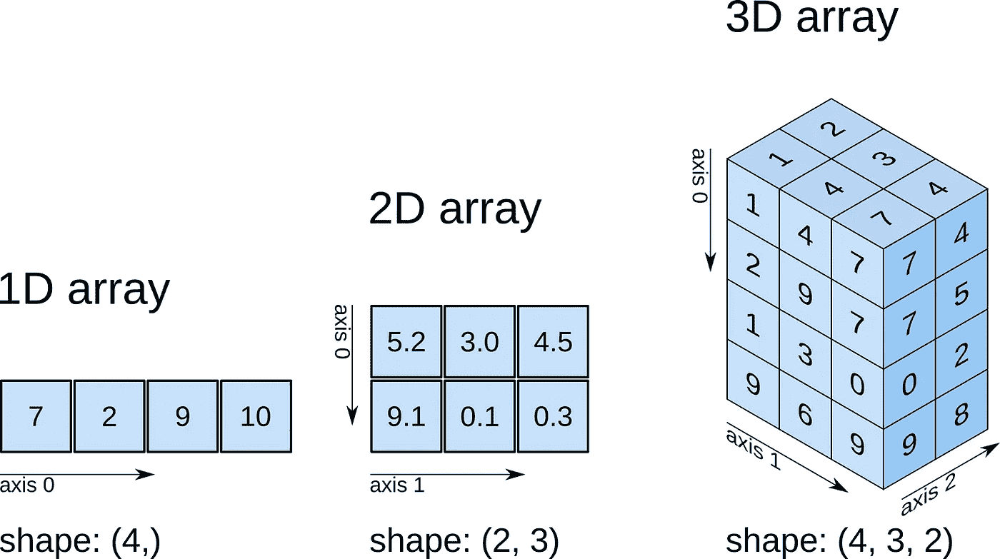

# 人工智能系列 _ 第 2 部分:NumPy 演练

> 原文：<https://medium.datadriveninvestor.com/artificial-intelligence-series-part-2-numpy-walkthrough-64461f26af4f?source=collection_archive---------5----------------------->

在这篇文章中，我将介绍机器学习和数据科学最需要的 **NumPy** 的基础知识。我不会涵盖所有与 **NumPy** 库相关的内容，但这仍然是一篇相当详尽的文章。这是 AI 系列的第二篇专题文章。

> 在进入数组操作的世界之前，让我们先了解一下为什么我们必须学习 **NumPy** 以及它相对于传统 python**‘lists’**所带来的优势。

 [## NumPy 数组如何优于 Python List -与示例的比较- Studytonight

### 以上 3 个代码示例清楚地证明了 NumPy 数组优于 Python 列表，当它出现时…

www.studytonight.com](https://www.studytonight.com/post/numpy-array-over-python-list)  [## NumPy 比常规 Python 列表有什么优势？

### NumPy 比常规 Python 列表有什么优势？我有大约 100 个金融市场系列，我…

stackoverflow.com](https://stackoverflow.com/questions/993984/what-are-the-advantages-of-numpy-over-regular-python-lists/994010#994010) 

恭喜你，你已经到达了 **NumPy** 教程的结尾！你已经涉及了很多领域，所以现在你必须确保记住你所获得的知识。在所有这些理论之后，是时候用你在本教程中学到的概念和技术进行更多的实践了。一种方法是回到 [***scikit-learn 教程***](https://www.datacamp.com/community/tutorials/machine-learning-python) 并开始进一步试验用于构建机器学习模型的数据阵列。另外，请务必查看这个 [***Jupyter 笔记本***](https://github.com/rossant/ipython-minibook) ，它还会在 *jupyter* 笔记本的交互式数据科学环境中，指导您使用 **NumPy** 和其他一些库进行 python 中的数据分析。

**资源:**

NumPy Cheatsheet

[**用于数据分析的 Python:与 Pandas、NumPy 和 IPython 的数据角力**](http://shop.oreilly.com/product/0636920023784.do)**Wes McKinney 著(第 2 版)**

**[**Python 数据科学手册:处理数据的基本工具**](http://shop.oreilly.com/product/0636920034919.do) 作者 [Jake VanderPlas](http://www.oreilly.com/pub/au/6198)**

** [## Numpy 教程第 1 部分——数组简介

### 这是 numpy 教程的第 1 部分，涵盖了使用…执行数据操作和分析的所有核心方面

www.machinelearningplus.com](https://www.machinelearningplus.com/python/numpy-tutorial-part1-array-python-examples/)  [## 从 Python 到 Numpy

### 一本关于 numpy 矢量化技术的开源书籍，基于经验、实践和描述性示例

www.labri.fr](http://www.labri.fr/perso/nrougier/from-python-to-numpy/)  [## Numpy 教程

### 生命的游戏，也简称为生命，是由英国数学家约翰·霍顿设计的细胞自动机…

www.labri.fr](http://www.labri.fr/perso/nrougier/teaching/numpy/numpy.html)  [## Python Numpy 教程——通过例子学习 Numpy 数组

### 这个关于 Python NumPy 的博客将帮助你学习 NumPy 的所有方面，如 NumPy 数组、数组 v/s 列表和…

medium.com](https://medium.com/edureka/python-numpy-tutorial-89fb8b642c7d)  [## 100 次 numpy 练习

### 目的是为新老用户提供一个快速参考，也为那些…

www.labri.fr](http://www.labri.fr/perso/nrougier/teaching/numpy.100/index.html)  [## 实用数字——通过函数理解 Python 库

### 在开始数据科学和机器学习的旅程之前，学习一些 python 是非常重要的…

towardsdatascience.com](https://towardsdatascience.com/practical-numpy-understanding-python-library-through-its-functions-adf2e3841894) 

下一个教程将介绍**pandas**——python 中的一个高级数据分析工具。

**重温 ML/AI 系列的第 1 部分:Python 简介**

 [## 人工智能系列 _ 第 1 部分:Python 简介

### Python 简介:数据结构、控制语句和函数

medium.com](https://medium.com/@nishantup/artificial-intelligence-series-introduction-to-python-part-1-8f45743573bf)**