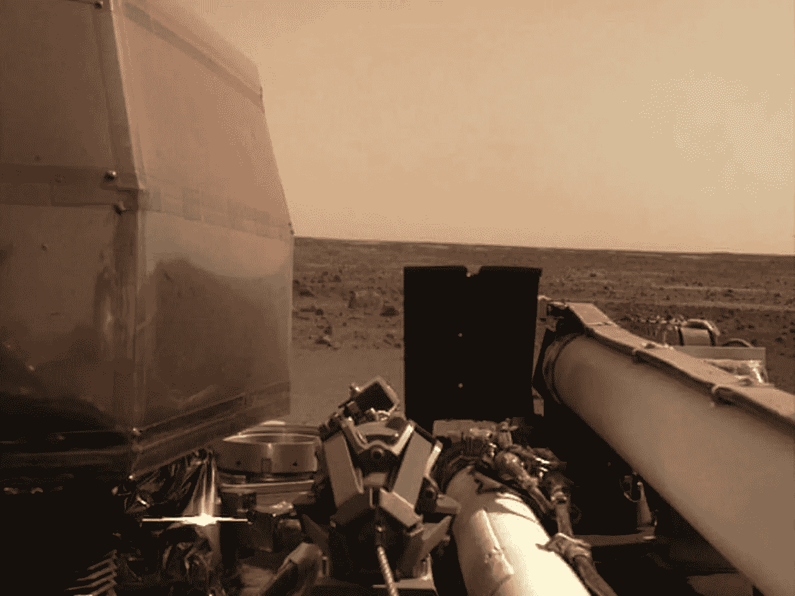

# 人工智能系列 _ 第三部分:揭秘熊猫

> 原文：<https://medium.datadriveninvestor.com/artificial-intelligence-series-part-3-demystifying-pandas-4f8caeeb6e9e?source=collection_archive---------18----------------------->

The **InSight** lander took the picture view across Elysium Planitia, the vast lava plain near the equator of Mars using a camera mounted on its robotic arm after its touchdown on Monday (26/11/2018) at 0254 hours after taking a long six-month, 300 million mile (480 million kilometers) journey. (Photograph: Reuters)

> 这是正在进行的预备人工智能/人工智能内容系列的第三部分。
> 
> 上面的图像是由**洞察号**拍摄的首批照片之一，是利用地震调查、大地测量和热量传输进行内部探测的简称，是火星[着陆器](https://mars.nasa.gov/insight/spacecraft/about-the-lander/)，旨在对这颗红色星球进行自 45 亿年前形成以来的首次彻底检查。这是第一个外层空间机器人探测器，深入研究火星的“内部空间”:它的地壳，地幔和地核。这项任务是美国宇航局探索计划的一部分，该计划是高度集中的科学任务，提出太阳系科学中的关键问题。(来源:[火星洞察任务](https://mars.nasa.gov/insight/mission/overview/))
> 
> 这篇文章是我高度关注的任务 AI *的一部分😅学习和理解人工智能，也许当这一切结束后，我会问自己，人工智能是否只是一个时尚！*💀*更重要的是，参与人工智能将如何拯救或毁灭世界的讨论；自动驾驶汽车会让我们活下去；社交媒体泡沫会摧毁民主；机器人烤面包机会剥夺我们加热面包的能力。— [询问关于人工智能的正确问题](https://medium.com/@yonatanzunger/asking-the-right-questions-about-ai-7ed2d9820c48)*

实际上，如果你选择 Python 作为你寻找真理的合作伙伴，那么在分析空间或几乎任何其他数据科学相关领域起步的每个人都必须学会使用 Pandas 库。(顺便说一句，我真的真的很想念 r，还没有失恋呢)。我真的很喜欢创建 *Jupyter* 笔记本(嵌入下面)，因为它强大的语法和大量易于使用的数据分析功能。这是一篇不短的关于熊猫的介绍，可能就是你开始学习的全部内容。熊猫图书馆肯定比这篇文章中提到的要多。当一个人开始使用这个库处理数据集时，他可以获得大量的函数。没有什么可以替代实践经验。然而，如果从头到尾读一遍这篇文章，你会熟悉这个库的大部分细微差别，并准备好争论、操作和总结数据。你终于可以明白“ ***pd*** ”通知到底是在做什么了。😃。

# 没有熊猫我们能行吗？

哦不！；*因为熊猫*🐼*对中国竹林的生存至关重要* ( [BBC](https://www.bbc.com/news/world-asia-china-37273337) 和其他人强调了这些濒临灭绝的可爱生物的重要性)。哇！你已经爱上熊猫了！！

**pandas** 可能是最流行的用于数据分析的 Python 库。这个库是对低级 **NumPy** 库的高级抽象，低级**NumPy**库本身是用 c 语言编写的。Pandas library for Python 已经成为用 Python 分析和建模数据的黄金标准。Pandas 是开源的，可以免费使用(在 BSD 许可下)，它最初是由 [Wes McKinney](https://en.wikipedia.org/wiki/Wes_McKinney) 编写的(链接到他的 [GitHub 页面](https://github.com/wesm))。除非你有使用 R 的精神障碍，直到一段时间以前我有(太多的 R 爱好者，嗯！💕)，任何与使用 Python 处理数据相关的事情都需要依赖 Pandas 库。根据熊猫图书馆的维基百科，“这个名字来源于术语“[面板数据](https://en.wikipedia.org/wiki/Panel_data)”，多维结构化数据集的[计量经济学术语。”但是我认为这只是一个非常有用的 Python 库的可爱名字！](https://en.wikipedia.org/wiki/Econometrics)

**Pandas** 有以下**优势**这让它在用 Python 分析数据时成为事实上的去图书馆:

*   数据框架 viz-a-viz 传统的 pythonic 数据结构，如列表、字典等。
*   *易于读入和回写多种常用表格格式的数据，如 csv、Excel、SQL、json 等。*
*   *处理缺失数据的丰富功能*
*   *超级容易重组/重塑数据*
*   *简单的分度、切片和分类操作*
*   这个库是在 NumPy 的基础上编写的，NumPy 主要是用 C 语言编写的，这给了它巨大的性能提升。。。还有更多！

**最后的想法！**

以此，我将结束这个对可爱的熊猫的小而野蛮的介绍，但这是用爱来完成的。恭喜你！👏

Pandas 是一个非常动态、非常强大和有趣的数据操作/分析库，具有易于理解的语法和快速的程序操作。本帖(又名。笔记本)在内容上相当详尽，但是熊猫提供的功能还有很多值得探索的地方。如果你已经一个单元一个单元地浏览了笔记本，那么哇！这是很多奉献(消化😍).对于其他人来说，你现在需要做的只是**的练习！练习！练习！分享！，分享！分享！**。

*领养熊猫，爱护熊猫，拯救熊猫！*

快乐的潘多拉之旅！！

**资源:**

Pandas cheat sheet

 [## Python 熊猫教程

### Python 熊猫初学者教程-从基础到高级，通过简单易行的步骤学习 Python 熊猫…

www.tutorialspoint.com](https://www.tutorialspoint.com/python_pandas/index.htm)  [## 与熊猫一起学习数据分析的 8 大资源

### 我最近推出了一个关于“熊猫”的视频系列，这是一个流行的 Python 库，用于数据分析、操作和…

www.dataschool.io](https://www.dataschool.io/best-python-pandas-resources/)  [## 熊猫教程示例练习解决方案技巧问题

### Pandas 是一个 Python 库，包含高级数据结构和工具，旨在帮助 Python 程序员…

www . python 编程. in](https://www.pythonprogramming.in/pandas-examples.html)  [## 如何学习熊猫

### 在这篇文章中，我将概述一个“学习熊猫”的策略。对于那些不知道的人来说，熊猫是最受欢迎的…

medium.com](https://medium.com/dunder-data/how-to-learn-pandas-108905ab4955)  [## 泰德石油-中等

### 阅读泰德·彼得鲁在媒体上的文章。熊猫食谱的作者和邓德数据的创始人。每天，泰德·彼得鲁和…

medium.com](https://medium.com/@petrou.theodore)  [## 101 只熊猫的数据分析练习

### 101 python 熊猫练习旨在挑战您的逻辑肌肉，并帮助内化数据操作…

www.machinelearningplus.com](https://www.machinelearningplus.com/python/101-pandas-exercises-python/)  [## 最低限度足够的熊猫小抄

### 这篇文章总结了在《最低限度足够的熊猫》中提出的非常详细的指南。

medium.co](https://medium.com/dunder-data/minimally-sufficient-pandas-cheat-sheet-34f3a6888c36)  [## 最低限度足够的熊猫

### 在本文中，我将提供一个关于如何最好地使用 Pandas 库进行数据分析的观点。我的…

medium.com](https://medium.com/dunder-data/minimally-sufficient-pandas-a8e67f2a2428)  [## 蟒蛇熊猫:你可能不知道的技巧和特性-真正的蟒蛇

### Pandas 是分析、数据处理和数据科学的基础库。这是一个巨大的项目，有成吨的…

realpython.com](https://realpython.com/python-pandas-tricks/) 

下一篇文章将会涉及使用 Python 的数据可视化方面。

**之前的博文:-**

 [## 人工智能系列 _ 第 1 部分:Python 简介

### Python 简介:数据结构、控制语句和函数

medium.com](https://medium.com/@nishantup/artificial-intelligence-series-introduction-to-python-part-1-8f45743573bf)  [## 人工智能系列 _ 第 2 部分:NumPy 演练

### 在这篇文章中，我将介绍机器学习和数据科学最需要的基础知识。我不是…

medium.com](https://medium.com/datadriveninvestor/artificial-intelligence-series-part-2-numpy-walkthrough-64461f26af4f)