# 人工智能系列 _ 4A 部分:Python 中的数据可视化

> 原文：<https://medium.datadriveninvestor.com/artificial-intelligence-series-part-4-data-visualization-in-python-da457ff3a70b?source=collection_archive---------2----------------------->

这是 AI/ML 系列中正在进行的预备文章的第四部分——可视化部分 A

source: [8 Popular Types of Data Visualizations in Python](https://www.digitalvidya.com/blog/popular-types-of-data-visualizations/)

> 数据只有呈现出来才是好的。

# 数据可视化

数据可视化是预测建模中最重要的初级阶段之一。在建模工作的早期阶段，人们通常会进行探索性数据分析(EDA)以获得对数据的深入了解。创建图形和图表确实有助于让事情更容易、更清晰地理解，尤其是对于更大的高维数据集。在建模的最后阶段，能够以一种清晰、简洁、有说服力的方式呈现最终结果是很重要的，这样你的观众(通常是非技术客户)才能理解。

人们总是可以一行一行、一个单元一个单元地仔细检查整个数据。然而，这往往是一个可怕的任务，如果不是不可能的；即使有可能，仍然不会突出大局。另一方面，视觉效果描述数据的方式简单易懂，只需看一眼，就能吸引目标受众。简而言之，数据可视化是指通过将数据或信息编码为图形中包含的可视对象(如点、线或条)来传达数据或信息的方法。这篇文章将涵盖可视化需求的细微差别，什么构成了好的或坏的视觉效果。此后，使用 **matplotlib** 和 **seaborn** 库以及大量代码示例(在这篇文章和下一篇文章中总共嵌入了 3 个 jupyter 笔记本),深入研究 python 中的绘图。

> 除了众所周知的 **pandas** 、 **matplotlib** 和 **seaborn** 之外，python 数据可视化景观中还提供了几个绘图库，如 **Bokeh** 、 **plotly** 、 **ggplot** 、 **pygal** 、 **geoplotlib** 、 **Gleam** 、 **missingno** 、**我们将涵盖最重要的，即熊猫，马特 plotlib 和 seaborn。**

# 为什么我们需要建立视觉效果？

> [*人类是视觉生物。无数的研究表明，我们的大脑是如何适应视觉的，当它通过眼睛时，处理任何事情都更快。*](https://towardsdatascience.com/data-visualization-using-matplotlib-16f1aae5ce70)

当一个人试图探索数据并熟悉它时，可视化会特别有用。古老的格言“图片胜过千言万语”在数据科学中非常适用，它有助于在正确的时间以正确的格式将正确的信息传递给正确的人。绘图和图表可以非常有效地传达数据的清晰描述，尤其是在向观众披露调查结果或与其他同行数据科学家共享数据时。此外，在支持向客户经理或其他决策者提出的任何建议时，它们也非常有价值。根据 Darkhorse Analytics 的说法，分析是关于决策的。它是关于寻找和收获降低成本、增加收入和降低风险的机会。他们提出了如下三步可视化方法:

**最佳实践:**

> 越少越有效
> 
> 越少越有吸引力
> 
> 越少越有影响力

适当的可视化给决策带来清晰和确信。它引人入胜，揭示真相，消除疑虑。

***“即使你的角色不直接涉及数据科学的具体细节，了解数据可视化能做什么以及它在现实世界中是如何实现的也是有用的。”***

***——苎麻***

这篇文章旨在理解如何更清晰地向对数据感兴趣的各种利益相关者传达数据。还有许多不同的利益相关者，你可能有兴趣用视觉传达给他们。例如，您希望与能够做出自己的推断和解释的同行数据科学家共享无偏见的数据表示。但是，您还希望能够与经理和高管分享关于数据的故事，这些经理和高管可能熟悉领域，但正在寻找具体的可行见解。最后，你还希望能够像记者一样与对你的特定数据知之甚少的广大人群交流，他们不仅需要了解你所描述的现象的概况，还需要了解你所使用的方法的局限性。

**爱德华·塔夫特也许是信息设计和数据可视化方面的世界权威。在如何设计定量信息的视觉显示方面，他是一个开创性的人物。他是美国统计学家，也是耶鲁大学的荣誉退休教授(研究政治学、计算机科学和统计学)。在他的作品中你可以找到[视觉信息表现的四个基本准则](https://www.interaction-design.org/literature/article/guidelines-for-good-visual-information-representations):**

1.  **卓越的图形**
2.  **视觉完整性**
3.  **最大化数据-油墨比率**
4.  **审美优雅**

**让我们讨论一下 Tufte 关于良好视觉信息表现的标准**

****答:图形试探法:数据-墨水比****

**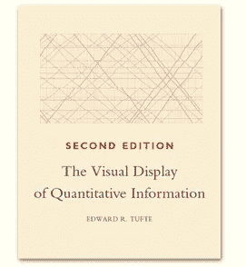**

**在他的书《量化信息的可视化显示》中，我最喜欢他的一本书，他介绍了两个有趣的图形启发法，数据-墨水比图。**

**首先，什么是启发式？**

**启发式是一个过程或规则，旨在指导你做决定。根据定义，它不是最佳的或完美的，但在本质上是实用的。试探法应该被遵循，直到你有理由背离它们。Tufte 的第一个图形启发是数据-墨水比率。Tufte 将数据墨水定义为图形的不可擦除核心。非冗余墨水响应于所表示的数字的变化而排列。换句话说，数据墨水对于给定变量的意义构建过程至关重要**

**Tufte 将数据油墨比定义为数据油墨量除以打印图形所需的总油墨量。他实际上是建议我们测量页面上的墨水量，而是建议我们删除那些不会给图形添加新信息的元素。**

**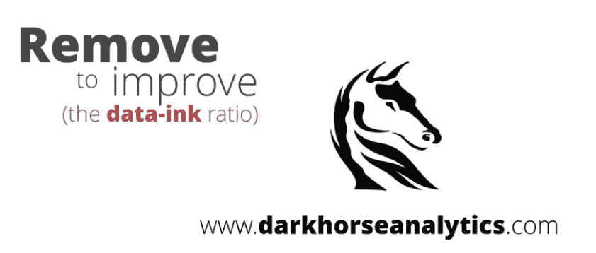**

**也许显示数据墨水减少的最著名的例子之一是由*黑马分析公司完成的。他们收集了四个如何提高数据-墨水比率的例子。但是我将在这里介绍其中的第一个。***

**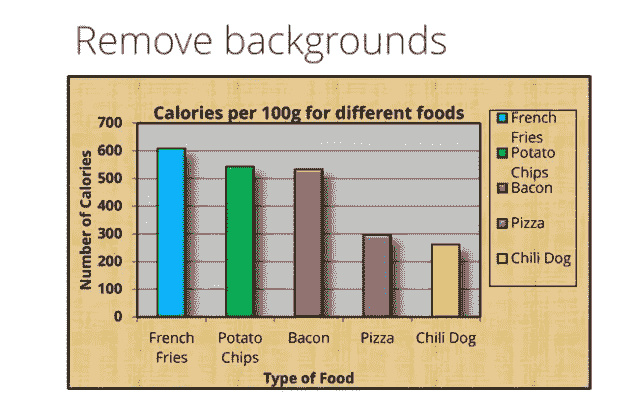**

**我们从食物和食物中卡路里含量的数据表开始。第一步是去除不想要的背景图像，因为它对理解图表没有任何价值。**

**我们还删除了条形图后面的灰色背景，因为它不提供概念价值。然后，我们消除所有的冗余。这包括去掉图例，因为每个条形都直接沿 x 轴标注。y 轴标签中的标题被修剪了，因为在整个图像中有很多关于食物卡路里的参考。这给我们留下了一个更小的图像。有一些粗线形成的边界没有增加任何价值，所以我们也可以删除它们。在图表中包含颜色是一个棘手的问题。在本课程中，我们不会深入探讨色彩理论。但是，当试图与色觉缺陷或色盲的人交流时，颜色是一个挑战。因此，假设数据中明确引用了这段文字，让我们去掉除培根以外的颜色。三维条和阴影也可以，因为它们不会增加额外的价值。我们也可以从头到尾去掉粗体。在这个图像中仍然有许多网格工作，并且这个网格工作的价值还不太清楚，所以我们将放弃它。现在网格可能很有价值，但它们通常只是一种干扰。现在，研究一下这个图像。培根，我们感兴趣的数据点，和比如说，薯片或者辣热狗，在卡路里数量上有什么区别？仅仅去掉线条并不能让它更容易阅读。但是这里的数据值非常简单。因此，让我们直接标记图形中的每个条形。现在，培根和薯片或者培根和辣椒热狗的区别有多大？**

**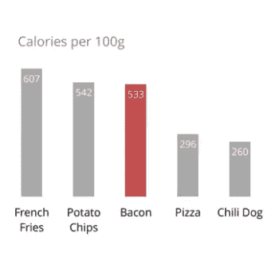**

**当然，你必须做一些数学计算，但是你仍然可以通过浏览图表得到一个快速的估计，并且通过直接比较数字得到一个精确的值。**

**现在你知道了。通过增加数据和墨水的比例，我们不仅使图形更简单，可读性更好，而且增加了浏览者看到的信息量。**

**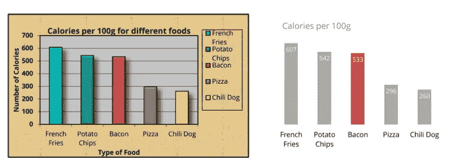**

****随意探索黑马的** [**作品集**](https://www.darkhorseanalytics.com/portfolio-all/) **和** [**博客**](https://www.darkhorseanalytics.com/blog) **获得有趣的互动视觉效果。****

****B:** **图形启发:图表垃圾****

**爱德华·塔夫特介绍给我们的另一个启发叫做图表垃圾。现在，比起其他形式的非数据墨水，图夫特更倾向于指责图表垃圾。事实上，他认为统计图表上的艺术装饰就像我们数据图表中的杂草。他认为实际上有三种图表垃圾。**

*   ****第一个是无意识的光学艺术。****

**例如，图表特征的过度阴影化或图案化，如 Tufte 在他的书*中分享的这张经济学图表所示，定量信息的可视化显示*。**

**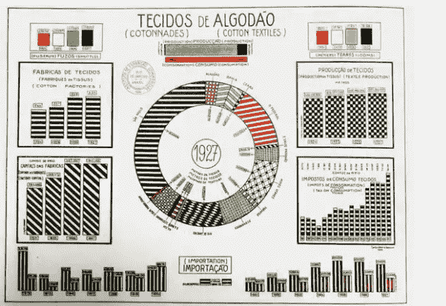**

**在这里，图案使人眼跳跃并引起视觉疲劳。这些现象被称为 ***莫尔条纹。这也是你在拍摄 MOOC 这样的视频内容时通常不会看到人们穿着条纹衬衫的原因，因为视频的低分辨率加剧了莫尔条纹的问题。Tufte 建议，与其将这些内容图案化，不如直接标记图表图形。我们看到黑马分析公司在数据油墨比率的例子中使用了这种方法。*****

*   ****chart junk 的第二种形式是** `**grid**` **。****

**Tufte 认为，网格不仅作为数据墨水是不必要的，而且还会导致与实际共享数据的竞争。细化、删除或降低网格线的饱和度会使数据更容易查看，而不是被页面上的行数淹没。直接标记数据是减少这种图表垃圾的另一个好方法。**

*   ****图表垃圾的第三种形式，图夫特称之为** `**duck**` **。****

**概括地说，他指的是非数据创意图形，无论是艺术线条还是照片，它们都包含在图表中。报纸和新闻杂志是经常使用这种图像的地方。一位著名的图形艺术家奈杰尔·霍尔姆斯用这只鸭子来展示数据，这种方式既令人难忘又富有美感。对我来说，他创作的最令人难忘的一幅画名叫《钻石是女孩最好的朋友》。这出现在 1982 年的时代杂志上。**

**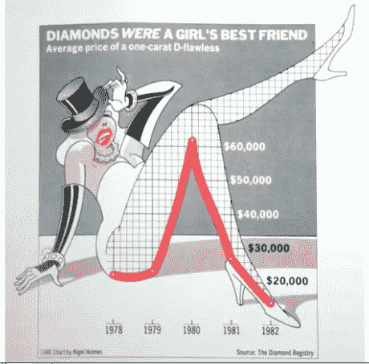**

**Bateman, S., Mandryk, R. L., Gutwin, C., Genest, A., McDine, D., & Brooks, C. (2010, April). [Useful Junk?: The Effects of Visual Embellishment on Comprehension and Memorability of Charts](http://hci.usask.ca/uploads/173-pap0297-bateman.pdf). In Proceedings of the SIGCHI Conference on Human Factors in Computing Systems (pp. 2573–2582). ACM.**

**这张图显示了从 1978 年到 1982 年的钻石价格趋势，虽然美元金额很容易被忘记，但很容易记住趋势有一个尖峰，因为这个女人的腿的形状。那么文档真的是一个有用的启发吗，或者它是关于令人难忘的文档的什么？**

****C:图形试探法:谎言因子和火花线****

**爱德华·塔夫特对简单和极简主义的强调已经拥有了一大批追随者。他在很大程度上被视为图表可视化主题上最有影响力的作家之一。在他的书`Beautiful Evidence`中，他介绍了将图表中的极简主义提升到一个新水平的想法。他建议将图表简化并嵌入讨论的背景中，而不是将图表作为一个单独的人工制品进行研究。他认为一个小的图表，比如一个时间序列线图，可以快速传达更多的信息，这对读者来说是非常宝贵的。他称这些东西为`sparklines``，称它们为`data words`。一个有趣的方式来弥合文字和数字之间的差距。他建议*迷你图*不仅可以直接用文本表示，还可以和它们描述的数据一起嵌入表格。这种想法变得如此自然，以至于它甚至被最常见的电子表格分析软件之一 Microsoft Excel 所采用。**

**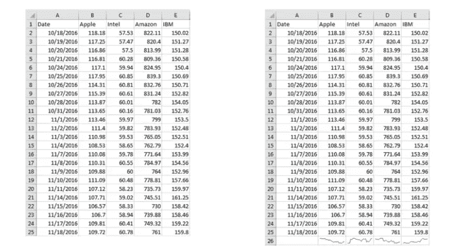**

**这是一张来自纳斯达克证券交易所的表格数据图，显示了四只科技股在一个月内的开盘价。请花点时间考虑一下这些数据。哪只股票经历了一个糟糕的月份，并呈下降趋势？哪一个月表现良好并呈上升趋势？如果我在下面的单元格中添加迷你图会怎么样？在这里，你可以立即看到苹果公司经历了一个糟糕的月份，股价下跌。IBM 几个月来表现不错，股价不断上涨。亚马逊和英特尔的情况就不那么明朗了，我们看到了一些峰值。**

**现在这些迷你图不能帮助我们回答谁的股价最高，或者谁的盈亏最大。但它们确实让我们对数据背后的趋势有了一个总体感觉。实际上，迷你图用于趋势或分布特征很重要的数据。这是谷歌财经网站上使用的迷你图的另一个例子。**

**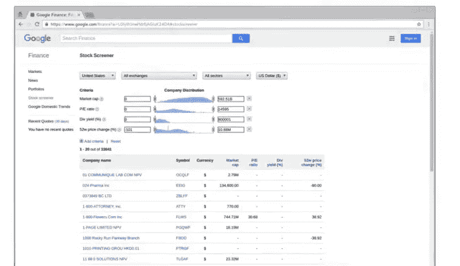**

**请注意如何使用这些迷你图快速放大分布图。所以它们不仅仅是数据的表示，也是与数据交互的方法。**

**请注意如何使用这些迷你图快速放大分布图。所以它们不仅仅是数据的表示，也是与数据交互的方法。迷你图有许多不同的用途。定制界面，比如视频游戏，就是一个很好的例子。**

**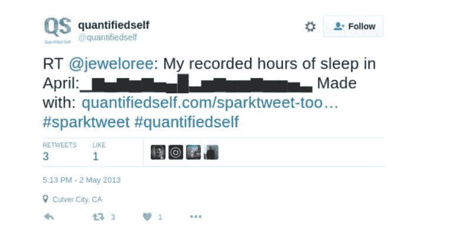**

**迷你图的现代版本被称为`sparktweet`，我认为它很简洁。其中 Unicode 块字符用于显示 Twitter 分配的 140 个字符内的条形图。例如，这里有一个用户在推特上以条形图的形式发布了她四月份的睡眠时间。**

**我想和你分享的最后一个 Tufte 原则叫做`lie factor`。寿命因数是图形中显示的效应大小除以数据中实际的效应大小。这通常是无意识的，试图帮助讲述一个故事，然而，它会误导观察者。谎言因素有很多不同的例子。我认为，1979 年《时代》杂志的这篇文章提供了一个很好的例子。**

**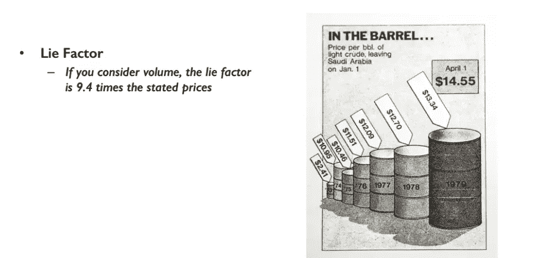**

**其中显示了各种桶的石油，显示了六年来的石油价格。但观众并不清楚一个桶的大小相对于其他桶意味着什么，部分原因是这里有透视的元素。这些桶的大小不同吗，或者它们看起来是不同的，因为一些桶在另一些桶的前面？代表成本增长的是桶的体积，还是桶的高度？**

**迷你图和谎言因子只是爱德华·塔夫特给我们的另外两个理解和交流数据的工具。**

****关于图形谎言和误导性视觉效果的又一个例子****

***饼图切片相加不到 100%。***

****

**source:[https://blog.visme.co/bad-infographics/](https://blog.visme.co/bad-infographics/)**

**虽然你不必是一个数学天才来解决这个问题，但这个错误比我们想象的更普遍。例如，当呈现允许多个响应的投票结果时，可能会发生这种情况。在这种情况下，回答的总和不会达到 100，在这种情况下，应该使用另一种类型的图表。**

**要通过图表了解更多关于一个人如何犯错或说谎的信息，请参考:**

1.  **[糟糕的信息图表:你永远不想犯的 11 个错误](https://blog.visme.co/bad-infographics/)**
2.  **开罗(2015 年)。[图形谎言，误导视觉效果](https://infovis.fh-potsdam.de/readings/Cairo2015.pdf)；《数据设计的新挑战》(第 103-116 页)。斯普林格伦敦。**

# **让我们使用`matplotlib library`从 Python 中的基本绘图开始**

**Matplotlib 是一个流行的 Python 库，可以用来非常容易地创建数据可视化。我们现在将深入了解一下 Matplotlib 库。jupyter 笔记本将不仅详细介绍 *matplotlib* 库，还将介绍构建在 matplotlib 库之上的 *seaborn* 库。**

**在使用 matplotlib 库绘图这一节中，我们将介绍:**

*   **使用`matplotlib.pyplot`创建基本情节**
*   **放置轴标签和标题**
*   **在同一个图形中创建多个情节(支线情节)**
*   **更改 x 轴和 y 轴的比例**
*   **创建常见类型的图:直方图、箱线图、散点图等。**
*   **使用图像**

**在深入研究`matplotlib`库中可用的功能之前，让我们简单了解一下这个库的历史和架构。**

**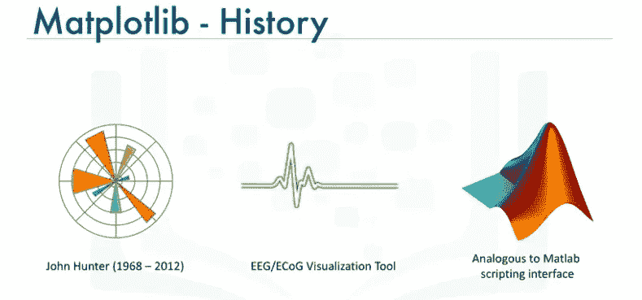**

**Matplotlib 是一个基于 NumPy 数组的多平台数据可视化库，旨在与更广泛的 SciPy 堆栈一起工作。它是由约翰·亨特(一位神经生物学家，是一个研究小组的成员，致力于分析皮层脑电图信号，简称 ECoG)在 2002 年构思的，最初是作为 IPython 的一个补丁，用于通过 gnuplot 从 IPython 命令行进行交互式 MATLAB 风格的绘图。该小组使用了一种专有软件进行分析。然而，他们只有一个许可证，并轮流使用。IPython 的创建者 Fernando Perez 当时正忙着完成他的博士学位，并告诉 John 他在几个月内都没有时间审查这个补丁。约翰以此为线索，开始着手用基于 MATLAB 的版本替换专有软件，该版本可以由他和他的队友使用，并且可以由多个研究人员扩展。因此，2003 年发布的 0.1 版 Matplotlib 包诞生了。Matplotlib 最初是作为 ECoG 可视化工具开发的，就像 MATLAB 一样，Matplotlib 配备了一个脚本接口，用于快速轻松地生成图形，由 pyplot 表示。当它被太空望远镜科学研究所(哈勃望远镜背后的人)采用为绘图包时，它得到了早期的推动，该研究所在经济上支持 Matplotlib 的开发并极大地扩展了它的功能。来源**

**在使用 Python 的 matplotlib 库进行可视化之前，让我们简单介绍一下 Matplotlib 的架构**

**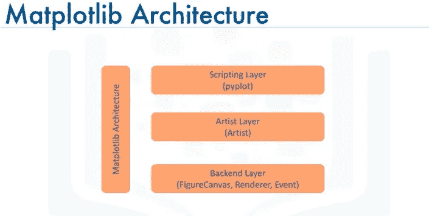**

**Matplotlib 的架构由三个主要层组成: ***后端层*** 、 ***艺术家层*** 在这里，大部分繁重的工作发生了，并且通常是在编写 web 应用服务器、UI 应用或者可能是与其他开发人员共享的脚本时的适当编程范例，以及 ***脚本层*** ，这是用于日常目的的适当层，被认为是简化常见任务和**

**现在让我们更详细地了解每一层。**

1.  ****后端层****

**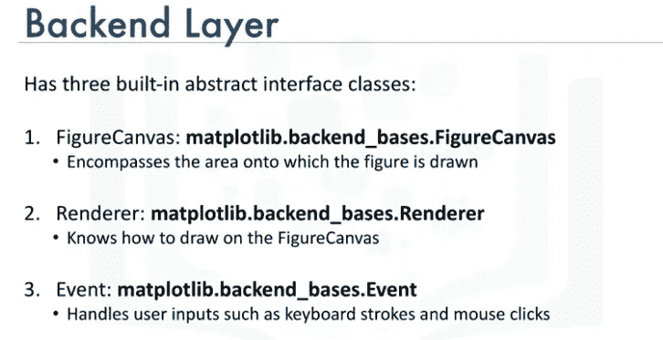**

**所以后端层有三个内置的抽象接口类:FigureCanvas，它定义并包含了绘制图形的区域。Renderer，renderer 类的一个实例知道如何在图形画布上绘制。最后是事件，它处理用户输入，比如键盘敲击和鼠标点击。**

****2。** **艺术家图层****

**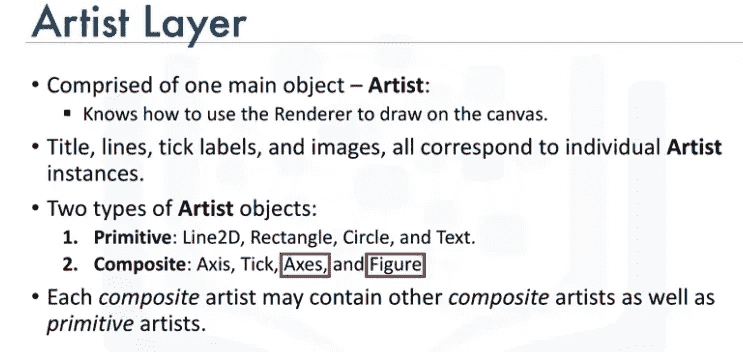**

**移动到艺术家层。它由一个主要对象组成，这个对象就是艺术家。艺术家是知道如何使用渲染器并使用它在画布上添加墨水的对象。你在 Matplotlib 图形上看到的一切都是艺术家实例。标题、线条、刻度标签、图像等等都对应于一个艺术家。**

**有两种类型的艺术家对象。第一种类型是基本类型，如直线、矩形、圆形或文本。第二种是复合型，如图形或轴。包含并管理给定图形中所有元素的顶级 Matplotlib 对象是图形艺术家，最重要的复合艺术家是轴，因为它是大多数 Matplotlib API 绘图方法的定义位置，包括创建和操作记号、轴线、网格或绘图背景的方法。现在需要注意的是，每个合成艺术家可能包含其他合成艺术家以及原始艺术家。例如，图形艺术家将包含轴艺术家以及矩形或文本艺术家。现在让我们使用艺术家层，看看我们如何使用它来生成一个图形。**

**因此，让我们尝试使用 artist 图层生成一个包含 10，000 个随机数的直方图。**

**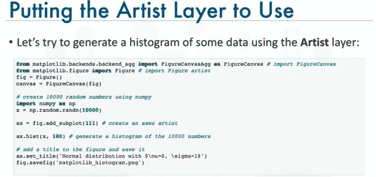**

**首先，我们从后端 underscore agg 导入人物画布，并将人物艺术家附加到画布上。请注意，agg 代表反纹理几何体，这是一个高性能的库，可以生成有吸引力的图像。然后我们导入 Numpy 库来生成随机数。接下来，我们创建一个轴艺术家。axes artist 被自动添加到 figure axes 容器 figure axes 中，注意(111)来自 MATLAB 约定，因此它创建一个具有一行和一列的网格，并使用该网格中的第一个单元格作为新轴的位置。然后我们调用轴方法 hist 来生成直方图。hist 为每个直方图条创建一系列矩形艺术家，并将它们添加到 axes 容器中。这里 100 表示创建 100 个箱。最后，我们用一个标题装饰图形，并保存它。**

**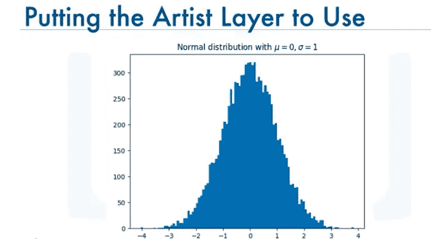**

**这是生成的直方图，这就是我们如何使用艺术家层来生成图形。**

****3** 。**脚本层****

**至于脚本层，它是为非专业程序员的科学家开发的，根据我们刚刚创建的直方图，我相信你会同意我的观点，即 artist 层在语法上很重，因为它是为开发人员设计的，而不是为那些目标是对一些数据进行快速探索性分析的个人设计的。Matplotlib 的脚本层本质上是`Matplotlib.pyplot`接口，它自动化了定义画布和定义 figure artist 实例并连接它们的过程。让我们来看看我们之前使用 artist 层生成 10，000 个随机数的直方图的代码现在看起来是什么样子。**

**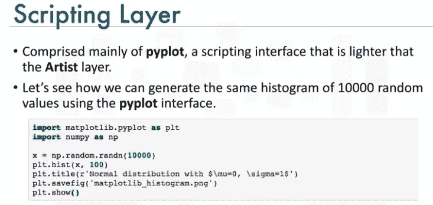**

**首先，我们导入 pyplot 接口，您可以看到所有与创建直方图和其他 artist 对象以及操纵它们相关的方法(无论是 hist 方法还是显示图形)都是 pyplot 接口的一部分。**

**如果你有兴趣了解更多关于 Matplotlib 及其架构的历史，[这个链接](http://www.aosabook.org/en/matplotlib.html)将带你到 Matplotlib 的创造者自己写的一章。绝对是值得推荐的读物。**

**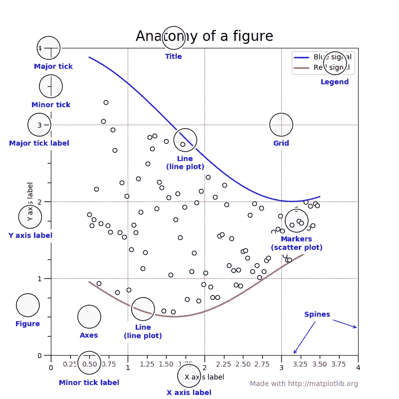**

**[This figure shows the name of several matplotlib elements composing a figure](https://matplotlib.org/gallery/showcase/anatomy.html)**

**在我们深入研究使用 Matplotlib 创建可视化的细节之前，这里有一个很好的图表，用于为工作选择正确的可视化！**

****

**[A chart for selecting the proper data visualization technique for a given situation](https://towardsdatascience.com/5-quick-and-easy-data-visualizations-in-python-with-code-a2284bae952f)**

# **废话，废话，废话…让我们直接跳到编码**

**笔记本 1 将涵盖基本图表背后的理论，如折线图、箱线图、条形图等。此外，我们将使用 *Pandas* 和 *matplotlib* python 库绘制这些基本统计图表。**

**下面的笔记本 2 将使用 *matplotlib* 和 *seaborn* 库更深入地可视化分布(单变量和双变量)以及分类和时间序列数据绘图。**

# **结论**

**我希望现在你已经熟悉了使用*matplotlib*&*seaborn*的 Python 基本绘图技术，以及如何处理基本的可视化问题。文章还强调了不同类型的统计图及其适当的用法。**

**[下一篇文章](https://medium.com/@nishantup/artificial-intelligence-series-part-4b-data-visualization-in-python-8b0a797cbc44)将涵盖详细的可视化示例。此外，将涵盖使用*叶*库在 Python 中绘制地图。**

****查看这些有用的资源:****

*   **[*激发灵感的设计:爱德华·塔夫特与量化信息的视觉展示*](https://medium.com/sutherland-labs/design-that-inspires-edward-tufte-and-the-visual-display-of-quantitive-information-ca5da54054fe)**
*   **[备忘单:Python 中的数据可视化](https://www.analyticsvidhya.com/blog/2015/06/data-visualization-in-python-cheat-sheet/)**
*   **[*多维数据有效可视化的艺术*](https://towardsdatascience.com/the-art-of-effective-visualization-of-multi-dimensional-data-6c7202990c57)**
*   **[*Python 中的散景数据可视化，第一部分:入门*](https://towardsdatascience.com/data-visualization-with-bokeh-in-python-part-one-getting-started-a11655a467d4)**
*   **[*用 Seaborn 实现数据可视化(第一部分)*](https://jovianlin.io/data-visualization-seaborn-part-1/)**
*   **[*Matplotlib 简介 Python 中的数据可视化*](https://heartbeat.fritz.ai/introduction-to-matplotlib-data-visualization-in-python-d9143287ae39)**
*   **[*Python 中数据可视化方法简介*](https://machinelearningmastery.com/data-visualization-methods-in-python/)**
*   **[欢迎来到数据可视化](https://www.kaggle.com/residentmario/welcome-to-data-visualization)**
*   **[*终极巨蟒之海教程:把它们都抓起来*](https://elitedatascience.com/python-seaborn-tutorial)**
*   **[*使用 bokeh、plotly、seaborn 和 igraph 等 python 包可视化数据的教程*](https://github.com/neerjad/DataVisualization)**
*   **[*Python-YouTube 视频中的 Matplotlib 数据可视化完整教程*](https://www.youtube.com/playlist?list=PLqEbL1vopgvs1p90E3Ig_OTY08wBTCj9B)**
*   **[*通过 Python 的数据可视化景观(包括 ggplot 和 Altair)的戏剧性游览*](https://dsaber.com/2016/10/02/a-dramatic-tour-through-pythons-data-visualization-landscape-including-ggplot-and-altair/)**
*   **[*Matplotlib 教程 Python 绘图完全指南，带示例*](http://Matplotlib Tutorial – A Complete Guide to Python Plot w/ Examples)**

****关于使用 Python 可视化的一些 mooc:****

*   **[全球最佳数据可视化课程](https://www.class-central.com/report/best-data-visualization-courses/)排行榜。**

****Python 具体可视化课程:****

*   **[用 Python 和 Matplotlib 实现数据可视化](https://www.udemy.com/data-visualization-with-python-and-matplotlib/) -Udemy**
*   **[应用绘图，图表&Python 中的数据表示](https://www.coursera.org/learn/python-plotting) -Coursera(密歇根大学)**
*   **使用 Python 实现数据可视化(IBM )-Coursera**
*   **[Python 数据可视化(莱斯大学)-Coursera](https://www.coursera.org/learn/python-visualization)**
*   **[Python 数据可视化简介](https://www.datacamp.com/courses/introduction-to-data-visualization-with-python?tap_a=5644-dce66f&tap_s=93618-a68c98) (DataCamp)**

****AI/ML 系列的早期博客文章:-****

** [## 人工智能系列 _ 第 1 部分:Python 简介

### Python 简介:数据结构、控制语句和函数

medium.com](https://medium.com/@nishantup/artificial-intelligence-series-introduction-to-python-part-1-8f45743573bf)  [## 人工智能系列 _ 第 2 部分:NumPy 演练

### 在这篇文章中，我将介绍机器学习和数据科学最需要的基础知识。我不是…

medium.com](https://medium.com/datadriveninvestor/artificial-intelligence-series-part-2-numpy-walkthrough-64461f26af4f)  [## 人工智能系列 _ 第三部分:揭秘熊猫

### InSight 是利用地震调查、大地测量和热传输进行内部勘探的缩写，是一个火星…

medium.com](https://medium.com/datadriveninvestor/artificial-intelligence-series-part-3-demystifying-pandas-4f8caeeb6e9e) 

感谢您阅读帖子。我希望你喜欢这篇文章。如果你喜欢，请按住拍手键，分享给你的朋友👏。我很高兴听到你的反馈。如果你有什么问题，尽管问。请使用评论框。😉可视化 B 部分见！**