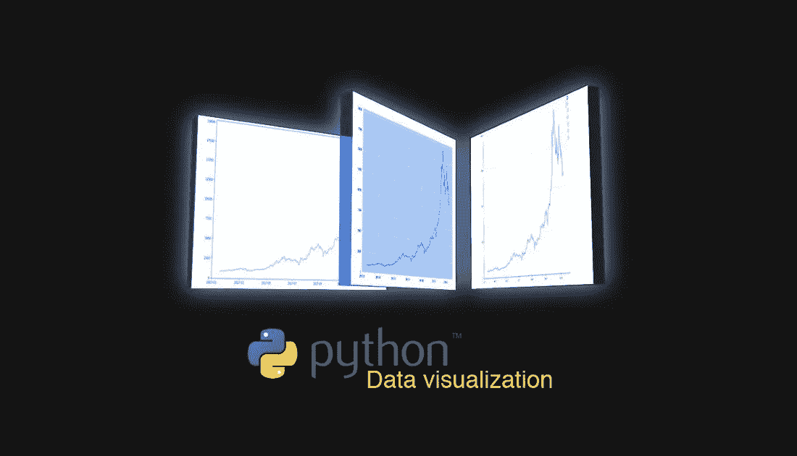

# 人工智能系列 _ 第 4B 部分:Python 中的数据可视化

> 原文：<https://medium.datadriveninvestor.com/artificial-intelligence-series-part-4b-data-visualization-in-python-8b0a797cbc44?source=collection_archive---------3----------------------->

这是 AI/ML 系列中正在进行的预备文章的第五部分——可视化部分 B

使用 Python 进行可视化的第一部分可在此处访问:

 [## 人工智能系列 _ 第 4 部分:Python 中的数据可视化

### 这是 AI/ML 系列中正在进行的预备文章的第四部分。

medium.com](https://medium.com/@nishantup/artificial-intelligence-series-part-4-data-visualization-in-python-da457ff3a70b) 

最后一个笔记本 3(下面给出)将根据从[早期帖子](https://medium.com/@nishantup/artificial-intelligence-series-part-4-data-visualization-in-python-da457ff3a70b)中获得的知识深入练习。此外，还将介绍如何使用名为*的优秀地图绘图库用 Python 绘制地图。(注意:使用*叶子*生成的地图不会在下面提供的嵌入式笔记本中渲染。人们必须在他们的本地或浏览器环境中执行代码。总之，代码可以在笔记本上找到，可以随意使用)。*

*以下是[***matplotlib***](https://s3.amazonaws.com/assets.datacamp.com/blog_assets/Python_Matplotlib_Cheat_Sheet.pdf)***，***[***seaborn***](https://s3.amazonaws.com/assets.datacamp.com/blog_assets/Python_Seaborn_Cheat_Sheet.pdf)***和 Bokeh*** 库的备忘单(由 DataCamp 提供)*

# *最后的话*

*如果你已经做到了这一步，我相信你现在已经理解了使用 matplotlib 库进行可视化的基础和高级技术，以及如何处理典型的 EDA/可视化问题。要获得更多的学习资源， [**realpython**](https://realpython.com/python-matplotlib-guide/) 和 [**Matplotlib 文档**](https://matplotlib.org/users/beginner.html) 是一个很好的地方。*

***想了解更多关于可视化数据的信息吗？查看这些有用的资源:***

*   *[*激发灵感的设计:爱德华·塔夫特与量化信息的视觉展示*](https://medium.com/sutherland-labs/design-that-inspires-edward-tufte-and-the-visual-display-of-quantitive-information-ca5da54054fe)*
*   *[备忘单:Python 中的数据可视化](https://www.analyticsvidhya.com/blog/2015/06/data-visualization-in-python-cheat-sheet/)*
*   *[*多维数据有效可视化的艺术*](https://towardsdatascience.com/the-art-of-effective-visualization-of-multi-dimensional-data-6c7202990c57)*
*   *[*Python 中的散景数据可视化，第一部分:入门*](https://towardsdatascience.com/data-visualization-with-bokeh-in-python-part-one-getting-started-a11655a467d4)*
*   *[*用 Seaborn 实现数据可视化(第一部分)*](https://jovianlin.io/data-visualization-seaborn-part-1/)*
*   *[*使用 SeaBorn 创建基本的图形可视化——迄今为止最棒的可视化 Python 库*](https://mlwhiz.com/blog/2015/09/13/seaborn_visualizations/)*
*   *[*Matplotlib 简介 Python 中的数据可视化*](https://heartbeat.fritz.ai/introduction-to-matplotlib-data-visualization-in-python-d9143287ae39)*
*   *[*Python 中数据可视化方法简介*](https://machinelearningmastery.com/data-visualization-methods-in-python/)*
*   *[欢迎来到数据可视化](https://www.kaggle.com/residentmario/welcome-to-data-visualization)*
*   *[*终极巨蟒之海教程:把他们都抓起来*](https://elitedatascience.com/python-seaborn-tutorial)*
*   *[*使用 bokeh、plotly、seaborn 和 igraph 等 python 包可视化数据的教程*](https://github.com/neerjad/DataVisualization)*
*   *[*Python-YouTube 视频中的 Matplotlib 数据可视化完整教程*](https://www.youtube.com/playlist?list=PLqEbL1vopgvs1p90E3Ig_OTY08wBTCj9B)*
*   *[*通过 Python 的数据可视化景观(包括 ggplot 和 Altair)的戏剧性游览*](https://dsaber.com/2016/10/02/a-dramatic-tour-through-pythons-data-visualization-landscape-including-ggplot-and-altair/)*
*   *[*使用 Matplotlib 进行数据可视化*](https://towardsdatascience.com/data-visualization-using-matplotlib-16f1aae5ce70)*
*   *[*数据可视化在 Python 中就像在 R 的 ggplot2* 中 ](https://medium.com/@gscheithauer/data-visualization-in-python-like-in-rs-ggplot2-bc62f8debbf5?fbclid=IwAR1wma0CBt5srUygzZ__1BdCZ5yhCLqmqiNadGXSrFkqAR7CpdZZDGqhcrI)*

***一些使用 Python 可视化的 mooc:***

*   *[全球最佳数据可视化课程](https://www.class-central.com/report/best-data-visualization-courses/)排行榜。*

***Python 特定可视化课程:***

*   *[使用 Python 和 Matplotlib 实现数据可视化](https://www.udemy.com/data-visualization-with-python-and-matplotlib/) -Udemy*
*   *[应用绘图、图表&Python 中的数据表示](https://www.coursera.org/learn/python-plotting) -Coursera(密歇根大学)*
*   *[用 Python 实现数据可视化(IBM](https://www.coursera.org/learn/python-for-data-visualization/home/welcome) )-Coursera*
*   *[Python 数据可视化(莱斯大学)-Coursera](https://www.coursera.org/learn/python-visualization)*
*   *[Python 数据可视化简介](https://www.datacamp.com/courses/introduction-to-data-visualization-with-python?tap_a=5644-dce66f&tap_s=93618-a68c98) (DataCamp)*

***早先的博文:-***

* [## 人工智能系列 _ 第 1 部分:Python 简介

### Python 简介:数据结构、控制语句和函数

medium.com](https://medium.com/@nishantup/artificial-intelligence-series-introduction-to-python-part-1-8f45743573bf)  [## 人工智能系列 _ 第 2 部分:NumPy 演练

### 在这篇文章中，我将介绍机器学习和数据科学最需要的基础知识。我不是…

medium.com](https://medium.com/datadriveninvestor/artificial-intelligence-series-part-2-numpy-walkthrough-64461f26af4f)  [## 人工智能系列 _ 第三部分:揭秘熊猫

### InSight 是利用地震调查、大地测量和热传输进行内部勘探的缩写，是一个火星…

medium.com](https://medium.com/datadriveninvestor/artificial-intelligence-series-part-3-demystifying-pandas-4f8caeeb6e9e)  [## 人工智能系列 _ 第 4 部分:Python 中的数据可视化

### 这是 AI/ML 系列中正在进行的预备文章的第四部分。

medium.com](https://medium.com/@nishantup/artificial-intelligence-series-part-4-data-visualization-in-python-da457ff3a70b) 

AI/ML 系列接下来的几篇文章将会涉及诸如**用于数据科学的数学**和**用于数据分析的 SQL**等主题

有人可能会问为什么是 SQL？这个问题的答案在于，机器学习可以分为三个部分:

1.数据获取/收集、准备/清理

2.模型结构

3.模型结果解释、生成和更新

第一部分涉及大量时间，涉及所有 3 种类型的数据—结构化、半结构化和非结构化。因此，使用数据库的知识不仅有用，而且是数据科学家必备的技能。

有人可能会问，为什么数据科学家需要知道多少数学知识

从我自己的角度来说，我们可以用基本的数学知识完成一个数据挖掘项目，但是如果我们懂微积分、概率、线性代数，我们可以做得更好更快。在 Coursera 学习吴恩达的课程时，数学的重要性第一次凸显出来。作为一名数据科学家，我确实发现，当我不得不实施更新的库或方法时，有时理解实际发生了什么或方法如何工作(即 t-SNE、深度学习者、推荐系统、LightGBM)的唯一方法是研究方程，并重温我的旧统计理论书籍。总的来说，如果你被聘用时没有数学背景或不了解高等数学，你可能会成为一名*体面的数据科学家*，执行基本的工作(例如，用决策树或逻辑回归分类)；然而，如果你想在你的职业生涯中取得进步，并开发方法论和设计新的方法来解决问题，我确实认为拥有强大的数学背景是一个巨大的财富。

如果有选择的话，我总是更愿意和懂数学的人一起工作。不成为数学奇才也有可能成为一名功能数据科学家，但是经验告诉我们，没有一定水平的数学素养，你很难成为一名有效的实践者(这不仅仅是机器学习的问题，而是用数学的方式思考问题)( [Reddit Q & A](https://www.reddit.com/r/datascience/comments/7aa77s/how_much_math_do_you_really_need_to_know_for_data/)

总结一下，这对一个有抱负的数据科学家来说很重要。

> 你不需要微积分和线性代数就能被冠以“数据科学家”的头衔

也就是说，如果没有微积分和线性代数，你就无法理解分布、统计模型和神经网络。

数学越多越好！！😜

你已经完成了这个关于可视化的两部分系列的最后一部分。我希望你喜欢这篇文章。我喜欢写它。如果你喜欢，请按住拍手键，分享给你的朋友👏。我很高兴听到你的反馈。如果你有什么问题，尽管问。请使用评论框。😉*