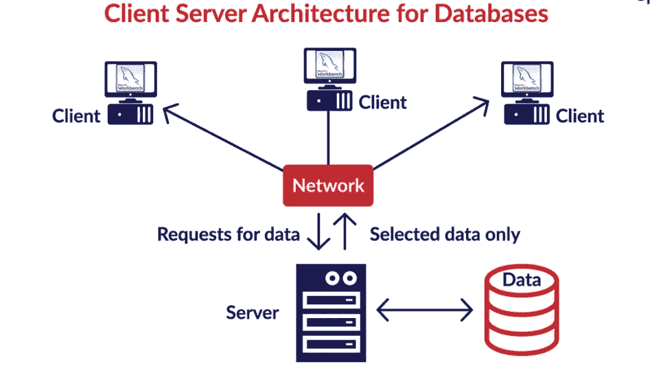
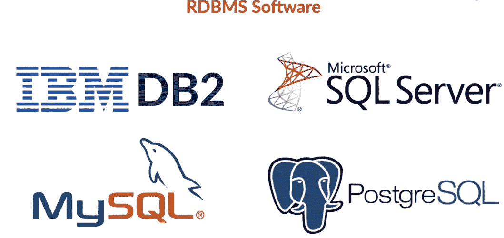
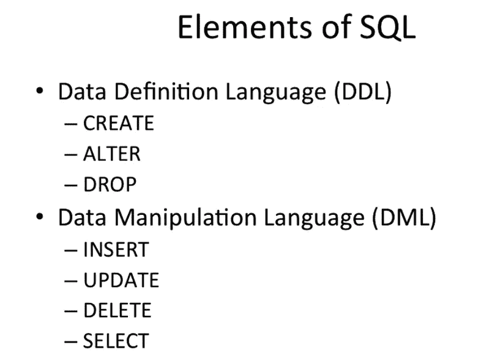
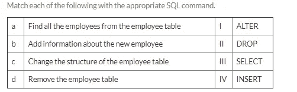
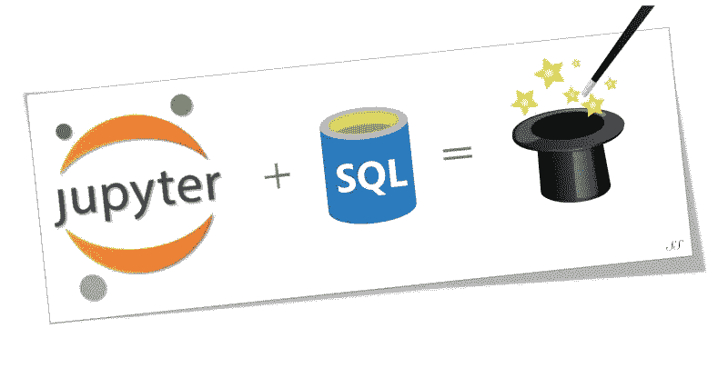

# 人工智能系列 _ 第五部分:使用 SQL 进行数据分析

> 原文：<https://medium.datadriveninvestor.com/artificial-intelligence-series-part-5-data-analysis-using-sql-7e61bee24b85?source=collection_archive---------1----------------------->

这是正在进行的 AI/ML 系列准备文章的第六部分— —使用 SQL 分析数据

早期帖子(从最新帖子开始):

1.  [**人工智能系列 _ 第 4B 部分:Python 中的数据可视化**](https://medium.com/datadriveninvestor/artificial-intelligence-series-part-4b-data-visualization-in-python-8b0a797cbc44)

[2**。人工智能系列 _ 部分 4A:Python 中的数据可视化**](https://medium.com/datadriveninvestor/artificial-intelligence-series-part-4-data-visualization-in-python-da457ff3a70b)

[**3。人工智能系列 _ 第三部分:揭秘熊猫**](https://medium.com/@nishantup/artificial-intelligence-series-part-3-demystifying-pandas-4f8caeeb6e9e?fbclid=IwAR1VqwsRDs-j_SyYmJMU4tY6ncsauD70eQX1XRl-pqufR6aZ3C_pslrs3Ws)

[**4。人工智能系列 _ 第二部分:NumPy 演练**](https://medium.com/datadriveninvestor/artificial-intelligence-series-part-2-numpy-walkthrough-64461f26af4f)

[**5。人工智能系列 _ 第 1 部分:Python 简介**](https://medium.com/artificial-intelligence-series-introduction-to)

**简介**

到目前为止，我们已经学会了如何使用 Python 执行基本的数据分析。我们知道通过不同的文件管理数据总是有风险的，并且可能产生不一致。一个组织无法通过维护成千上万的文件来有效地跟踪其业务活动。为了有效地访问和管理数据，有一种叫做数据库的东西。数据库是数据的储存库。您可以添加、修改和查询数据库中的数据。一种被称为数据库管理系统(DBMS)的软件在行业中被广泛使用，以方便地分析数据。与关系数据库对话以存储、更新、更改和删除数据的语言称为**结构化查询语言(SQL)** 。在本文中，我们将介绍数据库、DBMS 和 SQL 命令的基本概念。SQL 是最强大的数据操作工具之一，在所有行业中广泛使用。

# 为什么学习 SQL 如此重要？

首先，它允许您直接处理原始数据，而不是要求其他人向您提供结构化/有组织的数据集。这使你能够更快地洞察、制定战略，独立领导项目，并成为团队的技术资产。

其次，SQL 增加了你的 [**经济护城河**](https://www.investopedia.com/ask/answers/05/economicmoat.asp)——沃伦·巴菲特推广的一个术语，用来描述你相对于你所在领域其他人的竞争优势。SQL 是目前市场上[最受欢迎的技能之一](https://www.cnbc.com/2017/04/26/5-skills-that-will-lead-to-a-high-paying-in-demand-job.html)，它肯定会让你与众不同。

# [RDBMS](https://www.tutorialspoint.com/sql/sql-rdbms-concepts.htm) 和 SQL 简介

在你逛超市的时候，你有没有观察过收银台的那个人？收银员扫描产品代码，自动生成您所购商品的账单。他从哪里检索产品代码细节？此外，当你购物时，交易细节如你的卡号、购物金额等。会自动存储在某个“后端数据库”中。这到底是怎么发生的？

让我们再举一个例子——你可能使用过存储你的账户余额、卡的详细信息、交易历史等的网上银行应用程序。并且在任何给定的时间处理数以千计的这样的客户。你所要做的只是点击几个图标，但整个过程既快又流畅。这背后的技术是什么？所有这些客户的数据究竟是如何处理和检索的？在这篇文章中，我将带领我们了解称为 **DBMS(数据库管理系统)**的技术及其数据检索语言 **SQL(结构化查询语言)。**

有各种方法来安排和管理数据库中的数据。最常见的是将数据排列在表格中，这类似于 Excel 文件。该表包含多列和多行。现在你知道数据库是相关数据的集合。为了提供更一致的数据视图，人们发明了数据库管理系统或 DBMS。常见的数据库管理系统有:

> **数据库管理系统和**
> 
> **关系数据库管理系统**

在 RDBMS 中，数据被组织在数据库的表中，SQL 是访问和操作 RDBMS 中数据的语言。但是一个问题仍然没有答案——你如何访问这些数据？答案是一种为此设计的特定语言，称为**结构化查询语言，或 SQL** 。在某种程度上，SQL 是一个中介。它将前端(计算机和其他端点)与后端数据库(托管在服务器上)连接起来。

> SQL 是由 IBM 的 Donald D. Chamberlin 和 Raymond F. Boyce 在 20 世纪 70 年代早期开发的。它最初被称为**续集**(结构化英语查询语言)，但后来不得不改变其名称，因为另一家企业拥有该名称作为商标。舍弃了几个字母，SQL 诞生了。

本文将向您介绍**模式、表、关系、约束和键**等概念。我们将以**‘company’**数据库为例来学习 SQL。可以下载显示以下数据库模式的 pdf 文档:

**MySQL 安装指南:**

我们将在 MySQL DBMS 系统上工作，我们将使用的客户端是我的 SQL 工作台。请下载下面文档中给出的安装说明。(请注意，无论您的系统架构如何(无论是 32/64 位)，windows 都有 32 位安装版本，请安装 32 位版本。)

现在，您已经在机器上安装了 MySQL，并学习了与 MySQL 相关的基本组件和术语( [**MySQL 教程**](https://dev.mysql.com/doc/mysql-tutorial-excerpt/8.0/en/tutorial.html) **)** ，是时候了解更多有关 SQL 和 SQL 中一些重要命令的信息了。

先说 SQL。SQL 是非过程化的、简单的、类似英语的语言。SQL 是用于处理存储在关系数据库中的数据的语言。让我们了解一下数据库架构。

数据库通常存储在服务器中。DBMS 软件在服务器上运行。为了在服务器上使用 SQL 语言，需要使用所谓的客户端软件。有许多开源和专有的 RDBMS 软件可用。在这篇文章中，我们将使用一个这样的开源软件，即 **MySQL Workbench** 。

下面显示了一些可用的软件(DB2 和 Microsoft SQL server 是专有软件) :

那么 SQL 中包含了什么呢？概括地说，SQL 包含两个主要元素:

> **1。数据定义语言(DDL)**
> 
> **2。数据操作语言(DML)**

顾名思义，DDL 用于创建新模式以及修改现有模式，这通常由数据库管理员(DBA)来完成。DDL 中典型的命令有— **CREATE** 、 **ALTER** 和 **DROP。**

**DML** 命令允许我们操作数据库中可用的数据。作为一名数据分析师，您将大量使用 DML 命令，因为您的工作将侧重于洞察生成，因此大部分时间将使用 DML 命令，特别是 **SELECT** 命令。

问题的答案是:

**a-III、b-IV、c-I、d-II**

# 使用 SQL 进行数据检索

在本节中，您将学习 SELECT 查询中的基本构造。本课程还将包括创建数据库模式，该模式将在整个课程中使用。您将具体学习以下内容:

> SELECT 子句-从数据库中检索数据
> 
> FROM 子句
> 
> WHERE 子句
> 
> SQL 中的基本排序和过滤

让我们使用 DDL 命令创建一个数据库，并在 MySQL Workbench 中使用 DML 命令填充它。您可以从下面给出的 SQL 代码中下载用于模式创建的 **DDL 脚本**，并在 MySQL Workbench 编辑器中运行它。确保预先创建了 **companydb** 空模式，并且在执行 DDL SQl 代码时，记得选择默认模式作为 **companydb** ，这将确保为 **companydb** 数据库创建表。

DDL 代码创建了 **companydb** 数据库(即填充了所需的表)，如上面上传的模式 pdf 所示。接下来，我们将深入学习数据分析师最广泛使用的 SQL 查询—由 SELECT、FROM 和 WHERE 子句组成的 DML 查询。

你准备好使用 SQL 了吗？我们将根据我们刚刚创建的 **companydb** 数据库回答一些问题。通常我使用像 **sublime text** 这样的文本编辑器来创建更好的代码着色和索引，而不是直接使用 **MySQL workbench 编辑器**。然后，我将代码从 sublime text 复制粘贴到 MySQL workbench 编辑器中，然后执行它们。我将回答 30 个奇怪问题所需的 SQL 命令放在下面:

如果需要得到问题的答案，上面给出的 SQL 代码需要在 MySQL workbench 中执行。但是等等……这不是 AI 系列文章吗。那就让我们在这里创造一些奇迹吧。我们将通过 Jupyter 笔记本使用 python 环境来解决所有问题，而无需在 MySQL workbench 中实际执行任何查询。你怎么可能会问？Python-SQL 连接器，傻瓜。美妙的是，我们将在令人敬畏的 Jupyter 环境中操作，这是我们从 AI/ML 系列一开始就一直在做的。代码和输出可以并排查看，就像我们看到 python 脚本一样。太棒了，不是吗？

[Creating magic with Jupyter + SQ](https://towardsdatascience.com/jupyter-magics-with-sql-921370099589)L

注意:我们仍然需要 MySQL 数据库引擎。只有数据会驻留在那里。所有的分析都将通过 Jupyter 的笔记本和 MySQL 工作台之间建立的连接来完成。此外，我们不仅将在 Jupyter 环境中使用常用的 SQL 语法，还将 SQL 查询数据转换为 Pandas 数据框架，以便进一步分析和可视化(使用 seaborn 库)。魔法无处不在！！！

哒哒…..！！

**SQL 学习资源:**

1.  SQL 备忘单:

[2。如何在 MySQL 中设置多个字段为主键？](https://dba.stackexchange.com/questions/57548/how-to-set-up-multiple-fields-as-primary-key-in-mysql)

[3。MySQL 参考电子书](https://dev.mysql.com/doc/mysql-tutorial-excerpt/8.0/en/tutorial.html)

4.[数据分析的 SQL 教程](https://community.modeanalytics.com/sql/tutorial/introduction-to-sql/)

5.[面试的 SQL 回顾](https://towardsdatascience.com/sql-cheat-sheet-for-interviews-6e5981fa797b)

6. [W3 学校](https://www.w3schools.com/sql/)

在线 MOOCs:

1.  [用 SoloLearn app 学习 SQL](https://www.sololearn.com/?ref=medsql)

2.[IBM-Coursera 为数据科学开发的数据库和 SQL](https://www.coursera.org/learn/sql-data-science/home/welcome)

3.[数据科学 SQL 加州大学戴维斯分校(Coursera)](https://www.coursera.org/learn/sql-for-data-science)

4.[使用 Python 数据库-密歇根大学(Coursera)](https://www.coursera.org/learn/python-databases)

接下来的几篇帖子将涵盖数据科学和机器学习中经常使用的一些基本数学概念，这是一些算法(如 PCA、高级回归、神经网络和深度学习等)的先决条件。回头见！！

***软软的小猫，暖暖的小猫，小小的毛球。***

***快乐的小猫，瞌睡的小猫，咕噜咕噜咕噜！！！！***