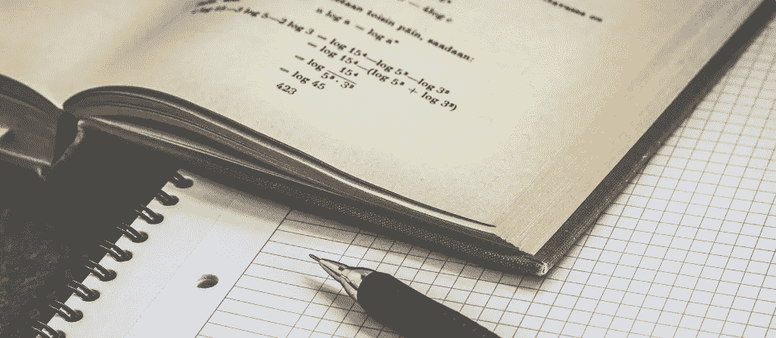
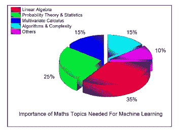

# 人工智能系列 _ 第六部分:人工智能与人工智能的数学

> 原文：<https://medium.datadriveninvestor.com/artificial-intelligence-series-part-6-mathematics-for-ml-ai-525560dac06d?source=collection_archive---------6----------------------->

> 只要学校里教代数，学校里就会有祈祷。

我前进旅程的下一部分是确保我对机器学习和人工智能所需的数学有一个很好的理解，如果不是很扎实的话。许多需要理解的理论数学概念是我以前在某个地方，在我的教育中的某个时候，在某种程度上深入研究过的概念，因此不仅可以作为复习，而且可能还会给我新的见解。

回顾到目前为止走过的路程:(从最新开始)

[**6。人工智能系列 _ 第五部分:使用 SQL** 的数据分析 T3](https://medium.com/datadriveninvestor/artificial-intelligence-series-part-5-data-analysis-using-sql-7e61bee24b85)

[**5。人工智能系列 _ 第 4B 部分:Python 中的数据可视化**](https://medium.com/datadriveninvestor/artificial-intelligence-series-part-4b-data-visualization-in-python-8b0a797cbc44)

[**4。人工智能系列 _ 4A 部分:Python 中的数据可视化**](https://medium.com/datadriveninvestor/artificial-intelligence-series-part-4-data-visualization-in-python-da457ff3a70b)

[**3。人工智能系列 _ 第三部分:揭秘熊猫**](https://medium.com/@nishantup/artificial-intelligence-series-part-3-demystifying-pandas-4f8caeeb6e9e?fbclid=IwAR1VqwsRDs-j_SyYmJMU4tY6ncsauD70eQX1XRl-pqufR6aZ3C_pslrs3Ws)

[②**。人工智能系列 _ 第二部分:NumPy 演练**](https://medium.com/datadriveninvestor/artificial-intelligence-series-part-2-numpy-walkthrough-64461f26af4f)

1.  [**人工智能系列 _ 第一部分:Python 简介**](https://medium.com/@nishantup/artificial-intelligence-series-introduction-to-python-part-1-8f45743573bf)

*****数学*用于机器学习&人工智能****

> 数学就像一只章鱼:它的触角可以触及几乎所有的学科。虽然有些受试者只是轻轻一刷，但其他受试者却像蛤蜊一样被触手紧紧抓住。数据科学属于后一类。如果你想从事数据科学，你将不得不与数学打交道。—兰德尔·霍尔

许多现成的机器和深度学习包的可用性出现了爆炸式增长，如 caret (R)、scikit-learn (python)、keras/Tensor flow (DL)等。机器学习理论领域是线性代数和概率理论、统计学、计算机科学和算法等学科领域的交叉，这些学科聚集在一起，从数据中迭代学习，并揭示隐藏的见解，以解决商业问题并构建类似人类的智能应用程序。然而，尽管在机器和深度学习框架中存在巨大的可能性，但对于这些建模技术中的一些技术，如果不是牢固的数学理解，也是很好地掌握建模算法的底层机制所必需的，这将最终转化为获得良好的结果。

**百万美元问题——为什么要担心*数学*？**

> 在不了解基础数学/统计学的情况下使用像神经网络、boosting 和支持向量机这样的花哨工具，就像在知道如何使用创可贴之前做大脑手术一样。——**拉里·乏色曼**

**了解用于机器学习的*数学*很重要，这有几个原因，在这种情况下，我将在下面强调其中的几个:**

1.  **首先，任何建模步骤的一个关键部分是选择适当的算法，包括适当考虑相关特征的数量、广义设置中的模型精度、训练时间、模型复杂性的可解释性、参数的适当选择。**

**2.选择正确的超参数设置(调谐)和验证策略。**

**3.理解偏差-方差权衡，以识别欠拟合和过拟合。**

**4.用相关的置信区间和不确定性来表达结果。**

****因此，下一个合乎逻辑的问题是，一个人需要知道什么水平的*数学*？****

**当我们试图获得 ML/AI 这一跨学科领域的技能时，需要获得一些构成 ML/AI 的交叉学科领域的基础。因此，人们一致认为，要成为一名成功的 ML 工程师，所有领域的专业知识都是非常重要的。在这方面，出现的问题是，要很好地理解算法，需要多少数学知识的水平和数量。答案并不像你可能已经猜到的那样简单。许多因素在这里相互作用。这个问题的答案取决于你想成为什么--类似于我称之为理论 ML 工程师的理论物理学家，或者类似于我们大多数人都是的应用或实验物理学家。但是要成为一个全才，你必须两者都有不同的*比例。*根据到期日和兴趣，人们可以随着时间的推移改变比例。但是说了这么多，让我们来看看，为了开始看到隐藏的结构，我们需要覆盖哪些数学子领域。**

****

***‘I’m trying to free your mind, Neo. But I can only show you the door. You’re the one that has to walk through it.’ —* [The Matrix](https://t.umblr.com/redirect?z=http%3A%2F%2Fwww.imdb.com%2Ftitle%2Ftt0133093%2F&t=NGE5ODUwMjFkNDUwNmEyNzIyYjFlMDFkYmMxMWM2ZTM2NjFlM2NiMSxXNnlIRkVldw%3D%3D&b=t%3AcU7L33iK9eBQE8aWv-eZGA&p=https%3A%2F%2Ftechnoir.nl%2Fpost%2F44652440963%2Fmarch2013-thematrix&m=0) (1999)**

**下面是一个饼图，显示了需要学习/更新的主题分类。下面的指针取自**

****

1.  ****线性代数**:**

> ***斯凯勒·斯皮克曼*，最近说“ ***线性代数是 21 世纪的数学*** ”。**

**在 ML 中，线性代数随处可见。诸如主成分分析(PCA)、奇异值分解(SVD)、矩阵的特征分解、LU 分解、QR 分解/因式分解、对称矩阵、正交化和正交归一化、矩阵运算、投影、特征值和特征向量、向量空间和范数等主题对于理解用于机器学习的优化方法是需要的。线性代数的惊人之处在于有如此多的在线资源，最受欢迎的是麻省理工学院开放课程软件(Gilbert Strang 教授)提供的线性代数课程。**

****2。概率论与统计**:统计和机器学习在某种意义上并没有那么大的区别。据说，**

> **机器学习被美化为统计学**

**ML 就像在苹果电脑上做统计一样。尽管如此，统计学和概率中的一些基本领域将派上用场的是，概率规则和公理，随机变量，方差和期望，条件和联合分布，标准分布(伯努利，二项式，多项式，均匀和高斯)，矩母函数，组合学，贝叶斯定理，最大似然估计(MLE)，先验和后验，最大后验估计(MAP)和抽样方法。**

**3.**多元微积分**:**

**他们的武库中应该有几个主题，包括微分和积分，偏导数，向量值函数，方向梯度，海森，雅可比，拉普拉斯和拉格郎日分布。**

**4.**算法和复杂优化**:**

**这对于理解我们的机器学习算法的计算效率和可扩展性以及利用我们的数据集中的稀疏性是重要的。需要了解数据结构(二叉树，散列，堆，栈等)，动态规划，随机和次线性算法，图形，梯度/随机下降和原始对偶方法。**

**5.**剩余话题**:**

**上述四个领域未涉及的数学主题，包括实分析和复分析(集合和序列、拓扑、度量空间、单值和连续函数、极限、柯西核、傅立叶变换)、信息论(熵、信息增益)、函数空间和流形。**

**现在，让我们把手弄脏。**

**随附 Jupyter 笔记本和我的手写笔记，涵盖三大领域，即:**

1.  **向量和向量空间**
2.  **使用矩阵的线性变换**
3.  **多元微积分**

**Jupyter 笔记本包含基础理论以及使用 python 解决一些线性代数问题的例子。手写笔记涵盖了理论和一些推导，以便我自己更好地理解。**

****

**请根据您的要求随意使用这些材料。这里有太多我无法涵盖的东西。当我深入研究 ML 和 DL 时，许多剩余的概念将被涵盖。不要忘记浏览最后的资源部分，包括备忘单、书籍信息、网络资源、MOOCs。旅途愉快！**

1.  ****线性代数(向量和向量空间)****

****2。线性变换(矩阵)****

****3。多元微积分****

**即使付出了这么多努力去理解题目，做笔记，看着吉尔伯特·斯特朗来回讲解线性代数，我仍然觉得我还有很多东西要学…很多东西要记住…有太多东西要补上。我感觉自己就像《生活大爆炸》中 TBBT 的伦纳德想要抓住谢尔顿一样——巴赞加！….巴赞加！：**

****资源:****

****课程笔记(pdf):****

****Mathematics for Machine Learning-Lecture Notes ( IMPERIAL COLLEGE LONDON)****

**Mathematics for machine learning calculus formulasheet**

****The Matrix Cookbook****

****博文:****

** [## 数据科学线性代数

### 这是博客文章系列“数据科学:完整参考”的第三篇文章，这篇文章涵盖了这些相关的主题…

medium.com](https://medium.com/@rathi.ankit/linear-algebra-for-data-science-a9648b9daee0)  [## 主成分分析背后的数学

### 从原始数据到主成分

towardsdatascience.com](https://towardsdatascience.com/the-mathematics-behind-principal-component-analysis-fff2d7f4b643)  [## 数据科学中的线性代数

### 这是数据科学终极课程的一部分，学习张量、范数、奇异值分解、奇异值分解

medium.com](https://medium.com/@gauravc2708/linear-algebra-in-data-science-a5504d8b35e6)  [## 提升您的数据科学技能。学习线性代数。

### 我想介绍一系列的博客文章和它们相应的 Python 笔记本，收集关于深层…

towardsdatascience.com](https://towardsdatascience.com/boost-your-data-sciences-skills-learn-linear-algebra-2c30fdd008cf)  [## 数据科学中的微积分及其应用

### 微积分是一种以纯粹形式发展起来的抽象理论。

towardsdatascience.com](https://towardsdatascience.com/calculus-in-data-science-and-its-uses-3f3e1b5e5b35)  [## 线性代数 101 —第一部分

### 我相信当学习一些高级的东西时，理解基本概念是至关重要的。为什么？因为…

medium.com](https://medium.com/sho-jp/towards-understanding-linear-algebra-part-1-d43710535503)  [## 线性代数 101 —第二部分

### 在进入本文之前，请注意这些故事是一系列的“走向理解线性…

medium.com](https://medium.com/sho-jp/towards-understanding-linear-algebra-part-2-e51c948ad00)  [## 线性代数 101 —第三部分

### 在进入本文之前，请注意这些故事是一系列的“走向理解线性…

medium.com](https://medium.com/sho-jp/towards-understanding-linear-algebra-part-3-5bda805bd67e)  [## 线性代数 101 —第四部分

### 这是一系列旨在理解线性代数的文章。我坚信理解…很重要

medium.com](https://medium.com/sho-jp/linear-algebra-101-part-4-6864630842b)  [## 线性代数 101 第 5 部分:行列式

### 在这个故事中，我们将涉及线性代数中最重要的概念之一，“行列式”！

medium.com](https://medium.com/sho-jp/linear-algebra-101-part-5-determinants-b54f990782cc)  [## 线性代数第 6 部分:特征值和特征向量

### 欢迎来到这一系列关于理解线性代数的故事。你可以看看以前的故事，来自…

medium.com](https://medium.com/sho-jp/linear-algebra-part-6-eigenvalues-and-eigenvectors-35365dc4365a)  [## 线性代数 101 第 7 部分:对称时的特征分解

### 今天，我们正在学习线性代数中更高级的主题，这些主题在机器学习中更相关、更有用。

medium.com](https://medium.com/sho-jp/linear-algebra-101-part-7-eigendecomposition-when-symmetric-4cd41d38269e)  [## 线性代数 101 第 8 部分:正定矩阵

### 今天，我们继续深入研究正定矩阵。更具体地说，我们将…

medium.com](https://medium.com/sho-jp/linear-algebra-101-part-8-positive-definite-matrix-4b0b5acb7e9a)  [## 机器学习的数学:线性代数

### 我旅程的下一部分是关于确保我对机器所需的数学有一个坚实的理解…

medium.com](https://medium.com/@isaacng/mathematics-for-machine-learning-linear-algebra-d6eefe979105)  [## 机器学习的数学:多元微积分

### 自从我发帖以来已经有一段时间了。我已经决定完成 Coursera Specialisation 的最后两部分…

medium.com](https://medium.com/@isaacng/mathematics-for-machine-learning-multivariate-calculus-7102c7a586c6)  [## 机器学习的数学:PCA

### 这是机器学习数学的最后一门课。完成这个课程后，我学会了如何应用…

medium.com](https://medium.com/@isaacng/mathematics-for-machine-learning-pca-239c84de654)  [## 数据科学家线性代数初学者综合指南

### 我们在分析网站上最常遇到的一个问题是:我需要学习多少数学才能成为一名…

www.analyticsvidhya.com](https://www.analyticsvidhya.com/blog/2017/05/comprehensive-guide-to-linear-algebra/)  [## 矩阵乘法-一个不同的视角

### 矩阵乘法是工程和数学中常见的二元运算。我们在……中经常看到它

kishorepv.github.io](https://kishorepv.github.io/Matrix-Multiplication/) 

**书籍:**

1.  可能是物理学中最流行和最容易理解的 ***数学方法*** 玛丽·L·博阿斯，约翰·威利父子，2006 年第 3 版。线性代数在第三章。
2.  ***《线性代数导论》***Gilbert Strang 著，韦尔斯利-剑桥出版社，2016 年第 5 版。【http://math.mit.edu/~gs/linearalgebra/ 
3.  ***用于机器学习的线性代数基础*** 杰森·布朗利著

**网络资源:**

1.  [吉尔伯特·斯特朗博士(麻省理工学院)的线性代数讲座视频](https://ocw.mit.edu/courses/mathematics/18-06-linear-algebra-spring-2010/video-lectures/)
2.  [课堂讲稿——机器学习的数学(OCW-MIT)](https://ocw.mit.edu/courses/mathematics/18-657-mathematics-of-machine-learning-fall-2015/lecture-notes/?fbclid=IwAR2zv1qN8ag05WUv1ZSImLPbR4ZS66Fxqk4KpGlU2ucmQmjMMQUo7bR-pik)
3.  格兰特·桑德森在 YouTube 上有一系列发展数学直觉的视频，你可以通过他的网站找到这些视频
4.  可汗学院的[线性代数](https://www.khanacademy.org/math/linear-algebra)、[概率&统计学](https://www.khanacademy.org/math/probability)、[多元微积分](https://www.khanacademy.org/math/calculus-home/multivariable-calculus)和[最优化](https://www.khanacademy.org/math/differential-calculus/derivative-applications/calc-optimization/e/optimization)。
5.  约瑟夫·布利茨坦— [哈佛统计 110 讲座](http://projects.iq.harvard.edu/stat110/youtube)。
6.  [多变量微积分(OCW-MIT)](https://ocw.mit.edu/courses/mathematics/18-02-multivariable-calculus-fall-2007/video-lectures/)
7.  [WildLinAlg:线性代数中的几何课程](https://www.youtube.com/watch?v=yAb12PWrhV0&list=PL01A21B9E302D50C1)
8.  [数学——面向工程师的高级矩阵理论和线性代数](https://www.youtube.com/watch?v=NAAa_eQOh2s&list=PL05CD03A43A56AE66)
9.  [线性代数的直观指南——更好的解释](https://betterexplained.com/articles/linear-algebra-guide/)
10.  [IIT 马德拉斯数学系 K.C. Sivakumar 博士的线性代数](https://www.youtube.com/playlist?list=PLbMVogVj5nJQ2vsW_hmyvVfO4GYWaaPp7)
11.  [向量微积分学习指南(俄勒冈州立大学)](https://math.oregonstate.edu/home/programs/undergrad/CalculusQuestStudyGuides/vcalc/vcalc.html)
12.  [向量微积分](https://betterexplained.com/articles/category/math/vector-calculus/)
13.  [向量代数与向量微积分](http://farside.ph.utexas.edu/teaching/336k/Newtonhtml/node148.html)

**慕课:**

1.  [机器学习专业化数学(伦敦帝国理工学院)——Coursera](https://www.coursera.org/specializations/mathematics-machine-learning)
2.  [线性代数的应用，第一部分](https://www.edx.org/course/applications-linear-algebra-part-1-davidsonx-d003x-1)和[第二部分](https://www.edx.org/course/applications-linear-algebra-part-2-davidsonx-d003x-2)。戴维森学院蒂姆.查蒂尔的新课程。
3.  [线性代数——前沿基础](https://www.edx.org/course/linear-algebra-foundations-frontiers-utaustinx-ut-5-04x)作者罗伯特·范·德·盖因，德克萨斯大学 edX 分校。

好了，你已经到了这篇博文的结尾，这意味着你幸存了。你是幸存者！

这篇文章的主要目的不是恐吓 ML 爱好者或该领域的初学者。这是我个人的一次尝试，探索一条最终能让我创造 SOTA(最先进的)应用的道路，也许是类似自动驾驶汽车的东西。谁知道呢。但有一点是明确的，要达到我所努力的阶段，我必须穿过黑暗、茂密和潮湿的森林，如果我想看到另一端的光明。这是我为自己规划的旅程，无论发生什么，我都非常认真。这是唯一的路吗？。天哪不。肯定会有更短、更轻松的路可以走。一个人必须弄清楚并坚持到底。

最后，我相信/我的观点是，尽可能多地吸收知识，而不是仅仅成为机械化的编码员或四处游荡。我需要学习这个或那个吗？去做吧。当然，学习/了解更多并没有坏处，不是吗？没有东西会浪费。

顺便说一句，我在@Quora 上看到了这个关于数据科学需要数学的帖子。看一看。

 [## 学习机器学习的数学前提是什么？

### 回答(第 1 题，共 33 题):和其他开始学习机器的初学者一样，第一个问题是…

www.quora.com](https://www.quora.com/What-are-the-mathematical-pre-requisites-for-studying-machine-learning) 

希望一些疑惑得到澄清。

下一篇文章将涵盖统计学应用于机器学习的概念基础(使用 Python)。

在那之前…

## 快乐编码:)

别忘了拍手拍手拍手…

**