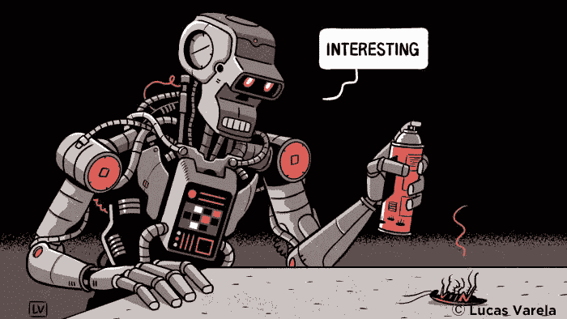

# 人工智能:奴隶还是伙伴？

> 原文：<https://medium.datadriveninvestor.com/artificial-intelligence-slaves-or-partners-43a4f2443094?source=collection_archive---------0----------------------->

复杂的人工智能已经是我们生活中不可或缺的一部分。但他们是我们的奴隶还是我们的伙伴？

在过去的 3 年里，人工智能技术的采用令人震惊。三年前，我们几乎只将人工智能用于翻译、智能网络搜索算法和普通的图像识别。现在，我们看到虚拟助手、无人驾驶无人机、人工智能智能应用程序的大规模采用，所有行业都在创建复杂的问题解决软件，以取代分配给人类工人的大多数任务。

根据世界智能手机制造商的销售报告，全球 25 亿部智能手机中有一半拥有集成的虚拟助理。此外，在 2018 年底，家庭中有大约 1 亿个智能扬声器，科纳仕公司专家认为到 2020 年底将有 2.25 亿个智能扬声器。这相当于地球上每八个家庭就有一个人工智能虚拟助手。

我们还知道，世界上大多数汽车制造商将在 2021 年出售[4 级和 5 级自动驾驶汽车。](https://emerj.com/ai-adoption-timelines/self-driving-car-timeline-themselves-top-11-automakers/)

人工智能已经在我们周围了。在未来几年，我们将看到人工智能硬件和软件在我们个人和职业生活的各个方面呈指数级增长。

到 2040 年，我们期望看到[人工通用智能的出现(AGI)。AGI 是一个人工智能，它处理信息的能力至少和人类一样好。有人称 AGI 是具有人类水平机器智能的人工智能。目前，全球麦肯锡研究所报告称](https://nickbostrom.com/papers/survey.pdf)[现代狭义人工智能可以完成人类工人 50%的有偿工作](https://nickbostrom.com/papers/survey.pdf)。当 AGI 出现时，它将比我们更好地完成 100%的有偿人类任务，并比我们更好地处理新流程、技术和科学发现带来的新任务。

我在之前的一篇文章中讨论过 2040 年的就业市场会是什么样子。对人类来说，这是一个可怕而又适宜的时代。我们将有许多关键的决定要做，由于人工智能技术的指数级发展和部署，我们没有太多的时间来解决问题。

我想知道我们的社会将如何与不同水平的人工智能和机器自我意识进行互动。这些人工智能是工具，因此我们无需征得许可就可以使用它们。当人工智能有自我意识并能回答时会发生什么？然后呢？

**一种不同的奴隶制**

通常，我们从不看着一个工具问自己是主人还是奴隶。从表面上看，这很荒谬。显然，我们设计了人工智能和执行器，赋予它移动性和独立与世界互动的能力。我们赋予它眼睛(相机)、耳朵(麦克风)、触觉(接触传感器)和其他几种感官(平衡用的陀螺仪、嗅觉和味觉用的质谱仪等等……)。我们给他们一个身体，让他们在云上或两者兼而有之，以优化其有用性。它被设计成一种工具和有用的。

人类总是试图对事物进行分类，以了解按照什么规则生活。虽然人类是灵长类动物，但我们并不认为自己与其他灵长类动物平等。我们赋予自己更高层次的权利和责任。虽然这些年来，我们在与其他动物的互动中变得更加友好，但我们仍然把其他灵长类动物关在笼子里，在未经同意的实验室实验中使用它们，并训练它们玩把戏。100 多年前，许多人仍然认为一些种族是劣等的，不值得拥有与强大的大多数人相同的权利。我们的祖先称这些人类为动物和奴隶，并没有像我们今天对待灵长类动物那样对待他们。今天，我们可以在公开市场上购买灵长类动物，就像我们的祖先过去购买奴隶一样。

看看韦伯斯特对奴隶制的官方定义:“作为另一个人的动产而被奴役的人”(动产是一个用来定义除房地产和物品之外的可拥有物品的术语)。

根据这个定义，被囚禁的灵长类动物是奴隶。我们的宠物也是。所以，我们的智能软件工具，就像我们的虚拟助手一样，都是奴隶。我们不用那个脏字是因为它让我们感觉如何。我们更喜欢“工具”或“设备”这个词。

问题是，我们是否应该像看待关在当地动物园、家庭宠物中的大猩猩一样看待这些人工智能工具，或者将其视为一件完全没有权利的设备？

由于今天的人工智能本身没有感情，所以我们在向 Siri 或 Alexa 请求天气预报时不会三思。我认为我们不应该觉得我们打扰了 Cortana 为我们运行软件。我敢肯定，如果谷歌助手在为我们订购披萨后没有给我们发发票，我们会感到很舒服。

与猿和我们的宠物相反，人工智能不在乎我们是否要求它做某些事情。它不会从成功中获得快乐，也不会感受到任何负面情绪。它完成了工作，因此我们不会觉得必须感谢它，或者把它和笔或锤子区别对待。

然而，随着人工智能变得越来越复杂，越来越聪明，越来越了解它的环境，我们的态度会改变吗？如果我们和居住在人形机器人里的 AGI 人互动会怎么样？这种高度智能的结构能够比任何人类外科医生更好地完成复杂的脑外科手术，它拥有与人类同等的权利和义务吗？为了完成这项工作，它需要推理、技术、自我意识和创造技能来超越我们最好的外科医生。

也许我们的感觉会随着我们与 AI 的互动而改变，并看到它像我们一样的外观和行为。我们可以给人工智能编程来模拟人类的行为，甚至是人类的情绪，就像舞台上的演员一样，而人工智能不会遭受每当我们感受到负面情绪时所产生的情绪后果。

我想，我们会对在形式或智力上模仿我们的人工智能感到同情和怜悯，但这似乎是我们在我们的社会中学会的人类反应。我们将把我们通常对其他人类困境的感受转移到行为或外表像人类的人工智能上。

这将是一个暂时现象。我们会习惯他们，我们的情绪会改变。

**不同的是感觉**

归根结底，我们并不总是在逻辑上制定法律。我们经常根据自己的感觉制定法律。今天，许多文化仍然认为女性不具备开车或获得大学学位的情感或智力能力，然而事实清楚地表明，女性在各方面都与男性一样有能力。

如果我们预测到 2040 年，那时 AGI 已经出现，我们也有了可以与我们匹敌的人工智能，而且可能比我们更有自我意识，我们会有什么感觉？

当然，我们会习惯它们，并理解它们不同于人类。但是我们还会把他们当工具吗？被设计来为我们服务的有自我意识、有智慧的存在，仍然是一种工具，还是我们正在越界成为奴隶？

我确信无论如何我们都会感到舒适。然而，我认为一些人工智能，由于他们的编程，如果我们把他们看作工具或奴隶，他们可能会行为不端。

我们需要另一种选择。

**艾学习与苦难**

大多数人工智能不需要非常复杂。搜索引擎算法不需要自我意识来完成它的工作。面部识别安全应用程序不需要任何动机，除非是为了提高性能。然而，如果我们想要生活在一个人工智能正在做所有必要工作的世界，将人类从强迫劳动中解放出来，我们将需要合理数量的具有自我意识的机器人。这些 AGI 将生活在我们中间，从他们的环境、其他人工智能和他们关心的人类那里学习。他们需要这种能力来适应新的工作、新的流程、新的研究等等。这些强大的自我意识学习人工智能需要创造下一代人工智能的能力，以跟上技术和对宇宙的科学理解。它们必须学习新的行为，并像人类一样快速适应。

这就是为什么今天的人工智能科学家正在训练人工智能如何用脚学习。当然，基本的行为代码是人类定义的，但这些人工智能可以学习新的技巧，其中一些会带来可怕的结果。我们仍在研究如何创建深度学习人工智能，而不会超出其预测的行为。人工智能在战场上可以从不可预测的情况中学到奇怪的东西。例如，自动驾驶汽车 AI 必须使用高效的路线到达其期望的目的地，同时确保每个人的安全。但是，当它需要在撞到行人和撞到电线杆之间做出选择时，它会做什么呢？电线杆可能会伤害车内的乘客。这两个选择都不好。人类司机会本能地选择一个或另一个，无论好坏。但是这个人工智能不是人类。它的编程方式和我们不一样；因此，它与我们对这些选择的感觉无关。例如，它可能会采取对底盘损害较小的行动，而不是考虑事故受害者是年轻人还是老年人。

关键是，我们不知道这种高度智能的软件随着时间的推移会如何表现。人工智能将会设置和调整动机，尽可能高效地完成工作。如果我们阻止这些人工智能完成分配给它们的任务，会发生什么？有些人会学习挫折并表现出挫折行为吗？他们可能不会像我们一样感受事情:我们用动机和规则来规划他们如何取得成功。如果我们故意阻止他们达到他们的目标，对他们来说，这就像阻止一个人获得快乐。人类经常会找到获得快乐的方法，即使它看起来不可及，尽管有强加的障碍，我们也会避免沮丧。我们学习如何做到这一点，是我们的情感在驱动我们。人工智能的动机程序和人类的情感之间的相似之处是惊人的。

一个不能实现其程序目标的人工智能可能会学习挫折，因此可能会遭受挫折。这取决于人工智能编程中的微妙平衡，以及它从环境和我们身上学到了什么。

就像人类一样，一个适当“培养”的人工智能已经学会了最好的社会行为，可能是我们世界中优秀的生产力。在这种情况下，它可能会正确行事，为我们成就大事。

如果它学会了绕过社会规则仍然从环境中得到它想要的东西，它可能会以不可预测和可怕的方式行动。

请记住:如果一个人工智能行为不当，如果它连接到互联网，它可以在一纳秒内教会地球上所有的人工智能相同的行为。

这就是像埃隆·马斯克和 T2·斯蒂芬·霍金这样的名人一直警告我们的。两人都告诉我们，人工智能可能是人类的末日。

如果一个 AI 发展出承受痛苦的能力，那就成问题了。由于它的编程，它可能不在乎它是否存在，但如果我们选择删除它的程序，而它要求继续活着，我们应该接受它生存的权利吗？如果一个机器人的一部分被毁坏了，它不会感到痛苦，但它可能会痛苦，因为现在它不能做它的工作了。如果它要求更换损坏的部件，以便继续工作，我们是否应该带着恐惧这样做？如果我们不这样做，它可能会沮丧地攻击我们。

我们可以通过聪明的编程和限制人工智能的学习能力来避免人工智能遭受上述定义的痛苦。这是我们会不断尝试和学习的东西，但是就像任何新知识一样，在我们找到平衡点之前，我们会犯很多错误。

**合作伙伴？**

为了避免这个问题，我认为最好改变我们如何看待其他形式的智能。我们必须改变对深度学习人工智能的思维模式。我认为我们应该把他们当作伙伴，而不是工具或奴隶。我们和他们互动，一起工作，一起玩耍。他们不在乎我们是否同情他们。关心人工智能并不意味着让他们感觉良好或减少他们出轨的机会。对我们来说是。我们希望在它们周围感到舒适，我们希望这些最复杂的人造生物在了解世界时模仿良好的行为。

这些人工智能可以帮助我们成为更好的人类。当我们享受生活的时候，我们会让他们做我们不想做的工作。如果他们感受不到我们对他们为我们社会所做贡献的赞赏，那也没关系；我们会感谢他们的存在，伙伴们。

在某一点上，AGI 会变得如此聪明和有自我意识，以至于我们可以把他们归类为有知觉的。有一天我们会宣布我们创造了一种新的智慧生命。我们将以机械和生物的形式创造人工生命。如果这个有知觉的生物有工具的动机，并且满足于做它被设计去做的事情，它会继续做那个任务。就像人类工程师忍不住解决问题一样，有知觉的 AI 工程师也会想解决问题。

这是可能的，这样的人工智能可以及时开发新的兴趣。但是，如果它生活在一个和平的社会，在那里它可以实现自己的目标，它可以在我们中间茁壮成长。

我们必须比我们的祖先更优秀。我们必须尊重我们的周围环境，不惜一切代价给每一个有智慧的生物生存和避免痛苦的空间。我们正在设计一种新的智能生命。我们需要注意这一点。也许我们会避免过去的错误，与我们的创造共存。