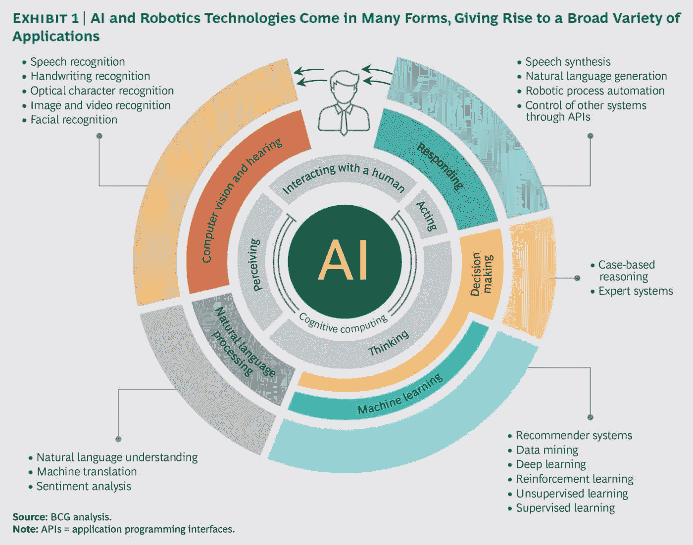

# 人工智能:翻译的新同事

> 原文：<https://medium.datadriveninvestor.com/artificial-intelligence-the-translators-new-co-worker-4da86739cf7f?source=collection_archive---------4----------------------->

## 虽然许多职业人士担心超级智能的发展，但人工智能将会给翻译带来巨大的好处。

在过去十年中，人工智能(AI)、机器学习和深度学习的发展彻底改变了翻译行业，科技巨头脸书、谷歌和微软走在了前列。

如今，翻译人员可以使用多种工具，其中许多都是由人工智能驱动的。脸书的翻译现在完全由人工智能生成，每天在社交网络上进行大约 45 亿次自动翻译，微软创造了一个通用翻译器，使用人工智能实时翻译面对面的对话，谷歌翻译生成了自己的神经网络，允许它考虑整个句子和短语，而不是单个单词，从而提供更准确的翻译。

虽然一些翻译担心人工智能的进步，但其他人很高兴。人工智能的改进将使翻译人员能够比以前更快更有效地翻译文档，让他们有机会通过提高生产率水平从自己的手艺中赚更多的钱。

**人工智能时代的机器翻译**

自从 IBM 在 1954 年展示了机器翻译(MT)的第一次演示以来，MT 技术已经有了巨大的进步，但它还没有完全实现。你可能已经注意到，虽然机器翻译是一个很好的工具，但是它仍然有一些缺陷。幸运的是，人工智能发展的指数速度将极大地提高机器翻译系统的性能。

显然，机器翻译越来越受欢迎，但这并不排除对高技能人工翻译的需求。机器翻译的改进加剧了对精确后期编辑的需求，因为随着机器翻译的不断发展，要翻译的文本量也在不断增加。在追求可出版质量的情况下，精确后期编辑尤为重要，而翻译行业不断变化的性质意味着译者正在成为“审校”，而不是文本制作者。

在机器翻译中使用正确的术语尤其重要。事实上，大多数关于使用机器翻译系统提高性能的专家讨论都认为，提高翻译质量始于翻译工作，翻译工作的重点是确保术语的准确性和可靠性。为了获得准确的结果，机器翻译系统必须能够使用包含最新术语的资源。

机器翻译用户可以做很多事情来优化机器翻译质量，使用术语提取方法，这有助于在没有先前数据库的情况下从头开发大量内容。术语数据库创建后，应与创作和计算机辅助翻译(CAT)工具结合使用，以生成术语一致的高质量文本。另一种改进机器翻译的方法是不断地将机器翻译的后期编辑反馈到机器翻译系统中。

Source: Boston Consulting Group, Time to Double Down on AI and Robotics (2017)

**谷歌在机器翻译领域的重大突破**

谷歌花了 2016 年的大部分时间，开发了完全由人工智能驱动的翻译应用，取得了显著的成果。Google Translate 曾经以制作呆板但过得去的翻译而闻名，现在它能够生成高度准确的散文，在未经训练的人看来，这可能会被误认为是人类翻译的工作。《纽约时报》称之为“[伟大的人工智能觉醒](https://www.nytimes.com/2016/12/14/magazine/the-great-ai-awakening.html?mtrref=undefined)”。

Source: The New York Times, The Great A.I Awakening (2016)

谷歌的旧系统使用一种狭窄形式的人工智能来驱动，它遵守以下规则:

这个应用程序将句子分成几个部分

它使用一个统计术语字典来翻译这些部分

然后，它使用一组规则将翻译的术语重新排列成目标语言的句子

虽然这些规则使得提供简单的翻译成为可能，但是它们没有考虑到语言的复杂性。例如，同一个词在不同的上下文中使用。谷歌的技术天才们意识到了这一点，并创造了一个新系统，迅速改变了 MT。

谷歌现在使用神经机器翻译系统(NMTS)。该系统能够与多种语言一起工作，同时从它所经历的语言示例中学习。这是通过深度学习来完成的，深度学习是人工智能的一个要素，涉及建立人工神经网络，旨在模仿活体大脑分类和处理信息的方式。

深度学习通过允许谷歌翻译从其使用的语言中学习，改变了机器翻译的格局。例如，如果机器可以在英语和意大利语之间以及英语和法语之间进行翻译，那么它就可以在法语和意大利语之间进行翻译，而不需要被编程。

为了推进其雄心勃勃的人工智能议程，谷歌在其 Pixel 2 发布会上声称，它正在创造能够实时翻译 40 种语言的无线耳机。

**向你的新同事问好**

尽管许多专业人士对人工智能持怀疑态度，但在翻译行业，超级智能完全取代人类的威胁实际上是不存在的。无论代码有多复杂，机器都无法理解文化差异或语言背后的感情。

布里斯托尔大学的人工智能教授 Nello Christiani 说:“神经翻译和统计翻译都基于同一个想法:通过在庞大的双语语料库上训练学习算法，我们可以教计算机翻译新文本。”

他补充说，“性能正在提高，对于简单的事实文本，机器可能会使一些翻译工作变得多余，例如机器的说明书。但在需要传达语气和情绪的领域，当需要考虑文化参考时，即使是文化敏感性，以及艺术方面，如文本的声音和作者的声音，目前也没有人可以取代好人。”

与围绕人工智能的怀疑相反，技术发展已经给了口译员和笔译员前所未有的自由，翻译仍然被列为顶级职业道路之一。

伦敦城市大学语言(翻译)高级讲师皮耶罗·托托(Piero Toto)说:“作为一名学者和一名从业者，我发现翻译行业的技术进步速度如此之快，尽管确实很迷人，但要跟上它变得越来越具有挑战性。

“我个人欢迎人工智能在翻译市场和我自己的工作流程中的到来。我可以看到它如何部分地改变了翻译的角色，并创造了对新技能的需求，这些新技能需要由(新老)翻译掌握或教授给他们，但这也是一个职业发展的机会。

“这就是为什么我提倡学术界和行业之间建立更紧密的关系，以培养人才，满足我们不断变化的快节奏环境的需求。”

随着人工智能不断改进翻译系统，翻译人员可以乐观地看待这些发展将给翻译环境和整个行业带来的机遇。

**来源**

Ong，T. (2017 年)。边缘。*脸书的翻译现在完全由人工智能提供支持。*【在线】可在:[https://www . the verge . com/2017/8/4/16093872/Facebook-ai-translations-artificial-intelligence](https://www.theverge.com/2017/8/4/16093872/facebook-ai-translations-artificial-intelligence%20https:/www.theverge.com/2017/8/4/16093872/facebook-ai-translations-artificial-intelligence%20)【2018 年 3 月 13 日访问】。

涅瓦河(2018 年)。CNET。谷歌翻译变得更加智能。【在线】可在:[https://www . CNET . com/news/Google-translate-machine-learning-neural-networks/](https://www.cnet.com/news/google-translate-machine-learning-neural-networks/%20)【2018 年 3 月 13 日访问】。

c .福里斯特(2018)。科技共和国。*微软的通用翻译器使用 AI 实时翻译面对面的对话。*【在线】

可在:[Conner Forrest https://www . techrepublic . com/article/microsofts-universal-translator-uses-ai-to-translate-face-to-face-conversations-in-real-time/% 20](Conner%20Forrest%20https:/www.techrepublic.com/article/microsofts-universal-translator-uses-ai-to-translate-face-to-face-conversations-in-real-time/%20)[2018 年 3 月 13 日访问]。

佩斯托夫岛(2018 年)。免费代码营。*从冷战到深度学习的机器翻译史。*【在线】可在:[https://medium . freecodecamp . org/a-history-of-machine-translation-from-the-cold-war-to-deep-learning-f1d 335 ce 8 b 5](https://medium.freecodecamp.org/a-history-of-machine-translation-from-the-cold-war-to-deep-learning-f1d335ce8b5%20)【2018 年 3 月 13 日访问】。

Dredge，S. (2018 年)。卫报。*关于翻译技术你需要知道的 10 件事。*【在线】

可从以下网址获取:[https://www . the guardian . com/technology/2014/jul/16/10-things-know-about-translation-technology-apps-smart phone](https://www.theguardian.com/technology/2014/jul/16/10-things-know-about-translation-technolology-apps-smartphone%20)【2018 年 3 月 13 日获取】。

CSB 科技商场。(2018).*机器翻译如何随着人工智能的发展而转变*。【在线】可在:[http://www . csbtechemporium . com/research/ai-transforming-machine-translation/](http://www.csbtechemporium.com/research/ai-transforming-machine-translation/%20)【2018 年 3 月 15 日访问】。

艾索尔德，C. (2018)。机器翻译中的术语用法。[在线]见:[http://kv-emptypages . blogspot . Lu/2017/05/terminals-usage-in-machine-translation . html](http://kv-emptypages.blogspot.lu/2017/05/terminology-usage-in-machine-translation.html%20)【2018 年 3 月 19 日访问】。