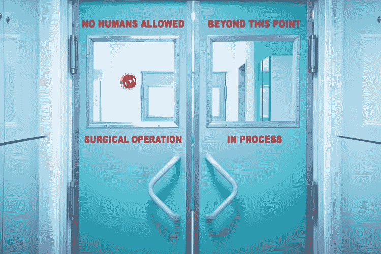

# 人工智能消除了医生阶层

> 原文：<https://medium.datadriveninvestor.com/artificial-intelligence-to-eliminate-the-doctors-as-class-2c1d89227b36?source=collection_archive---------18----------------------->

不同行业中关于人工智能实施的问题通常与人力资源优化和替代有关。医疗和保健行业也受到机器学习技术快速变化的影响，似乎是变革的时机成熟了。在医院或护理环境中已经有某些应用，在这些应用中，人工智能的参与是更有效的选择——从数据管理到安全和处理。有一些毫无根据的担忧是，随着进一步的发展，机器学习和机器人系统将夺走医生和其他医务人员的工作。这经常被媒体夸大，所以让我们从不同的角度来看这个问题，根据最近的发展得出一个短期的结论。

**医生日常遇到的问题**

作为一名前医生，作为一个观察许多执业医生的人，我相信我们的角色将变得不那么专注于分析，这是由于机器学习的作用越来越大。这不是一件坏事:每个医生都会告诉你，医疗系统的压力使得人们很难专注于重要的方面——比如了解病人这个人，而不仅仅是一系列需要解决的问题。医疗保健行业和医生的角色与护理角色一样都是关于数据分析的，其中最重要的部分是对提供的信息进行解释，以绘制出患者的需求。一个典型医生的许多职责可以自动化，变得更加准确。想想当地医院一位忙碌的医生的生活，你会发现他们花了大量时间挖掘诊断信息，检查血液测试结果、化学结果，查看 x 光片、核磁共振成像，试图在一个人的病史中找到因果关系——在风险和不确定性下做出艰难、快速的决定。

展望未来，比如说 5 年，这个过程可以通过区块链技术、机器学习和大数据分析(统计)的混合来自动化，以便在多学科团队中移动可信数据，而不管位置如何，并利用人工智能来分析这些数据。医疗保健将是无国界的，数据流将更少受到限制，但重要的是，民主监督仍将存在，让患者控制他们的数据用于何处。

我参与的一家公司正试图开放参与，以便通过机器学习来平衡医疗保健的成本——允许患者选择适合他们预算的医疗保健需求的地点，而不管他们住在哪里。我正在合作的另一家初创公司非常雄心勃勃——他们希望通过机器学习创建一个完整的行业，将预防医学、健康和健身、表演艺术、精神健康、保险行业和社交媒体结合起来。他们的首席执行官经常说*“为了让人们变得健康，我们需要让他们以对他们有帮助的方式运动或锻炼——而不是他们的同龄人或社交媒体账户告诉他们做什么。我们需要在数据科学的基础上做出决策，以帮助减轻公共医疗系统的负担。”*

**谁在真正引领技术的基层应用？**

一个很好的例子是谷歌 DeepMind，它与圣托马斯医院合作，查看医疗记录并创建算法。根据我的理解，这是为了帮助分析有关患者记录的信息在医院不同部门之间的处理和移动方式。在未来，这可以区分不同的医疗条件，然后为他们指出对这些人来说最好的治疗方法。DeepMind 被广泛认为是深度强化学习的领导者。他们在创建神经图灵机和其他研究复制人类短期记忆的程序方面的研究，可以有效地分析患者数据，以评估特定患者在未来 5-10-15-20 年内可能会发生什么。

另一个很好的例子来自印度的一个创业项目，该项目使用人工智能来激进化和自动化诊断。它背后的家伙是机器学习毕业生，他们专注于帮助医生分析人们的血液结果的可负担性。他们采用机器学习和机器人技术，并将它们整合到实验室已经使用的东西中——显微镜、化验、手机等。这些家伙创造了一个低成本的巧妙解决方案——它实际上是一套现成的设备，如智能手机和显微镜。它拍摄显微镜正在观察的东西，显微镜由一个基本的机器人控制臂控制。该系统通过机器学习算法分析它在照片中看到的内容，以帮助医生确定可能的诊断。类似于 DeepMind 的系统，该系统将能够在 99%的误差范围内准确地确定原因，该系统将能够识别疾病子集，然后自动向医生报告。这些技术极大地提高了多学科医疗团队的生活质量，而不是“破坏”他们在社会中的角色。

这些发展有效地降低了数据管理、医疗记录分析、诊断、废物、设施管理方面的成本，并促进了预防性医疗保健措施——许多首席财务官和转型经理会告诉你必须发生的所有事情，尤其是在公共医疗保健系统中。这是全世界的一个大问题，尤其是在非洲、亚洲、南美洲等地的农村地区。目前，从医生从病人身上抽取血液样本到拿到结果之间的延迟可能会有几个小时。有了这样的技术，只需要几分钟。机器学习在其规模上最令人兴奋——可以分析的人的数量呈指数增长。同时，这样的系统可以在一小时内分析 5000 多名患者，而 5 个人永远做不到 5000 名患者，因为这在物理上是不可能的。更深入地思考未来，量子技术，如 D-Wave、1QBit、IBM、Qubitl India 或 Rigetti 正在开发的技术，可能会提升处理能力，从而扩展到未知的水平。

但是我们到了吗？答案是明确的“不”——有这么多复杂的问题需要解决，有这么多道德和伦理障碍需要人类考虑。对个人数据使用的参与和民主监督尚未得到探索。然后，我们必须考虑这项技术更广泛的社会影响。作为一个人类，我们正在走的道路是好的吗？我们真的能及时实现人工通用智能，以防止气候变化、政治动荡和金融紧缩等正在出现的灾难吗？我认为，如果我们关注由学者领导的致力于帮助人们生活得更好的组织，未来会非常光明。

*关于作者:* [*阿玛迪普·辛格*](http://www.linkedin.com/in/amardeepsinghnhs/) *是一家国际量子技术、软件开发和实验机构的联合创始人兼首席执行官。*

*最初发表于*[*bitnewstoday.com*](https://bitnewstoday.com/news/artificial-intelligence-to-eliminate-the-doctors-as-class/)*。*