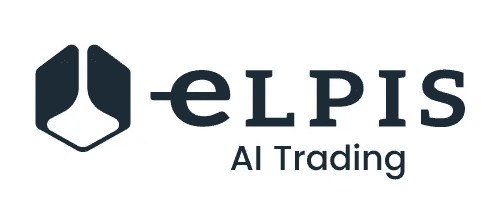

# 人工智能交易和增长机会

> 原文：<https://medium.datadriveninvestor.com/artificial-intelligence-trading-and-the-opportunities-for-growth-c32ecc4ba706?source=collection_archive---------15----------------------->

上周，专注于加密货币和区块链技术的瑞典科技公司 Stockholm IT Ventures AB (SITV)宣布，其子公司 Blocktrade Technology (BTT)已经与 Valens Bank 签署了软件许可协议。该协议规定，瓦伦斯银行将使用 BTT 加密交易工具箱进行加密基金交易服务，允许专业交易员(如网站所述)使用其人工智能交易工具“积极管理其客户的数字资产”。

[elpisinvestments.com](https://elpisinvestments.com/)

今年八月初，[电子金融职业](https://news.efinancialcareers.com/ie-en/321171/j-p-morgan-goldman-sachs-adding-algo-trading-vps)的全球编辑 Sarah Butcher 指出“今年有一种金融专业人士特别受欢迎:系统或算法(algo)交易员。无论是编写中央风险账簿，还是为客户交易创建算法，银行都在忙着寻找算法交易人才。”

高盛(Goldman Sachs)和摩根大通(J.P. Morgan)等传统金融巨头正在聘用算法交易领域的顶级人才，试图迎头赶上，夺回被 Elpis Investments 等新成立的金融科技公司夺走的部分地盘，这些公司正在努力推动该领域的创新并取得成功。

这条新闻是继 2018 年 8 月出版的世界经济论坛(WEF)的[新报告](http://wef.ch/ai-in-finance)之后，通过采访世界领先的金融专家和行业领袖做出的。根据《麻省理工技术评论》的报道，该报告最终得出结论“人工智能将通过允许早期采用者智胜竞争对手而颠覆整个行业。”

世界经济论坛(WEF)题为“[金融服务的新物理”](http://www3.weforum.org/docs/WEF_New_Physics_of_Financial_Services.pdf)”的报告也指出**技术将为消费者创造更方便的产品**，例如管理个人财务和投资的复杂工具

[elpisinvestments.com](https://elpisinvestments.com/)

根据该报告，“现有企业可能不得不改变策略，以抓住人工智能领域的机遇，”因为该领域的新竞争对手正在推出“可能补充或替代现有产品的新产品和服务。”

世界经济论坛(WEF)报告的发现对于像 [Elpis Investments](https://elpisinvestments.com/) 这样的金融科技初创公司来说很有趣，该公司正在创建一个由**人工智能驱动的系统**，该系统能够分析**揭示的非结构化数据，这些数据无法通过基于人类的技术分析**和来识别，利用最新的**人工智能技术，如** [**机器和深度学习**](https://drive.google.com/file/d/0BylWh_GCTZAyQWhsTFA2NW82d3M/view) **，** **来提高其战略的效率** 吸引传统的机构投资者和新型的非专业散户投资者，他们目前还无法获得交易体验。

正如[报告](http://www3.weforum.org/docs/WEF_New_Physics_of_Financial_Services.pdf)所指出的，“高净值个人在历史上可以获得高度个性化的产品和服务”，但现在人工智能“允许以低得多的成本提供类似的定制，使这种产品和建议可以进入大众市场。”事实上，“零售和商业客户都将受益，因为更好的、人工智能驱动的决策会改善财务结果。”

[Elpis Investments](https://elpisinvestments.com/) 的使命是明确而雄心勃勃的:由于我们基于人工智能的系统，我们希望**成为交易和区块链领域的领导者**，通过比传统的交易竞争对手更有效地运营，只关注业绩，同时建立一个具有完全开放结构的**组织，对客户透明的**，由于区块链的将能够不断验证和审计交易。

[elpisinvestments.com](https://elpisinvestments.com/)

[Elpis 投资公司](https://elpisinvestments.com/)更大，也可能更有野心的目标是**向每个人开放和扩展 Elpis 投资公司的交易系统和基金管理技术**。正如 WEF 报告所强调的，“与过去的‘人工智能春天’不同，人工智能的科学和实践似乎准备继续前所未有的数十年发展:”增长的机会是开放的，比以往任何时候都大:Elpis 投资公司**正在建设一个具有实际价值的** 坚实项目来抓住它们。

***如果您正在寻找一家可靠、值得信赖的人工智能驱动的贸易公司，并希望参与我们的 ICO，请查看我们的网站***[***www.elpisinvestments.com***](https://elpisinvestments.com/)***，或者加入我们的*** [***电报***](https://t.me/joinchat/E34qxhL2yukir8BJSGpNMw) ***群与我们直接取得联系。***

朱塞佩·索利纳斯

**首家人工智能驱动的密码和传统资产投资公司 Elpis Investments 主编:**[**www.elpisinvestments.com**](https://elpisinvestments.com/)**、info@elpisinvestments.com**