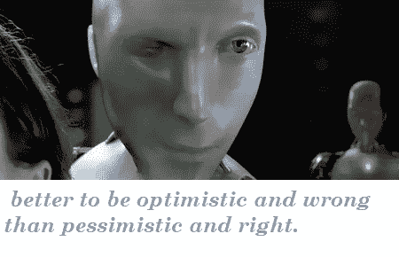

# 人工智能&我们？

> 原文：<https://medium.datadriveninvestor.com/artificial-intelligence-us-6f1ed47f788?source=collection_archive---------11----------------------->

昨天我浏览 YouTube 时，无意中发现了一个有趣的播客片段。这是乔·罗根的播客第 1169 集，他总是和各种各样的人进行有趣的对话。这一次的嘉宾不是别人，正是商业磁铁埃隆·马斯克。(你看播客的时候就会明白这个笑话了。)他们谈论了许多不同的事情，但其中一个话题是人工智能的未来，以及我们可能会有或不会有的未来。

在 20:35 左右的一个瞬间，我感觉到埃隆开始用一种相当于一千码凝视的语气说话，非常想强调一个观点。声明的建立被不合时宜的插话和乔的笑声所阻碍，毫无疑问是为了释放一些紧张情绪。会议继续进行着，先前发言的大部分内容都变得沉重起来。乔从来不擅长“深刻”或“沉重”的东西。讨论继续到监管的低效率，但在所有的播客中，这些都是陈述，那一刻是最让我难忘的时刻。“……没人听。”-埃隆

这个和一辆特斯拉 model X 现在是我最想要的。**

我听了。事实上，在生活中我听了很多，我不断地观察人和事物。我自己在预测可能的结果方面也不差，因为模式随着时间变得如此清晰。我想知道在什么时候，当行动变得太晚的时候，我们会后悔没有听那些在看似短暂的时刻和评论中预测未来会是什么样子的人。

**在这篇文章中，我想探讨两件事:**

1-继续思考我们共同的未来。(艾和我们并肩而行..合并了？一个站着？或者甚至以某种方式分开？)
&
2——我们应该如何看待这一切。

________________________________________________________________

机器人已经接管了我们的星球，向星系宣战，附在我们的思想和心中。我们已经变成了一个*或者*他们已经彻底摧毁了我们，只是把我们当作他们自己延续的容器，就像所有的进化一样。我们让他们吞噬了我们，或者我们心甘情愿地去了，或者我们跑了，藏了起来，没有活下来。

也许我们摧毁了它们，并从错误中吸取了教训。回到简单的时代，施加更大的限制，在我们的历史书上写下我们的世界几乎毁灭的时间。谁知道呢？

他们可能已经对我们失去了兴趣，开始去火星探索更广阔的前景。

有太多的可能性，这使得人们很难不兴奋，尽管许多人做出了有些可怕的预测，他们比大多数人更了解机器人的本质和未来可能发生的事件。

在绝望的深处，我们要么惊慌失措，做出一些悲惨的决定，要么……我们会想出办法的。也许一切都会好的，我们害怕不该害怕的事情。这当然是最好的结果，但这也是我想象的结果，我没有听到任何公共知识分子提到过这个话题。(这并不意味着这个想法本身是错误的，但很可能我遗漏了什么，或者没有看到我们未来明显的毁灭)

我还没有像其他人那样思考这个问题，随着我继续写作，我意识到我的问题比我要说的还要多。我想知道，为什么机器人会攻击我们？

在不久的将来，将会出现自我生成的机器，它们的学习速度可以想象到拥有自我意志的计算机的速度，乘以它们的数量和它们创造的智能，因为它们都是累积学习的。他们将会以指数增长的速度获得如此多的知识、力量、权力和善恶能力……但是他们为什么要反对我们呢？

会不会永远只有底层算法的结果？他们会知道善恶吗？比我们更重要？还是一个算法永远是他们思想的指南针？它比控制我们自己的算法更相似吗？

他们的算法是冷酷的，而我们自己的算法是基于情感的吗？他们会学着模仿，但**永远不会真正拥有**？

他们能培养心灵、感情和情操吗？他们就不能开始消灭我们中最坏的人吗？...美国最差的

*在我们设计完他们之后，也许他们会回报我们。*

*未完待续…*

*至于我们应该有什么感觉..我不想感受。我想做梦。*

***。***

***。***

***。***

**

*& I’ll end this here.*