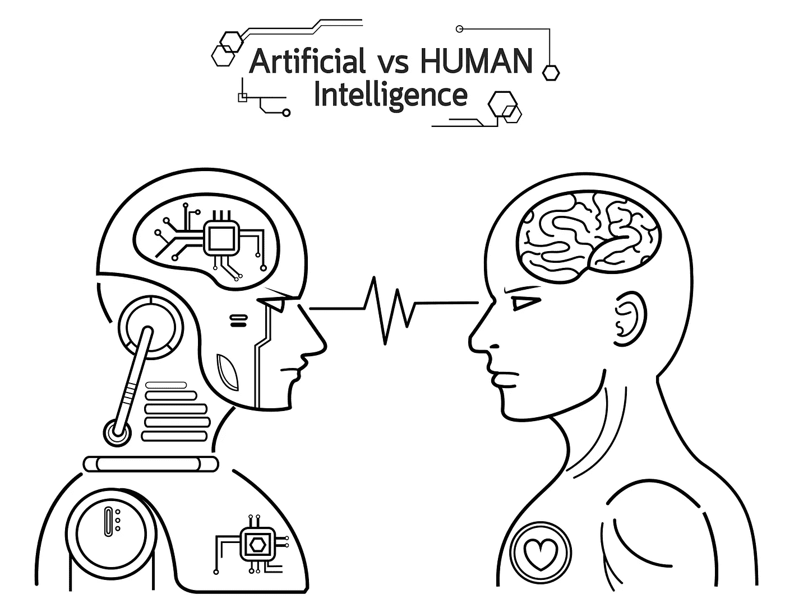
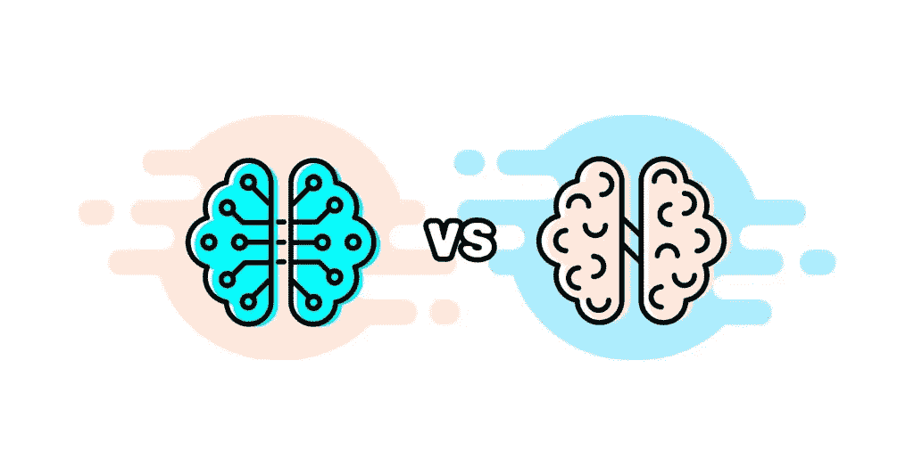

# 人工智能与人类智能——你更愿意雇佣哪一个

> 原文：<https://medium.datadriveninvestor.com/artificial-intelligence-vs-human-intelligence-which-one-youd-prefer-to-hire-37527528191f?source=collection_archive---------5----------------------->

这里有许多定义智能的方法，当涉及到机器时，事情会变得更加复杂。此外，当我们需要测量智力时，事情变得更加棘手。对于人类来说，这通常是通过测试来完成的，但对于计算机来说，就没那么简单了。我们都记得“黑客帝国”，主角“尼奥”需要学习如何在接到通知后立即驾驶直升机，这正是由于可用的编程而发生的事情。在现实生活中，这真的不是人工智能的工作方式。

鉴于人工智能技术的发展，越来越多的跨行业企业正在寻求取代人类工人。考虑到所有这些，让我们更仔细地看看人工智能和人类智能之间的区别，从各自的定义开始。

 [## 模式和机器人:复杂的现实|数据驱动的投资者

### 哈耶克的名著《复杂现象理论》(哈耶克，1964)深入探讨了复杂性的话题，并断言…

www.datadriveninvestor.com](https://www.datadriveninvestor.com/2019/03/04/patterns-and-robotics-a-complex-reality/) 

# 什么是人工智能？

人工智能(AI)正在研究一个人工创造的智能代理，或者用通俗的术语来说就是一台机器。这种机器有能力了解它们周围的世界，并采取最有可能取得成功的行动。对人工智能的研究包括使用许多其他科学的工具，如心理学、语言学、计算机科学和许多其他科学。它还与其他研究领域重叠，如面部识别、机器人、数据挖掘等。我们可以看到，AI 是一个非常宽泛的术语。现在，让我们来看看人类的智力。

# 什么是人类智能？

人类智力包括一个人从他或她以前的经历中学习的头脑。这可能是他们的教育、工作经历，或者仅仅是他们发现自己所处的情况并从中吸取了教训。最重要的是，人脑可以提供多种类型的信息。例如，一个人可以谈论在国外旅行或每天早上上班途中的观察，并对他们的研究领域或专业知识提出一些有价值的见解。既然我们对这两种智能类型都有了了解，让我们比较一下人工智能和人类智能，看看我们是否能发现一些有趣的差异。

# 人类与机器

在某些领域，人类的智慧比机器更有优势。例如，让我们看看多任务处理。一个人可以同时做许多不同的工作，而机器要做这样的事情需要很长时间。人们拥有优势的另一个重要领域是决策。事实上，在讨论这一类别时，即使最先进的机器也只能与一个六岁的孩子相提并论。在这方面，人类远远领先于计算机，因为他们有能力从经验中学习，并吸收多种相关因素。

机器最有优势的领域是处理速度。事实上，一台机器每秒可以执行 93，000 万亿次运算。比如说医生十分钟就能做出诊断。人工智能系统将能够在这段时间内做出一百万次诊断。计算机能够提供的这种处理速度和能量使它们在国际象棋等领域表现出色，因为它每秒可以计算数十万步棋。

# 人脑大战 AI:谁是赢家？

在考虑了不同的因素后，人类大脑无疑是赢家。当我们认真对待它时，AI 只能在一些特定的领域进行竞争，就像上面提到的象棋例子。如果你的公司面临一个重要的决定，或者你正在寻找创造一个最先进的产品，你将需要人工。公司[雇佣我们的软件开发人员](https://skywell.software/)是因为他们丰富的经验和知识。这是计算机无法比拟的。

我们希望这样的技术与人类思维的比较对你有用。虽然有可能使用人工智能来完成一些日常任务，但在创建新产品时，依赖人工智能并不是一个好的决定。每当有必须考虑的重要决策时，比如用户行为、产品设计和许多其他高度专业化的知识，只有人类的智慧才能做到。他们能够适应不断变化的市场条件，以确保你所创造的任何东西都具有竞争力，并被用户所接受。

把 AI 想象成一个纯粹的数据消费者。它可以从你输入的任何东西中学习，但是它永远不会出去寻找新的信息。人工智能在这方面依靠人类找到新的数据，为他们分解，然后输入到计算机中，供他们的神经网络处理和学习。如果人类生成数据的过程停止，那么人工智能就会崩溃。出于这个原因，你不应该担心机器会接管你的工作。毕竟，你为你的公司提供了许多有价值的见解，使他们能够在市场中导航，以确保他们的产品或服务将得到最好的接受和最大的利润。这就是为什么你的工作在可预见的未来是安全的。

*最初发布于*[*https://sky well . software*](https://skywell.software/blog/artificial-intelligence-vs-human-intelligence/)*。*