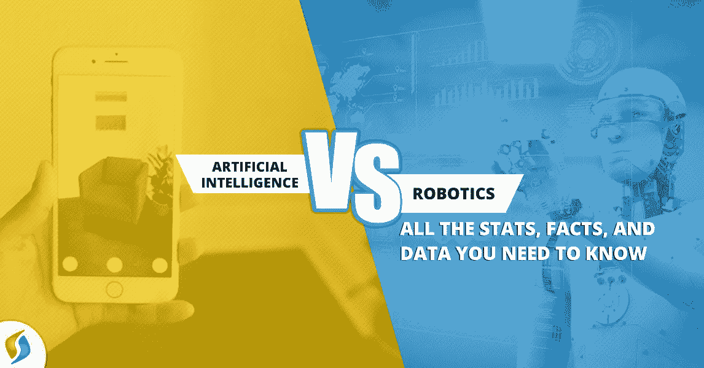

# 人工智能 vs 机器人:你需要知道的所有事实

> 原文：<https://medium.datadriveninvestor.com/artificial-intelligence-vs-robotics-all-the-facts-you-need-to-know-1079e01e05e2?source=collection_archive---------0----------------------->

机器人一直是我们的魅力所在。他们做 100 个人的工作的速度让我们大开眼界。本田的阿西莫夫机器人向 21 世纪的人类介绍了现代机器人技术。人工智能最近在各种工作领域的需求和发展方面都有显著的增长。这导致印度对机器学习公司的需求激增。在这篇博客中，我们将尝试呈现人工智能和机器人技术的事实，从而了解它们是如何相似以及在何种意义上不同。

[Source](https://www.signitysolutions.com/blog/artificial-intelligence-vs-robotics-facts-need-know/)

人工智能和机器人技术是相同的或有些相似的，这是一种普遍的看法。通俗地说，AI 是大脑，机器人是身体。机器人在过去没有 AI 的情况下也存在过。并将继续这样做。如同没有机器人一样，AI 的实现也不过是软件交互。人工智能机器人是这两种技术结合的一个术语，因为它仍在研究中。两者的增强将创造奇迹。但在此之前，人们需要明确一个概念，即人工智能和机器人服务于不同的目的。这就是机器学习咨询需求产生的地方。

 [## 今年值得关注的 5 大人工智能趋势|数据驱动的投资者

### 预计 2019 年人工智能将取得广泛的重大进展。从谷歌搜索到处理复杂的工作，如…

www.datadriveninvestor.com](https://www.datadriveninvestor.com/2019/02/19/artificial-intelligence-trends-to-watch-this-year/) 

# 人工智能 vs 机器人:背景

*   **定义机器人和人工智能**

机器人学是研究机器人发展的科学分支。机器人旨在用更少的时间和更高的效率完成人类所做的工作。机器人可以是自动的，或者需要人类的一些初始指令。

人工智能是计算机科学的一个分支，它有助于开发能够完成需要个人判断力、决策力和智能的任务的软件，因为这些品质无法在计算机中编程。 [AI 开发](https://www.signitysolutions.com/blog/ai-change-web-development/)服务可以帮助机器学习和感知周围环境以适应情况。人工智能甚至可以解决不同的问题，处理逻辑推理，也可以学习语言。

*   **方面**

机器人是可编程的，并使用传感器与周围环境互动。它们可能是自动或半自动的，这取决于它们的应用领域。

AI 是一门依赖于机器学习和算法的科学。如果用有限的话来解释，人工智能是靠自己的决策和推理工作的。

*   **应用**

机器人旨在简化生活方式，提高工作效率。一个能随机应变的机器人将会更受欢迎。但是机器人的明确定义并不意味着学习。设计一个机器人需要经历大量的物理构建、外部设计和编码(或 AI)，目的是增强其决策能力。

但人工智能是关于人性化的技术体验。人工智能引擎在 GPS 追踪器、更好的导航系统、客户服务聊天机器人等领域得到了应用。人工智能程序为机器人提供动力的情况很少。

有一种由人工智能驱动的机器人，即人工智能机器人。机器人的控制是通过在紧密结合的环境中开发的人工智能程序来实现的。人工智能开发公司和机器人开发公司执行这项任务。人工智能机器人有各种各样的应用领域。他们在同一个工厂的几个部门中找到了用途，而一个简单的机器人通过一套程序化的动作来执行重复的任务。它不需要任何智力。

# 人工智能机器人

人工智能机器人有一些具体的例子:

*   **Cobot(非人工智能)**

一个 Cobot 在编程后可以自己做工作。在关闭之前，它不需要任何人工帮助。Cobot 是一个协作机器人，在这种情况下，它将重复执行分配的工作，因为它是非人工智能机器人。

*   **Cobot(人工智能)**

上面提到的 Cobot 可以通过增加 AI 来进一步开发。AI 的加入给机器人增加了一种感知。它还增加了需要修饰算法的决策本能。例如，当机器人操作热敏物品时，防止机器人进入熔炉的热接收器。此外，相机可以增加机器人的感知视觉。这将防止它与工厂中的不同元素发生碰撞。

*   **软件机器人**

软件机器人是一种计算机程序，它自己在各种软件和网站上执行任务。它们也被称为机器人，因为它们在现实中不存在，实际上是计算机程序。例如，网络爬虫扫描网站并对其进行分类以便搜索。它可能包括人工智能引擎，以获得更好的性能。

软件机器人不是真正的机器人。但是所做的工作属于机器人的范畴，因此在这里的列表中有一个条目。

## 结论

让人工智能脱颖而出的不同之处在于它的决策能力。可以让软件产生更好的效果，也就是即兴创作。AI 是一个有电线和编程的科技大脑。机器人需要预先的指令或指令代码来自动或半自动地执行。

世界期待这两个原则以更有信心的方式融合，因为这可能有助于人类实现几个世纪以来从未触及的目标。人类发明的唯一目的就是满足好奇心。好奇号带我们去了月球，现在即将带我们去火星寻找一个和平和更好的栖息地。这种好奇心永远不会消亡，尽管它会消亡，但我们的生存意志可能会消亡。机器人学是不断发展的科学分支，从付费装载货架到无人机，该科学正在开发微型无人机，无人驾驶航空飞行器(UAV)以到达好奇号的边缘。一切的改善都依赖于开发团队的奉献精神，如果是唯一的领导者，还有他的动力。这项技术提供的潜力已经引起了世界各地对人工智能咨询服务的需求。

原发布:[https://www . signity solutions . com/blog/ai-change-we b-development/](https://www.signitysolutions.com/blog/ai-change-web-development/)