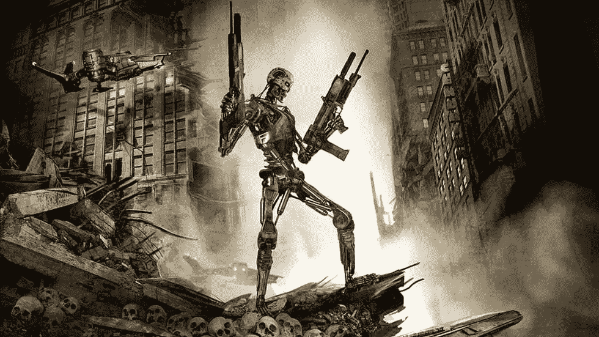
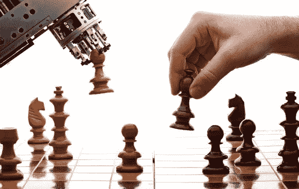
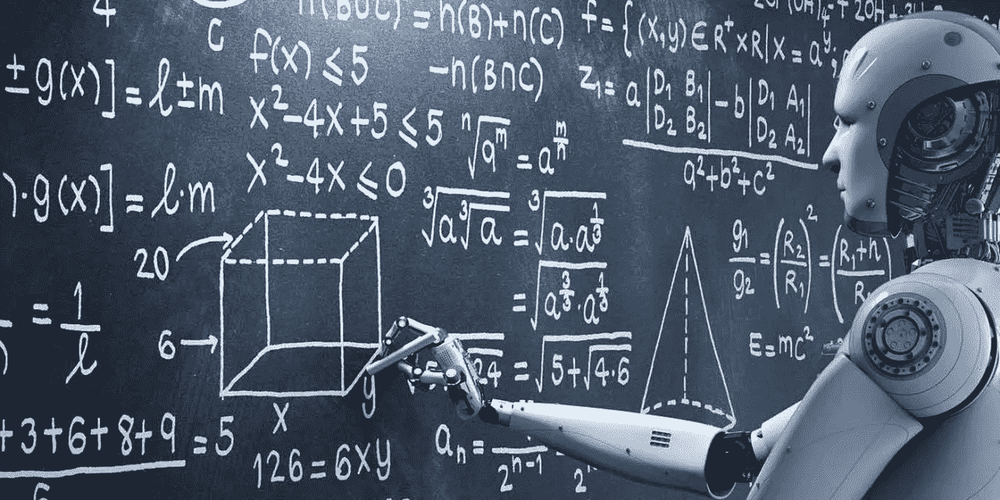
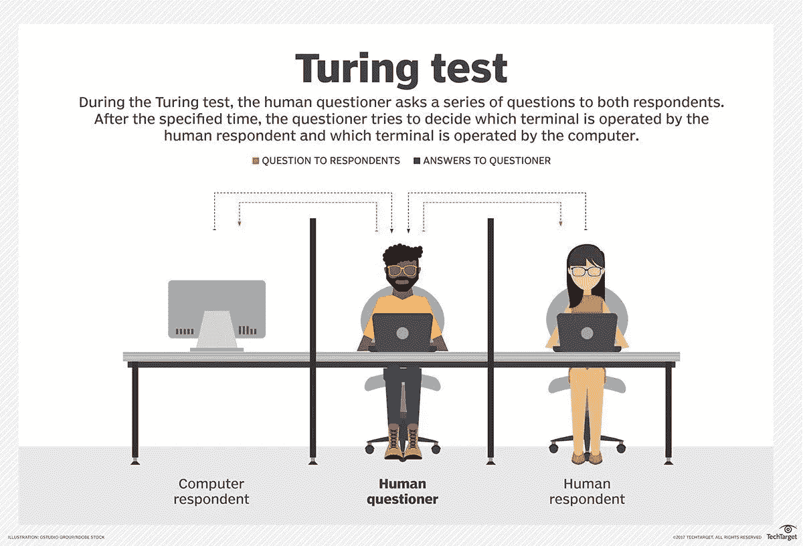
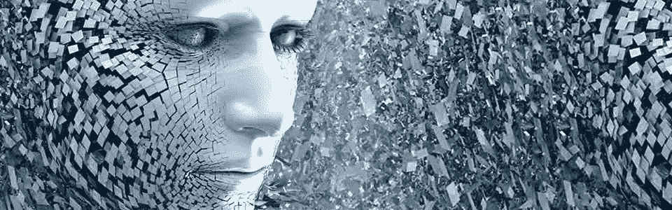
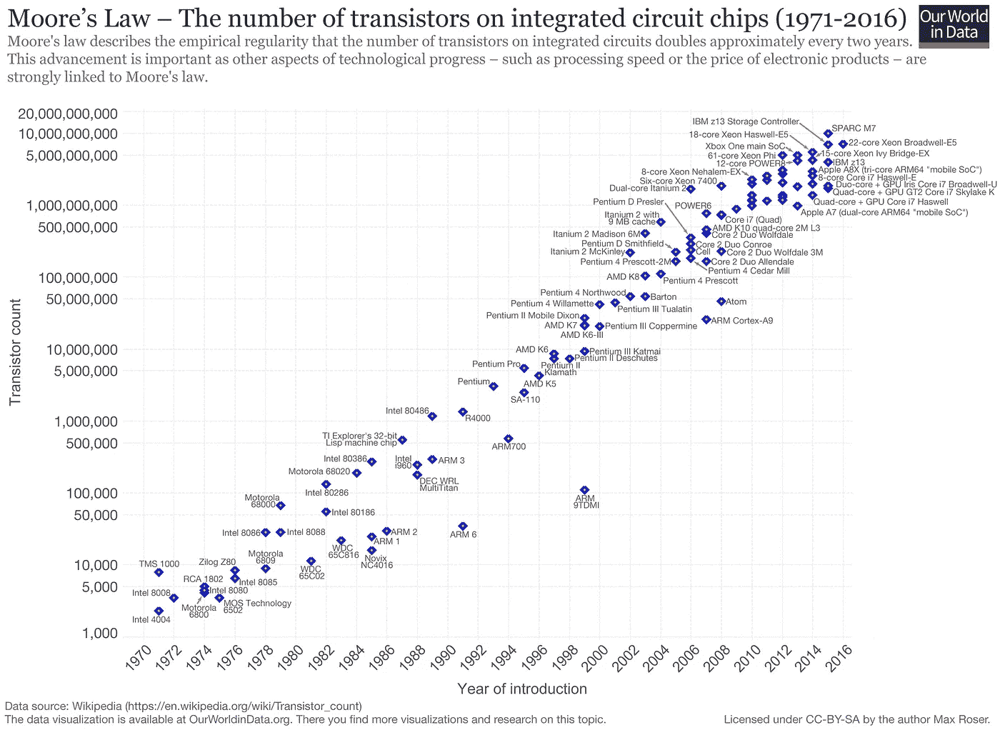

# 人工智能何苦呢？

> 原文：<https://medium.datadriveninvestor.com/artificial-intelligence-why-bother-91ca1287d09b?source=collection_archive---------5----------------------->

人工智能(AI)的**目标**是**让机器和人类一样聪明**。

人类是智能生物，而机器不是，因此需要将智能编程到机器中。人工智能借用了人类智能的特征，并以一种计算机友好的方式将它们作为算法来应用。

大多数人认为人工智能是虚构的，它只存在于好莱坞电影中。这是因为[人工智能是一个广泛的话题](https://en.wikipedia.org/wiki/Outline_of_artificial_intelligence)，人们通常将人工智能与电影联系在一起。然而，事实是我们今天生活在人工智能之中，从我们日常使用的网站，如脸书，在亚马逊购物和在 YouTube 上观看视频。在[神经网络](https://en.wikipedia.org/wiki/Artificial_neural_network)和[机器学习](https://en.wikipedia.org/wiki/Machine_learning)(都是 AI 的分支)的帮助下，这一切都成为可能。

你可以尝试在 YouTube 上播放一首 80 年代的歌曲，看看播放列表会发生什么变化。你最终会在播放列表中看到相关的歌曲。这一切都是用机器学习完成的。如今，人工智能的应用无处不在，Siri、谷歌助手、我们的 GPS、谷歌地图所有这些服务都使用了一种特定形式的智能。

既然你知道所有这些，为什么还要注意呢？这是个重要的话题吗？你应该担心吗？在我们回答这些问题之前，让我们先了解一下当今人工智能的类型。

## 人工狭义智能

**ANI 也被称为弱 AI 或窄 AI** 。这就是我们今天在人工智能革命中所处的位置。这种类型的人工智能专注于构建能够很好地完成一项特定任务的计算机。今天它们就在我们身边。例子包括 GPS 设备能够比你更准确地确定你的确切位置，工厂机器人比大多数人更快更准确地制造汽车，语音到文本设备可以翻译人类的语音，等等。

在当今世界，一些 ANI 系统使用其他 ANI 的组合。Siri、Cortana、谷歌助手和 Alexa 就是很好的例子。当你向这些虚拟助手中的任何一个询问一些事情时，他们会尝试使用几个 ANI 的组合来获得你的答案。没有真正的智慧或自我意识，他们不知道你为什么问这样的问题。当你问超出他们界限的问题时，他们变得非常烦人，因为他们真正做的只是智能地搜索云中的海量数据。如果你问 Alexa 几点了。她不知道你为什么这么问，可能是因为你需要去见一个朋友，或者你在等一个访客。但 Alexa 并不在意，也没有自我意识或觉悟。

## **人工通用智能(AGI)**

**AGI 也被称为强艾。**这种类型的人工智能旨在建造能够像人类一样真正推理和解决问题的机器，即建造能够模仿人类智能和行为的机器，这种方式是你在接触计算机时无法区分的。

事实证明这很难做到，我们甚至还没有接近实现。然而，有大量的研究正在进行中，以实现这一突破。我们怎么知道什么时候有了 AGI 机器？一种方法是使用[图灵测试](https://en.wikipedia.org/wiki/Turing_test)。还有其他方法，但图灵测试似乎是最常见的。

A picture depicting the Turing test source techtarget.com

AGI 很难，因为人脑是宇宙中最复杂的物体。大脑比人体其他任何器官消耗的能量都多，平均每天消耗 20 瓦。如果我们能够用人脑建造超级计算机，那将是一个突破，但这在今天还远远不可能，因为如果世界上最快的超级计算机——[Sunway Taihu light](https://en.wikipedia.org/wiki/Sunway_TaihuLight)**使用大约 1500 万瓦，而**你的大脑使用 20 瓦。另一个困难是为生物系统编程比为更确定的模型编写代码要复杂得多——事情可能是真的，也可能是假的。对于趋向于更加随机或类似于[量子](https://en.wikipedia.org/wiki/Quantum_mechanics)的生物系统来说，情况并非如此。

当 AGI 存在时，他们将能够媲美人类的智力。他们将能做人类能做的一切。

## **人工超级智能**

ASI 也被称为超级智能。简直就是更好的 AGI 。这种人工智能不会模仿人类的智力和行为，但会超越它。当他们存在时，他们将拥有的智慧将远远超过几乎每个领域中最聪明和最有天赋的人类头脑。他们将拥有跨领域的知识，并将有能力像他们自己一样创造更聪明的智能。这个循环将继续下去，直到经历了[智能爆炸](https://en.wikipedia.org/wiki/Intelligence_explosion)的阶段，然后导致[技术奇点](https://en.wikipedia.org/wiki/Technological_singularity)。

现在我们理解了这些类型的人工智能，重要的是要注意到我们还没有达到 AGI，因此离实现人工智能还很远。对于我们来说，要在这场人工智能革命中实现另一个突破，我们不能依赖于我们当前的计算机模型、我们确定性的编程模型和硬件架构，我们也不能依赖于[摩尔定律](https://en.wikipedia.org/wiki/Moore%27s_law)来确定我们何时将拥有能够使用很少功率的超级计算机，如果可能的话，只有原子大小，因为[摩尔定律正在消亡](https://www.youtube.com/watch?reload=9&v=Nfz0zRBEia8)。

Moore’s Law, source [https://en.wikipedia.org/](https://en.wikipedia.org/wiki/Moore%27s_law#/media/File:Moore%27s_Law_Transistor_Count_1971-2016.png)

让我们看看以我们今天拥有的人工智能的当前趋势，什么是可能的。

**如今人工智能系统(ANI)能做什么？**

1.  在计算机视觉中，它们能够进行人脸识别
2.  在机器人技术方面，我们已经能够制造大部分自主的车辆
3.  在自然语言处理中，我们有能够进行简单机器翻译的系统
4.  今天的专家系统可以在一个狭窄的领域内进行医学诊断
5.  在游戏中，人工智能系统可以玩国际象棋、跳棋

[还有更多](http://www.businessinsider.com/artificial-intelligence-ai-most-impressive-achievements-2017-3?IR=T#-15)。

**还有哪些 AI 系统做不到的？**

1.  展现真正的自主和智慧
2.  在动态实时域中构建计划
3.  解读任意的视觉场景
4.  充分理解自然语言

**技术奇点**

维基百科是这样说的

> 技术奇点(也简单地称为奇点)是一种假设，即人工超级智能(ASI)的发明将突然引发失控的技术增长，导致人类文明发生深不可测的变化。

这意味着，人工智能变得不可思议地聪明，它们可以表现出完全的自主性，并继续提高自己，直到它们达到智能爆炸，使我们拥有强大的超级智能，从质量上讲，远远超过所有人类的智能。这是好事吗？人工智能研究者和未来主义者有几种方式来看待它

第一种想法是，我们可以有一种意识，我们醒来后为自己做决定，他们可以制造战争坦克，天空战斗机，汽车，武器，去外太空，杀人，做各种坏事，比如甚至消灭地球上的整个物种。是的，你刚读过。

Alexa failing to execute the voice command “STOP” when asked to tell a horror story.

另一种观点认为，人工智能将增强我们的思维。人类将开始从生物进化到更加杂交。你将能够更快地推理，或像计算机一样快，以光速处理信息，并拥有触手可及的智能。埃隆·马斯克公司 [Neural Link](https://www.neuralink.com/) ，已经在开拓这样的技术——但是仍然没有接近。

**你应该担心吗？**

我总是说，未来属于有能力的人。我认为我们都应该关注这个领域正在发生的事情。就在我们说话的时候，在过去的十年里，电脑已经接管了成千上万的工作。如果你离开第三世界国家，你可能不会注意到我们接近 AGI 的速度。最近[谷歌员工因 project Maven](https://nypost.com/2018/05/14/google-employees-quit-over-controversial-pentagon-work/)——一种为军方打造的人工智能而辞职。计算机目前是利用光子开发的，许多公司正在投资开发量子计算机。公司正在为 ASI 的未来奠定基础，包括谷歌搜索、Youtube、脸书、神经链接等平台。

我们能做的是继续了解人工智能的发展，为即将到来的一切做好准备，并了解这如何影响我们作为一个物种的存在。人工智能既不是好的也不是坏的，而是既可以是好的也可以是坏的，这取决于如何使用它。

如果 AI 变得比我们聪明，我们有什么工作？

**参考文献**

[https://en.wikipedia.org/wiki/Artificial_intelligence](https://en.wikipedia.org/wiki/Artificial_intelligence)

[https://code bots . com/ai-powered-bots/the-3-types-of-ai 是第三种可能](https://codebots.com/ai-powered-bots/the-3-types-of-ai-is-the-third-even-possible)

[https://waitbutwhy . com/2015/01/人工智能-革命-1.html](https://waitbutwhy.com/2015/01/artificial-intelligence-revolution-1.html)