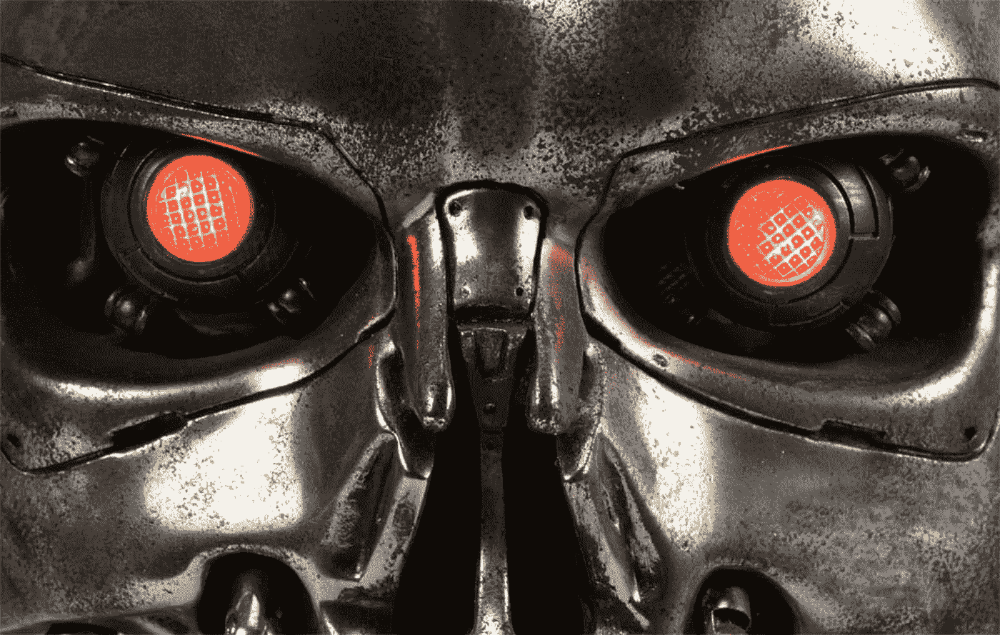

# 狂热分子声称，人工智能将为我们做所有的工作——它甚至会找到癌症的治疗方法。

> 原文：<https://medium.datadriveninvestor.com/artificial-intelligence-will-do-all-of-our-work-for-us-it-will-even-find-a-cure-for-cancer-ca1d5cd33c3a?source=collection_archive---------13----------------------->

狂热分子声称，人工智能将为我们做所有的工作——它甚至会找到癌症的治疗方法。悲观主义者回应道，这将使人类变得一无是处，预示着人类将被有意识的机器毁灭。不管怎样，今天的人工智能开发者将决定我们未来十几年的命运。尤其是他们有财力做这项工作。

# 关于机器意识

在回答记者关于机器是否会有感觉的问题时，艾伦人工智能研究所(Allen Institute for Artificial Intelligence)的联合创始人兼首席执行官柳文欢·埃齐奥尼(Michael Etzioni)说:“[简短的答案是否定的。](http://snip.ly/0ig0x)扩展的答案是:不，它们不会——在这个时代，人们对计算机能做什么有一种夸大的看法”。另一个著名的引用来自 Stuart J. Russel，一位对人工智能研究做出重大贡献的科学家，他是许多关于该主题的出版物的作者:“[人工智能发展的最大障碍](http://www.businessinsider.com/artificial-intelligence-machine-consciousness-expert-stuart-russell-future-ai-2015-7?IR=T)是我们完全不知道大脑如何产生意识。如果你给我一万亿美元来建造一个有意识的机器，我会还给你。我不觉得我们比 50 年前更了解人类意识是如何运作的”。

我们为什么不看看一些不可否认的事实，这些事实将提供我们在发展人工智能方面的立场的不失真的观点。专家们的怀疑有道理吗？

# 乘风破浪的狂热者

没有一个月没有关于谷歌、亚马逊、IBM、脸书、苹果、微软和三星等全球公司投资人工智能以及开发超现代智能技术的初创企业激增的报告。这种趋势在主流媒体和小众技术门户网站中一样受欢迎。伴随着它的是一场关于人工智能传播的可能后果的持续辩论。粉丝们很快列举了他们预计在一二十年内看到的好处，包括对人类面部表情、情绪和声音做出反应的计算机，使用连续数据集操作(机器学习)进行自我改进的计算机系统，能够寻找并摧毁人体内癌细胞的可植入纳米机器人，计算机决策支持系统；我们家庭和自动驾驶汽车中的智能技术。即使在今天，延长人类寿命的努力、对更大数据处理能力的争夺以及个人电脑的持续个性化为全球商业提供了各种燃料，而不再是好莱坞导演多年来开发人工智能的领域。

# 金钱驱动智慧

该领域的持续研究和更大的资金投入将不可避免地导致人工智能的逐渐商业化。在短短几年的时间里，大公司的介入有望给医药和商业带来革命性的变化。预测机构预测未来五年将会有巨大的飞跃。在此期间，投资于人工智能相关项目的资金将增长百分之十，而人工智能的魅力将像雪球一样越滚越大。根据 [CB Insights 的数据，仅在 2015 年](https://www.weforum.org/agenda/2016/06/investors-are-backing-more-AI-startups-than-ever-before)，全球金融市场就迎来了大约 300 家新的大公司，它们的使命声明中包含人工智能、机器学习和神经网络等关键词。根据市场研究机构 [TechSci Research 的报告，美国人工智能市场](https://www.highbeam.com/doc/1G1-457098627.html)将在 2016 年至 2021 年期间增长 75%。这笔钱将用于让人工智能更好地适应消费电子设备、科学研究、自动驾驶汽车和医疗保健行业的研发活动。另一方面，一家专门从事技术市场研究的公司 BCC Research 预计，到 2019 年，智能机器(神经计算机、专家系统、自主机器人、智能助手)[的全球市场将增长到 153 亿美元，年增长率为 19.7%。毫无疑问，这是技术行业发展最快的部分。](http://www.bccresearch.com/pressroom/ias/global-market-smart-machines-expected-reach-$15.3-billion-2019)

# 智力支持

没有研究的支持，商业的全球化是不可能的。如果没有科技机构、研究机构、技术中心和非营利组织的参与，今天的人工智能投资热潮永远不会发生。前面提到的艾伦人工智能研究所雇用了许多不同领域的学者和技术专家。正如该研究所网站上宣布的那样，它的使命是:“通过高影响力的人工智能研究和工程为人类做出贡献”。除了研究机构之外，人工智能项目还得到技术公司的资金支持，这些公司竞相推出新的高科技项目。过去四年取得了突破。甚至在 2012 年，谷歌已经在从事人工智能风险投资。2014 年，它宣布向初创企业 Deep Mind 投资数亿美元。2014 年，马克·扎克伯格、埃隆·马斯克和阿什顿·库彻联手向 Vicarious FPC 公司投入大量资金，该公司专门致力于最具远见的人工智能项目。正如其使命所宣称的那样， [Vicarious FPC](http://www.vicarious.com/about.html) 的目标是“建立一个统一的算法架构，在视觉、语言和运动控制方面实现人类水平的智能”。脸书的战略目标之一是创建一个强大的数据处理系统，并开发一种基于计算机的面部识别技术。巨大的资源(金钱、智力资本和人力)被用来开发人工智能。在我看来，所有这些可能很快就会在大公司和研究机构的实验室中放置一个相当于简单人工智能的东西。

# 智能变化的时代

鉴于对研究的预计投资，看看人工智能发展的一些预测领域是很有趣的。请注意分析公司 Gartner 最近关于人工智能的报告。这里有几个例子。据 Gartner 称，在未来几年内，IT 系统将能够做出自主的经济决策。到 2020 年，世界上 5%的经济交易将通过使用已安装的软件算法进行，这些算法能够从输入计算机的数据集得出结论。根据 Gartner 的研究，到 2018 年，20%的商业内容和信息将由计算机创作和发布。因此，我们指的是各种类别数据的智能处理。说到这里，请注意一些公司的市场存在，这些公司甚至在今天还提供自动将数据转换成对人类有意义的报告的系统。其中之一是 Yseop，它提供的服务可能很快会彻底改变会计师、股票交易分析师、商业战略家和经理的工作。在简单界面的帮助下，用户可以向计算机输入数字、图表和信息图。然后，一台机器将自动编译、整理和处理数据。即使在今天，美联社仍然依赖电脑自动生成报道供记者使用。它们的质量非常高，只有一些需要人工编辑。

# 机器走向科学

在对不远的未来的预测中，Gartner 特别指出了一个对人工智能系统的进一步发展具有重大意义的趋势:“机器学习”。人工智能研究人员提出的一个最基本的问题是，如何创建能够通过从经验中学习来自主提高性能的人工智能系统。如何在开发计算机中应用支配人类学习的规则？这让我们看到了专家认为人工智能开发者面临的最大挑战，这是一个既有趣又有争议的想法:如何创造出在决策中取代人类的高级系统。人们可以立即看到，这不仅仅是自动化重复的过程，这已经在商业和工业中实现了。我们指的是其算法识别模式、预测未来结果并将这些知识应用于决策的机器。应对这一挑战的实际答案可能是使用一种基于模拟人脑的人工神经网络的技术(量子计算趋势)。想象一台用于医学的能够分析数据并得出结论的机器。基于参数分析，计算机将诊断健康状况，检测异常和预测疾病。再次引用柳文欢·埃齐奥尼的话:“如果成千上万项临床研究的冗长报告中隐藏着治疗难治癌症的方法，那会怎样？人工智能将能够阅读——更重要的是——理解科学文本。这些人工智能读者将能够将不同研究之间的点连接起来，以确定新的假设，并提出否则会被错过的实验”。

# 你能听到我吗，华生先生？

对人工智能开发者来说，另一个重要的问题是自然语言处理。许多管理人员认为，模拟理解人类语言能力的计算机可能会彻底改变实现人机智能集成和协作的驱动力。谷歌声称，目前机器处理了客户 20%的电话咨询。该领域的研究旨在开发能够与人对话的系统，而不是对简单的需求做出反应。有些人补充说，这是 ca 的突破。20 年后，计算机将学会完全识别人类的面部表情并解读人类的情感。可以肯定的是，该领域的重大进展甚至在今天仍能看到，其中一些就在我们的眼皮底下。我们经常面临挑战，要评估它们的规模和对未来的意义。IBM 计算机 Watson (2880 内核，15 TB 内存)就是为回答用自然语言提出的问题而制造的。机器依靠自然语言处理来进行标准操作。为了使答案成为可能，计算机可以访问包含数百万页各种内容的数据库，包括字典和百科全书，并被编程为使用数百种并行算法来找到正确的答案。通过这种机制，它可以分析来自商业、经济和医学等各个领域的庞大数据集。通过语音与人类交流，沃森“理解”所提的问题和提出的问题，收集连续的数据，并从这些数据中“学习”，以符合机器学习的思想。

# 我是你的助手

随着计算机“获得”智能，它们学会以越来越“像人”的方式与人交流。他们的反应将取决于他们阅读和处理不同数据的能力。引领 IBM Watson 发展的开创性研究将被传播和商业化。可以肯定的是，自主助手在不久的将来会变得非常受欢迎。这些应用将帮助我们在日常生活中获取知识和做出决策。即使在今天，也不需要多少想象力就能想象出这种情况。多年来，iPhone 用户一直享受着 Siri 的陪伴，它通过语音回答各种简单的问题，如时间、天气、日期以及金融、音乐、电子邮件账户内容和智能手机联系人。类似的项目虽然不断改进，但已经可供个人用户使用，包括 Amazon Echo，它也依赖于自然语言处理机制。

# 乐观主义者、现实主义者和悲观主义者

人工智能继续唤起复杂的感情。电影制作人、作家和谨慎的未来学家推波助澜，热情遭遇恐惧。脸书创始人马克·扎克伯格属于技术乐观主义者和商业实用主义者。他说“人工智能将会让大大小小的公司受益。我们正在研究人工智能，因为我们相信越智能的服务将越有用”。并非所有科技市场参与者都认同他的冷静做法。根据为 Baker & McKenzie 准备的一份报告，在 424 名金融专家中，76%的人认为金融监管机构没有为使用新的人工智能软件做好准备，而 47%的人怀疑他们自己的组织是否有能力理解使用人工智能的内在风险。调查发现，受访者认为，对人工智能的依赖将导致就业减少。这种说法掩盖了对人工智能的各种情绪和观点。16 年前，比尔·乔伊在《连线》杂志上发表的一篇传奇且被大量引用的文章“[为什么未来不需要我们](https://www.wired.com/2000/04/joy-2/)”中分享了他对人工智能的想法。它的作者的很多反思，现在可以看做既是极端悲观的，也是精辟的。除了乔伊在人工智能发展中看到的所有好处，他还分享了一些担忧。他说:“我们还没有接受这样一个事实，即最引人注目的 21 世纪技术——机器人技术、基因工程和纳米技术——构成了不同于以往技术的威胁。具体来说，机器人、工程生物体和纳米机器人都有一个危险的放大因素:它们可以自我复制。”

# 未来会怎样？

好吧，人工智能的问题看起来如此复杂，以至于极端乐观主义者和悲观主义者仍然有很大的机会赢得关于人工智能及其在我们生活中的作用，也许是在我们整个物种的生活中的观点之战。有一点是肯定的:我们生活在一个需要重新定义人类进步和利益的时代。在个人助理、计算机、自主决策者和在我们体内漫游的纳米机器人的时代，几年前开发的类别可能不再足以把握现实和理解我们的位置。

**作品引用:**

阿桂·玛丽·德尔·普拉多，**智能机器人不需要有意识地与我们为敌**，商业内幕，[链接](https://www.businessinsider.com/artificial-intelligence-machine-consciousness-expert-stuart-russell-future-ai-2015-7?IR=T)。

Sam Schead，**投资者支持的人工智能初创公司比以往任何时候都多**，世界经济论坛，[链接](https://www.weforum.org/agenda/2016/06/investors-are-backing-more-AI-startups-than-ever-before)。

TechSci Research，**美国人工智能市场到 2021 年将增长 75% CAGR**，TechSci，[链接](https://www.highbeam.com/doc/1G1-457098627.html)。

BCC Research，**预计 2019 年全球智能机器市场将达到 153 亿美元；自主机器人以 22.8%的速度移动**、[www.bccresearch.com、](http://www.bccresearch.com,)链接。

Nancy Owano，**语义学者搜索引擎扩展为神经科学**，科技探索，[链接](https://techxplore.com/news/2016-11-semantic-scholar-neuroscience.html)。

Greg Sterling，**这是官方消息:谷歌称现在手机上的搜索量已经超过了桌面搜索量**、搜索引擎和链接。

Max Tegmark，**人工智能的收益与风险**，生命的未来，[链接](https://futureoflife.org/background/benefits-risks-of-artificial-intelligence/?cn-reloaded=1)。

比尔·乔伊，**为什么未来不需要我们**，连线，[链接](https://www.wired.com/2000/04/joy-2/)。

**相关文章:**

- [关于道德领导力的思考](https://norbertbiedrzycki.pl/en/reflections-on-ethical-leadership/)

[-自动化不会破坏所有工作](https://norbertbiedrzycki.pl/en/automation-will-not-destroy-all-jobs/)

不确定性有它的好处。数字经济中的领导力

[——从独裁者到合伙人](https://norbertbiedrzycki.pl/en/from-dictator-to-partner/)

[-区块链即将改变我们的生活](https://norbertbiedrzycki.pl/en/blockchain-poised-to-shake-up-our-lives/)

[-量子计算机会毁灭区块链吗？](https://norbertbiedrzycki.pl/en/will-quantum-computers-the-doom-the-blockchain/)

[——人工智能只针对大玩家](https://norbertbiedrzycki.pl/en/ai-for-big-players-only/)

*最初发布于:*[*https://norbertbiedrzycki . pl/en/what-a-machine-will-think-when-it-looks-in-the-eye/*](https://norbertbiedrzycki.pl/en/what-a-machine-will-think-when-it-looks-us-in-the-eye/)