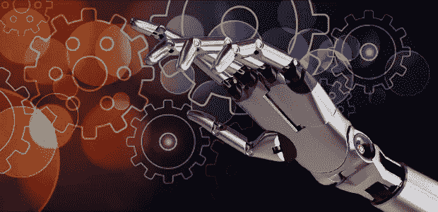
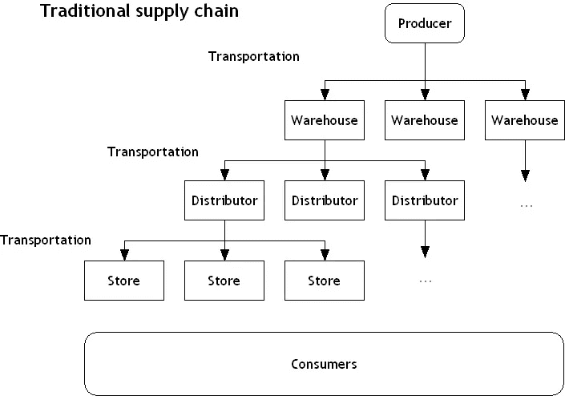

# 人工智能将改变我们的供应链——这是我们的错

> 原文：<https://medium.datadriveninvestor.com/artificial-intelligence-will-transform-our-supply-chains-and-its-our-fault-82dec81e72d3?source=collection_archive---------24----------------------->

今天，消费者希望在他们想要的时候，按一下按钮就能得到他们想要的东西。亚马逊迅速成为北美市值最高的五家公司之一，这是这一趋势背后的主要驱动力之一。它对快速自动化履行、人工助理开发和自动送货无人机投资的兴趣对市场产生了巨大影响。竞争对手苹果、谷歌、微软和 IBM 正在所有这些领域追赶这个分销巨头。

作为消费者，我们现在希望在网上购物时，能得到适合我们独特购买模式的建议。我们预计商品会在一天内送到。我们希望有多种支付选择，从智能手机支付系统，传统的塑料，在线支付系统，如贝宝，甚至加密货币。购物的时候，我们是被宠坏的小孩。现在是买方市场。

在一个越来越复杂、越来越容易进入的市场中，公司不断努力让我们的体验变得和我们一样独特，以取悦我们。

随着我们向前发展，我们可以预计这一趋势将继续下去，因为人工智能在预测我们的需求方面变得更好。通过部署在我们周围越来越多的传感器，AI 收集了比以往更多的信息。人工智能工程师有能力创造能够解决复杂问题和处理日益复杂的任务的人工智能。

消费者和需求之间的人越少越好。技术背后的公司也通过消除与雇佣相关的成本而受益。消费者获得了他们独特的廉价客户体验，而利用先进技术的公司在市场上更具竞争力。

这对生产者和消费者都是双赢的。这也意味着传统供应链正在失去部分。几年后，我们将能够直接从制造商那里收到产品，他们会直接送货上门。

传统上，在制造商和我们家之间有多个配送中心和仓库。这些都是及时成功分配货物以满足需求所必需的。这是必要的，因为一个月生产 100，000 件产品的制造商不可能将所有这些产品销往世界各地。毕竟，在互联网出现之前，消费者只有亲自去商店把产品带回家后才会购买。因此，我们创建了一个配送系统，将产品送到目标消费者的最近位置。因此，我们需要许多供应链企业来处理制造商和消费者家庭之间的所有地理步骤。这催生了一个庞大的国际网络，我们称之为供应链，由仓库、配送中心和运输公司组成，不断地运送产品。

亚马逊、阿里巴巴和易贝等许多公司向我们展示了绕过一些供应链步骤的方法。他们为那些想不受地域限制直接销售给其他人的个人提供分销和运输选择。这是我们今天仍在发展的网上购物现象的一部分。

亚马逊现在正在超前思考，开发一些方法，允许使用自动化无人机交付产品，并且没有人类员工挡道。

许多现代公司已经取消了实体店。我们附近的商店关门证明了这种持续的趋势。亚马逊也一直在努力通过自动驾驶送货车和自动化无人机来取代供应链的运输方面。这家巨型履行公司还完善了全自动仓储系统的概念，可以连接到自己设计的住宅交付系统。

他们创建了一个组合仓库和分销系统，消除了许多中介。消费者节省的成本是巨大的。我们不应该对亚马逊提供免费送货感到惊讶。

之后的下一步将是额外部署人工智能和强大的自动驾驶交通系统网络。像亚马逊这样从事物流业务的公司将整合他们运转良好的无人仓储配送中心和小配件制造商。然后，制造商可以接受终端客户的订单，直接向他们发货。亚马逊可以向制造商许可他们的履行技术，并允许他们轻松访问其完善的直接面向消费者的履行系统。

制造商不需要有很多员工(如果有的话)。没有员工的参与，运输系统将会是最有效率的。如果一架无人驾驶飞机可以在没有闲聊的情况下做得更好，谁会愿意和上门送货员打交道呢？制造企业胜出是因为它们削减了成本和中间商。履行公司乐于使用他们的自动化系统，以更少的步骤将货物送到家中。消费者也乐于削减成本。

你猜怎么着这对许多人来说听起来很惊人，因为我描述了在这个过程中许多工作岗位的消失。但是请记住它背后的主要驱动力是什么:我们消费者。

如果这种情况发生——它将会发生——那将是我们的错，因为我们要求快速、廉价、高效地交付任何能满足我们独特需求的东西。

在另一篇文章中，我可以谈论先进的家庭 3D 打印技术将如何破坏我描述的未来实现模式，让我成为一个骗子！但那要等下次了。

可以说，消费者正在为了便利和更低的产品成本而交易我们的供应链和运输工作。我们购买廉价商品的欲望正在无情地侵蚀我们参与买方市场的手段。多么讽刺！

再过 10 年左右，我们将看到制造企业的崩溃，以及我所描述的从遥远的地方配送商品的所有方式。随着先进的 3D 打印机能够使用多种材料类型，我们将能够在家里从互联网上下载的文件和原材料中制造出我们需要的任何产品。当然，原材料将由特定类型的制造公司生产，因此供应链不会完全崩溃，但会因这些事件而改变。

作为消费者，购买一件物品的成本将被限制在按重量计算所需的原材料成本和生产该物品所需的能源。

这将是令人兴奋的，但经济的剧烈变化与这些非常好的供应链中断密切相关。你准备好了吗？