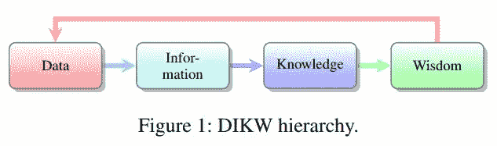

# 人为的非理性:(大)数据悖论

> 原文：<https://medium.datadriveninvestor.com/artificial-irrationality-the-big-data-paradox-b15c9db95e30?source=collection_archive---------11----------------------->

The Big Data Paradox

近年来，人工智能(AI)决策和自主系统成为经济、工业和社会不可或缺的一部分。人类-人工智能生态系统不断发展的经济引发了对人工智能系统中继承的风险和价值的关注。我对超额预订系统中的规划和决策的研究调查了价值创造和交换的动态，并指出在成本-价值、知识、空间和时间维度的感知方面的一些差距。在这篇博客中，我想建议更深入地研究数据在决策过程中的作用，并提供我最近关于“人类-人工智能生态系统的经济学:多维差距中的价值偏差和失去的效用”(2018)的论文中的一些观察结果。

# 从数据到决策

在技术进步、公司和人们收集数据仓库的背景下，术语大数据被多次使用；数据越大越好。数据的意义不仅仅在于它的存在，数据是决策的关键组成部分，决策可以是理性的，也可以是非理性的。决策行为可以是理性的，也可以是非理性的。

遵循 Marwala (2013，2014，2015)让我们定义一个决策为 ***理性*** 如果它导致了一个全局最优，基于逻辑原则并且来自完整的相关信息。基于不相关或不完整信息的决策是不合理的，并且不能保证对全局最优的指导。有效信息的不完全导致了 ***非理性决策*** (Marwala，2013)。 ***理性决策过程*** 由理性决策行为组成，整个过程及时优化并导致全局效用最优(grüne-Yanoff 2012；马尔瓦拉 2014；2015).

开发理性决策系统的目标来自于*对大数据的需求*和用于决策的信息的完整性。 ***但是数据太大怎么办？*** 要回答这个问题，让我们更深入地了解一下数据在决策过程中扮演的角色。

## DIKW 层次结构

信息和知识的关系在 DIKW 层次结构(数据—信息—知识—智慧)中建模，如图 1 所示。

一些研究人员同意 DIKW 的起源是在 T.S .艾略特的诗 [The Rock](https://leavesandpages.com/2013/01/03/poetry-excerpts-from-the-rock-by-t-s-eliot/) (1934)中，在诗中他想知道；

> 我们在生活中失去的生命在哪里？
> 
> 我们在知识中失去的智慧在哪里？
> 
> 我们在信息中丢失的知识在哪里？

几年后，DIKW 层次结构在研究文献中引起了注意(Zeleny，1987；库利，1980；阿科夫，1989)。Rowley (2007)的深入调查显示了对基本模型的一些观察和扩展。Ackoff (1989)在实践中为该理论提供了一个范例，他用一页纸的篇幅对 DIKW 层次结构组件与从数据中获取知识和智慧的过程中的有效性和效率方面的分析之间的关系进行了精炼的解释。关键概念如下。

**数据**是表示物体和事件属性的符号。

**信息**是经过处理的旨在增加其有用性(效用)的数据，是描述简洁的数据。

**知识**是说明**上的*如何*** *到*使用的信息。

*   ***理解*** 是解释 ***为什么*** 。
*   ***智力*** 是增加 ***效率的能力，而不是效能*** 。信息、知识和理解构成了智力。

**智慧**是增加有效性(一个被评估的效率)，增加价值的能力，这需要 ***判断功能*** 。

在一个不完美的世界中，我们应该意识到我们允许缺失信息的程度及其对决策过程和 ***将知识转化为行动*** 的过程的相关性。纯粹评估有效性的判断功能通过 ***将信息转化为行动*** 导致无意识的错误或犯罪。

## KHiA“行动中的知识”

在组织管理的文献中，KHiA“行动中的知识”(Swart，2011；斯特拉蒂，2007；Cunliffe，2008；Empson，2001)是将知识转化为行动的典范。有效的行动依赖于有效的判断功能，并且必须基于知识。行动的有效性因环境而异，取决于具体的人、地点和时间。知识是一种静态资源，它在特定的时间和地点通过行动创造价值(斯彭德，1996；Swart，2011)。为了从数据中创造价值，我们应该为人类和人工智能决策系统定义**价值理性判断函数**。

# (大)数据悖论

Robots’ HDHD

近年来,(大)数据的增长速度远远超过了使其变得有用的处理能力，即将其转化为信息、知识和有效行动。数据的丰富导致未处理的数据过度订阅到有限的处理能力中，未处理的数据很好拥有，但是当涉及到决策时，它是无用的。

> 为了做出合理的决策和行动，必须对数据进行处理并将其转化为信息，信息转化为知识，知识转化为决策或行动。

基于(太)大数据或(太)小数据的决策过程会导致不合理的决策。当数据太小时，我们会因丢失信息而产生不确定性，而当数据太大时，我们会获得同样的不确定性，但需要更努力地处理和收集无序的原因。如果数据的大小符合处理能力和时间预算的界限，使其变得有用，那么它就是好的。当人类创造者创造并向经济市场发布大数据时，他们必须意识到大数据的悖论，不朽的有限理性决策者和痴迷的数据收集者。过剩在实践中使人工智能从人工智能变为人工非理性，这在许多情况下适用于高效和充满自信(不知道成本)的行动，导致经济生态系统中的价值偏向。

> 我们应该追求的不是数据；要解决大数据悖论，我们应该专注于有价值的精炼知识，而知识是一种投资。

# 我们为什么要把知识创造过程视为投资？

如何评价知识并不总是很清楚。知识的本质是这样的，在大多数情况下，只有在实现其潜力之后，才能从时间的角度对其进行评估。创造知识的成本可能由个人支付，而随着知识的实现而获得的价值大多数时候由社会分享和占有。与社会分享知识允许进化、财富和进步。与此同时，科学和思想史上的许多成就只有在思想的创造者去世后才具有价值。创造知识过程中的风险，过程中预先付出的成本，过程以*潜在*结束，对付出成本的人没有即时价值。

## 数据犯罪

Data Crimes: a temporal illusion of benefit

知识潜在价值未实现的另一面涉及犯罪，如窃取知识、剽窃。当在一个维度支付成本而在另一个维度创造价值时，就出现了异常。一个奇异的观察结果出现了，背后没有任何代价的迹象。与此同时，在知识起源的维度上，存在一种异常现象，表现为理性预期的没有回报的多价值投资。

***数据剽窃*** 是一种真正的犯罪，必须从几个维度的角度来衡量。随着互联网的发展，信息革命和信息传输速度的增加，这个问题成为一个尖锐的问题，需要多学科的关注。如果社会中的个人在进行长期投资(如研究)时不能信任社会，以社会价值为导向的长期投资将被短期、成本最优的投资所取代，这些投资的价值是从个人的角度来衡量的。

## 知识在创业过程中的价值

另一个关于知识价值的例子是创业过程，在这个过程中，一群人承担风险，进行长期投资，以实现一个想法。当一个想法被展示给市场时，其潜力的实现创造了与社会共享的价值。从企业家的角度来看，当他走向市场时，他的想法的价值是巨大的，并且(没有额外的创新步骤)它开始了一个价值消退的过程，这就是价值和分享的代价。这种现象体现在“上市时间”的概念中，并产生了竞争。当竞争达到平衡时，它是一个有效的经济概念；当它以竞赛的形式出现时，它是危险的。

# 知识投资

投资可以采取多种形式和策略，并涉及多维价值动态；时间、地点、情感投入、调查投入等等。投资的本质是他们以 ***的未来眼光*** 进行投资，即在今天有限的资源下为明天更好的明天付出巨大的努力。由于对未来的不确定性，投资的本质是有风险的，这意味着只有部分理性的决策规划和决策，应该负责任地规划，以减少不理性和降低风险。由于投资的时间和不确定性动态，可信的系统和社会成为社会/系统生存和繁荣的重要因素。如果没有信任体系，长期项目就无法完成，这是一个具有短期时间观和狭隘价值观的社会，即关注高效、成本最优项目的自我集中的个人，其目标由相同的个人(或单个组织)定义和评估。

创造有用和有效的知识需要投资，并涉及风险，例如失败的风险。应该鼓励这种投资。一个可信社会中的个人，如果社会支持他，对冲个人承担的风险，他就可以承担长期研究的风险。与经济投资一样，研究风险的自然对冲可以建立在诸如有效知识的价值、失败的价值等价值之上。如果社会能从失败中创造价值，这将会给学院的目标带来更大的好处，并在几个方面带来额外的好处。对冲对可持续价值和人类价值的长期投资。长期投资被证明是创造有效价值的优秀策略。应用长期投资策略，我们建议将人工智能问题解决、规划和搜索的观察结果结合到大规模领域方法中。大规模领域中的搜索和研究不仅在名称上彼此非常相关，而且在概念和动态上也非常相关，即快速猜测内部路径和不确定性。受这些相似性的启发，提出了另一个假设；评估价值——社区中的信任与出版失败的关系是合作和有效研究进展的关键。

# (重新)搜索

分枝定界剪枝算法被认为在复杂的超额预订计划系统中是有效的。实践中的分枝限界剪枝算法通过利用错误从失败中获取价值来加快进度。修剪方法适用于所有搜索分支，这些分支不能保证比我们现有的解决方案更好的解决方案。因为搜索和研究在许多方面是相似的，所以有一个地方可以更仔细地研究这个分支，以利用我们所知道的错误。

有什么想法吗？请让我知道，询问，并请批评我的话