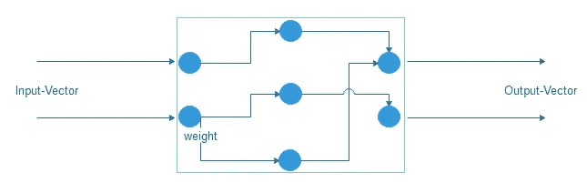

# 人工神经网络:定义、基本原理、简介

> 原文：<https://medium.datadriveninvestor.com/artificial-neural-networks-definition-fundamentals-introduction-f4a077fc9d20?source=collection_archive---------9----------------------->

# 什么是神经网络？

尽管神经网络被成功地用于非常不同的任务，如模式识别、函数逼近或优化，但它们总是基于相同的作用机制。神经网络可以被定义为一种分配规则，其将一组输入转换为一组输出，该组输入的特定属性由所谓的输入向量编码，该组输出也由向量描述，即所谓的输出向量。输入和输出向量可以属于不同的数据空间，由此这些向量的分量代表精确指定的特征值。

Neural networks as a weighted connection structure of simple processors

神经网络由简单、互连的处理器组成，这些处理器只能执行非常基本的计算(例如，计算所有输入的加权和)。两个处理器的连接通过一个权重来评估。通过修改这些权重，可以具体影响网络的输入和输出行为。

 [## 金融中的机器学习——数据驱动的投资者

### 在我们讲述一些机器学习金融应用之前，我们先来了解一下什么是机器学习。机器…

www.datadriveninvestor.com](https://www.datadriveninvestor.com/2019/02/08/machine-learning-in-finance/) 

**定义。**我们将系统定义为连接主义系统，这种系统的特征是由或多或少的大量简单的相似组件组合而成，由此元素之间的连接强度可以改变。

# 神经网络的特性

神经网络通常分两个阶段工作。在训练阶段，学习网络的某些输入/输出关系。训练样本的选择非常重要，因为训练样本中的不一致性或者非典型输入/输出关系的规范会对最终系统的有效性产生负面影响。在执行阶段，学到的知识可以用来解决未知的指派问题。

神经网络的主要属性是:

*   **学习能力** —神经元网络具有独立于应用的
    学习程序，允许你存储训练数据。为此，规则网络特定的内部参数被修改。在大多数情况下，我们会修改权重。
*   **稳定性** —连接式方法对噪声数据非常鲁棒。
*   **容错** —由于网络结构中信息的分布式表示，神经网络可以对单个子组件的故障做出容错反应。
*   **泛化能力** —神经网络可用于泛化训练示例，并在适当的学习策略的帮助下，形成决策规则，使您能够正确分类未训练的数据。
*   **性能** —神经网络通常在执行或应用阶段具有非常高的性能。这使得它们在实时应用等方面很有吸引力。

# 作为分类器的神经网络

神经网络的基本功能之一是对数据进行分类。为此，必须在训练阶段向网络提供足够的成对(对象、相应的对象类别/标签)的代表性示例。

在执行时，网络未知的对象以合适的形式呈现；这就决定了相应的对象属于哪个类。

预测作为神经网络的一个重要应用领域，也可以追溯到分类问题。历史情境与相关的后续事件相关联。当输入当前情况描述时，网络的输出可以被解释为预测，并且基本上只代表基于先前学习的示例情况的分类。

使用神经网络作为分类器的最重要要求是:

*   **选择好的培训案例** —培训阶段不典型的案例研究往往会导致执行阶段的错误分类。
*   **选择合适的特征**——通过合适的属性充分描述训练样本，这些属性是有特征的，并且尽可能相互独立。
*   **选择正确的学习方法** —有必要准确地考虑哪种方法最适合手头的具体问题。
*   **正确的参数化** —通过巧妙选择参数，通常可以显著提高可测量的分类性能。
*   **验证** — 存在允许检查训练网络的分类性能的技术。如果上述各点有相当大的变化可能性，则应特别采用这些方法。

*最初发布于:*[*https://ai news . spx bot . com/2019/05/26/artificial-neural-networks-definition-fundamentals-introduction/*](https://ainews.spxbot.com/2019/05/26/artificial-neural-networks-definition-fundamentals-introduction/)