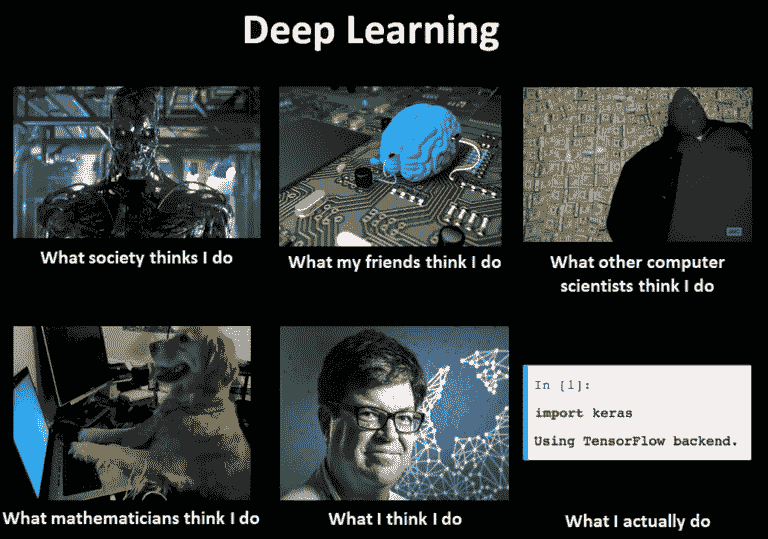

# 向 5 岁儿童解释人工神经网络。

> 原文：<https://medium.datadriveninvestor.com/artificial-neural-networks-explained-to-5-year-old-5ceb532c11cc?source=collection_archive---------0----------------------->

我是一个人工智能爱好者，我已经在这个领域工作了相当一段时间，我经常需要向人们解释我做什么和我是如何做的，这对于一个书呆子来说很容易解释，我的生活就是以下这些

```
import tensorflow as tf
import sklearn
```

但是当我的堂兄弟和家庭成员开始质疑我的工作时，事情就变得棘手了。然而，我生活的复杂性在下面的迷因中得到了很好的阐释。



除了有趣的部分，这个问题开始引起我的兴趣，我希望能够用非常简单的术语向他们解释什么是人工神经网络，而不是陈述。

> 神经网络让一切都变得很酷！

所以，最近我看到了某个天才写的短文，他像对一个 5 岁的孩子一样解释了神经网络的概念，这对我来说很有意义，并给了我对工作描述的回答。事情是这样的:

假设你的家人去某家餐馆吃饭，那里的汤非常好，你的家人品尝后非常喜欢。回家后，他们会告诉你关于汤的事情，当你听到这个戈登·拉姆齐的声音时，你会醒来，你想在家里复制这个汤。现在你开始，你有 10 次机会做出这道汤，你开始准备，每次你尝试食谱的组合时，你都把它给你的父母品尝，并开始接受他们的反馈，每次都做出改变，最后你做出了你想要做的完美的汤，就是这样，你的神经网络就完成了。你使用的配料是你的神经网络的输入，神经网络的权重类似于盐、香料、温度、持续时间等的正确数量。，10 个机会是你的时代或迭代，你的父母(可怜的家伙，他们必须从头到尾尝你的汤)给的反馈是损失，如果你是好的，你会看到他们的反馈随着时间的推移而改善，如果不是，你必须停下来尝试其他东西。

我希望这个故事能让你对神经网络的能力或机器学习/深度学习的能力有所了解。这一切都是为了获得对结果的反馈，并了解结果是否可接受/准确。你的电脑会根据你想要的东西为你做这件事，而不需要明确告诉你如何去做，这不是很棒吗

在一个寒冷的冬夜，在你甚至不知道如何做出点燃你味蕾的完美组合的情况下，啜饮一杯由你的电脑制作的美味的汤，这不是很棒吗？来加入人工智能革命吧。

> 人工智能让一切都变酷！

顺便说一句，对不起任何期望一些数学的人，甚至不要期望我向 5 岁的孩子解释微积分，我宁愿在我的机器上安装 Caffe/Caffe2。

一个必须的要求，如果你对你所知道的感到满意，就拍拍手。！

如果你喜欢你读到的东西，并且想给我买杯咖啡，你可以在这里买。