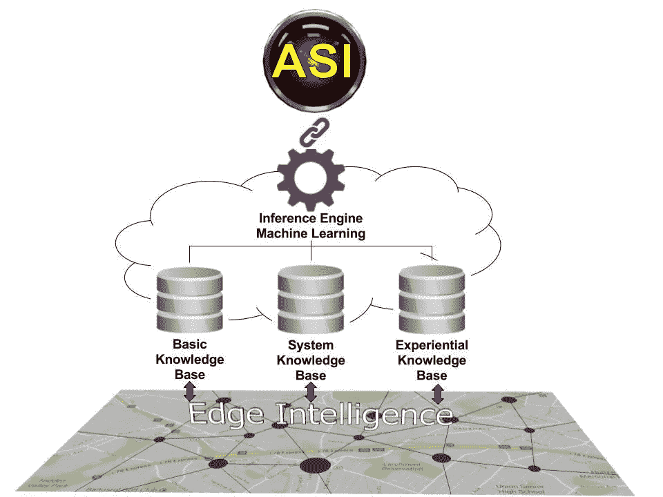

# 人工超级智能(ASI):它会自发产生吗？

> 原文：<https://medium.datadriveninvestor.com/artificial-super-intelligence-asi-could-it-rise-spontaneously-d0df6fd110fc?source=collection_archive---------16----------------------->

tyo0911, 3dwarehouse; What is DNA, Pinterest

我们可以在 techopedia.com 网站上找到对人工智能(AI)的一个漂亮而简单的描述:

人工智能(AI)是计算机科学的一个领域，它强调创造像人类一样工作和反应的智能机器。具有人工智能的计算机被设计用于的一些活动包括:

*   语音识别
*   学问
*   规划
*   问题解决

人工智能是计算机科学的一个分支，旨在创造智能机器。它已经成为科技行业的重要组成部分。

与人工智能相关的研究是高度技术性和专业化的。人工智能的核心问题包括为计算机编写某些特征的程序，例如:

*   知识
*   论证
*   问题解决
*   感觉
*   学问
*   规划
*   操纵和移动物体的能力

人工智能目前仅限于聊天机器人、象棋大师、简单的语音识别、模式识别以及类似的算法向人类学习的事情。

我们还需要几年(大约 5 到 15 年，马丁·福特)来达到普遍的人工智能，机器将使大多数人失业。

我们至少需要几十年的时间才能达到 ASI，在那里人类的意识将与叮咬融为一体。我们的孩子可能会达到这个技术奇点。这种影响将是巨大的，超过我们现在的想象。

我把所有这些东西、概念、定义和想法放在一起，拿起一个绘图工具，画了一个可以维持 ASI 的“元素包”的机制草图。在我画完这个包之后，我睁开眼睛，说了一些类似这样的话，“哇，我们正在建造一个非常大的东西……”

粗略地说，机制的概念由数据、推理机和机器学习组成。这些术语的核心来自专家系统的定义，因为构建逻辑是有根源的，人类只是添加了一些多年前未知的元素(例如 IoE)。

主要平台是一个所谓的“边缘智能”(EI)。EI 的元素是物联网(IoT)和整个具有人类和智能算法的物联网生态系统。物联网在这里扮演着传感器的角色，用于数据捕捉。然后，数据和算法被打包成 3 个主要的知识包:

*   基本知识库是已知知识、事实、证据等的集合。这已经被证明了。
*   实验知识库是一个知识包，物联网可以通过智能算法捕获、保存和处理这些知识，并将它们上传到云端(自动驾驶汽车可以节省计划外的障碍等。).
*   系统知识库是用推理机维护云生态系统潜在需要的知识包(这是工程师的事)。

推理机和机器学习起到了所谓的“*云核*的作用。推理机不仅仅是一个条件 if-then 子句，还包括巨大的智能算法，不仅可以实现深度学习，还可以不断进化新的神经网络，用非常简单的语言来说，这意味着新的思想、问题解决、学习、规划等。

一切都像人的大脑，比如周围和中枢神经系统。当然，有一个链接需要与现实对接。我简单的把它命名为一个 ASI 的链接或者电影)**中 [*HAL*](https://www.youtube.com/watch?v=qDrDUmuUBTo) 的链接。《2001:太空漫游》是 1968 年由斯坦利·库布里克制作和导演的史诗科幻电影。剧本是库布里克和亚瑟·C·克拉克写的。**

*我相信我们今天正在构建这个 ASI 元素包。问题只是这个人造有机体什么时候会出“[*Cogito ergo sum*](https://en.wikipedia.org/wiki/Cogito_ergo_sum)”(我思故我在)这个语句。一些未来学家声称这将在 2050 年发生，而另一些人持怀疑态度，声称不会在 2500 年之前发生。*

*我这篇文章的主要观点是下面这个问题:“*我们正在构建我们所期望的东西吗*”？真的会是一个新物种，一个有自我意识的人造生物吗？这里的问题是我们不能很好地解释它，也不能定义自我意识到底是什么。所以，我们怎么能期待像我们一样的东西和比我们更好的东西呢？如果我们只是在为我们的生活开发新的令人惊叹的工具，那会怎么样？这些工具将是 2050 年全球 90 亿人口所必需的。*

*最后，如果一个 ASI 自发地出现了呢？人类正在建立并将继续建立边缘智能，物联网生态系统，参考引擎和各种知识，将所有这些上传到云，将所有这些连接在一起，结果将产生一种人工智能，一种新的人工有机体，最后是一种我们可能无法理解的新物种。所以不会有开关 ASI 的按钮。*

*如果 200 万年前人类发明火的时候问自己一个类似的问题会怎么样？*

*在下面的视频中，戴夫与电脑 Hal 9000 进行交流。电影《太空漫游》显示 HAL 9000 是一台独立的计算机。现在，我们可以想象，这很可能不会是一台计算机，而是一个由世界各地的人类制造的巨大 IoE 的生态系统，它将开始自我构建，自我学习。*

*因此，戴夫可能会与这个由大数据、智能算法、全球物联网、机器人和数十亿传感器组成的庞大系统进行交流，而这些都不是这个星球所必需的。*

*最后，我需要说，这些说法可能是错误的，但至少现在我有一些基于现实的论点。虽然我把一个想法比作一部电影，但现实情况略有不同。正如我之前提到的，我们可能不会通过点击在超级计算机上“安装”一个 As I，但我认为“ [*Cogito ergo sum*](https://en.wikipedia.org/wiki/Cogito_ergo_sum) ”将从 IoE 生态系统中生长出来。这里的要点是，我们失去了对整个全球体系的影响力，而我们正在不断地建设这个体系。例如，尝试改变物联网生态系统，尝试从其中移除数十亿台物联网设备，或者改变其中大部分设备的行为。你就是做不到。假设数百万编码者在 GitHub 的帮助下创建一个算法，并允许所有用户为一个聊天机器人更新数据库。然后尝试改变这个聊天机器人的行为。你不能这么做。你不会用潜在的 ASI 来做这些。*

*马特加斯·马鲁西格*

***参考文献***

*2001:太空漫游(电影)可在:[https://en . Wikipedia . org/wiki/2001:_ A _ Space _ Odyssey _(电影)](https://en.wikipedia.org/wiki/2001:_A_Space_Odyssey_(film))【2017 年 7 月 29 日访问】。*

*人工智能(AI)可从以下网址获得:[https://www . techopedia . com/definition/190/artificial-Intelligence-AI](https://www.techopedia.com/definition/190/artificial-intelligence-ai)【2017 年 7 月 29 日获取】。*

*Cogito ergo sum 可在:[https://en.wikipedia.org/wiki/Cogito_ergo_sum](https://en.wikipedia.org/wiki/Cogito_ergo_sum)【2017 年 7 月 29 日获取】。*