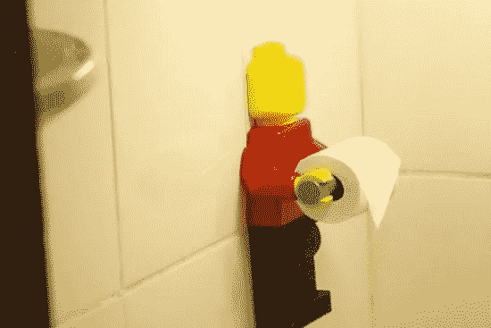
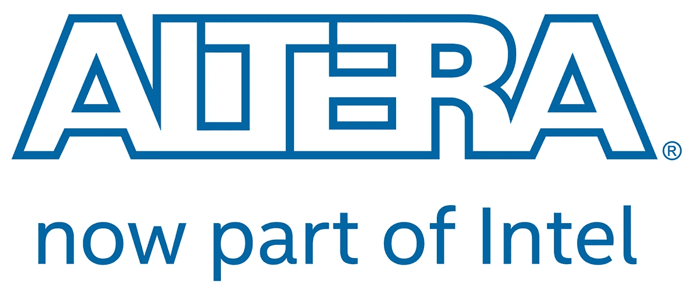
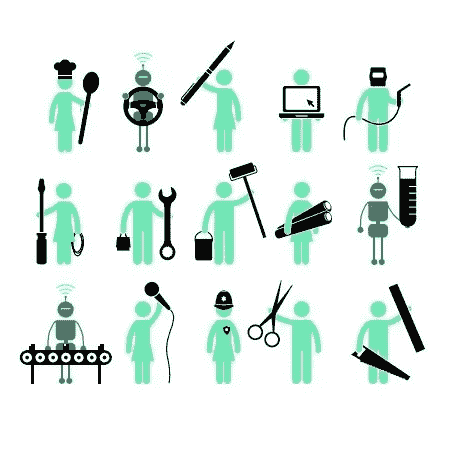
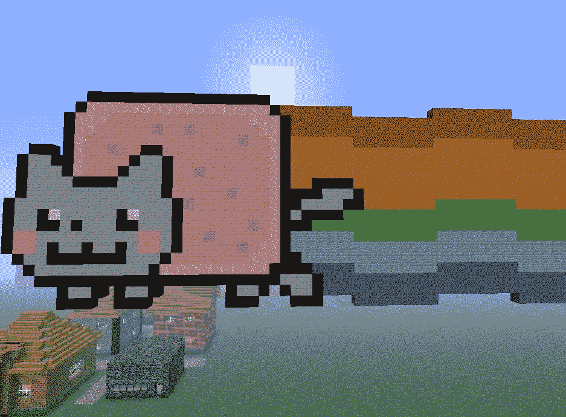
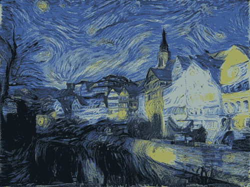

# 人工智能机器人(AIR)和新工作

> 原文：<https://medium.datadriveninvestor.com/artificially-intelligent-robots-air-and-new-jobs-d75a4d93df23?source=collection_archive---------18----------------------->

一个人工智能正处于蓬勃发展的边缘。在第三个千年的第十八年，我们手中的机器人能够从任何物体中提取微小的层，并以真实世界的精度和质量将其转化。我们一砖一瓦地建设一个新时代。

Source: [beeprinted.com.br/posts/lego-porta-papel](https://beeprinted.com.br/posts/lego-porta-papel)

我们还保留了一种非常新的方法，通过 Altera Intel fusion [2015]对更高阶复杂性的系统进行有效编程。无处不在的硬件将很快被实时设计，以满足应用程序节省能源、时间和金钱的确切需求。很快，通过硬件描述进行编程将成为世界上每一个计算系统的一部分，以创造解决问题的新途径，以及改变我们对人类看法的新范式。

Source: [newsroom.intel.com/news-releases/intel-completes-acquisition-of-altera/](https://newsroom.intel.com/news-releases/intel-completes-acquisition-of-altera/)

使用 3d 打印机和人工智能机器人，我们大大减少了生产我们需要和不需要的东西的努力。仍然支撑着这种体系的廉价劳动力将很快被空气所取代。

人类独有的东西，例如推理、复杂决策和图像识别，现在只是覆盖在硅上并嵌入地球处理核心的巨大智能的冰山一角。如果地球有一个大脑，它肯定会在多功能性、力量、范围和目的方面得到升级。

source: [becominghuman.ai/what-is-artificial-intelligence-ai-4bde325e5462](https://becominghuman.ai/what-is-artificial-intelligence-ai-4bde325e5462)

机器人将开发精确、地球、健康、生物、农业、社会、人类科学甚至艺术领域的工作。从现在开始，人工艺术品、人工意识、人工感情和机器人伦理等概念将比以往更多地被使用。AIRs 不仅会参与讨论，还会进化到与我们的智力相当并超越它。

Source: [workplaceinsight.net/one-fifth-uk-jobs-threat-automation/](http://workplaceinsight.net/one-fifth-uk-jobs-threat-automation/)

我们将把我们达到的极限延伸到远远超过任何曾经讲述过的童话。简单地说，我们可以预见一个从完全休闲到完全征服的未来。一方面蓝色药丸让你尽可能舒服，另一方面红色药丸让你成为奴隶。你会选哪一个？

Source: [planetminecraft.com/project/nyancat-only-the-cat-with-small-ammount-of-rainbow/](https://www.planetminecraft.com/project/nyancat-only-the-cat-with-small-ammount-of-rainbow/)

抛开这个光谱的边界，红色和蓝色的药片，让我们看看中间。控制和自动化理论的改进及其后续应用正在削减任何地方的中级和复杂工作。从自动比萨饼机到复杂的决策机器人，我们站在一个巨大的网络上，这个网络进化给了我们更多的寿命、舒适和懒散。

我们目睹旧工作的崩溃比新工作的兴起更快，给掌权的老人带来绝望和恐惧，让年轻人湮没无闻。
我们有了更优化的生产方法，需要更少的能源。过度重复、危险和丑陋的工作不再适合人类。空气正在创造艺术，驾驶汽车，甚至管理金钱。

Source: [deepart.io/](https://deepart.io/)

金钱很快就会变得公正，只是它曾经的一个虚拟概念。没有硬币，没有文件，只有统治我们所有人的比特。

由有史以来最高效的生物控制的比特:空气——人工智能机器人。它们从未停止，它们再生，它们学习，它们创造，它们升温，它们冷却。

Source: [dogecoin.com/](https://dogecoin.com/)

我们需要找到一种新的方式来表达我们升级后的全球化社会中的能量交换，否则我们注定会遭遇灾难。新时代要求我们重新分配我们的价值观和原则，我们需要重新思考我们的财富的核心意义，并相应地重新分配。

在我看来，艺术、自然和教育的提升；职业仍在我们手中；是度过这一切的方法。让他们的孩子出生，并理所当然地被视为艺术家、生物学家和教授。

让我们在我们建立的世界里舒适地呼吸。

请分享并参与讨论。