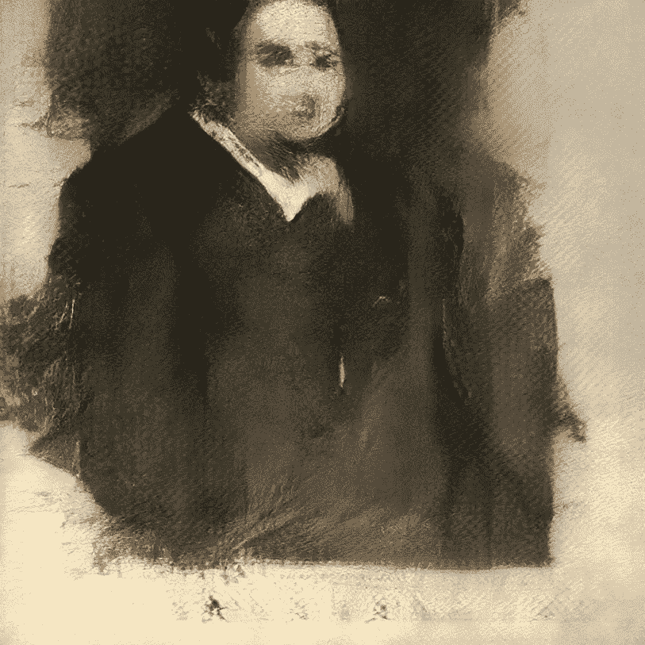
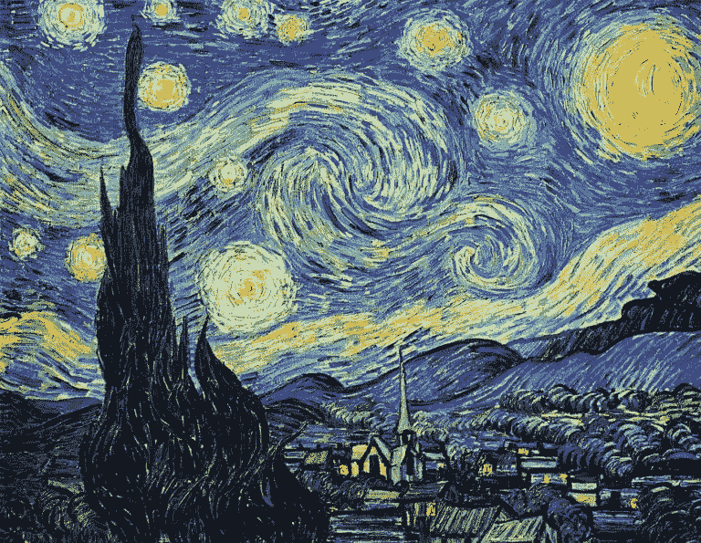
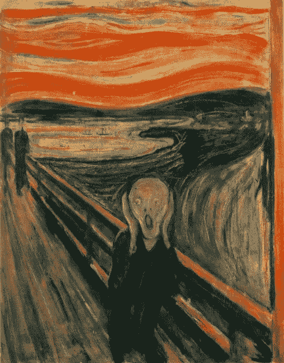

# 我们能区分计算机和人类艺术吗？

> 原文：<https://medium.datadriveninvestor.com/artist-vs-computer-8fe2b7745160?source=collection_archive---------13----------------------->

计算机可以创造艺术。但这只是未来的一种尝试，一个关于如何区分计算机生成的艺术和艺术家作品的伦理问题？

This photo provided by Christie’s shows a portrait of Edmond de Belamy, a work of art created by artificial intelligence.

上面的图片是计算机可以用几种算法和数据做什么的例子之一。但是什么是真正的艺术呢？它只是某人创造给观众看的吗？

想想文森特·梵高的名画《星夜》。这是一个相当简单的场景描述，包含一个村庄和一些可怕的夜空纹理。这幅画看起来很壮观，但更有趣的是它背后的故事。梵高生前不成功，被认为是疯子和失败者。他在自杀后成名，并作为典型的被误解的天才存在于公众的想象中。梵高患有精神病发作和妄想，尽管他担心自己的精神稳定性，但他经常忽视自己的身体健康，饮食不当，酗酒。梵高自愿住进圣保罗大教堂 [疯人院](https://en.wikipedia.org/wiki/History_of_psychiatric_institutions) m。这幅画的灵感来自梵高曾经住过的一家精神病院的真实景象。这是日出前从他圣保罗德莫索的精神病院卧室朝东的窗户看到的风景。这幅画创作于 1889 年 6 月的冬天，当时他还在这所学校。

***The Starry Night,*** [Vincent van Gogh](https://en.wikipedia.org/wiki/Vincent_van_Gogh), 1889, [Museum of Modern Art](https://en.wikipedia.org/wiki/Museum_of_Modern_Art), New York City

《呐喊》是爱德华·蒙克的一幅画，吸引了人们，甚至吓到了一些人。这幅画的创作过程非常有趣——有一天，当蒙克和他的朋友在城市街道上散步时，他产生了创作这幅画的灵感。然后，他停下来，看着天空，因为它是设置和血红的颜色。他还听到从城市下面传来微弱的吱嘎声。由于这样的设定，他觉得有无限的尖叫声从大自然中发出。在那次事件之后，他继续创作这幅画，把云涂成血红色。

后来，爱德华·蒙克描述了这幅画背后的个人痛苦。他说几年来他几乎疯了。他的画作*《呐喊*》描绘了他是如何被拉伸到极限，后来又放弃了再次去爱的希望。

The Scream - Edvard Munch

艺术背后有一定的灵感。这是创造艺术的意图，在观众中引起某种情感。当计算机创作艺术时，它是有目的的还是有灵感的？输入数据和创造这种计算机的人是那些在头脑中有某个最终目标或想要回报的人。或者，也许我们都只是计算机，更加复杂和抽象。

 [## 人工智能与创造力:梦想成真|数据驱动的投资者

### 人工智能总是让我着迷。不仅作为一套有用的工具，不断发展，而且作为一个…

www.datadriveninvestor.com](https://www.datadriveninvestor.com/2019/01/28/ai-creativity-deep-dream-comes-true/) 

当我读到强化学习或神经网络之类的东西时，我会想到这些技术与人类思维有多么相似。也许艺术家和计算机之间没有区别——计算机可以是一个学徒，努力成为未来最伟大的艺术家之一。

这些只是偶尔想想很有趣的一些想法——或者，也许我想得太多了。

*   南达科他州