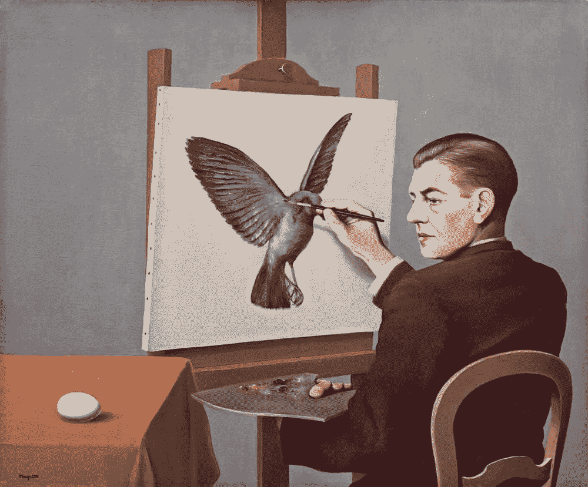

# 艺术家、企业家和投资者——学什么

> 原文：<https://medium.datadriveninvestor.com/artists-entrepreneurs-and-investors-whats-to-learn-295cdd2f2f51?source=collection_archive---------14----------------------->

An ability to see what may be, vs what Is

艺术家是幻想家，他们有能力讲述一个故事，并通过视觉图像来想象同样的事情。更重要的是，他们的作品之美在于其诠释——对其他人来说，它可能意味着不同的东西，但他们所做的事情有一个共同的主题——一个好的艺术家，是一个伟大的故事讲述者。

企业家在被他们的执行热情所驱使的同时，也需要一种非常相似的技能，一种对他们故事的精彩叙述。作为一名企业家，一个人需要有能力看到未来可能会发生什么，并通过统一的故事叙述带领他们的团队走向相同的目标——因为不是每个人都会明白——并且他们有责任确保这一切发生。真正的远见卓识者，是那些用他们的产品或服务来预见未来的人，他们的产品或服务填补了一个空白，并有能力看到将来会发生什么，而不是现在的情况。在这个旅程中，你会发现两种人:骗子和艺术家。两者都有非常相似的本质，他们都非常擅长他们所做的事情——他们讲述了一个非常好的故事。

投资很难，事实上非常难。虽然数据和数字处理是投资中容易的部分，但随着投资的商品化，难的部分是理解企业家、他的故事和筛选真正的艺术家。投资的好处在于，你不需要总是做对——只要你继续投资，并适当地调整投资规模。事实上，一些世界上最好的投资者，有 30%或更低的执行率(执行率是指他们的投资不变坏的可能性)，但持续复合财富超过 20%。你可能想知道这在数学上怎么可能…..答案是……他们让赢家乘风破浪，并累积时间收益——人们习惯于在房地产市场这样做，在那里，屏幕前看不到价格，但在公开市场，这需要一种与人类最基本的本能——兴奋——作斗争的持续冲动。

学习历史，让我明白了兴奋是人类最基本的需求。我们喜欢任何形式的兴奋，因为它会使肾上腺素激增——对于对这背后的科学感兴趣的人来说，有许多关于多巴胺释放及其影响的科学文章。在如此激动人心的时刻，人们喜欢改变他们的交易心态，偏离他们开始的地方。客观地看待交易意味着承认这一点，没有什么隐含的错误，但投资和交易需要两种不同的心理调整，很少有人能在两者之间无缝切换。

投资和做好投资的美妙之处在于，需要一个人戴上多学科的帽子，并在他/她的整个职业生涯中不断完善自己。直到今天，我才意识到艺术家也有投资者想要培养的特质。这确保了他们对企业家和驱动他们的心理的理解，使他们与正确的推动者合作。

我是 Itus Capital 的创始人，这是一家独立的资产管理公司，负责管理印度股票市场的资金。你可以在推特上关注我们，网址是 [ItusCapital](https://twitter.com/ItusCapital)