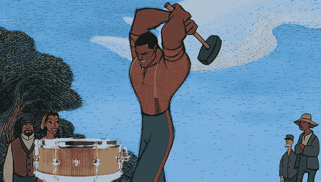

# 艺术的进化及其与技术的融合…进一步观察第二部分

> 原文：<https://medium.datadriveninvestor.com/arts-evolution-and-it-s-convergence-with-technology-further-observations-part-ii-a3ff06a11ae8?source=collection_archive---------23----------------------->

## 人对机器

随着我继续探索人类作为机器中的幽灵的概念，在快速发展的技术和人工智能中，我的潜意识继续屈服，并为这些思考带来更多素材。与其提出一个立场或观点，我想我觉得有必要认真地张贴/发表这些文章，以激发对话、评论、反馈和对话，促进我对这一现象以及我们未来的理解，而不是确认或封闭任何信念。

这是一位世界级音乐家对我作为视觉艺术家正在探索的同样困境的描述。Jojo Mayer 最近在苏黎世的 TEDx 演讲中谈到了这台机器以及它的燃料。此外，作为当今最优秀和最具创新精神的鼓手之一，Jojo 选择了挑战(鼓)机器，挑战他的身体极限，但随后证明了即兴表演不仅是一件非常人性化的事情，而且最终也是艺术和创造力真正诞生的地方:在这个通道过程中。我想知道通灵是否足以辨别艺术和计算机生成？毕竟有模仿创造力的计算机算法。所以我们会一直是 Jojo 机器里的燃料吗？

Ballad of John Henry still from Disney, doctored by Palmer

虽然我赞赏 Jojo Mayer 的《约翰·亨利之歌》中提出的人与机器并列、理论和想法，但它仍然没有对艺术的未来提供太多保证或预测。目前，我用技术补充我的天赋和技能。我在我的架子鼓上安装了一个循环触发垫，并继续在 Photoshop 中绘画和插图。今天，我是这些项目和技术的驾驶员、操作员和操纵者。然而，当机器学习和人工智能相交时，技术可以取代方向盘和驾驶座吗？那么人类的精神或创造力本身会被渲染成一个幽灵吗？我想 Jojo Mayer 是想说我们将永远承担管理角色，没有机器能够模仿“创造性的人类精神”。然而，如果人类继续为伟大而沾沾自喜，那么这可能是一个真实而不可避免的现实。你的视角取决于你的经历。

话题个人已经到了痴迷的程度。我自然很好奇未来 40-50 年会发生什么。我预测会有一个平台期，但技术领域更聪明、更聪明的领导者充其量也只是一致感到害怕或担忧。我更感兴趣，也更关心它将对我这一代以及未来几代人的创造力产生的影响。具有讽刺意味的是，作为一名艺术家，我认为我需要想出更聪明的方法来利用技术为我所用。

最受欢迎的想法和评论！

## 来自 DDI 的相关故事:

 [## 用 7 个步骤解释深度学习——数据驱动投资者

### 在深度学习的帮助下，自动驾驶汽车、Alexa、医学成像-小工具正在我们周围变得超级智能…

www.datadriveninvestor.com](https://www.datadriveninvestor.com/2019/01/23/deep-learning-explained-in-7-steps/)  [## 成为数据科学家所需的 8 项技能——数据驱动型投资者

### 数字吓不倒你？没有什么比一张漂亮的 excel 表更令人满意的了？你会说几种语言…

www.datadriveninvestor.com](https://www.datadriveninvestor.com/2019/02/07/8-skills-you-need-to-become-a-data-scientist/)