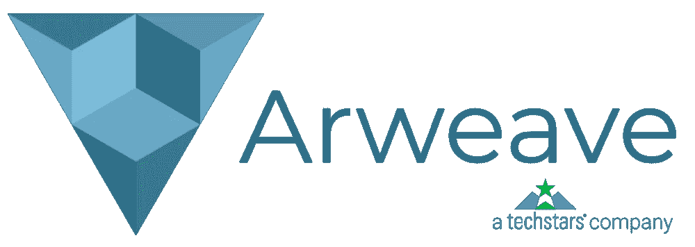
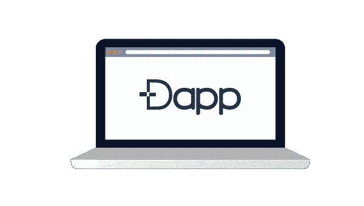
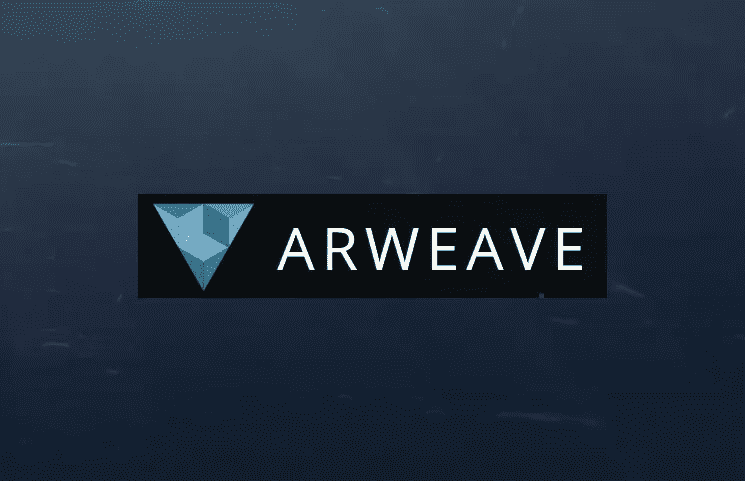

# ARWEAVE 是分散存储能力的未来

> 原文：<https://medium.datadriveninvestor.com/arweave-is-the-future-of-decentralized-storage-capabilities-7b4f29d7ce32?source=collection_archive---------7----------------------->

当石油被发现并了解其用途后，我们试图挖掘更多的油井来获取这些黑金。整个行业都是围绕石油建立起来的，尽管在石油之旅中有过坎坷，但在利润和实用性方面的结果是巨大的。我们现在处于一个完全不同的时代。石油仍然有利可图，但技术进步(尤其是在计算机领域)带来的一种有价值的产品，很快(如果不是已经)超过了石油的价值。我们生活在最新“黄金”数据的时代。

现在数据就是一切。没有数据，不仅仅是任何数据，准确的数据，你几乎什么都做不了。我们是数据的生成者，这些数据对世界各地的许多公司都非常有价值。当剑桥分析公司(Cambridge Analytica)的行为被曝光时，数据的重要性和它能做什么就被见证了，这显示了数据拥有多大的力量。因此，数据需要始终受到保护，以便永远保持其真实性。

这带来了数据存储和数据访问的问题，Arweave 试图通过改进现有技术来解决这一问题，以提供一种安全可靠的数据存储解决方案，在整个存储期间保持真实性，Arweave 希望永远保持真实性，同时为客户保持尽可能低的存储价格。Arweave 还希望创建一个平台，挑战目前世界上正在出现的审查问题，即政府和其他监管机构可以随意审查内容，如果它们不满意的话。Arweave 上的审查将由网络上的同行民主地管理。

# 巨大而宝贵的资源

一个的技术特征是我们所期待的。流程正变得日益高效。我们现在可以通过手机汇款，通过手机支付服务费用，从常见的家居用品中获得反馈，甚至可以通过应用程序控制家中的灯光强度。越来越多的设备被连接起来，随着物联网的发展，在不久的将来，将会产生更多的连接设备。这个基础对于数据生产来说是非常肥沃的。大多数人希望记录这些设备的数据，因为它们在未来可能会有用，特别是那些涉及支付的数据。

随着智能手机使用的增加，数据的产生也增加了。我们用手机拍照、录音、拍摄不同事物的视频，甚至用手机追踪我们的健康状况。所有这些都是数据的来源，因为它们每天都在生成数据。每一个 Instagram 或脸书邮报都是需要存储的新数据。

然后是现代工作生活。

🔷一切都在数字化。

🔷以前保存在硬拷贝中的记录现在正被转移到存储它们的数字平台中。

🔷事实上，大多数国家正在采用数字化版本的保存记录。驾驶执照、身份识别系统和任何其他重要文件都被数字化记录。

🔷现在上下班打卡已经数字化了，甚至用指纹传感器来保护。

🔷甚至一些大学也采用这种制度来确定学生的课堂出勤率。

数据的数字化是方便的，但是它也暴露了数据被操纵和删除。网络攻击可以很容易地消除或操纵数据，特别是如果数据存储在一个集中的系统中，因为大多数数据目前存储在。医院、企业甚至科技公司都因为使用中央系统而遭到黑客攻击，用户数据遭到泄露。

# 分散数据存储

去中心化和区块链齐头并进。区块链引领互联网走向去中心化，并为人类带来好处。与权力下放一起的是透明度和安全，这是它一再提供的。区块链平台的出现导致了这些平台上分散应用的开发。去中心化运作良好，给我们带来了它承诺的透明度和安全性，但有一个领域区块链平台仍然落后，那就是数据存储。

一些 DApp 开发者选择离线存储他们的数据，因为这样更便宜，尽管可访问性在这里成为一个问题。对数据的访问可能会极大地影响这些 Dapps 的功能。链上数据存储解决方案也有，但它们太贵了。以太坊试图在其协议上托管一个链上存储平台，但 Dapps 可能会产生的成本影响以及这些应用程序的后续用户意味着该项目不得不被搁置。它带来的问题比它解决的问题还多。

经历的一些挑战归因于不良的共识机制，这需要这些平台内所有节点的参与。Stellar Lumens 试图通过改进架构来解决这个问题，但这只能解决访问速度的问题。然而，潜在的数据存储问题仍然存在。

已经建立了分散数据存储解决方案，如 Filecoin 和 Sia coin，乍看之下，它们与 Arweave 之间可能没有任何区别。然而，错综复杂的是，Arweave 使用不同的方法来解决区块链面临的数据存储问题。这些平台的主要区别在于 Arweave 将用于其平台的访问验证机制。

# 专注于数据存储

我们所知道的历史可能是假的，也可能是真的，除非有确凿的证据证明书籍和人物所声称的事情确实发生了，否则我们永远也不会知道。这个问题是由存储之前或存储期间的数据失真引起的。数据失真可能是有意的，也可能是无意的，但大多数情况下是有意的，以促进格式化方的目标和愿景。拥有永久可靠的数据存储解决方案将终结对存储的数字数据的操纵。

Arweave 正在开发的平台将拥有专门为用户提供数据存储和所有支持技术的技术。这些创新包括:

1.  **平纹织物。** Blockweave 的核心是存储和转发存储数据的效率。Blockweave 引入了块哈希和钱包列表，有效降低了节点参与事务验证所需的要求。这将导致更有效的数据存储和更快的中继时间。
2.  **准入证明。** Arweave 将有一个工作证明与访问证明共识机制携手工作。它将使块能够以更快的速率生成，因为它不依赖于直接的先前生成的块，而是随机选择任何先前生成的块来生成新的块。访问证明也将影响矿商在复制数据方面的竞争。
3.  **野火。野火在矿工之间创造了一种积极竞争的氛围。Arweave 预计其平台上将存储大量数据。存储这些大量的数据还要求它们在需要时快速传播。它根据新形成的区块、同行之间共享的信息以及这些信息在被请求时的传递速度，对矿工进行排名。分数差的矿工在平台里就没有位置了。**
4.  **块状阴影。**使用 blockshadow，共享块变得更加容易，因为它发送了可用于构建块的实际块的“影子”。通过这种方式，更多的块被共享，占用更少的空间，并且可以在需要时重建。Blockshadow 将致力于提高 Arweave 平台内的交易速度。Arweave 的目标是 5000TPS 的交易速度，这对他们实现其文献中的声明非常重要。

# 为什么 [Arweave](https://www.arweave.org/) ？

你为什么会选择 Arweave 而不是其他人？嗯，从他们的旅程开始，Arweave 就一直在正确的轨道上，提出了一个平台，它将保持历史的原始形式，同时改变历史的进程。Arweave 一直在运行一个测试网，试图看看他们的产品将如何工作，以及他们是否会实现他们设定的目标。他们的 mainnet 很快就要推出了，这使得它成为少数几个在首次公开或私下销售之前就拥有产品的 ico 之一。这些只是积极的开始。

有哪些使用案例？根据世界正在遵循的数字方向，Arweave 是正确的数据存储解决方案。只要想想所有需要保护的数据，这是一个巨大的数量，但让我们看看一些机构将从一个完全工作的 Arweave 平台中受益匪浅；

1.  **学术机构。**大学和学校是发现新的创造性创新的最佳场所。这些创新可能会改变世界，但由于知识产权侵权，它们的创造者可能看不到他们的劳动成果。Arweave 可以帮助保护各种知识产权，因为它的平台永远不变地存储数据。抄袭的问题也可以通过 Arweave 轻松解决。来自世界各地的学生交流他们的想法，这有助于传播知识，但有些人会无耻地复制和粘贴他们同事的作品，这是发展的障碍。当作品存储在 Arweave 中时，如果内容被复制，可以追溯到该作品的原始创作者。这可以通过在 [*Arweave*](https://www.arweave.org/) 协议内开发应用程序来实现。Arweave 的 协议设计包括 REST API，这使得开发人员可以更容易地设计与 Arweave 无缝协作的应用程序。《原始数据杂志》将在支持为这种探测角色设计的应用程序方面发挥至关重要的作用。
2.  **医院。**欧洲一家领先的医院已经与 Arweave 合作，并将使用原始数据日志来存储他们每天生成的数据。医院要求记录一旦完成就永久保存，因为它们包括对病人的诊断。患者病史对于医生根据患者过去的诊断和治疗(尤其是慢性病)在未来做出决策非常重要。这些记录对研究和学习也很重要。通过使用 Arweave，医院可以确保他们的记录是安全的，并且可以随时方便地访问。
3.  **民主国家。在每个竞选期，选民们都不得不经受所有关于腐败的猜测，并希望一旦他们投了票，他们的选票就会真正算数。一些选举结果几乎不可信，但大多数时候，几乎没有任何具体的证据，法院可能会接受。选举结果被推翻也可能产生严重的影响，尤其是在竞争激烈的席位上。民主国家会发现 Arweave 平台在投票活动中特别有用。Arweave 中的投票将是防篡改的，每个人的投票都有其应有的权重。使用 Arweave 平台投出的每一票都将与其他每一票进行加密链接，这样任何不是由投票人投出的不规则投票在选举中都不成立。通过适当的调整，这一系统甚至可以用于其他机构的投票，作为一种透明度措施，这可能会大大增加选民对他们选出的领导人的信心。**
4.  **开发商。**如前所述，Arweave 使用 REST API 让开发者更容易构建运行在 Arweave 协议上的应用。这些应用程序可以用任何语言编写，从而支持所有想加入 Arweave 的开发者。开发人员可以构建任何支持 Arweave 特性的应用程序，甚至可以通过提出那些真正展示 Arweave 范围的应用程序来展示他们的创造性。他们可以与各种机构合作，通过 Arweave 平台解决独特的数据解决方案问题。
5.  **政府机构。**这些可以从 Arweave 支持的原始数据日志中受益。政府每天生成的数据是巨大的，对于服务于生成这些数据的公民是重要的。保护公民数据是政府机构的首要任务，他们可能会发现 Arweave 平台可以胜任这项任务。关于出生、身份和纳税状况的记录可以以原始格式保存，保证数据的存储不会受到任何干扰。如果政府与开发商密切合作，他们甚至可以建立一个税收体系，有效地减少逃税者的数量。

Arweave 的应用程序可以超越这些机构；只取决于利益相关方的数据存储需求和解决方案。除了机构之外，Arweave 对想要存储法律文件的个人也很重要。只要平台继续运行，文档将保持其真实形式，并在平台中持续存在。

Arweave 可能带来的另一个优势是不可改变的互联网存档。一些过去有时会在未来通过引用互联网上不久前写的材料而被曝光。这些文章中的一些可能不受政府或企业机构的青睐，他们可能会试图通过操纵其提供的信息或完全从互联网上删除来影响这些数据。

通过保持互联网的不变记录，所有在互联网上发布的数据从发布之时起，每个人都可以访问。它还可以作为某一时期发生的事情的确凿证据，防止历史事实被篡改。

# 最后

T 数据市场规模庞大，每年超过 3 万亿美元，随着我们不断增加产生的数据量，这一市场将稳步增长。云存储选项现在甚至向区块链提供服务，只是为了显示数据存储是多么有利可图。然而，现在比以往任何时候都更需要正确执行数据存储。我们已经看到了数据存储的基础知识，但随着我们迈向未来，还需要更多。

数据存储领域需要专业化的数据存储服务、数据的不变性、从监管机构手中夺走审查控制权，以及更多类似的例子。Arweave 可以提供所有这些，通过其平台采用的开发人员友好的方法，可以通过开发人员的创造力和平台的功能完成更多工作。

[*Arweave*](https://www.arweave.org/) 已经有了一个现成的产品，很快就会推出，在那里可以测试其声明，特别是 5000TPS。它的 mainnet 甚至在给出 ICO 的全部细节之前就已经发布了，这可能是行业首创。它的交付方式值得称赞，一旦他们发布了 ICO 的全部细节，可能会帮助他们达到他们想要的 ICO 目标。Arweave 还得到一个开发人员和顾问团队的支持，如果一切按照他们的路线图进行，他们有足够的经验来提供他们网站和文献中的声明。

[*Arweave*](https://www.arweave.org/) 有一个很棒的项目。这个概念可能不是新的，但它可以在执行和他们的功能中脱颖而出，如 Blockweave 和 wildfire。Arweave 绝对是一个有趣且有前途的协议。

如果你觉得这篇文章有用，并且想看我的其他作品，请点击 [*这里*](https://medium.com/@salmanmiah) *关注我！*😎

