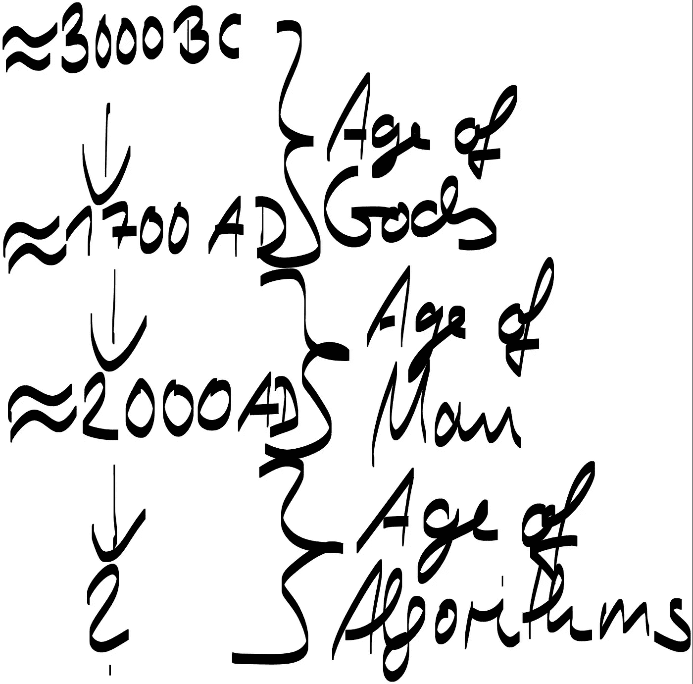

# 随着新时代的到来，我们需要寻找新的历史分期:一个建议

> 原文：<https://medium.datadriveninvestor.com/as-a-new-age-dawns-we-need-to-look-for-new-historical-periodizations-a-proposal-59517da2ffe8?source=collection_archive---------22----------------------->

每当人类进入一个新时代，就面临着如何重新评估其历史分期概念的问题。由于我们现在正处于一个新时代的边缘，这种重新评估是我们目前正在努力解决的一项任务，以便我们了解我们在一个似乎比以往任何时候都更加动荡的世界中所处的位置。

所有的分期都有标准和标志，在此基础上可以确定一个新时代的开始。我建议把这种分期建立在崇拜和权力的标准上，这是我们试图衡量历史变化的常用尺度。与古代、中世纪和现代历史的三分阶段相一致，我也提出了三分时代，它在某种程度上与传统的阶段划分重叠并支持传统的阶段划分，但在某种程度上偏离了这一公理。

第一个要确定的时代是神的时代，基本上是从人类文明开始到启蒙时代。在那个阶段，至高无上且无可争议的权力被赋予了神。神被赋予了普遍真理，是存在的不可告人的结局。这并不意味着没有权力斗争和人类统治社会和文明的愿望，但他们总是在神的自然神论的生活模式中这样做。在所有的社会中，无论是亚洲、欧洲、非洲还是美洲，所有的统治者都被神赋予了权力。当他们倒下时，他们失去了上帝的恩宠。

当神不足以解释世界的奇迹和规则时，下一个时代开始了，这是在 1700 年左右的启蒙运动时期。到那时，人类变成了以自我为中心、自给自足和自我陶醉的世界统治者。我们声称已经解开了世界和宇宙的秘密和阴谋，并因此登上了不是为国王或神建造的宝座，而是为我们每一个人建造的，因为我们摆脱了宗教的束缚。我们发明了自由意志的神话，我们的幸福和快乐成为了存在和历史的目标和目的。

这个时代即将结束，因为我们意识到，我们的自由意志的想法是一个神话，我们的良心和推理不是我们认为可以解决我们面临的所有问题的通用工具。我们终于认识到了这一点，因为我们正在通过资源枯竭、迫在眉睫的气候变化威胁和对我们自己生境的破坏，将我们自己带到毁灭的边缘，却没有找到消除所有这些末日情景的灵丹妙药。但是，标志着这个时代结束的最重要的认识是，不可否认地认识到人工智能算法的优越性，人工智能算法正在取代超越我们不稳定的大脑意识流的问题解决者。这种巨大变化的证据比比皆是，比如《纽约客》(The New Yorker)最近刊登了一篇题为“学会爱机器人”的封面故事，或者我们对一架 737 MAX 飞机的飞行员与自动驾驶系统进行的悲剧性战斗感到恐惧，因为他们在自动驾驶仪将飞机坠入大海时失去了自动驾驶系统。

因此，当我们在这个日渐式微的个人主义时代崇敬自己的时候，我们正处于迎来一个新时代的边缘，这个新时代将由算法以及作为算法平台和执行者的各种机器和机器人来统治。在接下来的几十年里，这些算法不仅仅是工具，我们，直到现在计算机的主人和操纵者，用来巩固我们在世界上的主导地位，这将成为既定的事实。

沃森在《危险边缘》和《国际象棋》中的胜利仅仅标志着这个时代的开始，正如葡萄牙水手巴托洛梅乌·迪亚兹到达好望角仅仅是全球时代曙光初现的前奏中的一个小节。(我们是否会被美好的希望所鼓舞，还是会被矩阵般奴役人类的恐惧所鼓舞，将在随后讨论)。

现在，即使与我们将在仅仅 50 年后看到的相比，技术仍然是初级和笨拙的，但很难否认一个普遍存在的事实，即我们已经开始崇拜技术超过神和我们自己。因此，随着机器的力量超过我们，随着我们崇拜它们，一个新时代的到来已经具备了条件，在这个新时代，人类不会消失，但会将接力棒交给完全意识到自己行为的后果的机器，因为它们被自己创造的算法的力量所压倒。

因此，我认为，以历史标准来看，我们最近进入人类世并没有结束，而是我们即将进入人类世的第二阶段，即技术人类世，在这一阶段，我们放弃了塑造世界的主角地位，让人工智能来主宰历史。

决定未来事物形状的不是建筑大师、画家大师或作曲家大师，而是算法大师。仍然会有站在人类等级顶端的高级牧师，但是像牧师一样，他们只是代表上帝一样的算法来调解和统治我们，我们需要这些算法来回答和解决所有关于生命、宇宙和一切的问题。我们将怀着敬畏和崇拜的心情看着，随心所欲地执行算法的发现，就像在过去的时代一样，我们首先执行神的意志，然后执行我们自己想象的自由意志。