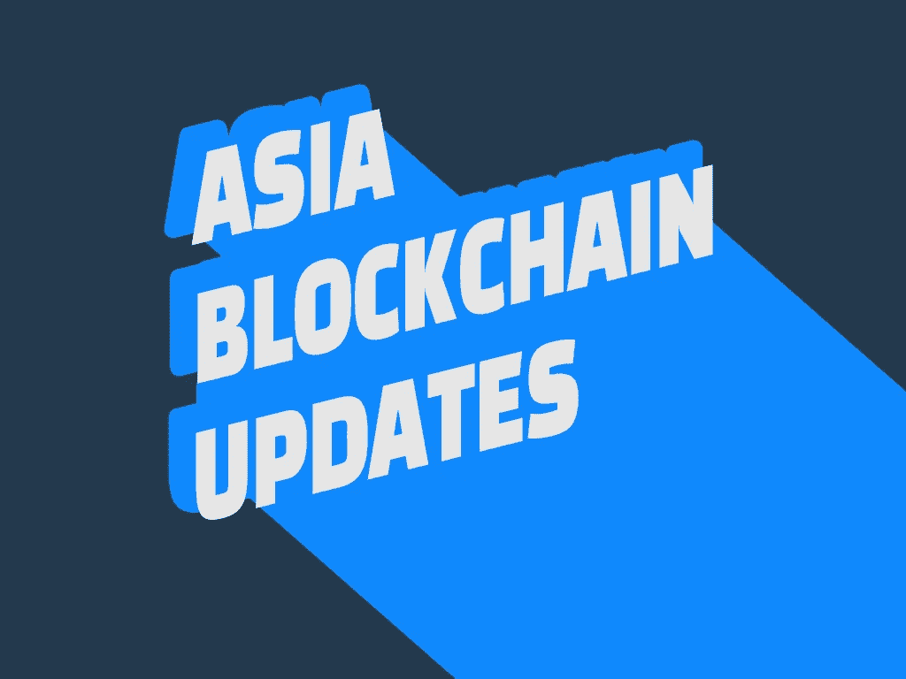
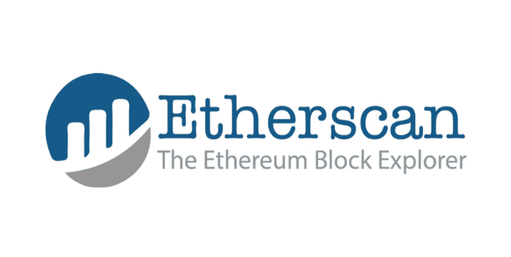
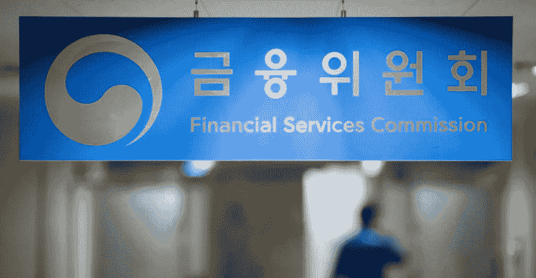
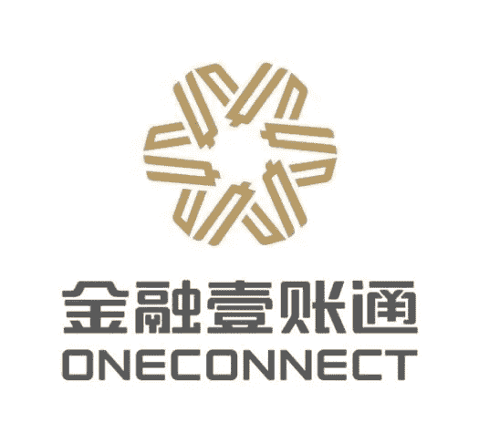

# 亚洲区块链更新 2019.12.04 中国正在审查各大加密网站，韩国会 Abadon 暗币吗？

> 原文：<https://medium.datadriveninvestor.com/asia-blockchain-updates-2019-12-04-5ff11d9ade9d?source=collection_archive---------12----------------------->

> 以太扫描也被踢出中国，
> 韩国政府试图正式禁止暗币，
> 中国大型保险公司区块链子公司在美国上市

Asia Blockchain Updates 2019 by Amy Kang

# 以太扫描在 Mainland China 已被屏蔽

Etherscan has been Blocked in Mainland China since Oct [https://blockinpress.com/archives/26391](https://blockinpress.com/archives/26391)

中国政府阻止了对以太坊浏览器 Etherscan.io 的访问，似乎中国政府决定使用防火墙来限制对以太坊海外网站的访问。

根据 Coindesk 和 coin telegraph 12 月 3 日的报道，他们在当天测试了中国的网站，发现无法通过中国内部 IP 地址访问该网站。

媒体还报道说，去年 8 月，可以在没有审查的情况下进入以太扫描。

 [## 5 行业转型区块链应用|数据驱动投资者

### 除非你一直生活在岩石下，否则我相信你现在已经听说过区块链了。而区块链…

www.datadriveninvestor.com](https://www.datadriveninvestor.com/2019/02/13/5-real-world-blockchain-applications/) 

根据国际民间组织 Greatfire.org 的搜索，自 10 月 30 日(当地时间)以来，除非使用虚拟专用网络(VPN)，否则在中国无法访问以太网扫描。CoinTelegraph 表示，“(以太扫描阻塞)似乎是最近才发生的。”

中国政府没有透露屏蔽的原因。

区块链投资公司 Sino Global Capital 的负责人 Matthew Graham 表示，“这是我们可以看到的区块链技术分散化与完全由中央政府控制的行动之间的又一个典型摩擦案例。当更多的区块链应用程序融入我们的生活方式时，这类事件应该会更多地发生。”

# 韩国政府考虑放弃暗币交易的政策

Korea Government is about to issue a Policy to Abandon the Trading of Dark Coins [https://www.coindeskkorea.com/62324/](https://www.coindeskkorea.com/62324/)

韩国政府最近再次考虑发布一项政策，禁止交易所谓的隐私币(或暗币)，如 Monero (XMR)、DASH 和 ZASH (ZEC)。使用暗币洗钱的风险远高于其他任何硬币，因为交易信息通常是未知的。

韩国 Coindesk 最近获得了与[【特定金融交易报告和使用法(特别金融法)】](https://medium.com/@sincerelyblockchain/asia-blockchain-updates-20191125-2ee5811600d6#64a6)有关的文件，该文件已于 2011 年 11 月 20 日编写并提交国会

该文档包含一些加密货币的示例和案例研究，这些示例和案例研究反映了这样一个事实，即某些硬币具有特别高的洗钱风险，包括未知的交易细节，所谓的暗币或私人硬币就在该示例组中。

特别金融法按执行程度分类，也称为总统令。

与法律不同，执行令(总统令)不必经过国民议会，因此制定和修改的过程相对不那么复杂。

为此，该法律作为一项实质性原则，执行令成为实际法律，以便在法律的频繁变化中更忠实地反映该领域的意见。

这已经不是业内第一次评论暗币及其交易风险了。

韩国金融当局去年 9 月对隐私硬币提出了质疑。当时，FSS 官员在与韩国主要加密货币交易所的会议上质疑为什么会有大量 Monero(暗币之一)交易，该问题指的是 Bithumb 的“交易量激增”。

会议结束后，Upbit 决定于 9 月 30 日立即将 Monero (XMR)、DASH、ZASH、ZEC、Haven (XHV)、Bittube (TUBE)和 Pivex (PIVX)除名。

# 平安通，目标在美国 IPO 融资 5 亿美元

Chinese Blockchain Company One Connect on US IPO [http://finance.ifeng.com/c/7s6TLhk3tTb](http://finance.ifeng.com/c/7s6TLhk3tTb)

中国最大的保险公司平安旗下的一家中国区块链公司向美国证券交易委员会提交了修改后的招股说明书，准备在美国上市。

据中国华夏媒体报道，One Connect 官方公布的最新招股书显示，其美股发行价区间为 12-14 美元之间，发行的美国存托股票(ADS)总数为 3600 万股。

这是自 11 月 14 日 Financial One Connect 在 SEC 发布首份招股说明书以来，首份详细的 IPO 计划。

Financial One Connect on 月 3 日发布的招股书显示，确定在纽交所上市，上市代码为“OCFT”以 One connect 的招股书计算，募资计划最高约 5.04 亿美元，最低 4.32 亿美元。

这还不到业内专家此前预测的 1.42 亿美元的一半。

平安的一位官员在接受媒体采访时回应说:联通本身和中国平安都没有发布明确的赴美 IPO 融资信息。所谓的 10 亿美元融资，是外界的猜测。对中国平安来说，金融通的上市是该集团金融科技战略的一部分。

此外，区块链工业目前的发展得到了中央政府的支持。一联是平安的孵化器公司。他们的重点产品应该是区块链技术的研究和应用。上市只是其进一步发展的一小部分计划。