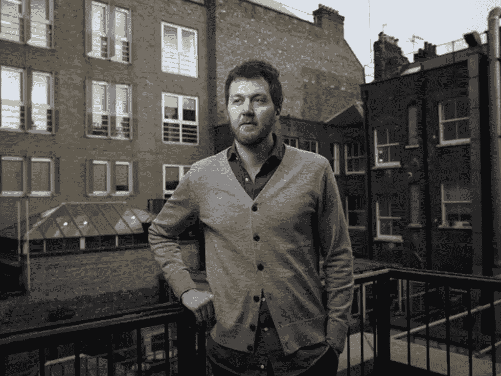
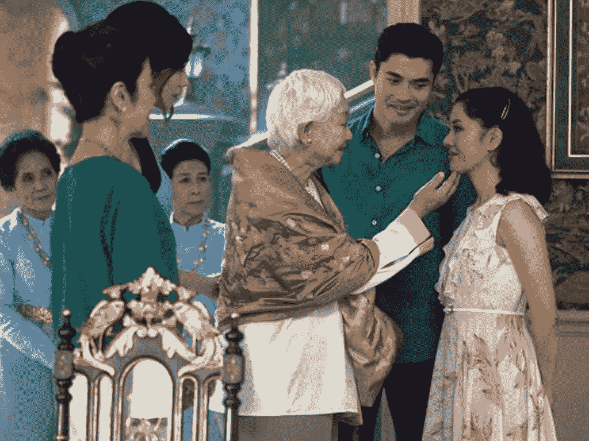

# 亚洲家族理财室为加密货币对冲基金支付溢价

> 原文：<https://medium.datadriveninvestor.com/asian-family-offices-pay-premium-for-cryptocurrency-hedge-funds-5733d3fc999?source=collection_archive---------3----------------------->

Hedge fund manager and man who thought he just saw someone changing in the window of the nearby apartment, Brant Rubin.

在从伦敦斯坦斯特德机场(因为希思罗机场太中产阶级化了)到汉堡会见一个潜在客户的三小时瑞安航空航班上，一个三岁的蹒跚学步的孩子不舒服地踢着他像纸一样薄的座椅靠背。

这种伤筋动骨、摧毁灵魂的飞行是对人类耐力的一种锻炼。瑞安航空是一家廉价航空公司，其唯一的使命是通过将尽可能多的乘客赶进联合国人权理事会允许的机舱来赚钱，并剥夺他们尽可能多的联合国禁止酷刑公约允许的舒适，这与他以前的生活状态相去甚远。

在这次转变之前，鲁宾在全球各地的头等舱机场休息室里闲荡，在三万英尺的高空啜饮香槟，在全球各地的君悦酒店尽情享受。

39 岁时，鲁宾加入了越来越多的前对冲基金经理的行列，他们自己闯出了一片天地，却意识到开一家对冲基金店并不像人们所说的那样好。纽约鸟舍里 500 美元一瓶的唐培里侬香槟和晚餐已经一去不复返了。

Hedge fund manager’s recurring nightmare made real.

如今，像鲁宾这样的对冲基金初创公司越来越多地发现，他们乘坐的是廉价航空公司的航班，而不是 AirBnbs。鲁宾于 2017 年辞去了他在伦敦卢克索资本的工作，当时他正在挑选欧洲互联网公司，正值该阶级的异常增长时期。

但事实证明，独自闯出一片天地要困难得多。从家人、朋友和一些以前的客户那里筹集了近 5000 万美元，鲁宾很快发现，他的筹资几乎无法覆盖他的日常开支，他的市场份额越来越不受潜在客户的青睐，同时受到欧洲金融监管机构新的繁重监管负担的挤压。

鲁宾欣然承认，他在筹集额外资金方面运气不佳，

> “这不再有利可图了。烧钱是不舒服的，尤其是当我们没有无限的钱可以花的时候。但我相信我们的业务。”

但不仅仅是像鲁宾这样的创业基金在与成本和收益递减作斗争。

这个主题贯穿了整个对冲基金行业。

Things are getting so bad in the hedge fund industry that three traders are now sharing one desk.

由于低成本投资和收取零或低费用的指数基金的双重趋势，以及高频交易算法基本上将市场上的阿尔法值交易到几乎为零，对冲基金行业自金融危机以来经历了艰难的十年。

一家中型科技主题精品公司的对冲基金经理表示，

> “从许多方面来看，积极策略的效率比过去低了很多。贝塔卷土重来，阿尔法被打败了。”
> 
> "我们甚至还没有达到这个指数，更不用说超过它了."

但在投资世界的一个安静角落，一些积极的基金经理正见证着管理下的资产的增长。

## 投资不适合胆小的人

从威士忌基金到艺术品基金和收藏品，亚洲管理着包括加密货币在内的各种另类资产的基金正受到越来越多的关注。

If it looks like a lemon, if it sounds like a lemon and if it runs like a lemon, it’s a collectible car.

香港一家另类资产管理公司的一位经理表示，

> “家族理财室不像养老基金。他们在选择投资工具方面有更大的回旋余地，时间跨度也更长。”
> 
> "与养老基金不同，它们还拥有更广泛的授权."

养老金在亚洲(日本和中国以外)并不常见，因此，养老基金在该地区的影响力也不大。相反，财富一直与亚洲最具企业家精神的家族联系在一起。

亚洲一直在崛起，并将继续成为世界上增长最快的地区之一，其最富裕的家庭从中受益匪浅。在 2017 年的[年底，亚洲亿万富翁几乎占全球亿万富翁的 38%。](https://uk.reuters.com/article/uk-asia-wealth-family-offices/rich-asians-crazy-about-securing-wealth-spark-family-office-boom-in-hk-singapore-idUKKCN1N90R1)

When Greg entered the vault, he started to worry that his client just might have a drinking problem.

家族理财室在亚洲还是一个相对较新的概念，与欧洲和美国的数千家相比，亚洲的家族理财室还不到 500 家，因此家族理财室的增长潜力和风险偏好已经同步上升。

许多亚洲最富有的家族都是白手起家的故事，他们坚韧不拔、富有创业精神的创始人表现出了反传统、打破常规的思维。

马来西亚一位著名房地产大亨家族办公室的一位经理表示，

> “他们(富裕家庭)享受着(家族理财室)的个性化关注，并意识到自己能够在财富管理方面拥有更大的发言权。”

对于家族理财室来说，亚洲的成本仍然相对较低，这也有所帮助。该地区最重要的两个金融中心香港和新加坡的顶级写字楼价格都很高，但仍比纽约和伦敦便宜得多。

“Come my child, let me see if there are dollar signs in your eyes.”

由于香港和新加坡的税率都很低，而且都没有资本利得税，家族理财室发现设立和运营成本非常合理。

香港和新加坡都是前英国殖民地，拥有强大的法治，增加了富有客户所欣赏和享受的监管确定性。

随着新一代亚洲人财富的增长，一些亚洲最著名家族的第二代和第三代子孙正在寻找“下一件大事”，其中加密货币已经出现在雷达上。

## 亚洲人喜欢昂贵的东西

尽管从高点下跌了 80%以上，加密货币继续吸引着亚洲最富裕家庭的兴趣。

向家族理财室提供高度专业化专业知识的加密货币对冲基金能够收取溢价。

Crowd went berserk when told that a new batch of Hamilton tickets would be released.

虽然当今大多数典型的对冲基金都难以向客户收取 1%的管理费和 15%的绩效费，但加密货币对冲基金在某些情况下收取高达 4%的管理费和 30%的绩效费。

香港一家算法加密货币对冲基金的一位经理表示，

> “客户认识到，他们是在为相对于传统对冲基金的某些‘知识’优势付费。因此，他们承认费用结构也不可能是典型的。”

事实上，加密货币对冲基金能够收取更高的费用，正是因为它们承担着更重、更专业化的负担，以及它们提供的专业知识的独特性质。

加密货币对冲基金的托管和基金管理成本通常更高，但这些更高的成本也伴随着更高的利润。

与传统市场的量子基金不同，加密货币市场的许多交易数据相对不成熟。市场数据也是零碎的，许多加密货币对冲基金公司拥有自己专有的研究优势。

印度尼西亚一家香水公司的老板热衷于加密货币，

> “在印尼，如果你在一个中等规模的城镇开一家泡泡(波霸)茶叶店，你可能会是那里多年来唯一的一家店，让你赚取垄断利润。”
> 
> “在印度尼西亚，信息传播速度不快，也不容易，但我们可以在这里赚钱。”

类似的信息和数据差距也吸引了许多亚洲家族理财室对加密货币感兴趣。随着这种新资产类别的兴起，他们看到了自己第一次发家致富的相似之处。

与传统市场相反，数据稀少，发现时的竞争优势可以保持更长时间，这是具有讽刺意味的，因为加密货币旨在促进信息的透明度和开放性。

加密货币对冲基金利用加密货币市场的低效率获取了巨额利润。

普通对冲基金会为 10%的同比回报率而欣喜若狂，而采用积极策略的加密货币对冲基金通常能够实现 30%至 50%的回报率，有些甚至超过 60%和 80%。

亚洲家族理财室也注意到了这一点。

加密货币对冲基金往往需要极其专业的知识。据新加坡一家加密货币对冲基金的交易员称，

> “你不能只做银行家或交易员。你需要理解计算，去中心化。对(加密货币)社区有一种感觉，也有一只耳朵在地面上。”

除了像*华尔街日报*和*金融时报*这样的出版物，加密货币对冲基金交易员还在独家 slack 频道、Reddit 小组和其他论坛上，比如所有加密货币之母比特币诞生的那些论坛。

“You don’t get it Rachel, to ‘moon’ doesn’t mean flashing your butt out the window.”

除了在计算机科学方面的扎实基础，交易者还需要了解市场心理，其他交易者的心理，并有能力构建积极交易加密货币的算法，以产生 alpha，但只能处理有限的市场数据。

到 2017 年底，在加密货币狂热的高潮时期，许多只做多的加密货币对冲基金诞生了，但许多基金的市值已缩水 70%以上。

那些继续坚持的通常有积极的交易和管理策略，典型的持有时间从几秒到几周不等。

在这种背景下，完全可以理解为什么客户(尤其是亚洲家族理财室)愿意为拥有积极交易策略的加密货币对冲基金支付溢价。

这位驻香港的经理表示，

> “费用只是家族理财室关注的一个方面。当你考虑到这些办公室也是对艺术品投资开放的时候，特别是中国皇家时代的艺术品和酒类投资，加密货币就不是想象中的事情了。”

## 来自 DDI 的相关故事:

 [## 为什么数据会改变投资管理

### 有人称之为“新石油”虽然它与黑金没有什么相似之处，但它的不断商品化…

medium.com](https://medium.com/datadriveninvestor/why-data-will-transform-investment-management-4a60966c1c81)