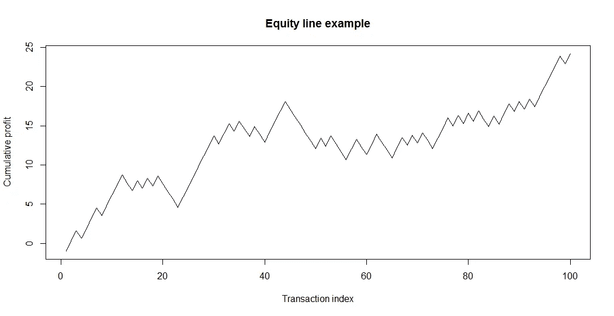
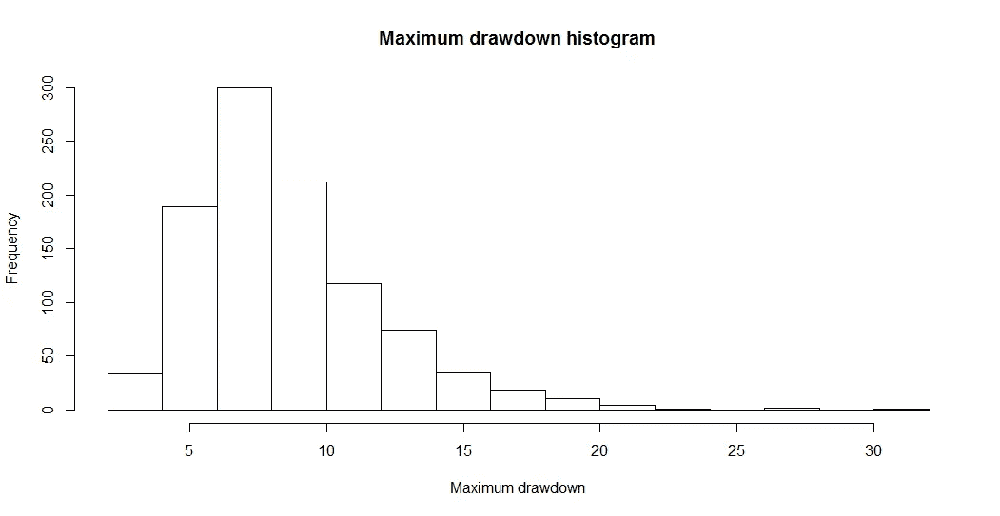

# 用蒙特卡罗方法评估交易策略的风险

> 原文：<https://medium.datadriveninvestor.com/assessing-the-risk-of-a-trading-strategy-using-monte-carlo-analysis-in-r-5df55782b21b?source=collection_archive---------2----------------------->

## 蒙特卡洛分析可以是管理交易策略中风险的有力工具。

Photo by [Chris Liverani](https://unsplash.com/photos/dBI_My696Rk?utm_source=unsplash&utm_medium=referral&utm_content=creditCopyText) on [Unsplash](https://unsplash.com/?utm_source=unsplash&utm_medium=referral&utm_content=creditCopyText)

蒙特卡洛分析是我在大学学到的最迷人的研究领域之一。它涵盖了**无限**的各种案例，并且对于许多分析场景来说**非常有用**。

在这篇文章中，我将向你展示如何使用蒙特卡罗分析来更好地评估一个**交易策略**的风险。

# 什么是蒙特卡罗分析

蒙特卡洛分析的目的是**从一些已知的原理和它们之间的关系出发，模拟一个**客观现象**的概率分布**(或其单一特征)。

在这篇文章中，我将向你展示如何计算一个**交易策略**的**内在风险**。衡量风险的主要指标是**最大提款**，我们策略的内在风险可以用最大提款概率分布的第 95 个百分位数来估算(即有 5%的概率被超过的最大提款值)。

就像在这种情况下，使用分析方法来解决这样的问题会非常困难，甚至是不可能的。这就是蒙特卡罗分析派上用场的地方。事实上，我们并不总是需要所有事物的解析式；我们可能只需要一个好的数值近似值。

在文章的下一部分，一切都会更清楚。

# 分析框架

## 将交易策略建模为随机变量

假设我们的交易策略有一个**回报风险**比率等于 *RR* 和一个**胜率**等于 *p* 。为了简单起见，我们可以假设我们在冒 **1 单位风险**。

我们可以将这种策略的一次交易描述为一个**随机变量** *x* ，概率分布如下:

*   *x = RR* 以概率 *p*
*   *x =* -1，概率为 1 *— p*

## 一系列交易的模拟

一旦我们建立了交易策略的概率分布模型，我们可以通过以下步骤**模拟交易**:

*   生成一个在 0 和 1 之间均匀分布的伪随机数**和**
*   如果小于 *p* ，则交易值为 *RR*
*   如果大于 *p* ，则我们的事务值为-1

如果我们重复这个简单的程序 *N* 次，我们得到一个模拟交易的**序列**，在此基础上我们可以计算出**最大提款**。

如果我们为 *N* 个新事务再次启动序列生成过程，由于该过程的**随机性**，我们将获得**个不同的序列**。这个新序列将为我们提供最大压降的新值**。**

我们可以**重复**序列生成程序任意多次，并为最大压降计算一组**值**。

蒙特卡罗分析**迭代**一个现象的模拟**高次数**以计算**统计上显著的**可观测量。我们可以称 *M* 为我们要模拟的序列数。该数值**必须大于**才能使统计数据正确收敛(如 *M =* 1000 甚至更大)。

最后，我们可以计算出 drawdown 的 *M* 值的**第 95 百分位**，这就是我们想要的数字。

交易策略的**完整蒙特卡洛工作流程**是:

1.  生成一系列 *N* 个随机交易
2.  测量序列上的最大压降
3.  重复上述步骤 *M* 次，获得 *M* 不同的最大压下量。
4.  计算获得的第 95 百分位的 *M*

我们使用的假设是 *N* 个事务是**独立且同分布的**，并且它们的概率分布在一段时间内是**稳定的**。

我希望这些理论没有打扰到你。现在，让我们深入实践。

# R 中的实现

为了计算压降，我将使用 **tseries** 库，它有一个非常有用的函数叫做*max dropound*。该函数将包含**累积利润**(即交易值的滚动和)的时间序列的数组作为输入。它的输出是一个列表，它的元素名为*max drooddown*是我们需要的值。

让我们假设，例如，我们的策略有一个等于 1.3 的**回报风险比**和一个 50% **胜率**。

让我们对 **100 个交易**的序列进行 **1000 次迭代**的蒙特卡洛模拟。我们将计算每个序列的最大下降，并将其存储在一个名为 *dd* 的数组中，从中我们将计算平均下降和第 95 个百分位数。

这是 R 代码。

# 结果

在分析最终结果之前，我想给你看两个图。

第一个显示的是 100 笔交易的**最后**模拟序列的**累计利润**。记住每次迭代产生一个新的序列，所以我们有 **1000 个不同的序列**。

下面的权益线**是我们可以从我们的策略中获得的唯一一条权益线**，但它有助于我向您解释在模拟过程中执行了什么。

An example of an equity line obtained in the last Monte Carlo iteration. Different iterations produce different equity lines.

然后我们可以看看**最大压降**的**直方图**。

Histogram of the maximum drawdown obtained after 1000 Monte Carlo iterations.

如你所见，**中的直方图偏斜了**和**单峰**。最可能的值(即峰值)介于 5 和 10 之间。

**平均压降**为 8.6，**第 95 百分位**为 15.2。

这些数字告诉了我们许多事情，这些事情仅仅从我们战略的特点出发是不容易说出来的。如果我们为每笔交易承担 **1 美元**的风险，那么对于一系列 **100 笔交易**，我们可以预计最大提取额为 **8.6 美元**。这可以给我们一个合理的**数量级的最大提款**，以及它对我们**投资组合**的影响。

我们策略的**内在风险**(连续 100 笔交易)可以用第 95 百分位值来近似，即 **15.2 $** 。这个数字告诉我们，超过这个最大提款值的**概率小于 5%，因此，如果在一系列 100 笔交易中，我们得到一个更高的最大提款值，我们将面临一个 5%的概率事件(可以认为**非常罕见**)。这对我们的战略是一个巨大的警告，应该建议我们重新考虑它的规则、我们正在合作的市场或其他事情，因为它的缩减在统计上已经变得过高。**

只要我们的最大提款低于 15.2 美元，我们可以考虑不要担心它。

请记住，所有这些值都是可伸缩的。如果我们承担 100 美元的风险，最大提款的第 95 百分位就是 1520 美元，以此类推。这就是我用 1 作为风险单位的原因。

# 结论

蒙特卡洛分析是评估交易策略能够提供的**未来情景**的强大工具，无论是在利润方面还是在最大亏损方面。

只要统计数据保持稳定，我们就可以用这些技术来衡量我们的战略未来对市场可能的反应。

这种方法中的其他可能的改进可以是，例如，使用可变风险/回报比率或依赖于时间的胜率，或者甚至更复杂的资金管理模型(例如，固定比率或固定分数)。

**吉安卢卡·马拉托是意大利的一名小说作家和数据科学家。他的书可以在** [**亚马逊**](https://www.amazon.it/Gianluca-Malato/e/B076CHTG3W?_encoding=UTF8&pd_rd_i=B07D7HG8V8&pd_rd_r=d34f8c07-0ef6-11e9-8c18-03e9e1f87d64&pd_rd_w=PjgeY&pd_rd_wg=3XHRC&pf_rd_p=466c5af4-0171-4b17-9b3f-b4036a90f75d&pf_rd_r=VYXNVD02NTB20Y1QS4JG) **上找到，他的文章可以在** [**中型**](https://medium.com/@gianlucamalato) **上找到。**