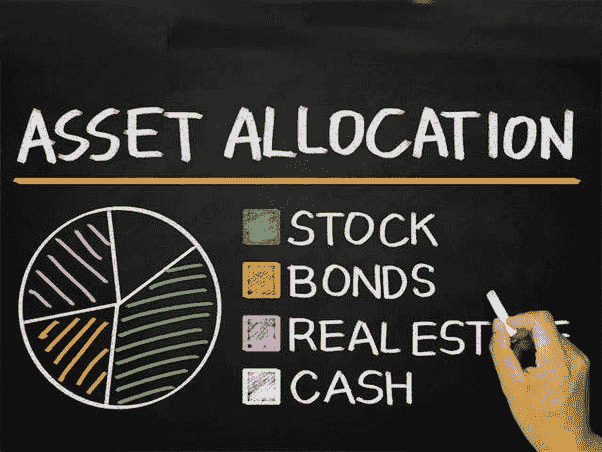
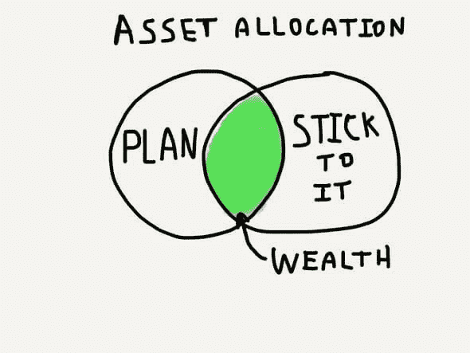

# 资产配置:创造长期财富的关键因素

> 原文：<https://medium.datadriveninvestor.com/asset-allocation-key-factor-for-long-term-wealth-creation-76b9a8116d00?source=collection_archive---------2----------------------->

Important for wealth creation

资产配置是创建和平衡投资组合的一个非常重要的部分。这个术语被金融专家广泛使用。它在最大化投资组合的整体回报方面发挥着重要作用。最著名的短语“**永远不要把所有的鸡蛋放在一个篮子里**”被用来简化术语资产配置**。**

***什么是资产配置？***

资产配置是决定如何在几个资产类别中分配投资的过程。股票、债券、共同基金、其他债务工具以及现金或现金替代品是资产配置策略中最常见的组成部分。**资产配置意味着分散投资组合。**投资组合的构建包括将资金分配到不同的资产类别。这个过程叫做资产配置。

 [## 股票市场投资的机器学习——数据驱动的投资者

### 当你的一个朋友在脸书上传你的新海滩照，平台建议给你的脸加上标签，这是…

www.datadriveninvestor.com](https://www.datadriveninvestor.com/2019/01/30/machine-learning-for-stock-market-investing/) 

简而言之，把你的钱投资在不同类型的投资产品上，以使你的风险最小化，回报最大化。资产类别可以是现金、股权、债务、房地产和黄金。**资产配置取决于你的年龄、风险承担能力和特定目标的时间跨度。**资产分配还为投资者的未来收入和现金流提供了方向，即他应该投资于何处以实现他/她的财务目标。

很难确定哪种特定的资产类别在某一年是表现最好的。只投资于一类资产，并期望其表现优于所有其他投资类别，可能会被证明是有风险的。**如果一个投资组合是多元化的，那么无论哪一个资产类别的表现优于其他类别，投资者都会对每一个资产类别有所投资。**投资组合中表现较好的资产类别将有助于保护投资组合的回报免受其他资产类别中较差回报的影响。就给定预期回报水平的回报可变性而言，资产配置降低了总体风险。因此，**拥有资产类别的混合更有可能满足投资者在风险金额和可能回报方面的预期。**

***资产配置与财务目标挂钩***

当一种需求可以用需要的金额和需要的时间来表达时，我们称之为财务目标。**与财务目标挂钩的资产配置是最合适的资产配置策略形式**。投资期限是投资者财务目标的函数，取决于何时需要这笔钱来为生活中的一些特殊事件提供资金。

在实施与您的财务目标挂钩的**资产配置时，您应该考虑以下步骤**

*   根据承担风险的能力和意愿评估您的风险状况。
*   需求评估。需要多少钱，什么时候需要？您还需要评估可用的资源，并根据需要进行匹配。
*   根据风险承受能力和时间框架选择资产类别。

***用不同的资产类别使你的投资组合多样化。***

**表现出相似风险和回报特征，并以相似方式对经济和市场事件做出反应的一组投资被归为一个资产类别。每个资产类别的风险和回报特征各不相同。因此，每种资产类别的表现可能会因普遍的经济因素而不同。**

*   **权益类资产** : **权益作为一种资产类别，代表一种增长型资产**。投资者的主要收入来源是投资价值的长期增长。

1.  在投资股票时，你应该考虑用核心和附属方法来构建你的投资组合。在这个办法中，按照 20 到 40 岁年龄段，权益投资的 60%要投在质量好的 ***大盘基金和多盘*基金**。45 岁左右的投资者应该将 80%的资金配置在大型基金中。大盘股可以为 SIP 投资带来 10%至 12%的回报。
2.  其余 40%进入****中小盘基金***20 到 40 岁年龄段*40 多岁的应该有 20%的敞口。中小盘股有潜力获得 15%至 18%的回报。他们可以提高你的投资组合回报。这种安排将把下跌风险降至最低，有助于产生更高的回报。**
3.  **如果你没有足够的直接股权股票的基本和技术知识，请**避免盲目投资直接股权**。而是走共同基金路线。**

*   ****债务资产类别**:债务作为一种资产类别，代表一种以收益为导向的资产。债务工具的主要收入来源是定期收入。**

1.  **你 20%的可投资盈余应该投资于年轻人的债务产品，40 多岁的人应该将 40%的本金投资于债务产品，如 PPF、优质债务基金和 NPS。**
2.  ****PPF、NPS 和 EPF** 是创造长期财富的最佳债务工具。对于短期目标，投资于**债务共同基金**。**
3.  ****债券**的风险和回报特征相对低于股票，因此适合寻求最低风险的定期收入流的投资者。**

*   ****房地产:**房地产涉及土地或建筑(商业和住宅)或房地产投资信托(REIT)的投资。房地产价格日益上涨。但它存在流动性风险，并受到经济周期的影响。**

1.  **自过去几年以来，住宅价格一直停滞不前，但从长远来看，商业地产和土地投资可能会有回报。商业地产市场通过租金和资本增值有固定收入。房地产是**收益导向**资产，也是**增长导向**资产类别。**

*   ****黄金:实物黄金**被印度家庭视为安全稳定的投资首选，同时也具有很高的流动性。黄金可以被认为是对冲通货膨胀的工具。它还为资产投资组合中的多样化提供了一种资产类别选择，与其他资产类别直接或间接相关。**

**a)黄金和大宗商品容易受到供需变化的影响。**

**b)5%至 10 %的黄金敞口就足够了。可以通过**黄金 ETF 或者黄金债券投资黄金。****

*   ****现金和现金替代品**:现金一般是为了满足日常和紧急需要而持有的。就回报而言，现金价值可以忽略不计，因此风险极小。一个人应该有最低金额的现金。**

**具有不同风险和回报特征的资产类别的存在为投资者提供了选择满足其回报和风险承受能力要求的资产类别的选择。寻求更高回报并愿意承担更高风险的投资者会考虑股票投资，而寻求更低收入和更低风险的投资者会考虑债务投资。**

**一些金融专家认为，确定你的资产配置是你在投资方面做出的最重要的决定——这甚至比你购买的单个投资更重要。正确的资产配置和坚持计划的纪律对创造长期财富非常重要。**

****

***记住这两件对创造长期财富很重要的事情***

*   ****根据你的资产配置定期投资****
*   ****保持长期投资****