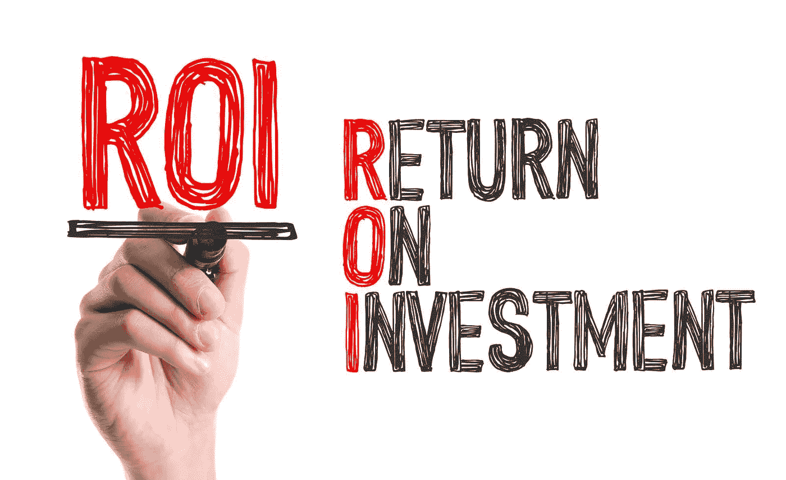

# 确保零售业中基于大数据和机器学习的分析的投资回报率。

> 原文：<https://medium.datadriveninvestor.com/assuring-roi-for-big-data-and-data-science-projects-in-retail-eb1be89f53d1?source=collection_archive---------11----------------------->

基于大数据和机器学习的分析解决方案提供商经常面临实施后满意度下降的问题。高级管理层和用户都对这些解决方案提供的结果感到失望，发现随着时间的推移很难衡量和证明投资的合理性。这种现象有几个原因:

*   许多数据科学团队尚未交付可由高管以 ROI 衡量的成果。
*   新获得的可见性的兴奋导致人们忽略了什么应该是门槛要求:使用该可见性，他们可以采取什么行动来帮助他们赚更多的钱？
*   他们通常意识到，在制定决策时，分析并没有真正嵌入到业务流程中。
*   由于技术或预算限制等不同原因，一些实施使用聚合数据，不允许查看运营系统中可用的最细粒度数据。

在利润如此微薄的零售行业，这个问题甚至更加突出，因此需要找到展示分析项目投资回报率的方法。如果零售商专注于特定的流程或政策，他们通常会表现得很好，但出色的执行是昂贵的；它需要管理层的关注和资源投入。如果零售商可以对迄今为止有些“被忽视”的流程应用高级分析，但可以为整个部署带来投资回报，那会怎样？

以下是零售部门的一些流程示例:

**逆向物流——百货商店和专业零售商**

*   在实践中，高达 10%的营业额被客户退回，与销售的可见性相比，逆向物流过程中利润机会的可见性显著下降。零售商对他们的逆向物流的关注程度是否与他们对下游商品的关注程度相同？是否在 SKU 级别监控异常和趋势？
*   减少客户退货或更好地回收退货物品可以转化为实实在在的资金节约，并用于分析解决方案的 ROI 计算。

**生鲜类的缩水和浪费——杂货商**

*   他们对生鲜品类的关注程度是否与他们对中心店商品的关注程度相同？
*   他们 25%-33%的销售额和 50%的损耗和浪费可能来自这些类别。他们是否投入了合理的努力来将它们控制在 SKU 级别？
*   收缩和浪费的减少很容易根据基准进行衡量，并可用于分析解决方案的 ROI 计算。

**监控后台供应商接收异常—所有零售部门**

*   区域经理和商店经理是否知道谁是向其商店交付货物的最差供应商(和司机),根据例外类型和例外价值？
*   他们能否创建这些异常的基线，以便展示与基线相比，问题是如何得到解决的，损失是如何减少的？
*   通过加强控制、监控客户索赔和运输商的表现以及减少员工与客户串通的情况等，降低交付操作的风险。可以为用于检测和监控的分析解决方案带来投资回报。

许多零售商会用“不”来回答上述问题中的至少一个。这意味着高级汇总仪表板(现在几乎每个人都在使用)不能取代 SKU 级别的分析。
粒度分析(使用正确的人工智能和 LM 算法，可以消除“噪音”和误报)可以帮助零售商以可衡量的方式增加利润和销售额，从而创造 ROI 案例。

然而，分析不是一切。有人需要采取行动，并在过程结束时有所作为。为了确保成功，零售商应回顾以下实践，如果应用这些实践，将显著提高投资回报率。

*   提高数据采集和准确性。
*   自动收集信息。
*   在退货周期的早期应用基于规则的处理。
*   创建并跟踪关键绩效指标。
*   与组织的其他部门分享建议的行动。