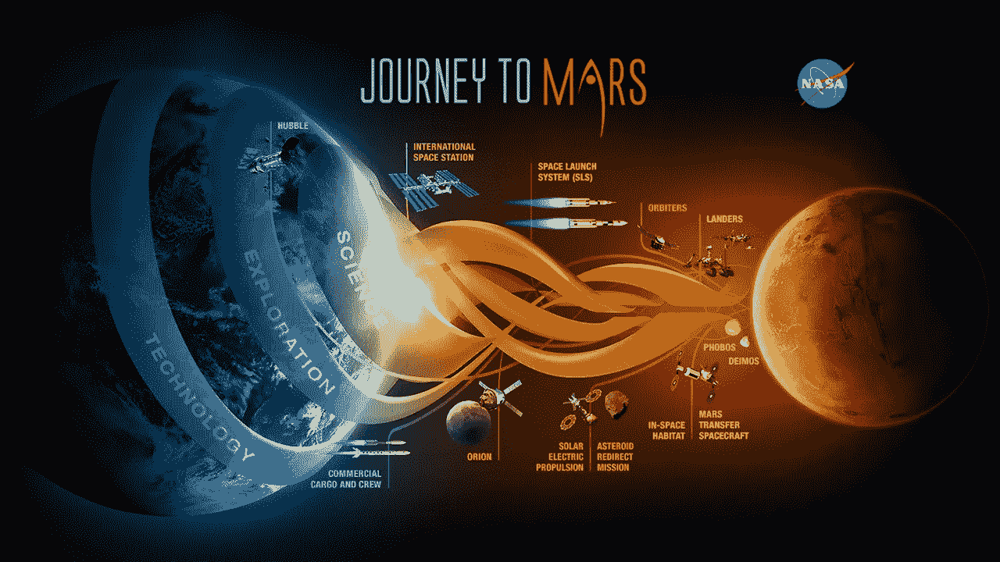
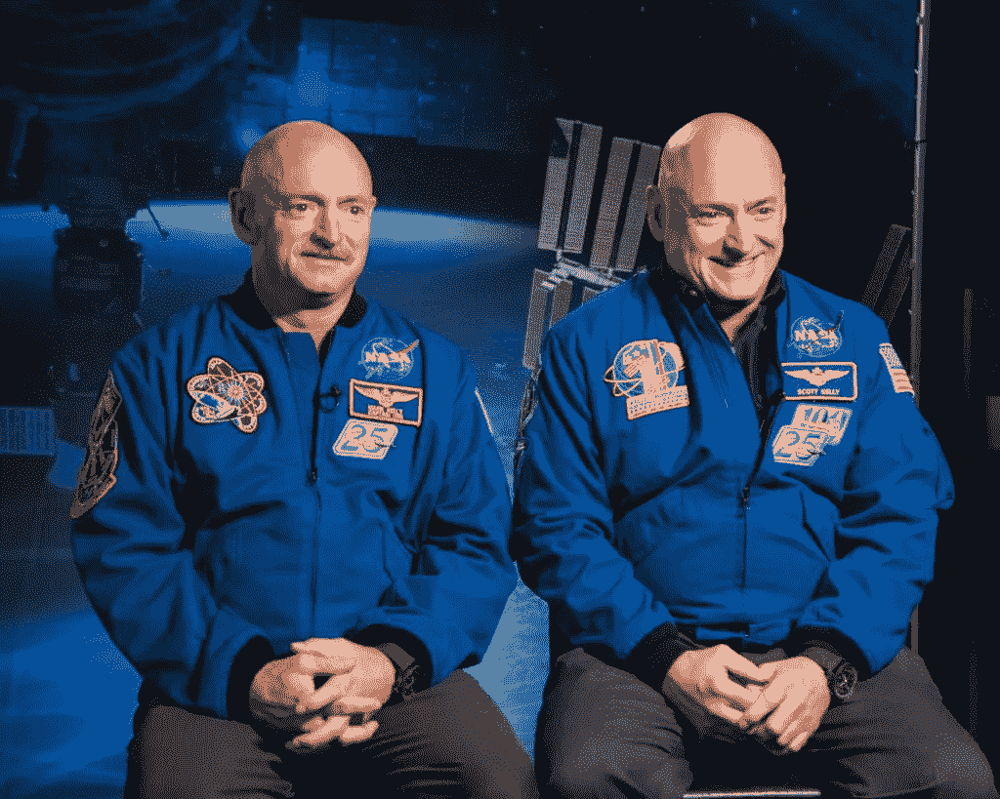
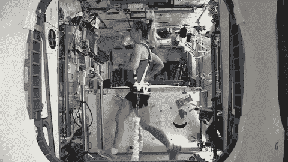
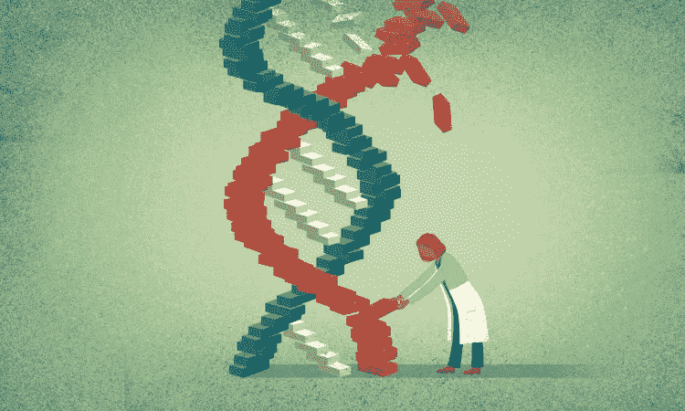
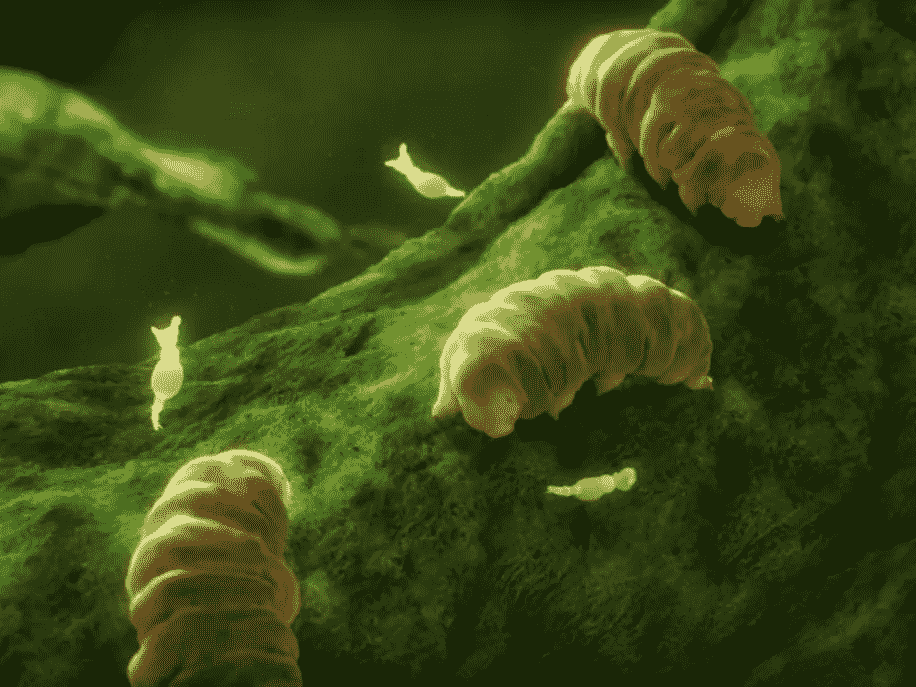
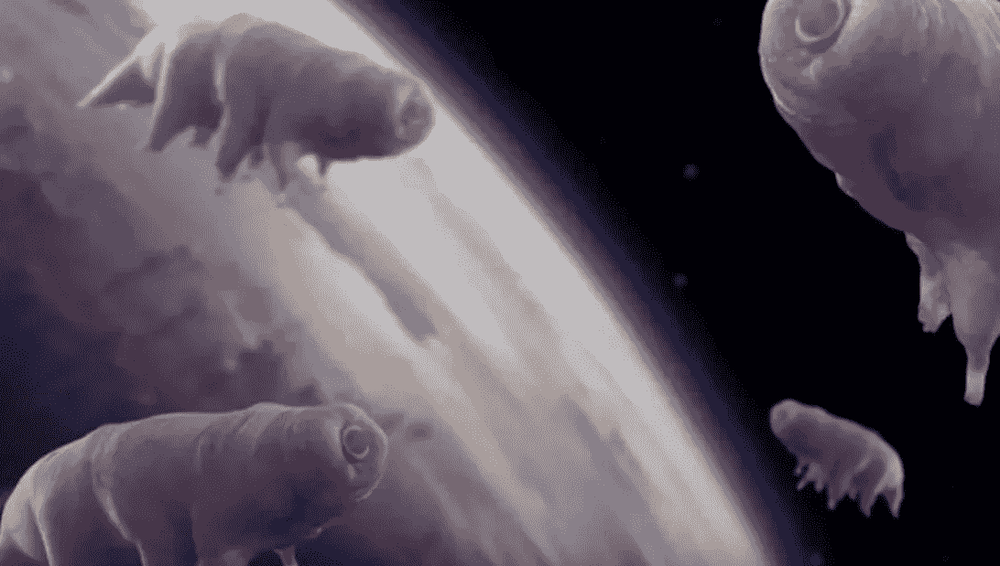
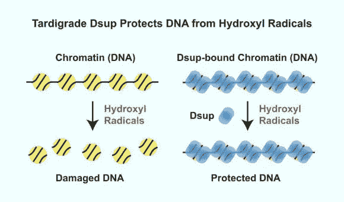
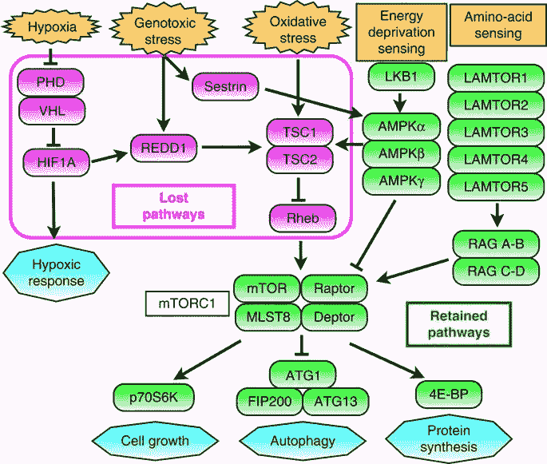
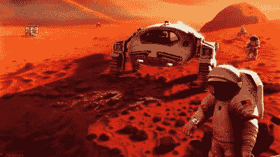

# 宇航员 2.0 英尺。缓步动物+基因编辑)🚀

> 原文：<https://medium.datadriveninvestor.com/astronauts-2-0-ft-tardigrades-gene-editing-f44b75ed18df?source=collection_archive---------0----------------------->

## 利用基因工程减少太空飞行对人类的影响。

Roadmap to Mars 😍(Credit: NASA)

## 十年后人类可能会登上火星！

到 2030 年，美国宇航局的目标是让第一批宇航员登陆红色星球(美国宇航局 2015)。

这将是人类距离地球大约 2 . 55 亿公里的最远旅程。

 [## 流氓基因组编辑扭曲 DNA 伦理|数据驱动的投资者

### 基因组编辑是科学的前沿。这在道德上也是有问题的，在许多方面可能是非法的…

www.datadriveninvestor.com](https://www.datadriveninvestor.com/2019/02/18/rogue-genome-editing-twists-dna-ethics/) 

这也将是 T2 历史上最长的太空飞行之一！

**以下是大概的数字:**

*   **9 个月:🌍➡️火星**
*   **火星 500 天📍**
*   **9 月:火星➡️🌍**

这将是太空探索的一次巨大飞跃，但也有其风险。

# 太空对人体有害。

我们的身体不是为太空生活而设计的。

结果，来自太空环境的力量和严酷的辐射对去过那里的宇航员造成了意想不到的影响。

**这些影响包括:**

*   **骨密度⬇️1%** 在火星上，由于重力不足。相比之下，地球上每年有 1%-1.5%的老年人骨密度下降。
*   **压力等级⬆️** +宇航员所处的封闭+恶劣环境导致免疫系统发生变化。
*   **太空辐射⬆️得癌症的几率。**它还会增加发展退化组织的机会，损害 CNS(中枢神经系统)，以及其他一些意想不到的影响。
*   **⬇️精神健康**，由于隔离和禁闭。

这些只是太空飞行对人体可能产生的一些影响，是通过研究宇航员返回地球后的身体观察到的。

Twins Mark Kelly (left) after a year in Space and Scott Kelly (right) after a year on Earth.

## 2016 年，研究人员对双胞胎宇航员马克和斯科特·凯利进行了研究，以深入了解太空飞行对人体的影响。

他们能够获得新的知识，并验证旧的见解，即火星可能会影响宇航员回国后的健康。

一些🔑调查结果:

*   **斯科特的端粒在太空中加长了！**不过，大部分两天后又缩短了。😮
*   与经历了 6 个月典型飞行的宇航员(马克)相比，在太空飞行一年的宇航员(斯科特)的认知功能并没有明显下降。🎉
*   大约 7%的斯科特基因可能有长期的表达变化。另外 93%恢复了正常。😰
*   还有[其他几个](https://www.space.com/39952-nasa-twin-study-spaceflight-health-effects.html)

总结这些发现和之前的发现，如果我们想去火星或更远的地方，我们需要想出如何保护宇航员免受太空飞行的影响。

# 目前处理这个问题的方法集中在太空任务期间练习健康的习惯。

针对这些效应的其他保护措施包括地球磁气圈和宇航服对国际空间站宇航员的部分辐射防护。

Space exercise. 😎

这些健康的习惯非常简单(我们在地球上也有类似的习惯😉):

1.  **吃得好**🍎
2.  **睡眠充足**😴
3.  **锻炼**🏋️‍♀️

我们需要一个更好的解决方案，因为宇航服+健康的习惯不能解决问题，而且我们没有地球的磁气圈来保护我们免受火星上的辐射。

幸运的是，基因编辑可以改变这一点！

# 我们可以利用基因工程来改变宇航员的身体以适应太空生活！🚀

如果你不熟悉基因工程，它基本上是使用像 **CRISPR Cas-9** 和 **Prime Editing** 这样的工具来编辑基因组的特定部分。

所有生物都有一个基因组(如果你想了解更多关于基因组的知识，请查看我写的[这篇文章](https://medium.com/datadriveninvestor/a-journey-into-the-genome-a6235c8eb81f?source=---------3------------------))。基因组是一个有机体的 DNA 的全序列，🧬又被称为生命的代码。

Gene-editing is like copying and pasting parts of the genetic code. (Credit: TED)

使用 CRISPR Cas-9 和 Prime Editing，**基因工程师可以编辑前往火星(或更远)的宇航员的部分基因组**，以保护他们免受辐射和骨密度损失等影响。💪

# 目前有两种主要的方法来改变宇航员的基因以进行太空旅行。

第一种方法是通过**“表观遗传工程”来改变宇航员**

这并不完全是基因编辑，因为它不涉及对 DNA 序列的任何改变。然而，它是**表观基因组**中的一种遗传工程形式(表观基因组是可以附着在 DNA 上调节基因表达的化学化合物和蛋白质)。

如果基因有一个控制它们是“开”(表达)还是“关”(不表达)的光开关，那么表观遗传工程就会控制这个光开关。

通过表观遗传工程，**工程分子被靶向表观基因组的位点**，改变太空飞行基因的表达。😎

第二种方法是将超级兴奋剂微型动物的 DNA 与人类细胞结合。

这些动物是缓步动物或水熊🐻他们有超能力！

# 缓步动物是地球上最坚不可摧的生物！

Tardigrades 😍

有超过 1000 种缓步动物。

它们生活在世界各地的苔藓、地衣、土壤、海滩和其他潮湿的栖息地。🌊

这些生活在水中的微型动物只能长到大约 **0.5 毫米**，并且被发现是**唯一能活到太阳灭亡的生物。**🤯

如果这还不够酷，它们也可以在没有食物和水的情况下存活长达 30 年！

整整 30 年！

它们还能忍受深海的极端温度和太空的冰冻真空。它们甚至可以承受高达 150 摄氏度的高温。🥶

Space tardigrades 👽

如果我们能够将他们的超能力 DNA 与人类细胞结合起来，那么我们就有希望在我们想要送往太空的宇航员身上解锁类似的超能力。⚡

这可以使宇航员抵抗严酷的辐射，极端的温度和其他有害的影响。

这将彻底改变太空旅行！

为了让缓步动物变得更酷(是的，这是可能的)，它们也给了我们生命可以存在于其他星球的希望！

事实上，人们认为现在月球上可能有缓步动物。但那是以后的事了。

> **“人生总会有办法的。—《侏罗纪公园》**

它是🕐深入研究缓步动物的基因组！⬇️

# 表达 Dsup 蛋白可以保护人类细胞免受 X 射线诱导的辐射。

[这篇研究论文](https://www.nature.com/articles/ncomms12808)分解了缓步动物的基因组，并在人类细胞中使用它们的 DNA 进行实验。

一项发现是，在缓步动物细胞中， **Dsup 蛋白**抑制了 DNA 损伤，可能对人类细胞也有同样的作用。

Dsup 蛋白是缓步动物特有的。这是一种**“损害抑制”**蛋白质，它本质上**结合并形成一层保护云来抵御生存威胁**(如辐射)。

The magical protein that protects tardigrades.

这一假设在 X 射线的辐射压力下得到检验。

这些实验的结论是**在人类培养细胞中使用缓步 DNA 可以抑制辐射的影响。**🎉

如果使用缓步动物的 DNA 并表达与缓步动物相似的基因可以保护人类细胞免受辐射，这是朝着改变宇航员进行太空飞行的可能性迈出的一大步。

在这些很酷的实验中，有一项关于缓步动物选择性丧失压力反应信号通路的研究。

## 缓步动物选择性地失去了它们压力反应信号通路中的一个互联网络。

在这个网络中的八个基因中，有三个是用来调节对缺氧反应的中心成分:***HIF1A**PHD*和 *VHL。***

缓步动物缺乏信号成分来连接各种压力，如氧化压力和缺氧。

这种互连网络的八个基因的选择性丢失**介导环境压力刺激**下调 mTORC1 蛋白，使缓步动物获得了一些超能力，可以继续在不利的条件下生活(下面的品红色基因)。

参与**感知和思考心理需求**的保留基因和组件仍然存在于它们的基因组中(下面绿色的基因)。

This diagram shows the lost pathways and remaining genes + components for down regulating the mTORC1 protein (Credit: Nature).

另一项发现表明，来自 **MRE11 基因家族**的基因表达可能有利于修复受损的 DNA。

这是缓步动物在脱水状态下生存的超能力的一个贡献者。

本文的研究证明了缓步动物的 DNA 可以用于人类培养的细胞，并对赋予缓步动物生存能力的基因提出了新的理解。

# 🔑外卖食品

*   **太空飞行对人体有害。**
*   **利用基因工程和 CRISPR Cas-9 等工具可以保护宇航员免受太空旅行中恶劣条件的影响。**
*   **表观遗传工程是针对表观基因组中的特定位点来调节某些基因的表达。**
*   缓步动物是地球上最不可摧毁的生物。
*   **将缓步动物的 DNA 与人类细胞结合有助于保护这些细胞免受辐射等生存威胁。**
*   MRE11 基因家族可能有助于修复受损的 DNA。
*   **Dsup 蛋白是一种独特的损伤抑制蛋白，保护缓步动物免受生存威胁。**
*   **缓步动物选择性地失去了应激反应信号通路，从而下调了 mTORC1 蛋白。这有助于他们在恶劣环境中生存。**

# 对缓步动物神奇基因组的进一步研究和对人类细胞的实验将有助于创造适合火星的人类。

然而，还有很长的路要走。

在水熊、基因编辑工具和热衷于太空探索的研究人员的帮助下，这有可能在未来十年内实现！🚀

正好赶上 2030 年登陆红色星球。😉

如果这行得通，对于去火星的宇航员来说，太空将是一个安全得多的地方，将来甚至可能是你。

(Credit: Fox News)

非常感谢您阅读这篇文章！💙

👋我是阿达拉！一个 16 岁的有抱负的植物遗传学家、遗传工程师、海洋生物学家和宇航员。我非常热衷于使用基因编辑工具等新兴技术来帮助解决一些世界上最紧迫的问题。

如果你喜欢这篇文章，你可以关注我的[媒体](https://medium.com/@astronautadara)来获取关于遗传学、太空和其他酷技术的文章。

要继续我的旅程，你可以在 [Linkedin](https://www.linkedin.com/in/adara-hagman-78a563171/) 和 [Twitter 上找到我。](https://twitter.com/astro_adara)

这就是我今天的全部内容。现在我该去我的实验室做一个基因编辑项目了。😉

下次见！

✌️Dara