# 天文天网

> 原文：<https://medium.datadriveninvestor.com/astronomical-skynet-8a65b7fcb34c?source=collection_archive---------15----------------------->

[](http://www.track.datadriveninvestor.com/1B9E)

## 分析我们可观测宇宙的可观测数据，一次一个时期。

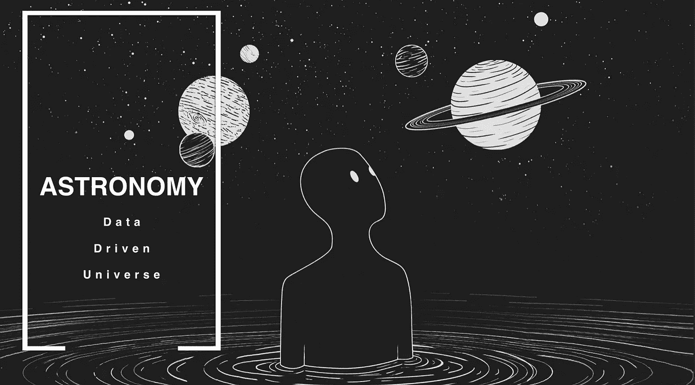

[‘The Koxx — A Fool Moon Night](https://genius.com/The-koxx-a-fool-moon-night-lyrics)’ cover

> 不…不是我们热爱的基于神经网络的人工智能。但有些不同。

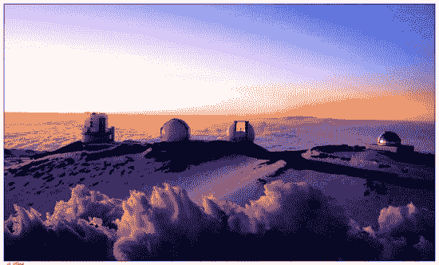

Mauna Kea Observatories in Big Island, HI Credit: [brookfieldhawaii](http://www.brookfieldhawaii.com/big-island-activities/stargazing-on-the-big-island-of-hawaii/)

十几岁时，我住在夏威夷，有机会探索夏威夷大岛的莫纳克亚天文台，这是一个位于 13，796 英尺山顶的天文设施。在海平面下测量，它高达 33，500 英尺，比珠穆朗玛峰高近一英里。它是观测恒星的中心枢纽。字面上。超过 12 个设施，在一个地方安装了 13 台望远镜。夏威夷还倡导黑暗天空环境，通过用现代 led 取代路灯中的低压钠灯来减少光污染，强制执行法案以保持对其天文台的完美观察。这使得夏威夷的夜晚呈现出标志性的黄绿色。

> 所以，是的，天文学在这里是一件大事。

这让我追求一个将深度学习和天文学联系在一起的想法，我想通过互联网传播我的想法和激情。

我的研究包括整合神经网络来学习和分类光谱数据。在这个故事中，我将在近地小行星上进行宣传，在小行星上进行光谱学研究可以让我们通过使用 Bus-DeMeos 分类法关键字来分析小行星的成分。

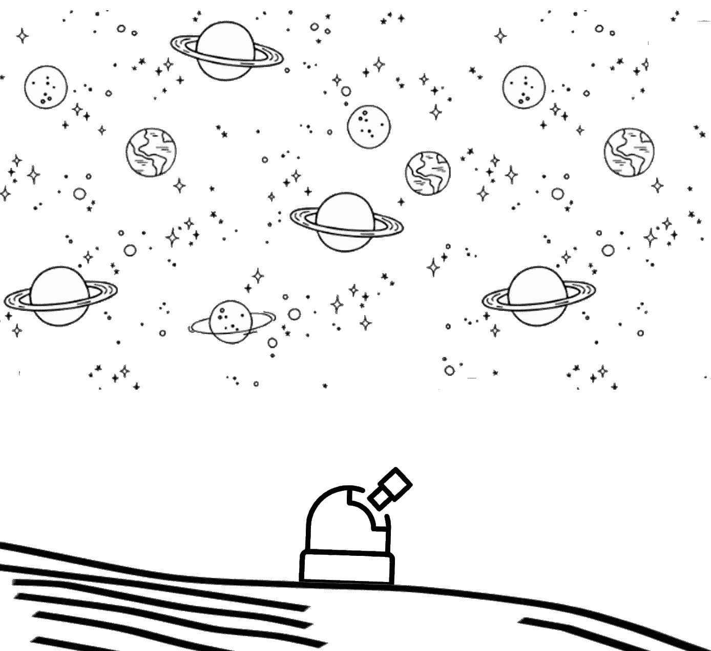

# 数据与宇宙相遇

人工智能正在影响我们周围的一切，小到生物细胞的微小碎片，大到我们所在的庞大星系，值得一提的是，我们正处于一个技术时代，我们可以教会机器学习我们周围的一切。虽然我们主要将人工智能集中在机器人、医疗保健和社交媒体等应用上，但最被低估的应用之一是天文学……它目前在科学上处于“数据爆炸”阶段。

> **天网**机器人望远镜网络托管超过**12，103，177张图像，任何地方的研究人员、教育工作者和学生都可以访问。它将全球 19 个天文台连接成一个单一的网络应用程序。[https://skynet.unc.edu/](https://skynet.unc.edu/)**

> 1200 多万张图片。这是大量的空间数据。

这些不仅仅是我们夜空的“照片”，天文数据可以是光谱，测量宇宙周围天体电磁辐射光谱的数据。这些类型的数据可以是光学、红外和无线电干涉仪的形式。这些数据的重要性有助于我们了解物体的成分、温度、密度、质量，甚至距离。

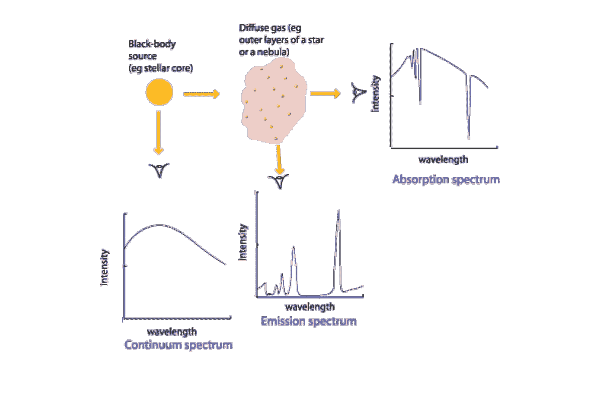

Here’s a visual representation of astronomical spectroscopy. Credits to [Australia Telescope National Facilit](http://www.atnf.csiro.au/outreach/education/senior/astrophysics/spectra_astro_types.html)y

天网机器人望远镜网络并不是唯一的空间数据托管网站。美国宇航局的系外行星档案馆和 T2 的斯隆数字巡天提供免费的、全球可访问的数据供公众使用。只需点击一个按钮，你就可以开始探索超过**1000 万个天体数据**。请确保您的计算机上有足够的硬盘空间:)

# 任何人都可以成为天文学家

> 你只需要一个 t̶e̶l̶e̶s̶c̶o̶p̶e̶。计算机和求知欲

## 经典的一石二鸟。|数据科学天文学|


也就是说，人工智能技术必须达到一个顶峰，任何人都可以在家里构建天网。(对，我指的是那个邪恶的基于神经网络的人工智能机器人。)机器学习最容易入门的是 Google 的 Colab，这是一个用 Python 进行机器学习教育和研究的研究工具。它根本不需要安装或设置，因为一切都托管在谷歌的服务器上。它甚至提出使用他们的服务器 CPU 和可选的 GPU 免费计算你的任何数据。它集成了 Tensorflow 和 Keras，这是一个简化神经网络的深度学习库，以及其他几个有用的库，如 Matplotlib，一个数据可视化工具，可以帮助直观地查看您的数据。因为是谷歌，所有东西都保存在你的账户上，只要你有互联网连接和网络浏览器，你就可以编码。

由于互联网上有许多免费的开放天文学数据，最受欢迎和最庞大的是 SDS ( [斯隆数字天空](https://www.sdss.org/))。它们包含各种各样的多色图像和光谱，您可以使用它们进行探索。不可观察的宇宙实际上是你的极限。你需要的只是一个想法和编码的意愿。或许你可以发现我们银河系中的秘密模式。

# 人工智能方法

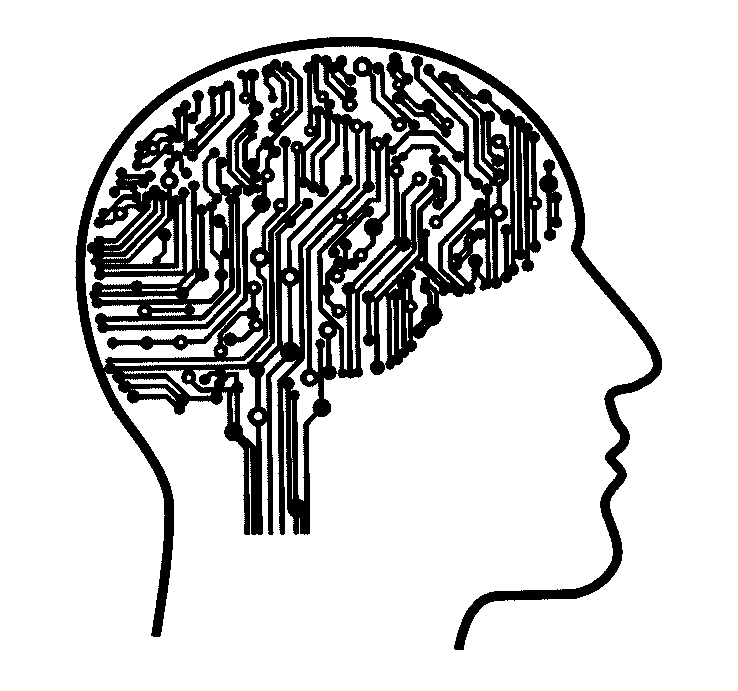

此外，宇宙正在膨胀…它提供给我们的潜在数据也一定在膨胀。虽然我们还没有到亲眼目睹宇宙膨胀的阶段，但我们正处于天文学中数据不可避免地激增的阶段，具体来说，就是每天 100TB 以上的数据激增。我们根本无法手动观察和分析所有万亿字节。

## 这就是机器学习的用武之地。

一个人工神经网络。是的，你已经知道它的发展方向…数据科学市场上最受欢迎的机器学习模型。将生物神经网络复制成代码。有超过[数百篇研究论文](https://arxiv.org/search/?query=neural+network+astronomy&searchtype=all&source=header&start=50)展示了天文学神经网络集成的有希望的结果。使用简单的前馈网络预测潜在的外星植物，使用卷积网络对多种类型的星系进行分类，甚至使用生成对抗网络来生成或恢复我们宇宙中天体的退化图像。任何追求天文学的人都应该学习如何编码，甚至更好的是，将机器学习集成到他们的研究中。对于今天的天文学家来说，Python 是一个完美的工具(除了望远镜之外)。也许 HAL 9000 比我们想象的要快…

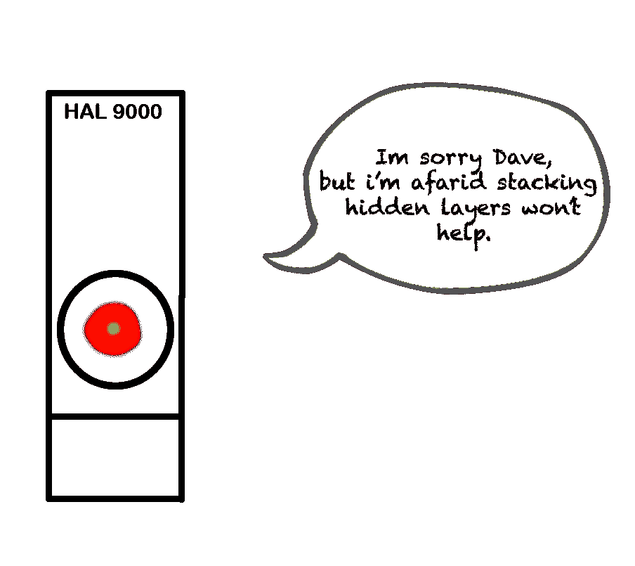

Let’s hope Elon Musk’s openAI has a solution to AI overtake in space exploration

# NASA 的 OSIRIS-REx 任务是数据科学的潜在功能！

还记得天文光谱学吗？为什么不做一个学习光谱学的 AI？！

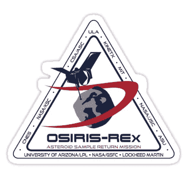

如果你没有及时了解太空新闻，一个新的突破即将发生。美国国家航空航天局的 OSIRIS-REx 宇宙飞船终于绕着一颗碳质近地小行星贝努鸟运行。其主要目的是获取至少 60 克的样本，并将其带回地球，以进一步研究小行星。现在，这个任务和机器学习有什么联系呢？三个字。小行星成分预测。我在这里谈论天文学中许多机器学习应用中的一个，特别是这个，因为它与我目前正在进行的人工智能和天文学研究有关。

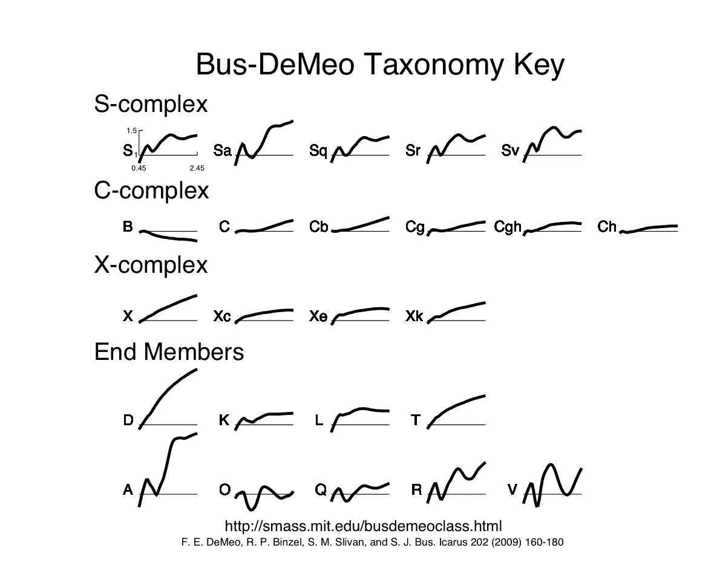

Bus-Demeo Taxonomy key to classifying asteroid compositions

你不需要记住太多。只要知道不同的波长对应着各自的 S(石质)、C(碳质)、X(金属性)、E(其他)成分类别。我们可以通过观察摄谱仪中出现的这些数据模式来对小行星进行分类。SMASS( [小主带小行星光谱巡天](http://smass.mit.edu/smass.html))和 SDS ( [斯隆数字天空](https://www.sdss.org/))提供了数以千计的分类小行星、它们的类别及其光谱数据。所有这些都可以输入神经网络，对望远镜发现的新小行星进行分类。我很确定我们将会有智能星际飞船，它具有智能小行星采矿功能，可以收集宝贵的资源来继续星际旅行…

还在迷茫？我们可以将这个简单的深度学习概念视为“音频分类”神经网络模型。

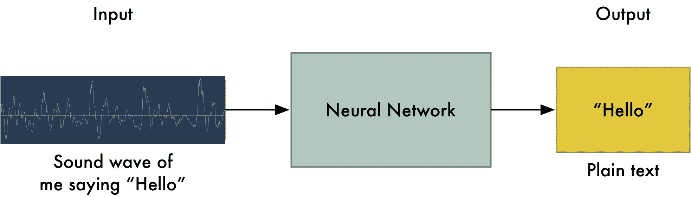

Here’s a fun [medium](https://medium.com/@ageitgey/machine-learning-is-fun-part-6-how-to-do-speech-recognition-with-deep-learning-28293c162f7a) story about this :)

我只是在教一个神经网络在某个时间段学习波长。根据它的模式，它知道“波”在传达什么。但是，我不是测量时间的声音频率，而是测量超过百万分之一克(g)的波反射率。这种微观的波传达了一个超过一百万英里外的太空中的巨大的 T2 岩石的成分。

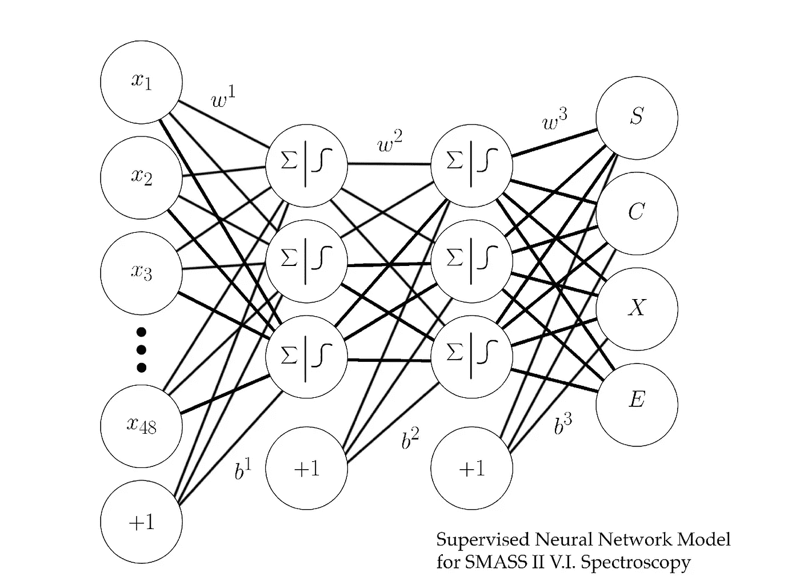

这是我的原型神经网络模型的一个简单的 3 层。

我将简要介绍一下代码部分。

**收集数据**

*   TrainX 是每个小行星的 49 个反射光谱值。
*   TrainY 是每个小行星的组成类。

```
trainX = train[:, 3:] #respective reflectance values
trainY = train[:,2] #label (composition type) of each asteroids in training settestX = test[:, 3:] #respective reflectance values
testY = test[:,2] #label (composition type) of each asteroids
```

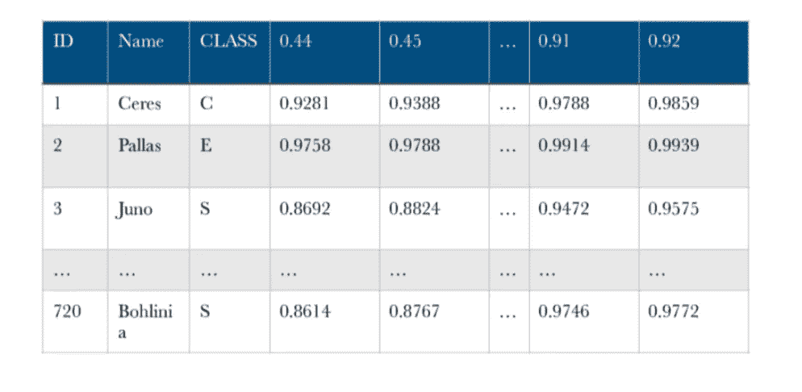

Figure 1 — MIT SMASS Custom Dataset I’ve built. 70% of 1341 Asteoirds used for training my model

这是我为光谱数据定制的数据库。现在，我不能简单地将 1341 颗小行星粘贴到这个博客中，但这里有一个简单的大纲。在图 1 中，有超过 720 排独特的小行星。每行包含一颗小行星、它们的类别和所有 92 个波长值。此数据集将用于训练我的模型。

你可以下载官方的 MIT SMASS-2 数据集，用和我相似的格式重新配置模型。我抓住了样条拟合值，因为它使我的模型更容易读取输入数据

[http://smass.mit.edu/data/smass/smass2/](http://smass.mit.edu/data/smass/smass2/)

**构建模型**

```
#Supervised Neural Network model. 3 Layers.
model = tf.keras.Sequential()model.add(tf.keras.layers.Dense(46, activation='relu')) #relu layermodel.add(tf.keras.layers.Dense(46, activation='relu')) #relu layermodel.add(tf.keras.layers.Dense(4, activation='softmax')) #softmax layer for predicitonmodel.compile(tf.train.AdamOptimizer(0.001),              loss='categorical_crossentropy', metrics=['accuracy'])
```

然后，我构建了一个简单的三层监督网络。我对隐藏层使用 relu，对输出层使用 softmax，因为它非常适合简单的多分类模型

**使用 MatPlotLib 的模型和数据可视化的性能**

```
history = model.fit(trainX, trainY, epochs=200, batch_size=46,          validation_data=(testX, testY))plt.plot(history.history['acc'])
plt.plot(history.history['val_acc'])
plt.title('Model Accuracy')
plt.ylabel('accuracy')plt.xlabel('epoch')
plt.legend(['train', 'test'], loc='upper left')
plt.show() plt.plot(history.history['loss'])
plt.plot(history.history['val_loss'])
plt.title('model loss')
plt.ylabel('loss')
plt.xlabel('epoch')
plt.legend(['train', 'test'], loc='upper left')plt.show()
```

它学习超过 1000+标记的小行星，并基于光谱学输出 S、C、X、E 小行星类别。

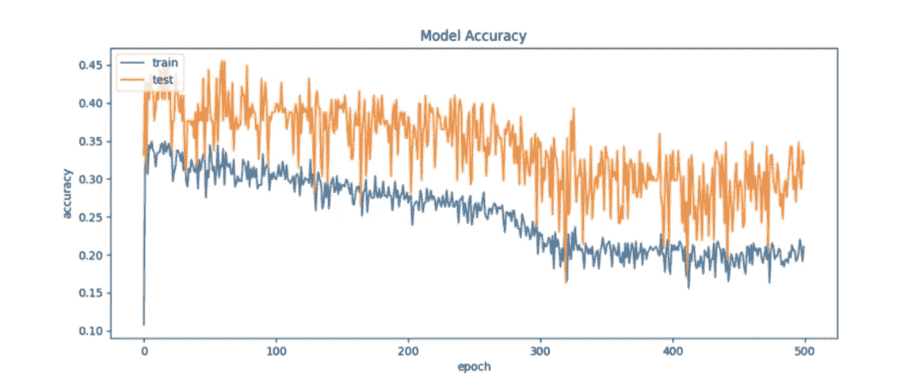

**结果结论**

该初步数据显示了 uhhh… *结果*。这可能不是最好的，也不是最差的，但它确实有效。我的简单模型能够达到 45%的准确率

> **不管结果有多糟糕，我会稳定地配置我的模型，直到它达到最好！**

****进一步研究****

**光谱神经网络是可能的。大多数神经网络用于图像分类或文本生成。我构建了一个简单的原型，它可以根据模式趋势预测波长。现在，我正在*构建一个更新的神经网络模型，以生成更高精度的结果，也许在那之后……使用基于红外而不是光学的斯隆数字巡天为 **100，000+** 近地天体构建一个新的神经模型。***

****

**the classic elevator pitch**

**不管怎样，这是我项目的一个简短的电梯推介。你现在有任何潜在的天文学人工智能项目吗？下面评论！通过查找天文学研究论文、太空探索甚至 Kaggle 竞赛来了解更多信息，以帮助您将您的想法融入人工智能和天文学。**

# **包裹**

**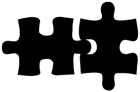**

**Connecting my ideas together**

**最后，人工智能在天文学上留下了印记。它被用来分类、预测和生成我们所爱的星系中的物体，使我们比以前更加了解我们的宇宙。天文学每天都在产生新的东西，允许数据科学家探索一个永无止境的沙箱。美国宇航局 OSIRIS-REx 的新任务给了我们机器学习可以对天文学做什么的潜在想法。多亏了地球上的观测站，我们就不会有如此庞大的数据集来帮助我们巩固数据科学的进步。由于人工智能研究人员正在努力使深度学习更加优化和强大，天文学将成为测试新人工智能技术和发现我们宇宙秘密的游乐场。**

> **让我们推动数据驱动的宇宙向前发展。**

***我是一名鼓舞人心的计算机科学家，写关于技术和科学的任何东西！***