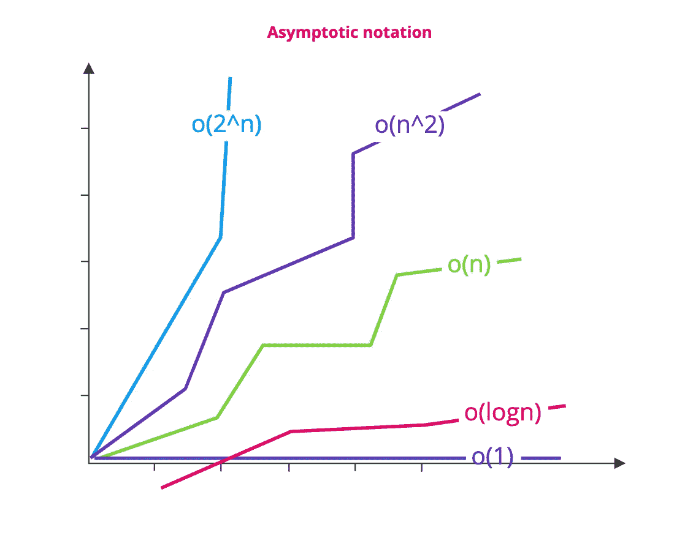
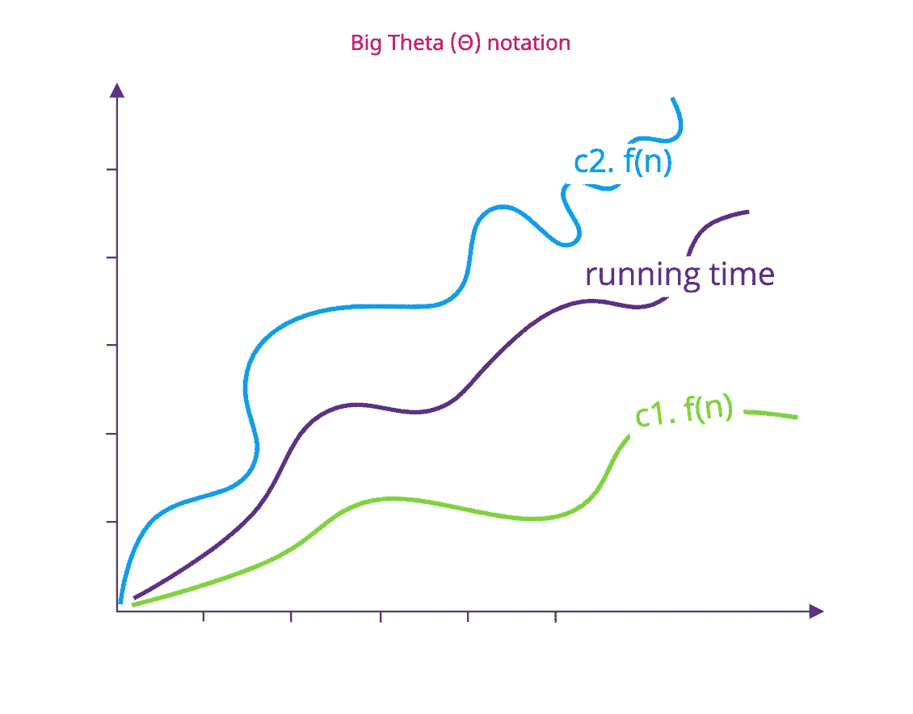
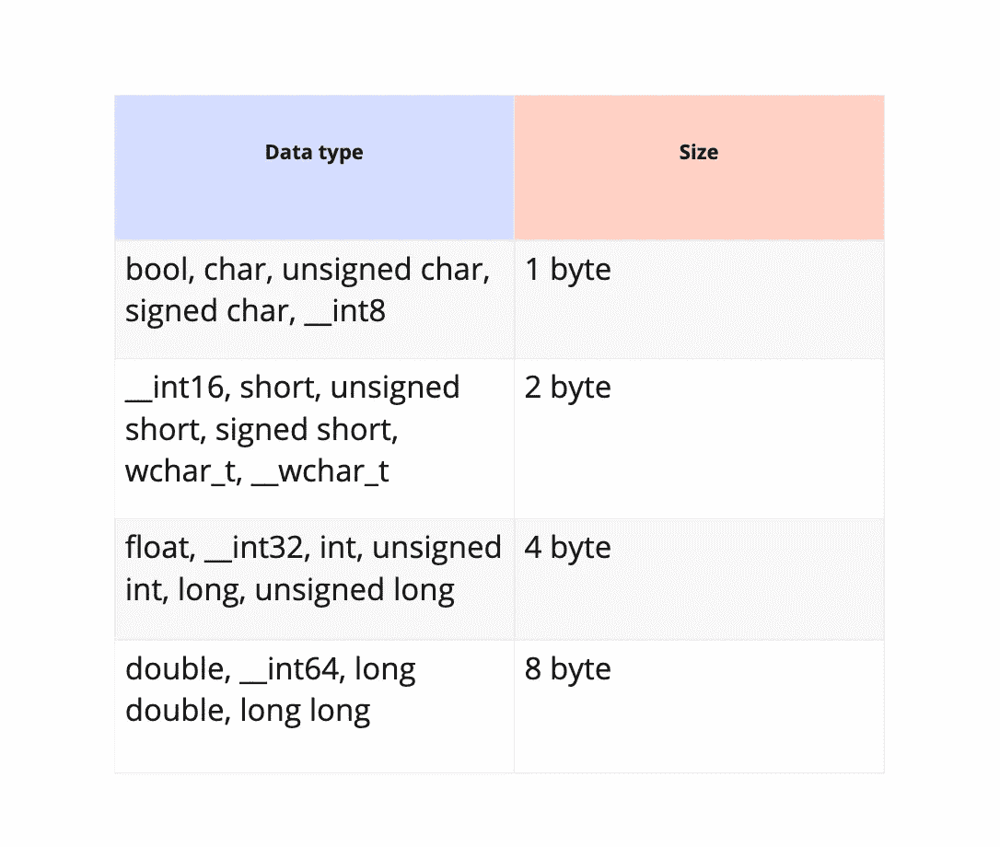

# 渐近符号和算法复杂性

> 原文：<https://medium.datadriveninvestor.com/asymptotic-annotation-and-algorithm-complexity-8825eec87d24?source=collection_archive---------3----------------------->

在本文中，我们将试图理解如何衡量任何算法的性能，我们所说的算法的复杂性是指什么，以及我们需要关注的因素。

在我们开始讨论分为两种类型(**时间复杂度**和**空间复杂度**的**算法复杂度**之前，我们需要先讨论一下**渐近符号**项。



渐近符号类似于标准符号，可以用来表示算法符号。

[](https://www.datadriveninvestor.com/2019/03/22/the-seductive-business-logic-of-algorithms/) [## 算法诱人的商业逻辑|数据驱动的投资者

### 某些机器行为总是让我感到惊讶。我对他们从自己的成就中学习的能力感到惊讶…

www.datadriveninvestor.com](https://www.datadriveninvestor.com/2019/03/22/the-seductive-business-logic-of-algorithms/) 

但这并不能说明什么，对吗？！

好吧，让我们试试这个

术语**渐近**有点像接近一个数字或值，这就是为什么我们用它来表示算法复杂性，因为我们不能用一个精确的数字或值来表示复杂性。

这就是为什么在渐近符号中，我们在大多数情况下只关心表示复杂性的方程的最高次数(是的，算法复杂性是用方程表示的，而不是用值或数表示)，而我们忽略其他次数和常数因子，以获得方程复杂性增长的渐近行为。

例如，如果我们讨论算法的时间复杂度，我们将其定义为二次方程 T(n) = 4n +3n+4，其中(n)是元素的数量。

所以对于较大的 n(比如 2000)，我们可以忽略 3n+4 (6004)相对于 4n (16000000)的值，而且因为我们讲的是一个渐近方程，我们会忽略因子(4)，值会是(4000000)，所以时间复杂度会趋近于 n 更易管理。

在上图中，你可以看到代表(n)的紫色曲线的增长比代表(n)的绿色曲线快，这让我们清楚了渐近记数法的概念。

# 渐近符号的类型:-

*   **大哦(O)**

大 Oh 代表可能发生的最坏情况，这意味着这个算法的复杂度不能超过 O(n)的值

换句话说，对于任何数量的输入，函数都不会超过某个时间。

*   **大ω(ω)**

大ω代表可能发生的最好情况，这意味着该算法的复杂度不会小于ω(n)的值

换句话说，这个函数至少需要这个时间来完成它的执行。

*   **大θ(θ):**

大θ表示算法复杂度的最坏情况和最好情况之间可以达到的平均值，所以ω(n)≤θ(n)**≤**O(n)

f(n)值将总是在 c1g(n)和 c2g(n)之间，其中 c1，c2 为常数



例如:-

如果我们有一个包含 n 个元素的数组，并且我们想要搜索一个特定的元素，那么我们必须遍历数组元素，并将数组中的每个元素与所需的值进行比较。

用ω(n)表示的最佳情况是常数“1”，这意味着第一个元素是必需的元素。

最坏的情况，用 O(n)表示，将是“n ”,这意味着最后一个元素是所需的元素，我们可以看到复杂性将受到数组中元素数量的影响。

用θ(n)表示的平均情况可以是 1(**)ω(n)**)和 n ( **O(n)** )之间的任何值

# 算法复杂性

现在，我们将开始讨论算法复杂性，它是什么？它的好处是什么？

算法复杂度可以分为两段“**时间复杂度**和“**空间复杂度**”。

知道任何算法复杂度的好处是，我们可以通过测量它的时间复杂度和空间复杂度来衡量任何算法的性能。

现在，我将试着把时间复杂性和空间复杂性这两个术语讲清楚。

*   **时间复杂度:-**

我们可以将**时间复杂度**定义为算法在执行期间直到生成输出所需的时间量。

时间复杂度受算法求解问题的步骤数影响，用大 Oh 渐近记法表示，表示该算法可能发生的最坏情况。

**我们如何度量时间复杂度？**

我们使用大 Oh 渐近符号，这意味着我们只关心算法方程的最高次，而忽略其他次和常数，因为我们关心可能发生的最坏情况。

此外，当我们度量时间复杂度时，我们关心表示算法的语句的数量。

让我们看一些例子

*   如果代码是:-

```
statement;
```

O(n)是常数，即 1，这里时间复杂度不受元素数量的影响

*   如果代码是:-

```
for(i=0;i<n;i++){
  statement;
}
```

O(n)是 n，因为我们循环语句 n 次。在这里，时间复杂度会受到元素数量的影响。

*   如果代码是:-

```
for(i=0;i<n;i++){
 for(j=0;j<n;j++){
   statement;
 }
}
```

O(n)是 n，也就是(n*n)，我们在内部循环中执行语句 n 次，在外部循环中执行 n 次，所以语句执行 n*n 次

*   **空间复杂度:-**

空间复杂度意味着算法需要的内存位置的数量。

该算法需要内存空间有三个原因

1-其**变量和常量的值**。

2-它的**指令**表示代码的编译版本。

3- **环境栈，**这意味着如果我们有嵌套的函数或算法，外部的算法或函数变量将被临时推送到系统栈，直到内部的算法或函数首先被执行和完成。

我们在计算任何算法的空间复杂度时，都忽略了第二个和第三个原因，只关心代码中的变量和常量在内存中所占的空间。

下表显示了每种类型的数据在内存中占用的空间(以字节为单位)



**我们如何测量空间的复杂性？**

请看下面的代码:-

```
{
    int z = a + b + c;
    return(z);
}
```

它有 4 个 int 类型的变量，每个变量使用 4 个字节
，因此这段代码使用 4*4+4 = 20 个字节的内存
，其中额外的 4 个字节用于返回语句
，因此我们可以将空间复杂度表示为以下形式 **4*n+4**
，其中(n)是变量的数量。

接下来:[搜索算法(线性和非线性)](https://medium.com/datadriveninvestor/search-algorithms-linear-and-non-linear-739de13ceaf8)

先前:[数据结构和算法](https://medium.com/datadriveninvestor/data-structure-and-algorithms-96127cc1b09f)