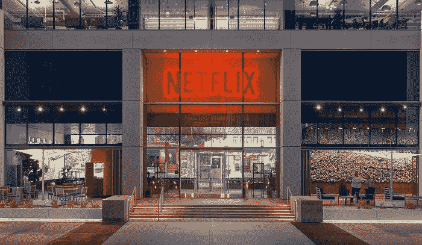

# 美国电话电报公司重组沃纳媒体部队，准备与网飞进行一场大战

> 原文：<https://medium.datadriveninvestor.com/at-t-reorganizes-warnermedia-forces-for-a-big-battle-with-netflix-e6c43e667137?source=collection_archive---------31----------------------->

## **和迪斯尼。还有苹果。所有人。**

上帝啊。尘埃落定之后会留下什么？不用说，你必须生活在岩石下，才不会知道现在正在进行一场视频流战争，当我们与在线媒体娱乐之王网飞在一座非常大的媒体山的山顶交谈时，枪声正在燃烧。但是，老实说…网飞可能*而不是*想在这一点上站出来。

# 美国电话电报公司目前正在为品牌定位做准备

我们在谈论裁员。成本削减。这发生在 HBO 前总裁理查德·普莱普勒(Richard Plepler)和前特纳广播公司总裁大卫·利维(David Levy)正式辞去公司职务之后。

现在，如果你认为美国电话电报公司在这方面是刚从新兵训练营出来的，你错了:该公司刚刚从另一场*战争中脱颖而出，以**850 亿**美元收购时代华纳，反对上诉法院挑战该出价。解决了这个问题后，他们现在准备将这笔投资变成 ROI 榴弹发射器，因为他们将一些节省下来的资金重新投资于媒体流—*

没错:HBO 将正式全面推出媒体订阅服务，正如你所知，这是最近技术领域的趋势，尤其是苹果公司。你看到墙上的字了吗？这可能会让霍比特人的四军之战相形见绌。

# 当然，网飞在这一点上并不太担心

他们真的不应该。还没有。毕竟，流媒体巨头拥有 1.5 亿庞大的用户群，对好莱坞电视和电影也有很大的影响力，这一点从它在奥斯卡上的影响力可以看出。但是不要排除其他一些重量级人物，比如迪士尼。

当然，媒体巨兽为 21 世纪福克斯支付了 710 亿美元，这意味着网飞的“前”竞争对手 Hulu 现在有了一些增强的肌肉来配合迪士尼自己的流媒体服务，该服务将提供一些摇滚原创节目来与网飞正面交锋。你见过比那*更奇怪的事情*吗？当然不是。这是一个漫长的过程。

# 不过，还是那句话——绝对不要在 T 点出局

想想看:我们已经和这家公司有了类似于**汉娜-巴贝拉**和**鲁尼曲调**的特许经营权。随着大量广告和代销商销售的整合，华纳媒体现在受到 AT & T 的支持，可能不仅会争夺网飞的钱，还会争夺迪士尼和苹果的钱，嗯，还有你们的钱。

只能有一个。除非你是个媒体狂，而且不介意有多个账号。对此你怎么看？注册一个 VIGYAA 账户，开始写下你对即将到来的流媒体战争的看法。

【vigyaa.com】最初发表于**。**