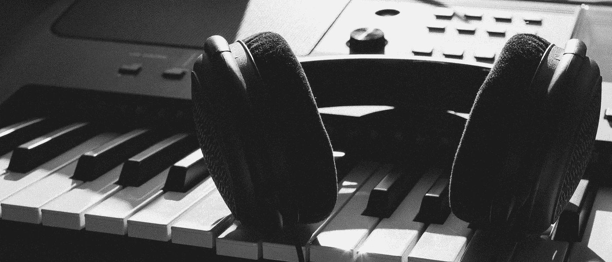

# 音乐制作人在什么时候会对制作音乐的人工智能感到恐惧？

> 原文：<https://medium.datadriveninvestor.com/at-what-point-do-music-producers-freak-out-about-music-making-ai-541140506ceb?source=collection_archive---------3----------------------->

小时候，我喜欢科幻小说。我版本的恶魔是天网，终结者，或者是众多被编程用来消灭生命的无情电影机器中的一个。尽管有童年的恐惧，我还是设法熬到了成年。但是现在，我童年时对没有感情的机器的恐惧又回来了。

去年，CNN Money 发表了一篇题为“[人气 YouTube 艺人用 AI 录制新专辑](http://money.cnn.com/2017/08/21/technology/future/taryn-southern-ai-music/index.html)”的文章，详细介绍了美国偶像校友塔瑞安·扫森的革命歌曲制作过程。

*“Southern 只有基本的钢琴技巧，所以她求助于节目来传递歌曲的器乐部分。人工智能开发了和声、和弦和序列。”*

当我读到这句话的时候，我的内心感到一阵恐慌。Taryn 是 2004 年美国偶像的参赛者，她与制作音乐初创公司 Amper Music 开发的人工智能软件合作，创作了她即将推出的专辑单曲“Break Free”的底层音乐。事实上，艾将成为她整张专辑《我是艾》的制作基础。

在文章中，Taryn 支持与人工智能平台合作的好处:*“以一种有趣的方式，我有了一个新的写歌伙伴，他不会累，并且拥有无穷无尽的音乐制作知识*……。她还说，现在创作歌曲结构的速度是依靠人类音乐家的 20 倍。

这种轻微的慌乱升级为全面的锤击心悸。首先，这首单曲赢得了一些评论家的认可，包括音乐和技术爱好者，他们一直睁大渴望的眼睛关注着这种未来主义的合作。

我漫不经心地把那篇文章扔进了浏览器的书签空白区，直到我遇到了另一位记者，他在探讨音乐、人和机器之间不断发展的关系。

《花花公子》2017 年 9/10 月音乐刊也专门用了一些笔墨来探讨音乐和 AI 的主题。作家亚伦·卡恩斯(Aaron Carnes)利用他的新闻技巧，带领读者穿越音乐制作人工智能的动物园，与该行业新旧顶尖创新者对话，并在此过程中采样当今的音乐创作机器人。

Carnes 参观了谷歌的旧金山总部，查看了 Project Magenta，“这是一个开源项目，使用人工智能和机器学习为艺术家创造工具。”他与 Magenta 的工程师团队一起参加了一个即兴演奏会，他们身兼音乐家和一个不太可能的乐队成员，一个名为 A.I. Duet 的平台。音乐人输入旋律短语，Duet 在分析的基础上处理这些短语，然后吐出新的短语。

“我们想出的还不错，但我对人工智能二重唱的低音线印象更深。*音乐家们经常缺乏新鲜的想法，而这个节目似乎是源源不断地提供这些想法的完美选择，”卡恩斯说。*

卡恩斯的文章阐述了兴趣从学术界向商业的转移，好奇的技术玩家支持音乐人工智能研究。许多初创公司和老牌巨头要么在创造人工智能，要么在投资人工智能，要么在专注地观察那些正在这样做的人。

例如，他详细阐述了 Jukedeck，一家利用人工智能的公司*“帮助未来的音乐家写歌，而不必学习演奏乐器。”Jukedeck 的联合创始人 Patrick Stobbs 将 Instagram 的摄影民主化视为他自己平台的灵感来源。*

在最后一部分，Carnes 与音乐人工智能教父 David Cope 进行了交谈，他在发明滑稽的音乐制作程序方面有着悠久的历史。柯普认为，音乐创作从来不仅仅是思想盗窃——创作者总是将有影响力的音乐作品“缝合”在一起，编织出新的作品；他用同样的方式设计他的软件。当谈到对人工智能的担忧以及它是否会让作曲家和制作人失业时，科普说:“他们做我们告诉他们做的事情……他们没有自我意识。他们没有意识……”

Carnes 总结了 Google 高级沟通经理 Jason Freidenfelds 的最终想法:

“……AI 在音乐领域的影响将超过任何一项技术进步……这可能与最初的转变一样重要，从人们主要用自己的身体制作音乐到制作具有自己独特属性和声音的乐器。”

我读完了卡恩斯的《花花公子》,全心全意地欣赏他对即将到来的人工音乐时代的敬畏感，但也与潜在的谨慎潮流有关。

首先，我不是现在的音乐制作人——我更像是一个已经不存在的音乐制作人。我把键盘、合成器换成了笔记本电脑。然而，作为《不要像我一样打节拍》的作者，这本书旨在帮助音乐制作人踏上他们有价值但困难的音乐之旅，这个主题让我手心冒汗。

我觉得有必要溜进领先的音乐人工智能公司的办公室，把强有力的磁铁扔进服务器机房，那里存放着让他们的数字音乐木偶充满活力的所有代码。我开玩笑。但是我很担心。从最好的意图开始的想法可能会带来灾难性的后果:

“现在，他们不确定这项技术将如何影响音乐，或者它是否会如他们所愿地被使用。”—亚伦·卡恩斯

去年，特斯拉推出了一款[无人驾驶半挂卡车](https://www.wired.com/story/what-does-teslas-truck-mean-for-truckers/),既性感又精致。互联网惊叹不已，这标志着这辆卡车向我们承诺的科幻未来迈出了大胆的一步。紧接着，记者们询问卡车驾驶行业及其人类司机将会面临什么。饱受劳动力短缺之苦的日本，[正在引领快餐机器自动化的兴起。当日本的烙牛肉饼机器人浪潮渗透到美国时会发生什么？优步和 Lyft 的司机想知道自动驾驶汽车何时会在他们的零工经济中扔下过时的炸弹。](https://sanvada.com/2017/12/13/robots-are-taking-jobs-japan-is-the-first-battleground/)

本着同样的精神，当公司开始生产有能力的软件威胁到他们在音乐制作过程中的地位时，已经陷入困境的音乐制作人和作曲家行业将会发生什么？

我使用“被包围”这个词，是因为制作人和词曲作者仍在试图驾驭以流媒体为引擎的音乐经济的最新迭代。当关注音乐领域的混乱时，我们通常会指出艺术家的困境——这些艺术家可以通过巡回演出和商业活动来补充收入。较少讨论的是制片人和作家，他们日益减少的收入仅限于流和销售。当这些创作者在这个音乐收入的魔方上扭来扭去的时候，科技行业现在正在把一个活生生的手榴弹扔进困境，这就是音乐制作人工智能。

也有剩余。由于技术的进步和技术成本的同时降低，大量的音乐制作人创造了 MPC 混音器和键盘手指摇摆器的剩余劳动力。

为了应对这种劳动力过剩，一些公司将内部推销员释放到其他生产商身上，为他们的竞争鼓与声。其他人已经把目标从与蕾哈娜合作录制唱片转移到与锐步合作。这是一个创新的，但紧张的创作者市场的证据。

这项技术的即将到来只会带来更多棘手的问题:

*   歌曲作者会讨好算法而不是制作人吗？
*   对技术的依赖和/或依赖的增加与质量的下降之间有关联吗？
*   我们会失去两个或更多的人在一个房间里把他们自己的音乐观点带入创作过程的自发性吗？
*   未来的制作人会回避对理论和乐器演奏的投资，认为它们是浪费时间，不如花在更新 Instagram 上？

在时间蹒跚前行并揭示其秘密之前，这些问题中有许多是无法回答的。

我不得不承认:虚伪存在于这些段落之中。正如我们所知，技术是音乐进步的原因。从古典音乐的乐器构造到嘻哈音乐采样器的发展，技术一直是每一次音乐飞跃的助产士。科技打开了现代录音的大门。技术是从留声机唱片到“你口袋里的 1000 首歌”的通道每一项技术在向世界介绍时都可能是低劣的。那些在肚子和大腿上鼓捣出节拍的部落音乐家可能会想到放火烧鼓手的小屋。

音乐人工智能的支持者认为，所有这些担心都是徒劳的:这仅仅是在房间里有另一位音乐家来激发想法的数字等价物。但是，难道我们不想让音乐制作人像过去伟大的音乐家那样，把勺子伸向人类的创作天才:小理查德的吉米、斯蒂维·旺德的迈克尔、泰迪·莱利的法瑞尔？

我们只知道这一点:科技无情的子弹不会被阻挡。但是能有中间立场吗？制作音乐的人类和机器能在不互相破坏的情况下一起工作吗？我们要等到该发生的事情发生后才能知道。如果事情出错，我们只能遗憾地回顾法瑞尔的意识被上传到一个告诉制作人按什么音符的盒子之前的时间。不管这些问题的答案如何，我相信天网推出圣诞专辑只是时间问题。