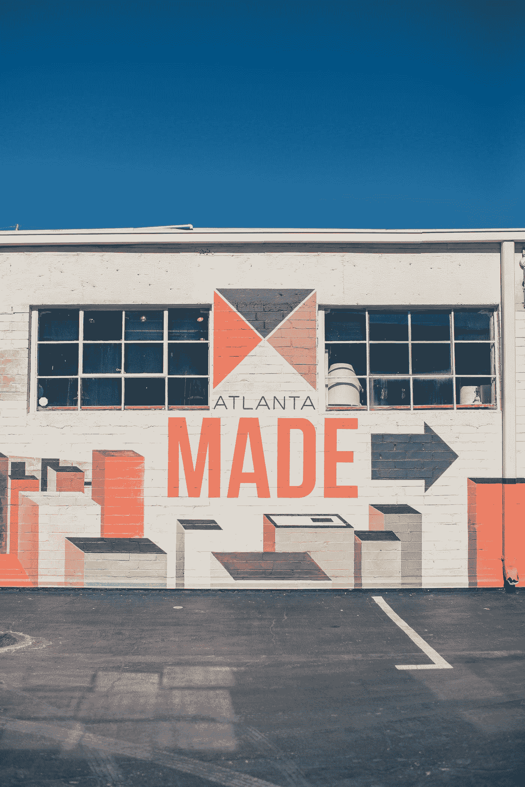

# 亚特兰大最好的科技交流场所

> 原文：<https://medium.datadriveninvestor.com/atlanta-best-places-to-network-in-tech-da4cf19093af?source=collection_archive---------7----------------------->

“Atlanta Made” by [Ian Schneider](https://unsplash.com/@goian?utm_source=medium&utm_medium=referral) on [Unsplash](https://unsplash.com?utm_source=medium&utm_medium=referral)

亚特兰大是美国发展最快的城市之一。随着建筑拔地而起，创新者不断涌现。亚特兰大正在成为一个企业家、制造商和辛勤劳动者能够繁荣发展的城市。

下面列出了一些地方，可以帮助你结识优秀的人和建立良好的关系网。查看举办科技活动的各种亚特兰大场馆。在这个城市中，遇到类似的想法并不困难，所以走出去，推广你的应用程序、业务，或者用你的技能帮助别人，以促进亚特兰大当地的业务发展。

# 举办地点

## [开关站](https://www.eventbrite.com/o/switchyards-downtown-club-6453217513)

Switchyards 是一家当地俱乐部，以为消费者创造美丽的创业公司而闻名。他们举办了一个名为“T2 消费者展”的活动，每月一次。5 家本地创业公司推销他们为消费者解决的问题。点击此处可找到调车场活动[的门票。](https://www.eventbrite.com/o/switchyards-downtown-club-6453217513)

 [## 市中心开关站俱乐部

### Switchyards Downtown Club 正在使用 Eventbrite 组织 2 场即将到来的活动。检查市中心俱乐部的开关站…

www.eventbrite.com](https://www.eventbrite.com/o/switchyards-downtown-club-6453217513) 

## [总装](https://generalassemb.ly/)

总装设在[庞塞城市场](http://poncecitymarket.com/)。这是一个了解未来课程或聆听各种演讲者演讲的好地方。所有这些离亚特兰大东区环线只有几步之遥。无论你是想学习编码、设计，还是更擅长营销，General Assembly 都为你提供了采取行动的重要信息。

 [## 在亚特兰大学习编码、设计、数字营销

### 在亚特兰大大会上探索你在编码、数据、设计和营销方面的未来

一般装配](https://generalassemb.ly/locations/atlanta) 

## [亚特兰大科技村](https://atlantatechvillage.com/)

亚特兰大创业文化的基石社区。各种各样的活动在巴克海德举行。参加各种活动，结识各种技术爱好者，寻找机会。

 [## 亚特兰大的创业中心|亚特兰大科技村

### 我们的使命是支持企业家通过一个社区取得成功，促进更快的联系…

atlantatechvillage.com](https://atlantatechvillage.com/events/upcoming/) 

## [先进技术开发中心](https://atdc.org/) (ATDC)

位于佐治亚理工学院的这个创业孵化器帮助创业者创办成功的公司。被认为是全国顶级孵化器之一，自 1981 年以来有 120 家公司首次启动，每月都有活动举行。在下面找到在亚特兰大应该优先参加的活动。

 [## ATDC

### ATDC 正在使用 Eventbrite 组织 1 即将到来的活动。查看 ATDC 的活动，了解更多信息，或联系该组织者。

www.eventbrite.com](https://www.eventbrite.com/o/atdc-1242111339) 

## [亚特兰大黑科技](http://atlblacktech.com/)

每月举办各种技术活动，包括研讨会、技术讲座和有益的倡议。亚特兰大黑人技术公司的目标是促进多样性，并在亚特兰大技术公司建立一个社区。

 [## 首页—亚特兰大黑科技

### 一个由个人、组织和公司组成的联盟，致力于定义和组织黑科技社区…

atlblacktech.com](http://atlblacktech.com/) 

## 佐治亚州技术协会

带着团结佐治亚州技术社区的使命，您可以参加亚特兰大的各种活动和会议。点击[此处](https://www.tagonline.org/events/)访问。

 [## 亚特兰大技术活动:午餐会和培训会议

### 注册参加由佐治亚州技术协会为您带来的亚特兰大技术午餐会或培训会议…

www.tagonline.o](https://www.tagonline.org/events/) 

# 推介活动

有很多机会让你的产品出现在亚特兰大的技术推动者和震动者面前。在 [Eventbrite](https://www.eventbrite.com/d/ga--atlanta/pitch/) 上找到一个列表。

 [## 佐治亚州亚特兰大推介活动| Eventbrite

### 在亚特兰大排队计划？无论您是本地人、新来的人，还是只是路过，您一定会发现…

www.eventbrite.com](https://www.eventbrite.com/d/ga--atlanta/pitch/) 

# 亚特兰大最佳科技活动 Twitter 账户

 [## 亚特兰大科技事件(@ATL_TechEvents) | Twitter

### 亚特兰大科技事件的最新推文(@ATL_TechEvents)。面向开发人员、技术人员和其他极客的活动…

twitter.com](https://twitter.com/ATL_TechEvents)  [## 冒险亚特兰大(@VentureAtlanta) |推特

### 来自 Venture Atlanta 的最新推文(@VentureAtlanta)。将顶级投资者与东南部最…

twitter.com](https://twitter.com/VentureAtlanta)  [## 催眠状态(@催眠状态)|推特

### Hypepotamus 的最新推文(@hypepotamus)。创新生活在南方。💥Hypepotamus 是您的首选来源…

twitter.com](https://twitter.com/hypepotamus)  [## 亚特兰蒂斯岛(@亚特兰蒂斯岛)|推特

### AtlantaIMA 的最新推文(@AtlantaIMA)。我们在 AIMA 的使命是为社区提供一个交流的场所…

twitter.com](https://twitter.com/AtlantaIMA)  [## 探索亚特兰大(@DiscoverAtlanta) |推特

### 来自探索亚特兰大(@DiscoverAtlanta)的最新推文。佐治亚州亚特兰大旅游官方帐户。#DiscoverATL。所有…

twitter.com](https://twitter.com/DiscoverAtlanta) 

# Eventbrite 在亚特兰大举办的技术活动

 [## 佐治亚州亚特兰大科技活动| Eventbrite

### 在亚特兰大排队计划？无论您是本地人、新来的人，还是只是路过，您一定会发现…

www.eventbrite.com](https://www.eventbrite.com/d/ga--atlanta/tech/) 

# 遇见 Ups

 [## 亚特兰大的技术会议

### 寻找关于技术的聚会，结识当地社区中与你志趣相投的人。

www.meetup.com](https://www.meetup.com/find/events/tech/?allMeetups=false&radius=10&userFreeform=Atlanta%2C+GA&mcId=z30308&mcName=Atlanta%2C+GA&eventFilter=mysugg) 

# 寻找亚特兰大活动的其他地方

 [## 即将举行的活动

### 编辑描述

atlantaevent.com](http://atlantaevent.com/upcoming-events/) 

这个列表可以帮助你在这个城市里找到一些有意义的东西，而不需要太多的研究。出去结交一些新朋友，如果这篇文章有助于引导你的事业走向新的成功，请在评论中分享你的故事。