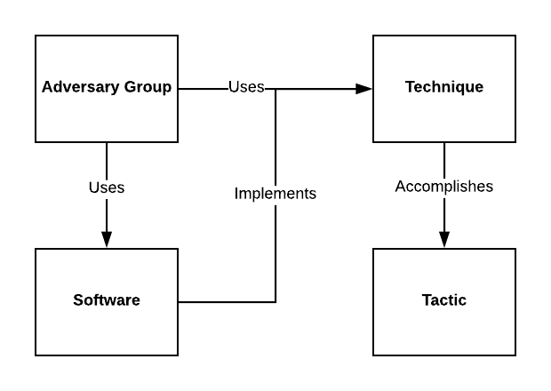

# ATT-CK 模型

> 原文：<https://medium.datadriveninvestor.com/att-ck-model-c40a113aab4?source=collection_archive---------7----------------------->

# 这不是你妈妈的杀人链模型

**谁和什么是 MITRE**

MITRE 是一个非营利组织，其使命是通过联邦政府资助的研发中心和公私合作伙伴关系，为一个更安全的世界解决问题。他们的目标是应对美国的安全、稳定和福祉所面临的挑战。

MITRE 在人工智能、直观数据科学、量子信息科学、健康信息学、空间安全、政策和经济专业知识、可信自治、网络威胁共享和网络弹性等领域带来了创新想法。

**什么是 ATT & CK**

ATT 和 CK 是一个在野外观察到的敌对行为的策划知识库，反映了对手攻击生命周期的各个阶段和他们已知的目标平台，组织成战术目标。ATT&CK 是 MITRE 在一个名为 Fort Meade Experiment (FMX)的研究项目下进行的练习的副产品，该项目旨在列举和分类针对 Microsoft Windows 的妥协后对手战术、技术和程序(TTP)。该项目在一个孤立的飞地内密切监控的网络战争游戏中模拟对抗技术，以测试分析假设，从而提高对威胁的妥协后检测。

ATT 和 CK 模型的不同应用扩展到入侵检测、威胁追踪、安全工程、威胁情报、红队和风险管理，并基于对手模拟创建的用例中的经验驱动的威胁信息，以实现更好的防御覆盖测量。

与洛克希德·马丁公司的杀伤链模型(KCM)不同，ATT&CK 公司并不以线性顺序表示战术或技术——相反，对手在不同的技术之间跳来跳去，以实现他们的战术目标。

ATT 和 CK 的不同元素之间的关系如下图 1 所示。

图 1:ATT 和 CK 元素之间的交互

ATT 和 CK 没有详尽列举攻击媒介。这些都包含在单独的 MITRE 研究中，并在 ATT 和 CK 矩阵的技术中引用，其中包括 [CAPEC](https://capec.mitre.org/) (常见攻击模式列举和分类)和 [CWE](http://%20https//cwe.mitre.org/) (常见弱点列举)。

ATT 和 CK 矩阵是以表格形式组织的，战术组织成列，作为攻击期间的短期敌对目标，单元代表对手为实现这些战术目标而使用的个人技术。

**ATT 的历史& CK**

第一个 ATT&CK 模型是 FMX 研究的结果，于 2013 年 9 月创建，并于 2015 年 5 月公开发布，包含 9 种策略下的 96 项技术。自 2013 年以来，该社区通过创建一个类似的知识库为该项目做出了集体贡献，该知识库名为[前 ATT & CK](https://attack.mitre.org/tactics/pre/) 专注于“利用的左边”行为，名为 [ATT & CK 用于移动](https://attack.mitre.org/tactics/mobile/)专注于移动特定领域的行为。

截至 2018 年 4 月，企业 ATT&CK 公司现在包括 219 项跨 Windows、Linux 和 Mac 的技术。

ATT&CK 按技术领域进行组织。把域想象成战场，敌人在里面活动以规避控制来实现他们的目标。目前有两个领域:企业(Linux，MacOS，Windows)和移动(Android，IOS)领域内的平台，操作系统或应用程序。

ATT&CK 还追踪 APT 团体，详细记录团体名称；唯一的 ID；组别名；对该组的描述；组别名的描述；团队使用的技术及其使用方式；和该组已报告使用的软件列表。

软件也在模型中分解，因为对手通常在入侵中使用不同类型的软件，这可以代表一种技术的实例化，因此有必要在 ATT 和 CK 内部进行分类，以了解如何使用技术的示例。软件分为工具、实用程序或恶意软件。每个软件都用软件的名称来描述；唯一的 ID；别名/别名；软件类型(恶意软件、工具或实用程序)；软件可以使用的平台；软件的描述；别名的描述；软件采用的技术列表及相关参考资料；以及据报道使用该软件的团体名单。

**战术对技术**

战术和技术是根本不同的东西。贸易点方案是 ATT&CK 模型概念化的基础。《ATT 与 CK》中的战术是技术要达到的目标类别，而技术是对手为达到战术目标而采取的行动。

**战术**

ATT 和 CK 中的战术代表了技术的“为什么”——最终，对手的战术目标或执行行动的原因。对手在入侵期间所做事情的标准符号包括持续、发现、横向移动、执行和渗透。

截至 2018 年 10 月的企业矩阵战术包括初始访问:对手用来在网络中获得初始立足点的向量；执行:导致对手控制的代码在本地或远程机器上执行的技术；持久性:对系统的任何访问、动作或配置改变，使对手在该系统上持续存在；权限提升:允许对手在系统或网络上获得更高级别的权限的行为的结果；防御规避:对手可能用来逃避检测或避免其他防御的技术；凭证访问:导致访问或控制系统、域或服务凭证的技术；发现:让对手获得关于系统、应用程序或网络的知识的技术；横向移动:使对手能够访问和控制网络上的远程系统的技术；收集:用于识别和收集信息的技术，例如在渗透之前从目标网络收集敏感文件；渗透:导致或帮助对手从网络中删除文件和信息的技术和属性，以及命令和控制:代表对手如何在目标网络中与受其控制的系统进行通信的战术。要查看整个矩阵，点击[这里](https://attack.mitre.org/matrices/enterprise/)。

**技巧**

ATT 和 CK 中的技术代表了对手“如何”通过执行一个动作来实现战术目标(例如，转储 SAM 配置单元以访问密码哈希)。每项技术都被分解成包含技术名称的更详细的信息；唯一的标识符；该技术可用于实现的战术目标；技术描述；它是什么，它的用途，以及它在野外使用的参考资料；目标操作系统或应用程序；对手需要满足的技术工作要求；对手执行该技术所需的权限；对手通过实施该技术将获得的权限级别；传感器或记录系统收集的信息来源，用于识别正在执行的操作；行动的顺序，或对手行动的结果；如果该技术可用于在远程系统上执行某些东西；如果它可用于绕过或逃避控制、方法或流程；关联的 CAPEC ID；投稿人；记录使用的例子；用于识别技术的分析过程、传感器、数据和检测策略；以及用于阻止该技术成功或实现对手所需效果的配置、工具或过程。

这些技术被进一步详细描述了它们是如何被利用的，以及为什么对防御者来说识别它们是重要的。平台和数据源描述了要监控的系统和要收集的内容，以减轻和/或检测技术的滥用。技术还包括恶意软件和对手使用的技术的真实世界实现的引用示例，并且还包含每种技术中的缓解和检测描述

**关键要点**

*   开始询问您的供应商他们的解决方案在 ATT 和 CK 矩阵中的覆盖范围。比如 Tripwire，比如在这里发表了类似[的东西。](https://www.tripwire.com/solutions/configure-and-harden-your-systems/mitre-attck-matrix-with-cis-controls-and-tripwire-mapping-register/?referredby=socialmedia/&success=true)
*   ATT&CK 模型并不意味着取代杀伤链模型，而是研究对手的技术，以便在攻击发生时可以检测到它们，并最终减少检测和响应 APT 攻击的时间。
*   考虑您自己的安全控制，以及在您的环境中 ATT&CK 中的个别技术的覆盖范围。这是执行控制差距评估的绝佳机会。有已发布的与 ATT 和 CK 相关的控制框架文档，如 CIS 控制。
*   ATT 和 CK 在 KCM 周围提供了更多的色彩，将 KCM 的步骤分解为每个步骤中执行的实际技术，以查看对手的战术目标，从而揭示实现这些战术目标所采用的不同技术。毕竟是孙子说的“要了解你的敌人，你必须成为你的敌人。”
*   参与进来。只有通过全球社区的参与，ATT 和 CK 才能得到维护并变得更好。通过网络安全从业者之间的网络情报共享，我们可以通过与我们的全球同事共享我们对目标的敌对行动进行的单独研究来提高效率，以便他们可以使用我们的经验和教训来提高他们检测相同技术的可见性。我们都是一个团队的。

**Like 和 Reshare！**

像往常一样，如果你喜欢这篇文章，请点击“喜欢”来支持我，并与你自己的 feed 分享！这是你支持我和我继续研究的最好方式。如果任何人对这篇文章有任何补充或评论，请在评论区与下面的每个人分享！在我的主页[www.alissaknight.com](http://www.alissaknight.com/)、 [LinkedIn](http://www.linkedn.com/in/alissaknight) 上了解更多关于我的信息，在我的 [YouTube 频道](http://www.youtube.com/c/alissaknight)上观看我的视频博客，收听我每周的[播客片段](http://alissaknight.libysyn.com/)，或者在 Twitter 上关注我 [@alissaknight。](http://www.twitter.com/@alissaknight)

**关于我**

我是 [Aite Group](http://www.aitegroup.com/) 的高级分析师，通过评估行业趋势、创建细分分类、确定市场规模、准备预测和开发行业模型，对影响金融服务、医疗保健和金融科技行业的网络安全问题进行重点研究。我通过公正、客观和准确的研究和内容开发，为这些行业提供网络安全市场的联合和定制市场研究、竞争情报和咨询服务。根据我对当今影响这些行业的当代网络安全问题的研究，我撰写研究报告和白皮书，并提供咨询服务，包括询问、简报、咨询项目、研究结果演示以及预约演讲，我经常在每年的网络安全会议、研讨会和圆桌会议上发表主题演讲。

**参考文献**

t .史密斯(2018 年 7 月 18 日)。米特 ATT 和 CK 框架:你需要知道什么。检索于 2019 年 2 月 6 日，来自[https://www . tripwire . com/state-of-security/mitre-framework/mitre-attack-framework-what-know/](https://www.tripwire.com/state-of-security/mitre-framework/mitre-attack-framework-what-know/)

斯特罗姆，b .阿普尔鲍姆，a .米勒，d .尼克尔斯，k .潘宁顿，a .托马斯，C. (2018，7 月)。米特 ATT 和 CK:设计与哲学。2019 年 2 月 6 日检索，来自[https://www . mitre . org/sites/default/files/publications/pr-18-0944-11-mitre-attack-design-and-philosophy . pdf](https://www.mitre.org/sites/default/files/publications/pr-18-0944-11-mitre-attack-design-and-philosophy.pdf)