# RNNs 中的注意

> 原文：<https://medium.datadriveninvestor.com/attention-in-rnns-321fbcd64f05?source=collection_archive---------0----------------------->

## 用一个详细的例子来理解这个机制

Montepulciano Italy

递归神经网络已经成功地应用于许多涉及序列数据的任务，如机器翻译、情感分析、图像字幕、时间序列预测等。改进的 RNN 模型，如长短期记忆网络(LSTMs)能够对长序列进行训练，克服消失梯度等问题。然而，即使是更先进的模型也有其局限性，当处理长数据序列时，研究人员很难开发出高质量的模型。例如，在机器翻译中，RNN 必须找到由几十个单词组成的长输入和输出句子之间的联系。似乎需要改变和调整现有的 RNN 架构，以便更好地处理这些任务。

 [## DDI 编辑推荐:5 本机器学习书籍，让你从新手变成数据驱动专家…

### 机器学习行业的蓬勃发展重新引起了人们对人工智能的兴趣

www.datadriveninvestor.com](https://www.datadriveninvestor.com/2019/03/03/editors-pick-5-machine-learning-books/) 

注意力是一种结合在 RNN 中的机制，允许它在预测输出序列的某个部分时专注于输入序列的某个部分，从而实现更容易的学习和更高的质量。注意力机制的组合使得在许多任务中的性能得以提高，使其成为现代 RNN 网络的一个组成部分。

这项工作基于 Bahdanau、Cho 和 Bengio 的论文《通过联合学习对齐和翻译来进行神经机器翻译》[1]。

我们首先简要回顾一下基本的 rnn。我们将关注的 RNN 编码器-解码器架构如下所示:

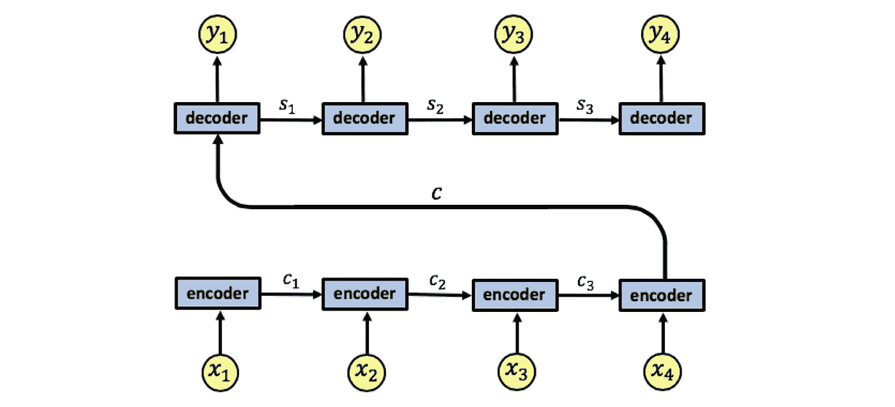

An RNN encoder-decoder architecture, we take an architecture with 4 time steps for simplicity

RNN 编码器具有输入序列 x1、x2、x3、x4。我们用 c1、c2、c3 表示编码器状态。编码器输出单个输出向量 c，该向量作为输入传递给解码器。像编码器一样，解码器也是单层 RNN，我们用 s1、s2、s3 表示解码器状态，用 y1、y2、y3、y4 表示网络输出。

这种架构的问题在于，解码器需要将整个输入序列 x1、x2、x3、x4 表示为单个向量 c，这可能导致信息丢失。此外，解码器需要从这个单一的向量中破译传递的信息，这本身就是一项复杂的任务。

详见[1]:

这种编码器-解码器方法的一个潜在问题是，神经网络需要能够将源句子的所有必要信息压缩成固定长度的向量。这可能使神经网络难以处理长句，尤其是那些比训练语料库中的句子更长的长句。

## 具有注意机制的 RNNs

一个注意 RNN 看起来是这样的:

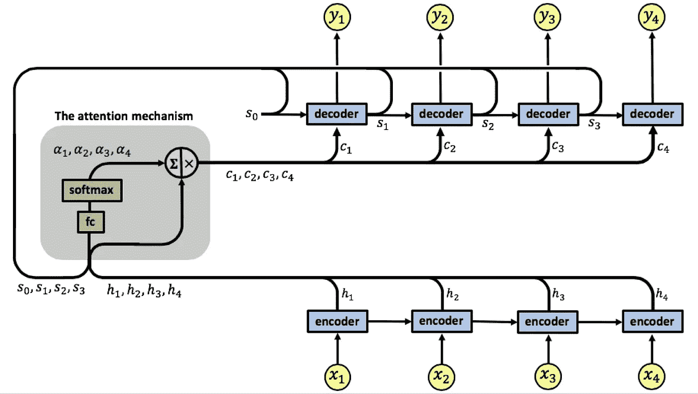

我们的注意力模型有一个单层的 RNN 编码器，同样有 4 个时间步长。我们用 x1、x2、x3、x4 表示编码器的输入向量，用 h1、h2、h3、h4 表示输出向量。

注意力机制位于编码器和解码器之间，其输入由编码器的输出向量 h1、h2、h3、h4 和解码器的状态 s0、s1、s2、s3 组成，注意力的输出是称为上下文向量的向量序列，用 c1、c2、c3、c4 表示。

## 上下文向量

上下文向量使解码器在预测其输出时能够专注于输入的某些部分。每个上下文向量是编码器输出向量 h1、h2、h3、h4 的加权和，每个向量 hi 包含关于整个输入序列的信息(因为它在计算期间可以访问编码器状态),重点关注输入序列的第 I 个向量周围的部分。向量 h1、h2、h3、h4 通过捕获输入 xj 与时间 I、yi 处的输出的相关程度的**权重来缩放。**

上下文向量 c1、c2、c3、c4 由下式给出:

注意力权重是使用一个额外的全连接浅层网络学习的，用 fc 表示，这是注意力机制输入的 s0、s1、s2、s3 部分发挥作用的地方。注意力权重的计算由下式给出:

使用注意力全连接网络和 softmax 函数学习注意力权重:

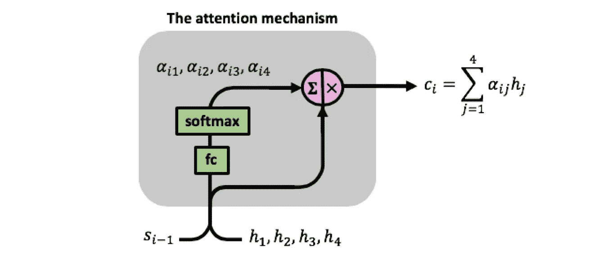

At time step i, the mechanism has h1,h2,h3,h4 and si-1 as inputs, it uses the fc neural network and the softmax function to compute the attention weights αi1, αi2, αi3, αi4, these are then used in the computation of the context vector ci.

从上图中可以看出，全连接网络在时间步长 I 接收向量[si-1，hi]的串联作为输入。网络有一个全连接层，该层的输出(用 eij 表示)通过 softmax 函数进行传递，计算注意力权重，位于[0，1]中。

注意，我们对所有连接的对[si-1，h1]、[si-1，h2]、[si-1，h3]、[si-1，h4]使用相同的全连接网络，这意味着**有一个学习注意力权重的单一网络。**

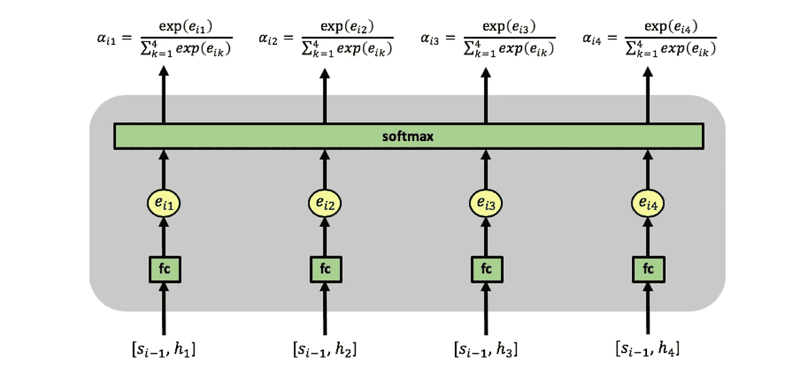

Computation of attention weights at time step i, notice how this needs to be computed separately on every time step since the computation at time step i involves si-1, the decoder’s state form time step i-1

注意力权重αij 反映了 hj 相对于前一隐藏状态 si-1 在决定下一状态 si 和生成 yi 中的重要性。**当预测输出 yi 时，大的αij 注意力权重导致 RNN 聚焦于输入 xj(由编码器的输出 hj 表示)。**

使用反向传播，fc 网络与编码器和解码器一起被训练，RNN 预测误差项通过解码器反向传播，然后通过 fc 注意力网络，从那里到编码器。

注意，由于注意力权重是使用额外的神经网络 fc 来学习的，所以我们有一组额外的权重来允许该学习发生，我们用 Wa 来表示该权重矩阵。

具有 4 个输入时间步长和 4 个输出时间步长的 RNN 将在训练过程中微调以下权重矩阵。注意注意力矩阵的 4×4 维度，连接每个输入和每个输出:

这种机制使解码器能够决定注意输入序列的哪些部分。通过让解码器具有注意机制，我们将编码器从必须将输入序列中的所有信息编码到单个向量中解放出来。信息可以扩展到整个序列 h1、h2、h3、h4，这些序列可以由解码器选择性地检索。

如[1]中所写:

*这种方法与基本编码器-解码器最重要的区别在于，它不试图将整个输入句子编码成一个固定长度的向量。相反，它将输入句子编码成一系列向量，并在解码翻译时自适应地选择这些向量的子集。这使得神经翻译模型不必将源句子的所有信息(无论其长度如何)压缩到固定长度的向量中。我们发现这使得模型能够更好地处理长句。*

## 计算注意力权重和上下文向量

让我们看一个详细的例子，看看上下文向量是如何计算的。

执行的第一个动作是由编码器计算矢量 h1、h2、h3、h4。这些然后被用作注意机制的输入。这是解码器通过输入其初始状态向量 s0 而首先涉及的地方，并且我们具有第一注意力输入序列[s0，h1]、[s0，h2]、[s0，h3]、[s0，h4]。

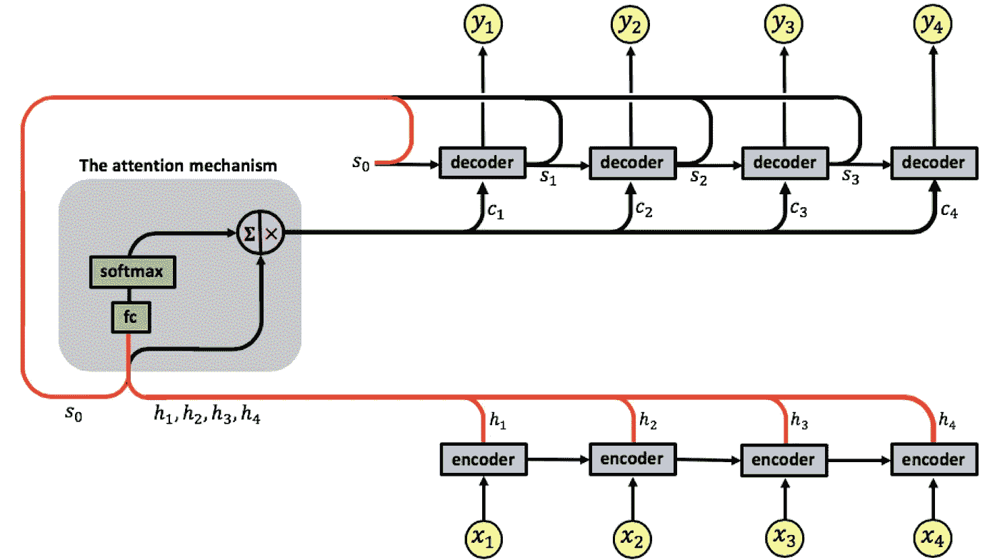

注意力机制计算第一组注意力权重α11、α12、α13、α14，使得能够计算第一上下文向量 c1。解码器现在使用[s0，c1]并计算第一 RNN 输出 y1

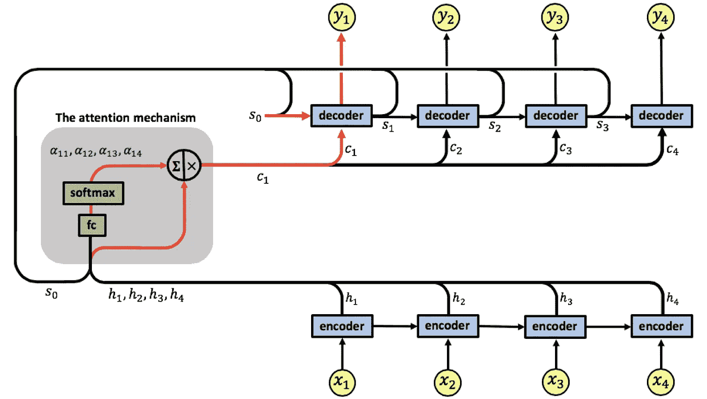

在随后的时间步，注意机制将序列[s1，h1]、[s1，h2]、[s1，h3]、[s1，h4]作为输入。

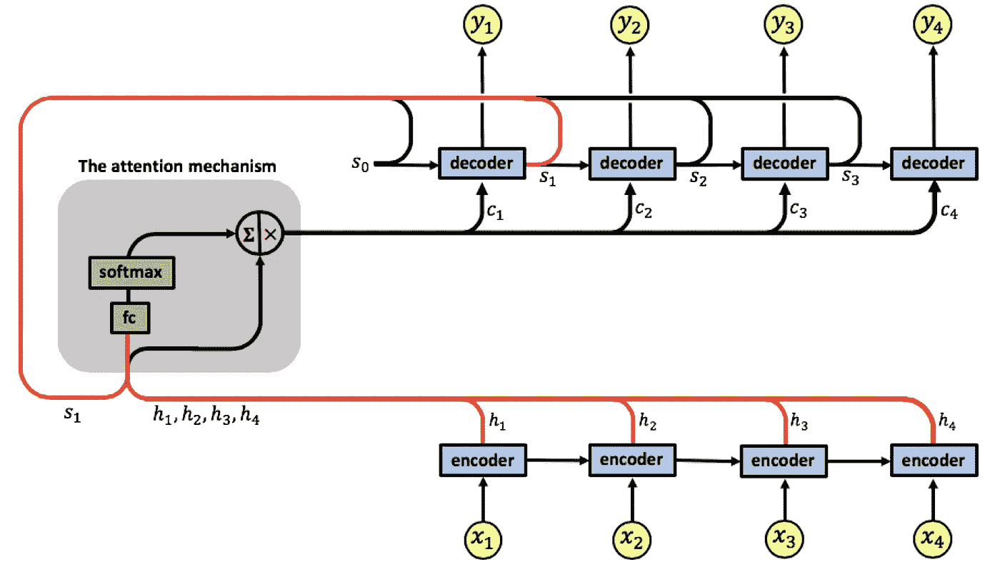

它计算第二组注意力权重α21、α22、α23、α24，使得能够计算第一上下文向量 c2。解码器使用[s1，c2]并计算第二 RNN 输出 y2。

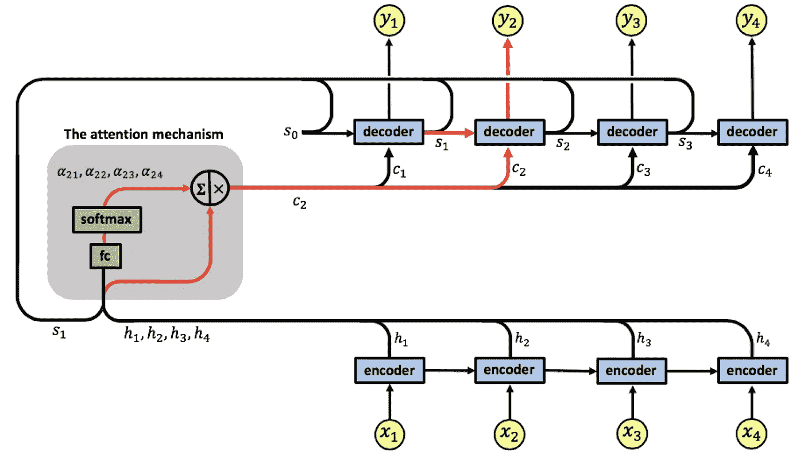

在下一时间步，注意机制具有输入序列[s2，h1]、[s2，h2]、[s2，h3]、[s2，h4]。

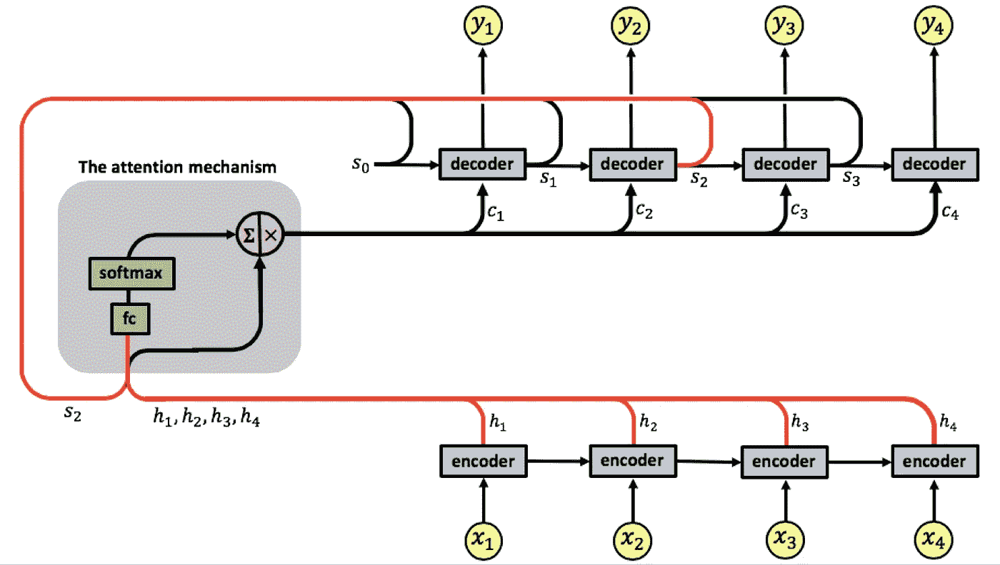

并且计算第三组注意力权重α31、α32、α33、α34，使得能够计算第三上下文向量 c3。解码器使用[s2，c3]并计算以下输出 y3。

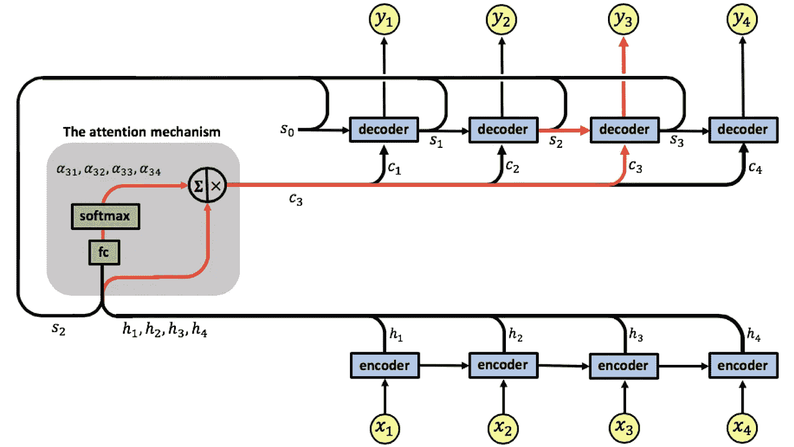

在下一时间步，注意机制具有输入序列[s3，h1]、[s3，h2]、[s3，h3]、[s3，h4]。

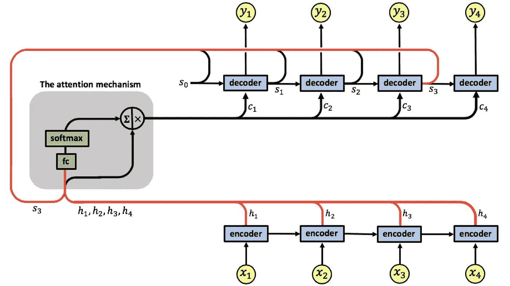

它计算第四组注意力权重α41、α42、α43、α44，使得能够计算第四上下文向量 c4。解码器使用[s3，c4]并计算最终输出 y4。

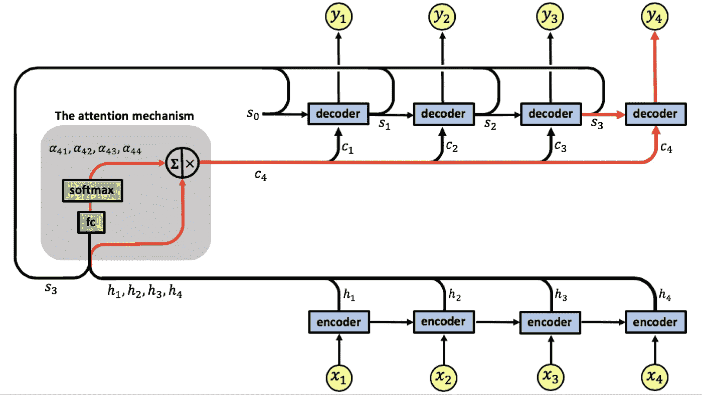

我们以一个来自[1]的例子结束，任务是英法机器翻译。下面是关注 RNN 发现的两条路线。每个图的 x 轴和 y 轴分别对应于源句子(英语)和生成的翻译(法语)中的单词。

每个像素以灰度(0:黑色，1:白色)显示第 j 个源单词和第 I 个目标单词的权重αij。

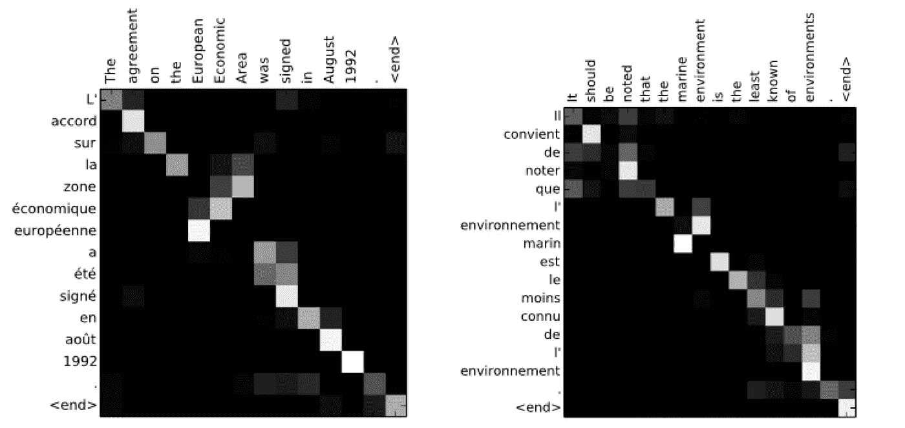

我们看到，当输出翻译时，注意机制如何允许 RNN 专注于输入句子的一小部分。请注意，较大的注意力参数(由白色像素给出)如何连接英语和法语句子的相应部分，从而使[1]中的网络能够实现最先进的结果。

**参考文献:** [1]通过联合学习对齐和翻译的神经机器翻译。Dzmitry Bahdanau、KyungHyun Cho 和 Yoshua Bengio。