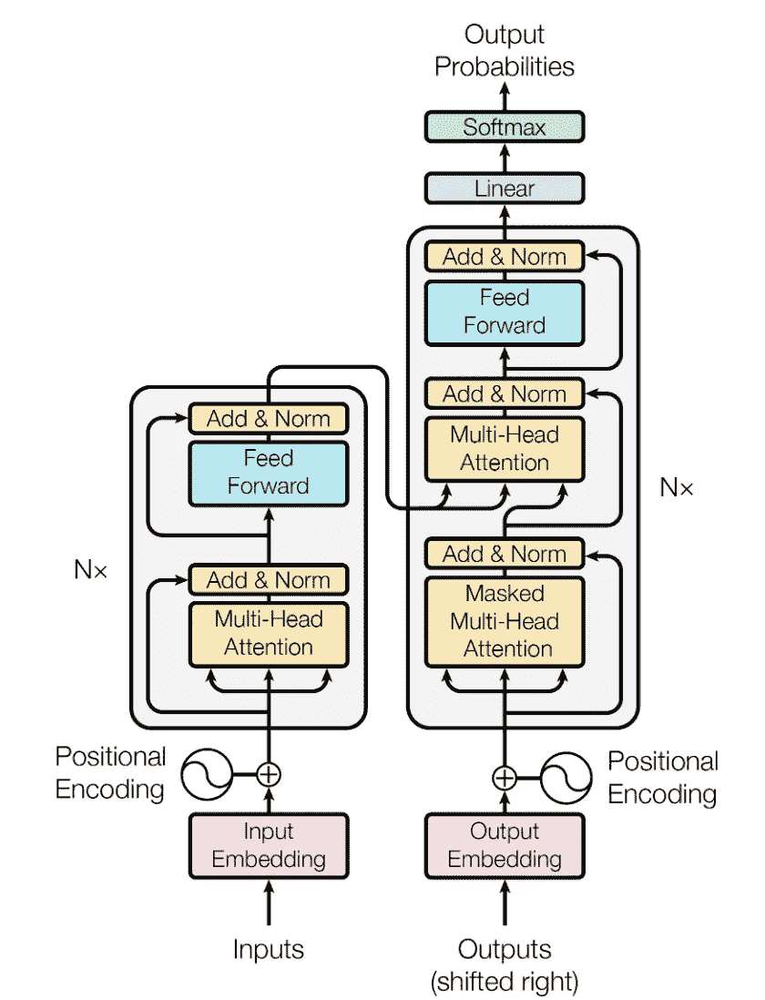
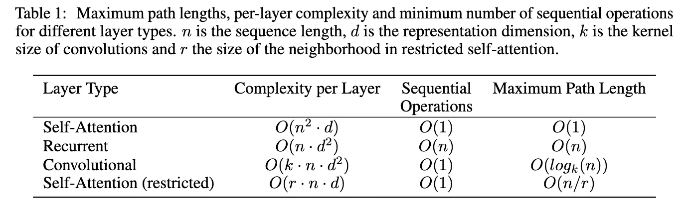
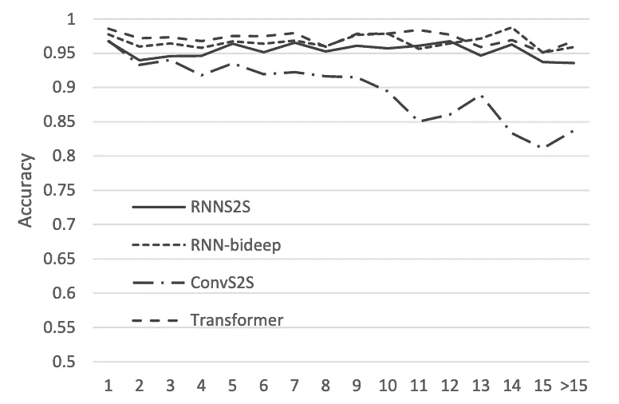
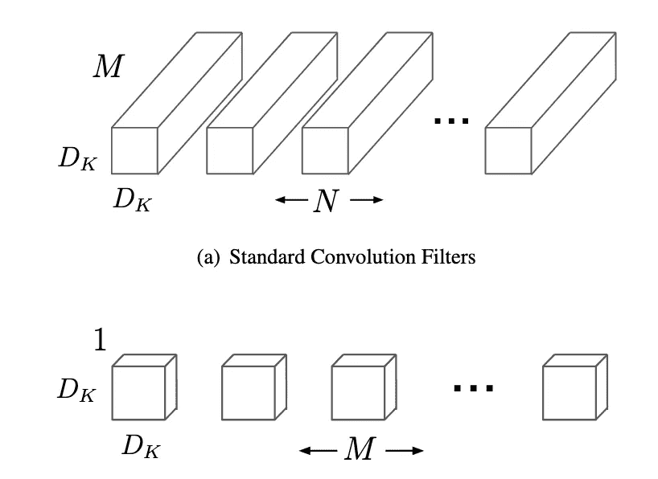
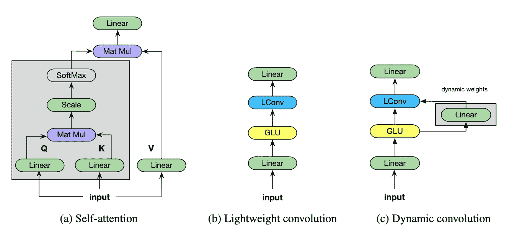
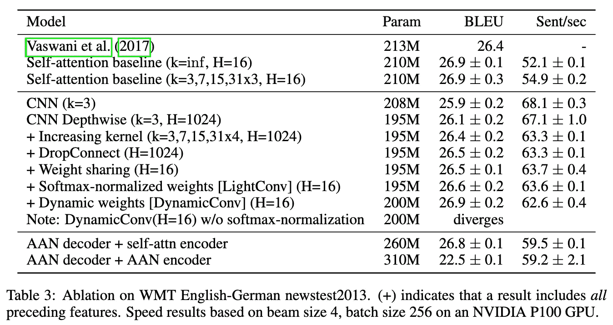

# 注意力被高估了

> 原文：<https://medium.datadriveninvestor.com/attention-is-overrated-d2b663458702?source=collection_archive---------4----------------------->

在过去，NLP 模型的标准设计是基于递归神经网络(RNN)的，以确保模型可以编码语言建模中所需的长期依赖关系。随着 [Transformer](https://arxiv.org/pdf/1706.03762.pdf) 的开发，这种假设受到质疑，这是一种使用自我关注层而不是 RNNs 的模型。转换器由交替的逐点全连接和自关注层的编码器和解码器堆栈组成:

The Transformer. If this isn’t familiar check out the [paper](https://arxiv.org/pdf/1706.03762.pdf) or this great [blog post](https://jalammar.github.io/illustrated-transformer/)

从那以后，自我关注在很多领域都很有用，包括计算机视觉，在 imagenet 上实现了最先进的[对抗防御，以及](https://arxiv.org/abs/1812.03411)[自我关注 GAN](https://arxiv.org/abs/1805.08318) 。

transformer 模型让我们质疑专注于递归神经网络的 NLP 模型的标准设计，但最近注意力是 NLP 的关键这一观点受到了质疑。

# 注意力的局限性

BERT 的论文向我们展示了注意力并不是在 NLP 中获得好结果的全部，因为为了获得他们最先进的结果，除了在 transformer 中使用的自我注意力之外，他们还利用了双向 LSTMs。但是后来的研究表明，我们不仅需要更多的关注，而且可能根本不需要关注。首先，我们可以回顾一下注意力的一些局限性:

 [## 金融中的机器学习——数据驱动的投资者

### 在我们讲述一些机器学习金融应用之前，我们先来了解一下什么是机器学习。机器…

www.datadriveninvestor.com](https://www.datadriveninvestor.com/2019/02/08/machine-learning-in-finance/) 

## 二次复杂度

注意力在输入长度上具有二次复杂度，这意味着注意力在长距离上不能很好地扩展。

这是因为，对于每个位置(有 n 个)，我们需要关注输入中的每一个其他位置(也有 n 个)，对于每个位置中的总共 d 个维度，因此总共需要 n 个 d 操作，其中 d 是输入的维度。

From the [transformer paper](https://arxiv.org/pdf/1706.03762.pdf)

## 对长期依赖的注意限制

人们推测注意力如此有用的原因是因为它可以更容易地模拟输入中的长期依赖性，但是最近的一篇论文表明这是不正确的。

通过观察 CNN、RNN 和 transformer 在主谓一致任务中的表现，随着主语和动词之间的距离增加，他们表明自我注意的表现比 CNN 或 RNNs 退化得更快。为了克服这种长期依赖的性能限制，需要许多自我关注的头。

Accuracy on subject-verb agreement task. Attention is worse than CNNs and RNNs! From
[A Targeted Evaluation of Neural Machine Translation Architectures](https://arxiv.org/pdf/1808.08946.pdf)

# 另一种选择是:轻质、动态回旋

在[关注轻量级和动态卷积](https://openreview.net/pdf?id=SkVhlh09tX)中，他们提出了两种改进卷积层形式的 self 替代方案:

1.  **轻质盘旋**——具有重量共享的深度方向可分离盘旋
2.  **动态卷积**——具有动态权重的轻量级卷积的扩展

## 轻质盘旋

轻量级卷积利用了 vision 中常用的创新技术来创建更高效的架构，称为深度方向卷积。

**深度方向卷积**将一个通道作为每个卷积的输入，与标准卷积相反，标准卷积将所有通道作为输入。仅将通道的子集作为输入会大大减少参数的数量，并且正如在视觉文献中所看到的，仍然提供良好的性能。

*As shown in* [*MobileNet*](https://arxiv.org/pdf/1704.04861.pdf)*, depthwise convolutions apply a single filter for each channel.*

**跨通道的权重分配**也被添加到深度方向卷积中，以进一步减少参数的数量。它们在多个通道上使用相同的权重，总共有 H 个独立的权重。在论文中，他们使用 H=16 的值，因此在有 1024 个通道的情况下，只学习 16 个，而不是学习 1024 个不同的滤波器。

使用深度方向卷积将所需的参数从 **d k** 减少到 **dk** ，其中 **d** 是通道数， **k** 是滤波宽度。重量分担的加入进一步将数量从 **dk** 减少到 **Hk** 。

Comparison of self-attention, Lightweight convolution and dynamic convolution from [Pay Less Attention with Lightweight and Dynamic Convolutions](https://openreview.net/pdf?id=SkVhlh09tX)

## 动态卷积

动态卷积是轻量级卷积的扩展，其中在每个时间步使用线性函数创建不同的卷积核。权重仅取决于当前位置，不使用全局上下文。如下所示，动态卷积对于在不使用自我关注的情况下获得最先进的性能至关重要。

# 结果

他们将轻量级和动态卷积与 Transformer 大模型进行了比较。对于卷积模型，他们用卷积替换了自我关注层，并将块增加到 7，以保持两个模型中的参数数量一致。内核大小在更深的块中增加，内核大小为 3、7、15 和 31x4，所有块的 H=16。

轻量级卷积尽管简单，但仍可与最好的方法竞争，而动态卷积在英德翻译方面达到了最先进的水平。这表明自我关注是不必要的，可以用更简单、计算成本更低的卷积来代替

另外，本文做了一个很棒的消融研究，看看这种模式的好处到底来自哪里。他们显示:

*   宽卷积核是取代自我关注所必需的
*   重量共享(H=1024 到 H=16)不会影响性能
*   自我关注即使在有限的环境下也能起作用
*   动态卷积有所帮助，但需要 softmax 归一化才能收敛

# 思想

*   这似乎是一个重要的结果，更广泛的上下文在更高层是重要的，但在更低层是不重要的。它们的动态卷积有点类似于自我注意，并且在有限的上下文大小下仍然表现良好，只要上下文逐渐增加。
*   imagenet 上敌对图像的当前 SOTA 使用自我关注层。有没有可能在更高层使用更宽或可能的动态卷积来代替这些卷积？