# 注意机制(带 tensorflow 的印地语到英语翻译器)(编码器和解码器)

> 原文：<https://medium.datadriveninvestor.com/attention-mechanism-encoder-and-decoder-f95d7d7005c8?source=collection_archive---------0----------------------->

嗨，我是 [Navneet](https://www.linkedin.com/in/navneet-kumar-52531816b/) ，

在这篇文章中，我将介绍注意机制中的编码器和解码器，并详细介绍如何使用注意机制创建印地语到英语的翻译器。

```
Credit: [https://www.tensorflow.org/beta/tutorials/text/nmt_with_attention](https://www.tensorflow.org/beta/tutorials/text/nmt_with_attention)
***Check above links for more exciting tutorial***
```

> ***目录***

1.  话题介绍
2.  编码器和解码器介绍

2(a .)文本

2(b .)图像

3.注意机制

4.编码

5.导入必要的库。

6.下载数据集

7.文本预处理

8.创建数据集

9.记号化函数

10.加载数据集函数

11.将数据集分为训练和验证

13.编码器

14. [Bahdanau 注意](https://arxiv.org/abs/1409.0473)

15.解码器

16.损失函数和优化器

17.训练模型

18.最终评估

19.未来的工作

20.参考

[](https://www.datadriveninvestor.com/2019/01/07/the-ultimate-learning-path-for-deep-learning-in-2019-more/) [## 2019 年深度学习的终极学习路径及更多...数据驱动的投资者

### 又一个美好的一周，一些好的教育内容将会到来。我最喜欢的&最受欢迎的帖子之一…

www.datadriveninvestor.com](https://www.datadriveninvestor.com/2019/01/07/the-ultimate-learning-path-for-deep-learning-in-2019-more/) 

> ***题目介绍***

在我们深入研究编码之前，让我们先试着理解什么是注意力机制？

假设你想了解 LSTM，为此你买了一本机器学习的书。现在你有两个选择。

a.)从头开始读整本书

b.)转到内容，然后找到深度学习部分，找到解释 LSTM 的章节

现在哪种方式对你来说更容易？

很明显是第二个，对吧？

所以在(a)部分，我们所做的是通读整本书来学习 LSTM，但在(b)部分，我们只关注对我们来说必要的东西。这是一个普通人会做的事。

因此，类似地，当我们将文本信息传递给网络时，它将只关注某些单词。

现在假设我们想把一个英语句子翻译成印地语。

“我的名字是 Navneet，我喜欢写博客”到“मेरानामनवनीतहैऔरमुझेब्लॉगलिखनापसंदहै”“mera naam navneet hai aur mujhe blogs likhna pasand hai”

那么在上面的句子中，我们如何将一个英语句子翻译成印地语。

由于我们不能一次读完所有的句子，我们将从左边开始读，我们遇到的第一个单词是**我的** ，然后是**名字**等等。

因此，当我们阅读整个句子时，**姓名、** **中人、** **爱情、****写作、** **博客、**是最重要的要翻译的词，其中**、name=नाम(naam、)、writing=लिखना(likhna、)**

因此，只使用精选的单词就可以把一种语言翻译成另一种语言。

因此，在**注意力机制**的帮助下，我们的模型也将只关注选定的单词进行翻译，而不是遍历整个单词。

> ***编码器和解码器简介***

## 1.)正文

首先，我们将寻找语言翻译，以便给定“ *t-1* 单词，预测下一个单词的概率是多少。

更正式地给出(y(1)，y(2)，y(3)……..，y(t-1))，我们想找到

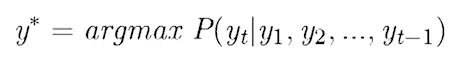

Credit:[https://www.youtube.com/watch?v=7Np_5Q-P8eo&list=PLyqSpQzTE6M9gCgajvQbc68Hk_JKGBAYT&index=113](https://www.youtube.com/watch?v=7Np_5Q-P8eo&list=PLyqSpQzTE6M9gCgajvQbc68Hk_JKGBAYT&index=113)

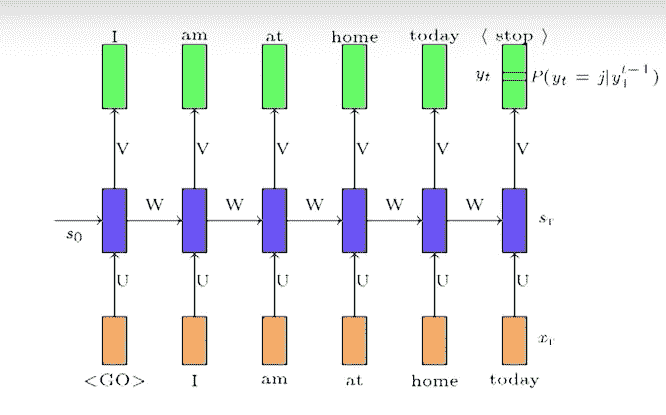

Credit:[https://www.youtube.com/watch?v=7Np_5Q-P8eo&list=PLyqSpQzTE6M9gCgajvQbc68Hk_JKGBAYT&index=113](https://www.youtube.com/watch?v=7Np_5Q-P8eo&list=PLyqSpQzTE6M9gCgajvQbc68Hk_JKGBAYT&index=113)

让我们考虑上面的图像，这里我们感兴趣的是

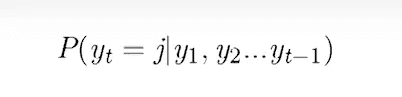

Credit: [https://www.youtube.com/watch?v=7Np_5Q-P8eo&list=PLyqSpQzTE6M9gCgajvQbc68Hk_JKGBAYT&index=113](https://www.youtube.com/watch?v=7Np_5Q-P8eo&list=PLyqSpQzTE6M9gCgajvQbc68Hk_JKGBAYT&index=113)

其中 j 属于所有词汇单词的集合(v)。

这里我们将使用 RNN 来预测下一个单词，即

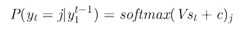

Credit:[https://www.youtube.com/watch?v=7Np_5Q-P8eo&list=PLyqSpQzTE6M9gCgajvQbc68Hk_JKGBAYT&index=113](https://www.youtube.com/watch?v=7Np_5Q-P8eo&list=PLyqSpQzTE6M9gCgajvQbc68Hk_JKGBAYT&index=113)

这里 **softmax** 代表概率分布

**V(st)** 代表之前的状态(蓝框)

**c** 代表偏置。

代表第 j 个元素的概率

***而这个函数将返回整个向量的大小词汇。***

因此，在每个时间步，我们必须预测概率分布，这意味着我们必须计算 softmax。

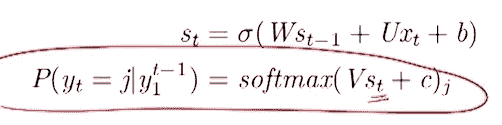

Credit:[https://www.youtube.com/watch?v=7Np_5Q-P8eo&list=PLyqSpQzTE6M9gCgajvQbc68Hk_JKGBAYT&index=113](https://www.youtube.com/watch?v=7Np_5Q-P8eo&list=PLyqSpQzTE6M9gCgajvQbc68Hk_JKGBAYT&index=113)

从上面的 RNN 方程中，我们可以看到下一个字依赖于上一个状态和输入 x(t)。

所以这里的**参数**是 **U，V，W，b，c**

**目标函数是交叉熵的和**

**损失**是

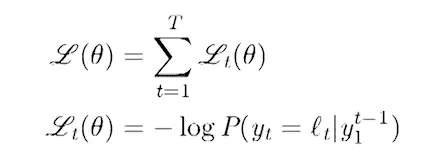

Credit:[https://www.youtube.com/watch?v=7Np_5Q-P8eo&list=PLyqSpQzTE6M9gCgajvQbc68Hk_JKGBAYT&index=113](https://www.youtube.com/watch?v=7Np_5Q-P8eo&list=PLyqSpQzTE6M9gCgajvQbc68Hk_JKGBAYT&index=113)

其中 L(t)是时间步长 t 处的真字

**使用的算法**是通过时间**反向传播**(**BPTT**)。

x(t)是代表字典中第 j 个单词的一个热编码向量。

类似地，我们可以用符号表示 GRU 和 LSTM，如下所示。

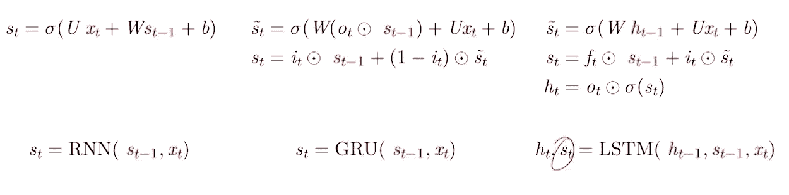

Credit:[https://www.youtube.com/watch?v=7Np_5Q-P8eo&list=PLyqSpQzTE6M9gCgajvQbc68Hk_JKGBAYT&index=113](https://www.youtube.com/watch?v=7Np_5Q-P8eo&list=PLyqSpQzTE6M9gCgajvQbc68Hk_JKGBAYT&index=113)

## **2。)图片**


Credit:[https://www.youtube.com/watch?v=7Np_5Q-P8eo&list=PLyqSpQzTE6M9gCgajvQbc68Hk_JKGBAYT&index=113](https://www.youtube.com/watch?v=7Np_5Q-P8eo&list=PLyqSpQzTE6M9gCgajvQbc68Hk_JKGBAYT&index=113)

现在，对于每一个经过的图像，我们想生成一个见证图像的句子，就像从上面的图像我们可以生成一个句子

***一个男人在公园里扔飞盘*** ”

这可以通过以下方法完成

1.  为了训练，我们自己传递带有像我们人类、飞盘、公园等词语的图像。
2.  或者我们可以使用计算机视觉从图像中提取单词。

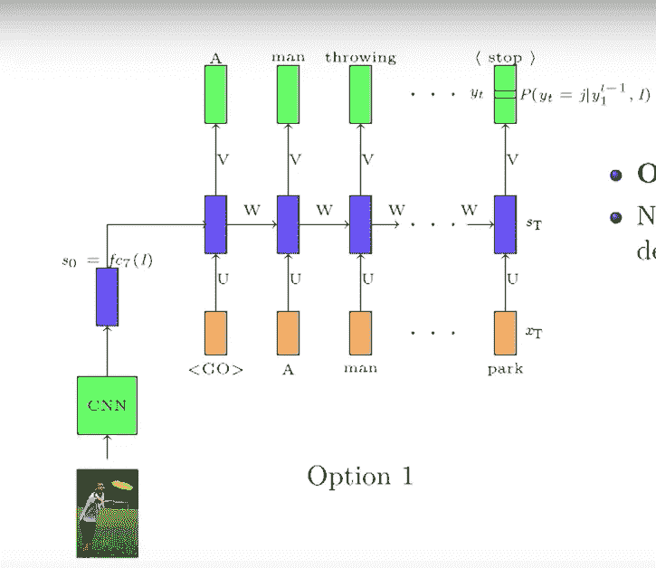

Credit:[https://www.youtube.com/watch?v=7Np_5Q-P8eo&list=PLyqSpQzTE6M9gCgajvQbc68Hk_JKGBAYT&index=113](https://www.youtube.com/watch?v=7Np_5Q-P8eo&list=PLyqSpQzTE6M9gCgajvQbc68Hk_JKGBAYT&index=113)

如上所示，我们从图像中生成单词，然后将其传递给每个解码器层或解码器模型的第一层。

因此，在解码器的第一层，单词和图像的概率等式会发生如下变化

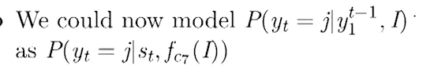

Credit:[https://www.youtube.com/watch?v=7Np_5Q-P8eo&list=PLyqSpQzTE6M9gCgajvQbc68Hk_JKGBAYT&index=113](https://www.youtube.com/watch?v=7Np_5Q-P8eo&list=PLyqSpQzTE6M9gCgajvQbc68Hk_JKGBAYT&index=113)

在给定解码器的阶段 1 处的先前状态(s(t))和图像的情况下，这可以将上述等式解读为下一个字的概率。

这里 fc(7)表示图像通过 7 个完全连接的层。(我们可以像 vgg16 一样思考预测输出的结构)。

现在我们可以看到完整的编码器和解码器模型，如

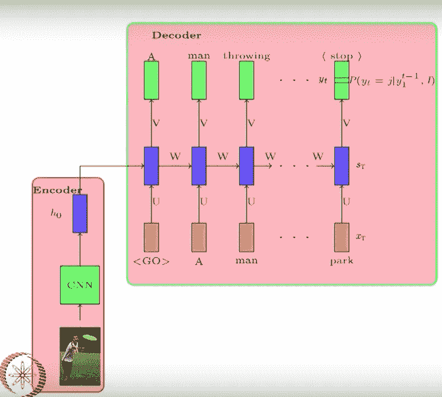

Credit:[https://www.youtube.com/watch?v=7Np_5Q-P8eo&list=PLyqSpQzTE6M9gCgajvQbc68Hk_JKGBAYT&index=113](https://www.youtube.com/watch?v=7Np_5Q-P8eo&list=PLyqSpQzTE6M9gCgajvQbc68Hk_JKGBAYT&index=113)

在上图中，我们首先对我们可以用这个图像生成的每个单词进行编码，然后它被传递给一个解码器，解码器对它进行解码并从图像中生成一个句子。

就像我们对图像进行编码一样，我们可以对一种语言进行编码，然后解码成另一种图像。

> ***注意机制***

到目前为止，我们已经看到，编码器读取句子一次，并对其进行编码，在每个时间步，解码器使用这种嵌入来产生新单词。

但我的问题是，**人类是这样翻译的吗？**

不对，因为我们只看重要的词，因为不是整个句子都重要，但某些词很重要。

人类试图通过关注输入中的某些单词来产生输出中的每个单词。本质上，在每个时间步，我们只关注输入单词的分布。

让我们举一个例子

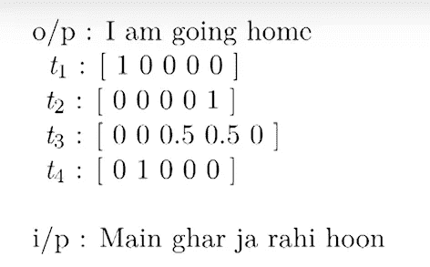

Credit: [https://www.youtube.com/watch?v=yInilk6x-OY&list=PLyqSpQzTE6M9gCgajvQbc68Hk_JKGBAYT&index=115](https://www.youtube.com/watch?v=yInilk6x-OY&list=PLyqSpQzTE6M9gCgajvQbc68Hk_JKGBAYT&index=115)

所以在上图中输入的是 ***主加尔贾拉胡恩***

而输出是 ***我要回家*** 。

因此，当我们看到 **Main** 作为输入时，我们只关注 **Main** ，我们看到的输出是 **I，因此这个[1 0 0 0 0]的向量。**

现在我们得到第二个单词 **ghar** 作为输入，我们生成单词 **home** 作为输出，这个的**向量是[0 0 0 0 1]。**

现在我们同时读取 **ja rahi** 并且输出正在进行。所以向量是[0 0 0.5 0.5 1]。

现在我们终于看到 **hoon** 和这个 **am** 的输出。所以生成的向量是[0 1 0 0 0]。

这里我们改变了编码器的逻辑，因为现在我们不是发送所有的编码向量，而是只发送重要的字，并把它送到解码器。

现在，对于不同的句子，不同大小的单词可能很重要，如[2，3，5，8]等，但图像中的**蓝色** **矢量**是固定大小的。这里我们可以发送所有重要向量的加权平均值。

这个模型现在应该工作得更好，因为我们没有用不相关的信息使解码器过载。

现在新的架构看起来像

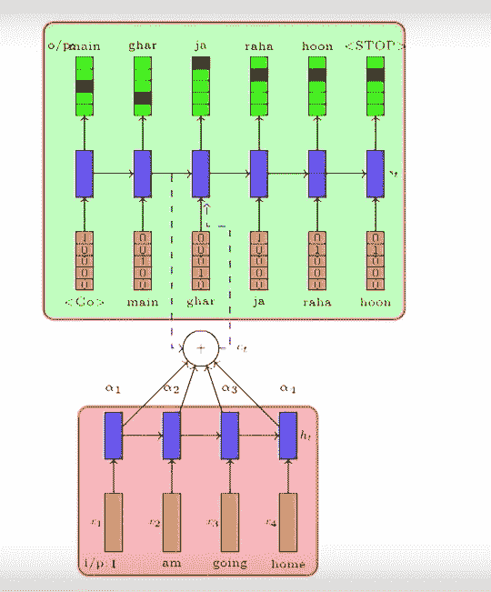

Credit: [https://www.youtube.com/watch?v=yInilk6x-OY&list=PLyqSpQzTE6M9gCgajvQbc68Hk_JKGBAYT&index=115](https://www.youtube.com/watch?v=yInilk6x-OY&list=PLyqSpQzTE6M9gCgajvQbc68Hk_JKGBAYT&index=115)

因此，模型将从数据中学习权重。为了达到这个目的，我们定义了一个函数

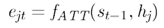

Credit: [https://www.youtube.com/watch?v=yInilk6x-OY&list=PLyqSpQzTE6M9gCgajvQbc68Hk_JKGBAYT&index=115](https://www.youtube.com/watch?v=yInilk6x-OY&list=PLyqSpQzTE6M9gCgajvQbc68Hk_JKGBAYT&index=115)

因此，这里 **e** *j(t)* 表示第 j 个字是什么，字 j 在时间步长(t)有多重要，以及解码器在时间步长(t-1)的状态是什么

h(j)在每个时间步捕捉编码器的状态。

s(t)在每个时间步长捕捉解码器的状态。

现在通过 softmax 函数归一化权重

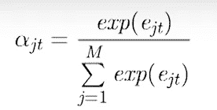

Credit: [https://www.youtube.com/watch?v=yInilk6x-OY&list=PLyqSpQzTE6M9gCgajvQbc68Hk_JKGBAYT&index=115](https://www.youtube.com/watch?v=yInilk6x-OY&list=PLyqSpQzTE6M9gCgajvQbc68Hk_JKGBAYT&index=115)

α *j(t)* i 在 t 时间步聚焦第 j 个字的概率。

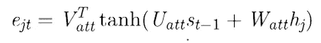

Credit: [https://www.youtube.com/watch?v=yInilk6x-OY&list=PLyqSpQzTE6M9gCgajvQbc68Hk_JKGBAYT&index=115](https://www.youtube.com/watch?v=yInilk6x-OY&list=PLyqSpQzTE6M9gCgajvQbc68Hk_JKGBAYT&index=115)

这里，我们使 **e** *j(t)* 依赖于 s(t-1)和 hj，并且这些参数将与所有编码器和解码器参数一起学习。

**e**j(t)是标量。

Uatt 的尺寸为(d1*d)

s(t-1)的维数是(d)

瓦特的尺寸是(d1*d)

hj 的尺寸为(d)

Vatt(T)的尺寸为(d1)

但是在现实世界中，我们没有α的真实权重。所以不能用 L[α(true)-α(pred)]最小化。

但这种模式应该更好，因为假设你正在学习自行车，我已经告诉你最好的学习方法，像划水，握住两个把手。

因此，在这种情况下，即使通过大量的下落和平衡你的重量，你也会不知何故地学会如何平衡你的重量，并在不下落的情况下向前移动。

类似地，我们的模型将翻译错误的单词，可能是因为错误的权重、错误的连接，然后更新权重以获得最佳结果。

最后是**方程式**

**输入**将同上

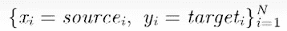

Credit: [https://www.youtube.com/watch?v=yInilk6x-OY&list=PLyqSpQzTE6M9gCgajvQbc68Hk_JKGBAYT&index=115](https://www.youtube.com/watch?v=yInilk6x-OY&list=PLyqSpQzTE6M9gCgajvQbc68Hk_JKGBAYT&index=115)

**编码器**

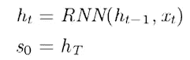

Credit: [https://www.youtube.com/watch?v=yInilk6x-OY&list=PLyqSpQzTE6M9gCgajvQbc68Hk_JKGBAYT&index=115](https://www.youtube.com/watch?v=yInilk6x-OY&list=PLyqSpQzTE6M9gCgajvQbc68Hk_JKGBAYT&index=115)

**解码器**

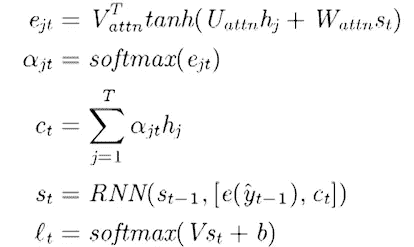

Credit: [https://www.youtube.com/watch?v=yInilk6x-OY&list=PLyqSpQzTE6M9gCgajvQbc68Hk_JKGBAYT&index=115](https://www.youtube.com/watch?v=yInilk6x-OY&list=PLyqSpQzTE6M9gCgajvQbc68Hk_JKGBAYT&index=115)

**e**j(t)是概率

c(t)是发送到编码器的加权和

s(t)是解码器的输出

s(t-1)是先前的状态

e(y(t-1))是先前预测的字

l(t)是概率分布

**参数**

U(dec)，V，W(dec)，U(enc)，W(enc)，b，U(attn)，V(attn)

**损耗**和**算法**同上。

> ***代码***

让我们深入研究印地语到英语的翻译代码。

*你可以从* [**这里**](http://www.manythings.org/anki/) **下载数据集。** *由于我发现 hin-eng 的数据较少，但你应该尝试使用大数据，因为深度学习模型需要大量数据。*

在训练模型后，我们将能够输入一个印地语句子，如**“तुमकहाँगएथे？”**，并返回英文翻译:**“你去哪里了？”**

> ***导入必要的库***

导入所有有用的必要库

1.  有了 __future__ module 的内含物，我们可以慢慢习惯不兼容的变化或引入新关键字的变化。
2.  使用 tensorflow 版
3.  在此阅读更多关于 unicodedata [的信息](https://docs.python.org/2/library/unicodedata.html)

```
from __future__ import absolute_import, division, print_function, unicode_literalstry:
  # %tensorflow_version only exists in Colab.
  %tensorflow_version 2.x
except Exception:
  pass
import tensorflow as tfimport matplotlib.pyplot as plt
import matplotlib.ticker as ticker
from sklearn.model_selection import train_test_splitimport unicodedata
import re
import numpy as np
import os
import io
import time
```

> ***下载数据集***

我将使用由[http://www.manythings.org/anki/](http://www.manythings.org/anki/)提供的语言数据集。该数据集包含所需格式的语言翻译对。我将把北印度语翻译成英语，因为如果事情正常或不正常，我会更容易理解。

**我下载了数据集，并将其放入我的驱动器，通过从 keras** 调用 get_file 直接获取它

1.  下载文件
2.  [**TF . keras . utils . get**](https://www.tensorflow.org/api_docs/python/tf/keras/utils/get_file)文件会自动从给定的下载链接直接下载文件。

```
path_to_zip = tf.keras.utils.get_file(
    'hin-eng.zip', origin='your downloading link',
    extract=True)
```

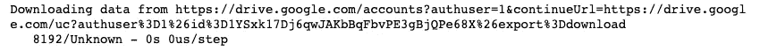

> ***文本 _ 预处理***

这里我们不能删除大部分字符，就像我们在这里看到的[**一样**](https://www.tensorflow.org/beta/tutorials/text/nmt_with_attention)
因为印地语单词有很多字符我们不能简单地删除，比如**【卡汉】【कहाँ】**

1.  在单词和它后面的标点符号之间创造一个空间，例如:“他住在孟买。”= >“他住在孟买**。**
2.  在句子中添加一个开始和结束标记，这样我们就可以知道模型何时开始和停止预测。

```
#text preprocessing
def preprocess_sentence(w):w = re.sub(r"([?.!,¿])", r" \1 ", w)
    w = re.sub(r'[" "]+', " ", w)
    w = w.rstrip().strip()
    w = '<start> ' + w + ' <end>'
    return w
```

> ***创建数据集***

在本节中，我们将创建所需格式的文本数据，如印地语-英语单词对。

以下代码行会:

1.  打开文件，从头到尾剥离，最后在看到行分隔符时拆分行(" \n ")
2.  然后生成用制表符(" \t ")分隔的印地语-英语单词对

```
def create_dataset(path, num_examples):

    lines = io.open(path, encoding='UTF-   8').read().strip().split('\n')

    word_pairs = [[preprocess_sentence(w) for w in l.split('\t')]  for l in lines[:num_examples]]

    return zip(*word_pairs)#creating dataset preprocessing and zipping
en, hi = create_dataset("hin.txt", None)
```

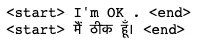

> ***分词功能***

将它符号化非常重要，因为没有机器算法能理解文本，它们能理解的只是数字。因此，通过标记化，我们将每个唯一的单词转换为其在空间中的唯一标记。

下面的代码块是:

1.  初始化标记器并使其适合文本
2.  最后把它转换成向量序列
3.  但是由于每个句子的长度不同，所以我们需要填充它，使序列长度相同。

[**过滤**](https://www.tensorflow.org/api_docs/python/tf/keras/preprocessing/text/Tokenizer) **:** 一个字符串，其中每个元素都是一个字符，将从文本中过滤掉**。**默认为所有标点符号，加上制表符和换行符，减去`'`字符。

```
def tokenize(lang):

  lang_tokenizer = tf.keras.preprocessing.text.Tokenizer(
      filters='')

  lang_tokenizer.fit_on_texts(lang)

  tensor = lang_tokenizer.texts_to_sequences(lang)

  tensor = tf.keras.preprocessing.sequence.pad_sequences(tensor,
                                                         padding='post')return tensor, lang_tokenizer
```

> ***Load_Dataset 函数***

在本节中，我们将加载数据集，对其进行标记，并以张量的形式返回输出。

```
def load_dataset(path, num_examples=None):
    targ_lang, inp_lang = create_dataset(path, num_examples) input_tensor, inp_lang_tokenizer = tokenize(inp_lang)
    target_tensor, targ_lang_tokenizer = tokenize(targ_lang)return input_tensor, target_tensor, inp_lang_tokenizer, targ_lang_tokenizer
```

由于印地语到英语的数据集没有太多的例子，所以我们将考虑所有的
，但是记住的数据集越多，结果越好。

```
# Try experimenting with the size of that dataset
num_examples = 2810
input_tensor, target_tensor, inp_lang, targ_lang = load_dataset("hin.txt", num_examples)
```

> ***将数据集划分为训练和验证***

```
input_tensor_train, input_tensor_val, target_tensor_train, target_tensor_val = train_test_split(input_tensor, target_tensor, test_size=0.2)print(len(input_tensor_train), len(target_tensor_train), len(input_tensor_val), len(target_tensor_val))
```


现在让我们用一个例子来检验我们是如何把单词转换成张量的

```
**def** convert(lang, tensor):
  **for** t **in** tensor:
    **if** t!=0:
      print ("**%d** ----> **%s**" % (t, lang.index_word[t]))
```

**印地语**

```
print ("Input Language; index to word mapping")
convert(inp_lang, input_tensor_train[0])
```

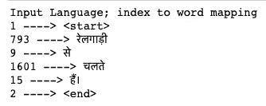

**英语**

```
print ("Target Language; index to word mapping")
convert(targ_lang, target_tensor_train[0])
```


> ***编码器***

编码器神经网络读取源句子并将其编码成称为上下文向量的固定长度向量。

本部分的结构与本博客**主题介绍**部分的解释相同(参见上文)。)

下面的代码是:

1.  将词汇嵌入到我们想要的维度。
2.  使用 glorot_uniform 初始值设定项将输出维度(单位)传递给 GRU。
3.  最后返回零数组。

```
class Encoder(tf.keras.Model):def __init__(self, vocab_size, embedding_dim, enc_units, batch_sz):
    super(Encoder, self).__init__()
    self.batch_sz = batch_sz
    self.enc_units = enc_units
    self.embedding = tf.keras.layers.Embedding(vocab_size, embedding_dim)
    self.gru = tf.keras.layers.GRU(self.enc_units,
                                   return_sequences=True,
                                   return_state=True,
                                   recurrent_initializer='glorot_uniform')def call(self, x, hidden):
    x = self.embedding(x)
    output, state = self.gru(x, initial_state = hidden)
    return output, statedef initialize_hidden_state(self):
    return tf.zeros((self.batch_sz, self.enc_units))
```

> ***巴丹瑙注意***

在 [Bahdanau 注意](https://arxiv.org/abs/1409.0473)的时候**t*t*我们考虑一下**t-1解码器的隐藏状态。然后我们计算对齐，上下文向量。然后我们将这个上下文与解码器在 ***t-1*** 的隐藏状态连接起来。所以在 softmax 之前，这个连接的向量放在一个 GRU 中****

本部分的结构与本博客**主题介绍**部分的解释相同(参见上文)。)

注意:这个架构和上面以及我之前的博客中解释的一样

注意力权重= α(jt)

特征= h(j)

上下文向量=σα(JT)* h(j)

```
class BahdanauAttention(tf.keras.Model):
  def __init__(self, units):
    super(BahdanauAttention, self).__init__()
    self.W1 = tf.keras.layers.Dense(units)
    self.W2 = tf.keras.layers.Dense(units)
    self.V = tf.keras.layers.Dense(1)def call(self, query, values):hidden_with_time_axis = tf.expand_dims(query, 1)score = self.V(tf.nn.tanh(
        self.W1(values) + self.W2(hidden_with_time_axis)))attention_weights = tf.nn.softmax(score, axis=1)context_vector = attention_weights * values
    context_vector = tf.reduce_sum(context_vector, axis=1)return context_vector, attention_weights
```

> ***解码器***

解码器输出来自编码向量的翻译。

解码器考虑来自解码器先前状态的输入和来自编码器的当前输入，随后是注意力。

本部分的结构与本博客**主题介绍**部分的解释相同(参见上文)。)

下面是解码器类的代码:

1.  将词汇嵌入到我们想要的维度(这里我们将使用 256。)
2.  使用 glorot_uniform 初始值设定项将输出维度(单位)传递给 GRU。
3.  添加完全连接的层
4.  最后呼吁 bahdanau 注意
5.  现在在调用函数中

打电话:

1.  将解码器的先前状态与注意上下文向量连接起来。
2.  将前一状态的输出传递给 GRU
3.  对 gru 产生的输出进行整形，并最终将其传递给全连接层

```
class Decoder(tf.keras.Model):
  def __init__(self, vocab_size, embedding_dim, dec_units, batch_sz):
    super(Decoder, self).__init__()
    self.batch_sz = batch_sz
    self.dec_units = dec_units
    self.embedding = tf.keras.layers.Embedding(vocab_size, embedding_dim)
    self.gru = tf.keras.layers.GRU(self.dec_units,
                                   return_sequences=True,
                                   return_state=True,
                                   recurrent_initializer='glorot_uniform')
    self.fc = tf.keras.layers.Dense(vocab_size) self.attention = BahdanauAttention(self.dec_units)def call(self, x, hidden, enc_output):

    context_vector, attention_weights = self.attention(hidden, enc_output) x = self.embedding(x) x = tf.concat([tf.expand_dims(context_vector, 1), x], axis=-1) output, state = self.gru(x) output = tf.reshape(output, (-1, output.shape[2])) x = self.fc(output)return x, state, attention_weights
```

> ***损失函数和优化器***

这里我们选择的损失是稀疏分类交叉熵。我们使用它的原因是因为当我们有 2 个或更多标签时，它会计算交叉熵损失。使用的优化器是 Adam。

```
optimizer = tf.keras.optimizers.Adam()
loss_object = tf.keras.losses.SparseCategoricalCrossentropy(
    from_logits=True, reduction='none')
```

> ***训练模特***

最后制作检查点以保存最佳权重，并将模型训练到 50 个历元。

因为我只有很少的翻译数据，所以我把它训练到 50 个纪元，我损失很大。

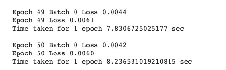

> ***最终评价***

因为我只有很少数据，所以模型仍然表现很好。

**最佳结果**

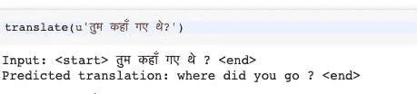

**最差结果**

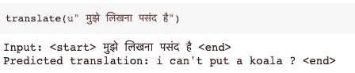

***感谢阅读。我希望你喜欢阅读这篇文章，你可以在这里找到完整的代码***[](https://github.com/navneetkr123/Attention-Mechanism-HIn-Eng-Translator-NLP-)****，并尝试用你觉得合适的不同的*** [***语言***](http://www.manythings.org/anki/) ***来实现。****

> **谢谢**

*[**公众号简介**](https://www.linkedin.com/in/navneet-kumar-52531816b/)*

*[**下一篇博客**](https://medium.com/@navneetkumarbitsindri/attention-mechanism-image-captioning-using-tensorflow-ebf180ec67ec)*

> ****未来工作****

1.  *尝试使用更多数据集以获得最佳结果。*

*2.超参数调谐*

*3.用 LSTM 代替 GRU*

*4.尝试不同的优化器和损失*

> ****参考文献****

1.  *[https://www.youtube.com/watch?v=7Np_5Q-P8eo&list = plyqspqzte 6m 9 gcgajvqbc 68 hk _ JKGBAYT&index = 113](https://www.youtube.com/watch?v=7Np_5Q-P8eo&list=PLyqSpQzTE6M9gCgajvQbc68Hk_JKGBAYT&index=113)*
2.  *[https://www.youtube.com/watch?v=W2rWgXJBZhU](https://www.youtube.com/watch?v=W2rWgXJBZhU)*
3.  *[https://www.youtube.com/watch?v=yInilk6x-OY&list = plyqspqzte 6m 9 gcgajvqbc 68 hk _ JKGBAYT&index = 115](https://www.youtube.com/watch?v=yInilk6x-OY&list=PLyqSpQzTE6M9gCgajvQbc68Hk_JKGBAYT&index=115)*
4.  *[https://www . tensor flow . org/beta/tutorials/text/NMT _ with _ attention](https://www.tensorflow.org/beta/tutorials/text/nmt_with_attention)*
5.  *【http://www.manythings.org/anki/ *
6.  *[https://arxiv.org/abs/1409.0473](https://arxiv.org/abs/1409.0473)*
7.  *[https://www . tensor flow . org/API _ docs/python/TF/keras/preprocessing/text/Tokenizer](https://www.tensorflow.org/api_docs/python/tf/keras/preprocessing/text/Tokenizer)*
8.  *h[ttps://stack overflow . com/questions/49579684/来自张量的数据集和来自张量切片的数据集之间的差异](https://stackoverflow.com/questions/49579684/difference-between-dataset-from-tensors-and-dataset-from-tensor-slices)*
9.  *[https://towards data science . com/how-to-use-dataset-in-tensor flow-c 758 ef 9 e 4428](https://towardsdatascience.com/how-to-use-dataset-in-tensorflow-c758ef9e4428)*
10.  *[https://www . programiz . com/python-programming/methods/built-in/next](https://www.programiz.com/python-programming/methods/built-in/next)*
11.  *[https://ai . Google blog . com/2016/09/a-neural-network-for-machine . html](https://ai.googleblog.com/2016/09/a-neural-network-for-machine.html)*
12.  *[https://www.tensorflow.org/api_docs/python/tf/expand_dims](https://www.tensorflow.org/api_docs/python/tf/expand_dims)*
13.  *[https://www.youtube.com/watch?v=W2rWgXJBZhU](https://www.youtube.com/watch?v=W2rWgXJBZhU)*