# 注意力机制(使用 Tensorflow 的图像字幕)

> 原文：<https://medium.datadriveninvestor.com/attention-mechanism-image-captioning-using-tensorflow-ebf180ec67ec?source=collection_archive---------1----------------------->

嗨，我是 [Navneet](https://www.linkedin.com/in/navneet-kumar-52531816b/) ，

在这篇文章中，你将详细地学习我们如何将注意力机制应用于图像字幕。

"鸣谢:[https://www . tensor flow . org/beta/tutorials/text/image _ captioning](https://www.tensorflow.org/beta/tutorials/text/image_captioning)"

[](https://www.datadriveninvestor.com/2019/01/23/deep-learning-explained-in-7-steps/) [## 深度学习用 7 个步骤解释-更新|数据驱动的投资者

### 在深度学习的帮助下，自动驾驶汽车、Alexa、医学成像-小工具正在我们周围变得超级智能…

www.datadriveninvestor.com](https://www.datadriveninvestor.com/2019/01/23/deep-learning-explained-in-7-steps/) 

你可以在 [LinkedIn](https://www.linkedin.com/in/navneet-kumar-52531816b/) 上联系我

> ***目录***

1.  概念解释
2.  真实世界的例子
3.  架构和数据集
4.  导入必要的库
5.  下载并准备 MS-COCO 数据集
6.  使用 InceptionV3 进行图像预处理
7.  初始化初始版本 3 并加载预训练的砝码
8.  捕捉从 InceptionV3 中提取的特征
9.  预处理和标记字幕
10.  将数据分为训练和测试
11.  巴丹瑙注意了
12.  CNN 编码器
13.  RNN 解码器
14.  训练模型和评估
15.  未来的工作
16.  参考( [1](https://www.tensorflow.org/beta/tutorials/text/image_captioning) ) ( [2](https://www.youtube.com/watch?v=hvhqHhrP_AU&list=PLyqSpQzTE6M9gCgajvQbc68Hk_JKGBAYT&index=117) )

> ***概念解释***

正如我们在我以前的博客中看到的，在注意力机制的帮助下，我们可以提取一些重要的单词，并将其传递给解码器进行机器翻译。

类似地，对于图像，从图像中提取字幕时，不是图像的每个像素都重要。即使只有很少的像素，我们也能从图像中预测出好的标题。这可以通过注意机制来实现。

在文本的情况下，我们对输入序列的每个位置(时间步长)都有一个表示。对于文本，每个单词都是离散的，所以我们知道每个输入在不同的时间步长。正如我们在下图中看到的， ***我要回家了*** 在不同的时间步传递给编码器。

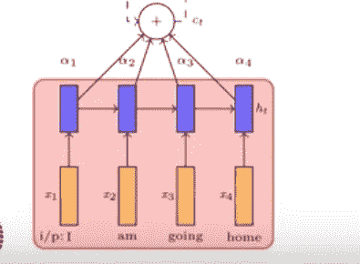

Fig1..Credit:[https://www.youtube.com/watch?v=hvhqHhrP_AU&list=PLyqSpQzTE6M9gCgajvQbc68Hk_JKGBAYT&index=117](https://www.youtube.com/watch?v=hvhqHhrP_AU&list=PLyqSpQzTE6M9gCgajvQbc68Hk_JKGBAYT&index=117)

现在的问题是，我们如何为图像的注意力机制建模？

对于图像，我们通常使用一个完全连接的图层的表示。但是假设如下图所示，**一个男人正在扔飞盘**。

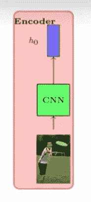

Fig2..Credit:[https://www.youtube.com/watch?v=hvhqHhrP_AU&list=PLyqSpQzTE6M9gCgajvQbc68Hk_JKGBAYT&index=117](https://www.youtube.com/watch?v=hvhqHhrP_AU&list=PLyqSpQzTE6M9gCgajvQbc68Hk_JKGBAYT&index=117)

所以，当我说单词**男人**时，这意味着我们只需要关注图像中的男人，当我说单词**投掷**时，我们必须关注图像中他的手。这意味着**人，投掷**来自图像中不同的像素。但是我们在上一篇博客中使用的 FC7 表示不包含任何位置信息。

例如考虑下面的层

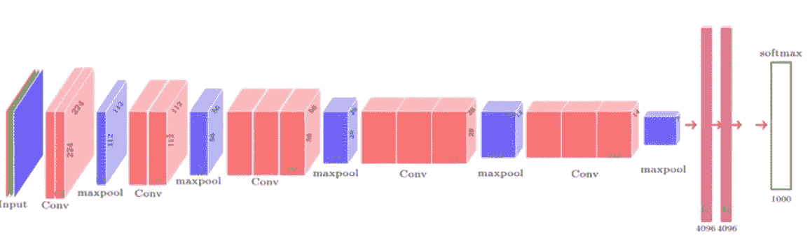

Fig3..Credit:[https://www.youtube.com/watch?v=hvhqHhrP_AU&list=PLyqSpQzTE6M9gCgajvQbc68Hk_JKGBAYT&index=117](https://www.youtube.com/watch?v=hvhqHhrP_AU&list=PLyqSpQzTE6M9gCgajvQbc68Hk_JKGBAYT&index=117)

对于下面的层，我们不知道任何位置信息。


Fig4..Credit: [https://www.youtube.com/watch?v=hvhqHhrP_AU&list=PLyqSpQzTE6M9gCgajvQbc68Hk_JKGBAYT&index=117](https://www.youtube.com/watch?v=hvhqHhrP_AU&list=PLyqSpQzTE6M9gCgajvQbc68Hk_JKGBAYT&index=117)

但是卷积层的每个位置对应于图像的某个位置，如下所示。

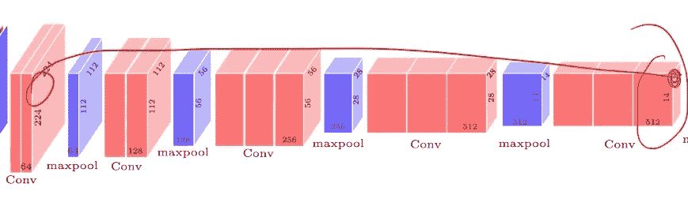

Fig5..Credit:[https://www.youtube.com/watch?v=hvhqHhrP_AU&list=PLyqSpQzTE6M9gCgajvQbc68Hk_JKGBAYT&index=117](https://www.youtube.com/watch?v=hvhqHhrP_AU&list=PLyqSpQzTE6M9gCgajvQbc68Hk_JKGBAYT&index=117)

现在让我们说这个第五卷积层有 14*14 个位置对应于图像中的某个部分，这意味着我们有 196 个这样的位置。

最后，我们可以把这 196 个位置(每个都有 512 个维度)视为我们在我之前的博客中看到的单词。

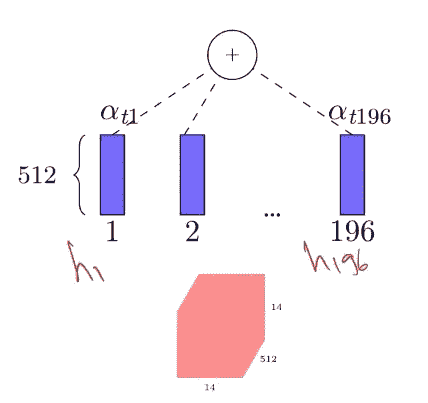

Fig6..Credit: [https://www.youtube.com/watch?v=hvhqHhrP_AU&list=PLyqSpQzTE6M9gCgajvQbc68Hk_JKGBAYT&index=117](https://www.youtube.com/watch?v=hvhqHhrP_AU&list=PLyqSpQzTE6M9gCgajvQbc68Hk_JKGBAYT&index=117)

如上图所示，第 5 个卷积块由 196 个位置表示，这些位置可以在不同的时间步长内通过。

α的等式和我们在文本中看到的相似。

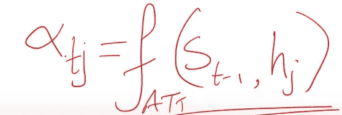

Fig7.Credit: [https://www.youtube.com/watch?v=hvhqHhrP_AU&list=PLyqSpQzTE6M9gCgajvQbc68Hk_JKGBAYT&index=117](https://www.youtube.com/watch?v=hvhqHhrP_AU&list=PLyqSpQzTE6M9gCgajvQbc68Hk_JKGBAYT&index=117)

这里，α(jt)表示在 t 时间步的第 j 个位置的重要性。

S(t-1)是解码器的先前状态

h(j)编码器状态。

F(att)可以进一步表示为标量。

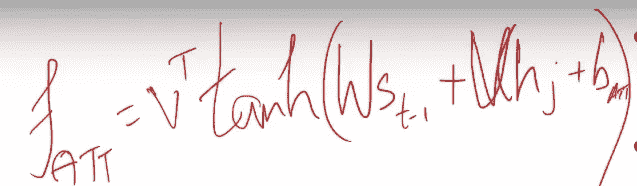

Fig8..Credit: [https://www.youtube.com/watch?v=hvhqHhrP_AU&list=PLyqSpQzTE6M9gCgajvQbc68Hk_JKGBAYT&index=117](https://www.youtube.com/watch?v=hvhqHhrP_AU&list=PLyqSpQzTE6M9gCgajvQbc68Hk_JKGBAYT&index=117)

> ***现实世界的例子***

现在你已经很好的理解了注意力模型是如何在不同的时间点关注图像中的不同位置的。

我们可以在各种领域使用这种技术，例如:

1.  在谷歌上用图片搜索内容
2.  自动驾驶汽车通过查看图像来为周围发生的事情添加字幕。
3.  人脸识别和检测等。

现在让我们深入到编码部分，我们使用**注意机制实现了一个**图像字幕**的模型。**

> ***架构和数据集***

模型架构类似于[展示、参与和讲述:具有视觉注意力的神经图像字幕生成](https://arxiv.org/abs/1502.03044)。

我们将使用 [MS-COCO](http://cocodataset.org/#home) 数据集，对其进行预处理，并使用 Inception V3 获取图像子集，训练编码器-解码器模型，并使用训练好的模型在新图像上生成字幕。

我用 50，000 张图片来训练这个模型

> ***导入必要的库***

使用 matplotlib.pyplot，我们将生成注意力图，以便可视化我们的模型在字幕过程中关注图像的哪些部分。

```
from __future__ import absolute_import, division, print_function, unicode_literalstry:
  # %tensorflow_version only exists in Colab.
  %tensorflow_version 2.x
except Exception:
  pass
import tensorflow as tfimport matplotlib.pyplot as plt# Scikit-learn includes many helpful utilities
from sklearn.model_selection import train_test_split
from sklearn.utils import shuffleimport re
import numpy as np
import os
import time
import json
from glob import glob
from PIL import Image
import pickle
```

> ***下载并准备 MS-COCO 数据集***

我们将使用 Ms-Mooc 数据集来训练我们的图像。该数据集包含 82，000 幅图像，每幅图像有 5 个标题。但是为了训练这个模型，我将使用 50，000 张图片。

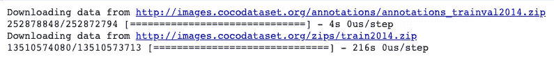

现在将数据限制为 50，000 张图片，这将包含 414113 个标题。

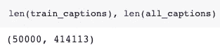

但是请记住，数据集越多，模型越精确。

> ***图像预处理使用 InceptionV3***

现在我们将使用 inceptionV3，这是一个用于图像分类的预训练模型。我们将从卷积层的最后几层提取特征。

对于预处理，我们需要将 50，000 张图片的大小改为 InceptionV3 预期的格式。

*   将图像大小调整为 299 像素乘以 299 像素
*   [使用](https://cloud.google.com/tpu/docs/inception-v3-advanced#preprocessing_stage) [preprocess_input](https://www.tensorflow.org/api_docs/python/tf/keras/applications/inception_v3/preprocess_input) 方法预处理图像以标准化图像，使其包含-1 到 1 范围内的像素，这与用于训练 InceptionV3 的图像格式相匹配。

```
def load_image(image_path):
    img = tf.io.read_file(image_path)
    img = tf.image.decode_jpeg(img, channels=3)
    img = tf.image.resize(img, (299, 299))
    img = tf.keras.applications.inception_v3.preprocess_input(img)
    return img, image_path
```

上面的块代码是:

1.  从图像路径读取图像
2.  用 3 个通道解码成 jpeg 格式
3.  将其调整为 299 像素* 299 像素的形状
4.  最后将像素转换到范围-1 到 1。

> ***初始化 InceptionV3 并加载预训练的 Imagenet 权重***

现在我们要创建一个 tf.keras 模型，其中输出层是 InceptionV3 架构中的最后一个卷积层。

```
The shape of the output of this layer is 8x8x2048. we will use the last convolutional layer as explained above because we are using attention in this example.
```

下面的代码块是:

1.  加载 imagenet 模型的权重，但不包括完全连接的层。
2.  现在设置这个模型为输入，它的最后一层为隐藏层，最后传递给 keras 模型。

```
image_model = tf.keras.applications.InceptionV3(include_top=False,
                                                weights='imagenet')
new_input = image_model.input
hidden_layer = image_model.layers[-1].outputimage_features_extract_model = tf.keras.Model(new_input, hidden_layer)
```

> ***缓存从 InceptionV3 中提取的特征***

在这一节中，我们将预处理每张图像，并将输出保存到 dick。这将减少时间，但不是内存有效的。

下面的代码块是:

1.  得到所有独特的图像。
2.  [为输入张量的每一行创建一个带有单独元素的数据集](http://tf.data.experimental.AUTOTUNE)。
3.  [将](https://www.tensorflow.org/api_docs/python/tf/data/experimental/map_and_batch) `[ma](https://www.tensorflow.org/api_docs/python/tf/data/experimental/map_and_batch)p_func`映射到该数据集的`batch_size`个连续元素上，然后将它们组合成一批。功能上相当于`map`后面跟着`batch`。
4.  提取特征并对其进行整形，最后保存模型。

```
# Get unique images
encode_train = sorted(set(img_name_vector))# Feel free to change batch_size according to your system configuration
image_dataset = tf.data.Dataset.from_tensor_slices(encode_train)
image_dataset = image_dataset.map(
  load_image, num_parallel_calls=tf.data.experimental.AUTOTUNE).batch(16)for img, path in image_dataset:
  batch_features = image_features_extract_model(img)
  batch_features = tf.reshape(batch_features,
                              (batch_features.shape[0], -1, batch_features.shape[3]))for bf, p in zip(batch_features, path):
    path_of_feature = p.numpy().decode("utf-8")
    np.save(path_of_feature, bf.numpy())
```

> ***预处理并标记字幕***

对单词进行预处理，然后对其进行标记非常重要，因为没有任何机器算法能够理解文本，它们所理解的只是数字。因此，通过标记化，我们将每个唯一的单词转换为其在空间中的唯一标记。

下面的代码块是:

1.  首先，我们将对单词进行标记，这将为我们提供数据中所有唯一单词的词汇。
2.  然后我们会把词汇量限制在 5000，以节省内存。
3.  然后，我们将用标记“UNK”(未知)替换所有其他单词。【`[<unk>](https://datascience.stackexchange.com/questions/33444/do-we-really-need-unk-tokens)`标签可以简单地用来告诉模型有*东西*，这对输出来说在语义上并不重要】
4.  然后我们将创建索引到单词和单词到索引的映射。
5.  现在最后将序列填充到与最长序列相同的长度。如果我们不提供最大长度，那么 pad 会自动计算。这里我们做后期填充。

```
#selecting top 5000 words
top_k = 5000
tokenizer = tf.keras.preprocessing.text.Tokenizer(num_words=top_k,
                                                  oov_token="<unk>",
                                                  filters='!"#$%&()*+.,-/:;=?@[\]^_`{|}~ ')
tokenizer.fit_on_texts(train_captions)
train_seqs = tokenizer.texts_to_sequences(train_captions)# Create the tokenized vectors
train_seqs = tokenizer.texts_to_sequences(train_captions)#padding
cap_vector = tf.keras.preprocessing.sequence.pad_sequences(train_seqs, padding='post')# Find the maximum length of any caption in our dataset
def calc_max_length(tensor):
    return max(len(t) for t in tensor)max_length = calc_max_length(train_seqs)
```

> ***将数据拆分成训练并测试***

现在，我们将数据集分为训练和测试，以便在训练数据集中训练我们的模型，在测试数据集中进行测试。

```
img_name_train, img_name_val, cap_train, cap_val = train_test_split(img_name_vector,
                                                                  cap_vector,
                                                                    test_size=0.2,
                                                                    random_state=0)len(img_name_train), len(cap_train), len(img_name_val), len(cap_val)
```

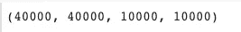

> [***巴哈瑙注意***](https://arxiv.org/pdf/1409.0473.pdf)

本部分的结构与本博客解释部分的解释相同(参见上文)。)

注意:这个架构和上面以及我之前的博客中解释的一样

注意力权重= α(jt)

特征= h(j)

上下文向量=σα(JT)* h(j)

```
class BahdanauAttention(tf.keras.Model):
  def __init__(self, units):
    super(BahdanauAttention, self).__init__()
    self.W1 = tf.keras.layers.Dense(units)
    self.W2 = tf.keras.layers.Dense(units)
    self.V = tf.keras.layers.Dense(1)def call(self, features, hidden):

    hidden_with_time_axis = tf.expand_dims(hidden, 1)

    score = tf.nn.tanh(self.W1(features) +    self.W2(hidden_with_time_axis))

    attention_weights = tf.nn.softmax(self.V(score), axis=1) context_vector = attention_weights * features
    context_vector = tf.reduce_sum(context_vector, axis=1)return context_vector, attention_weights
```

> ***CNN 编码器***

因为我们已经提取了特征，并使用 pickle 将其转储(如上)。该编码器通过完全连接的层传递这些特征。

```
class CNN_Encoder(tf.keras.Model):

    def __init__(self, embedding_dim):
        super(CNN_Encoder, self).__init__()

        self.fc = tf.keras.layers.Dense(embedding_dim)def call(self, x):
        x = self.fc(x)
        x = tf.nn.relu(x)
        return x
```

> ***RNN 解码器***

Rnn 解码器考虑来自解码器的先前状态的输入和来自编码器的当前输入，随后是注意力。

下面 RNN _ 解码器类的代码是:

1.  将词汇嵌入到我们想要的维度(这里我们将使用 252。)
2.  使用 glorot_uniform 初始值设定项将输出维度(单位)传递给 GRU。
3.  添加具有由 GRU 提供的输入作为输出的全连接第 1 层和具有 256 个神经元的全连接第 2 层。
4.  最后呼吁 bahdanau 注意
5.  现在在调用函数中

打电话:

1.  将解码器的先前状态与注意上下文向量连接起来。
2.  将前一状态的输出传递给 GRU
3.  然后最终将其传递给完全连接的第 1 层和第 2 层。

```
class RNN_Decoder(tf.keras.Model):
  def __init__(self, embedding_dim, units, vocab_size):
    super(RNN_Decoder, self).__init__()
    self.units = unitsself.embedding = tf.keras.layers.Embedding(vocab_size, embedding_dim)
    self.gru = tf.keras.layers.GRU(self.units,
                                   return_sequences=True,
                                   return_state=True,
                                   recurrent_initializer='glorot_uniform')
    self.fc1 = tf.keras.layers.Dense(self.units)
    self.fc2 = tf.keras.layers.Dense(vocab_size)self.attention = BahdanauAttention(self.units)def call(self, x, features, hidden):
    # defining attention as a separate model
    context_vector, attention_weights = self.attention(features, hidden) x = self.embedding(x)
    x = tf.concat([tf.expand_dims(context_vector, 1), x], axis=-1)
    output, state = self.gru(x)
    x = self.fc1(output)
    x = tf.reshape(x, (-1, x.shape[2]))
    x = self.fc2(x)return x, state, attention_weightsdef reset_state(self, batch_size):
    return tf.zeros((batch_size, self.units))encoder = CNN_Encoder(embedding_dim)
decoder = RNN_Decoder(embedding_dim, units, vocab_size)
```

> ***训练模型*和评价**

现在，一旦我们定义了编码器、解码器和注意力的架构。然后下一步是训练模型，但在此之前，我们必须选择一个优化器和一个损失函数，这可以表明我们的模型工作得有多好。

这里我们选择的损失是稀疏分类交叉熵。我们使用它的原因是，当我们有 2 个或更多标签时，它会计算交叉熵损失。使用的优化器是 Adam。

```
optimizer = tf.keras.optimizers.Adam()
loss_object = tf.keras.losses.SparseCategoricalCrossentropy(
    from_logits=True, reduction='none')def loss_function(real, pred):
  mask = tf.math.logical_not(tf.math.equal(real, 0))
  loss_ = loss_object(real, pred)mask = tf.cast(mask, dtype=loss_.dtype)
  loss_ *= maskreturn tf.reduce_mean(loss_)
```

现在我们可以提取存储在各自的`.npy`文件中的特征，然后通过编码器传递这些特征。然后，编码器输出、隐藏状态(初始化为 0)和解码器输入(即起始令牌)被传递给解码器。解码器返回预测和解码器隐藏状态。解码器隐藏状态然后被传递回模型，并且预测被用于计算损失。最后一步是计算梯度，并将其应用于优化器和反向传播。

```
[@tf](http://twitter.com/tf).function
def train_step(img_tensor, target):
  loss = 0 # initializing the hidden state for each batch
  # because the captions are not related from image to image
  hidden = decoder.reset_state(batch_size=target.shape[0])dec_input = tf.expand_dims([tokenizer.word_index['<start>']] * BATCH_SIZE, 1)with tf.GradientTape() as tape:
      features = encoder(img_tensor)for i in range(1, target.shape[1]):
          # passing the features through the decoder
          predictions, hidden, _ = decoder(dec_input, features, hidden)loss += loss_function(target[:, i], predictions) # using teacher forcing
          dec_input = tf.expand_dims(target[:, i], 1)total_loss = (loss / int(target.shape[1]))trainable_variables = encoder.trainable_variables + decoder.trainable_variablesgradients = tape.gradient(loss, trainable_variables)optimizer.apply_gradients(zip(gradients, trainable_variables))return loss, total_loss
```

现在终于开始训练模型了。

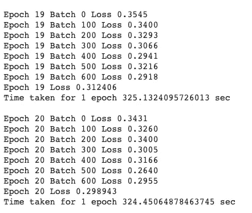

我训练模型到 50 个时期，你可以尝试更多的时期和数据集。

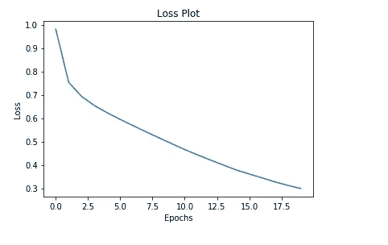

这是我的模型根据测试数据预测的。

**评价**

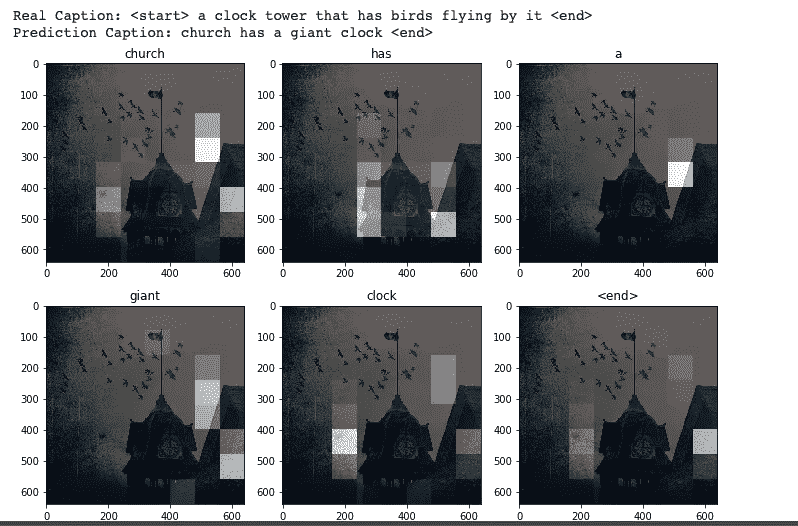

从上图中我们可以看到，预测值更接近实际值。

我希望你喜欢读这个。请不吝赐教，我哪里做错了，哪里需要改进。

[***大众简介***](https://www.linkedin.com/in/navneet-kumar-52531816b/)

***上一篇博客***

> ***未来工作***

1.  使用大型数据集
2.  超参数调谐
3.  用 LSTM 代替 GRU
4.  尝试不同的优化器和损失

> ***参考文献***

**代码参考:**

**1。**https://www . tensor flow . org/beta/tutorials/text/image _ captioning

**概念和图像参考:**

[2。https://www.youtube.com/watch?v=hvhqHhrP_AU&list = plyqspqzte 6m 9 gcgajvqbc 68 hk _ JKGBAYT&index = 117](https://www.youtube.com/watch?v=hvhqHhrP_AU&list=PLyqSpQzTE6M9gCgajvQbc68Hk_JKGBAYT&index=117)

3.[https://arxiv.org/pdf/1502.03044.pdf](https://arxiv.org/pdf/1502.03044.pdf)

4.[https://arxiv.org/abs/1409.0473](https://arxiv.org/abs/1409.0473)