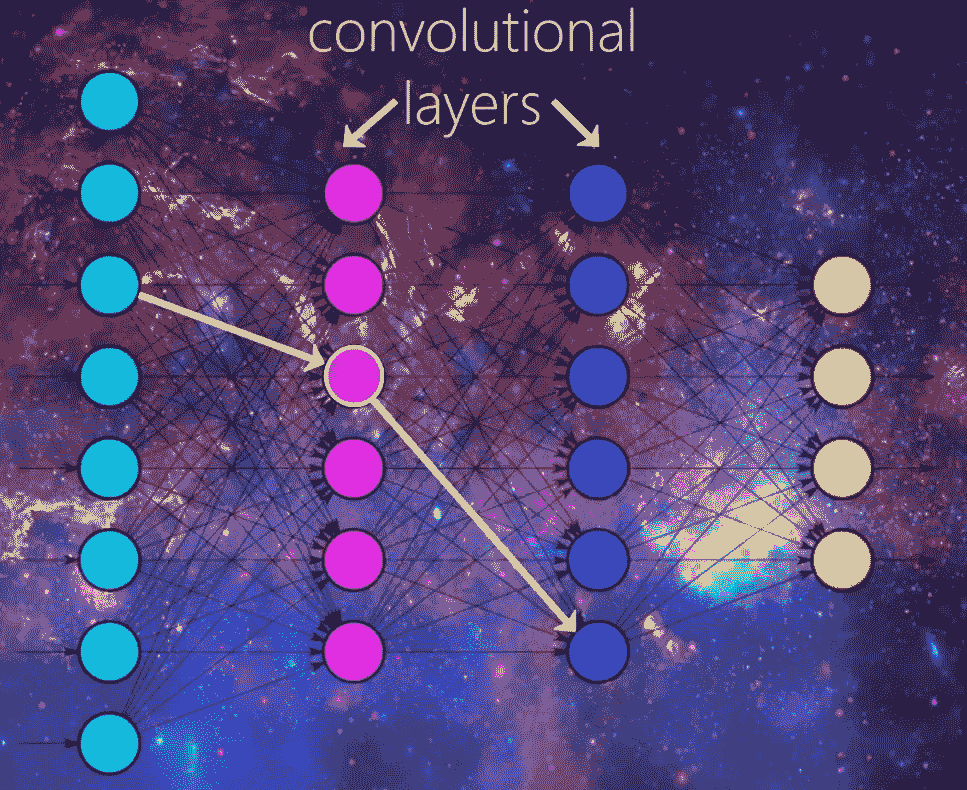
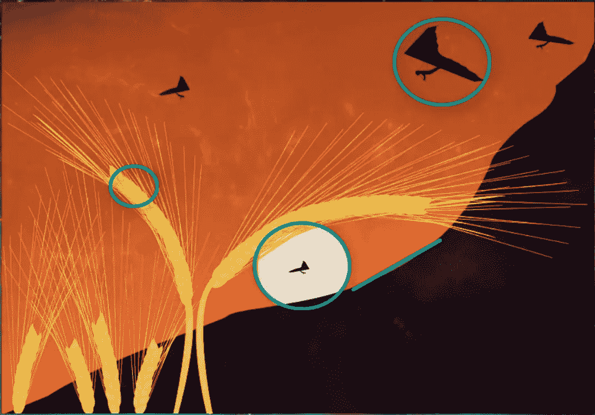
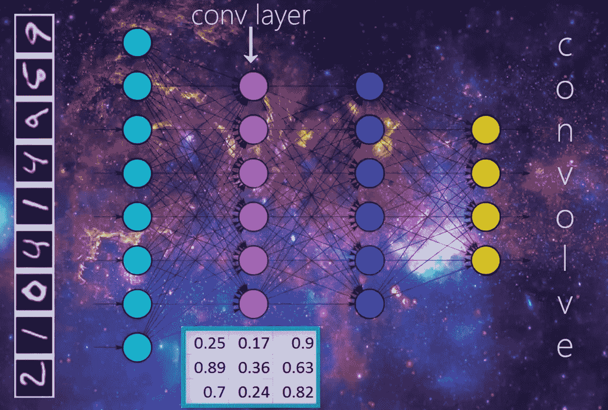
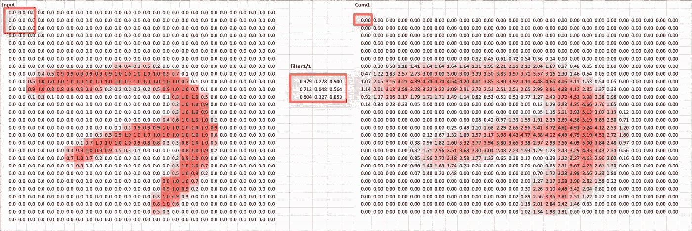
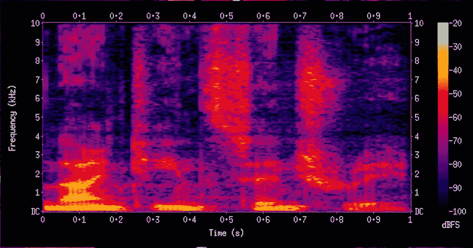
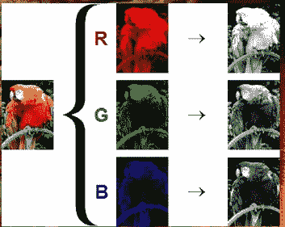
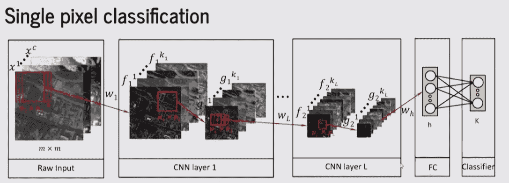

# CNN 使用的音频和图像功能

> 原文：<https://medium.datadriveninvestor.com/audio-and-image-features-used-for-cnn-4f307defcc2f?source=collection_archive---------8----------------------->

## CNN 的不同特征分析

**卷积神经网络(CNN):** 这是一种人工神经网络，迄今为止最常用于分析图像。虽然图像分析最广泛地用于图像分析，但是它们也可以用于其他数据分析和分类问题。

CNN 是一种人工神经网络，具有某种类型的专业化，能够挑选模式并从中理解。

**CNN 需要不同的数据集**

数据是原始信息，它是人类和机器对世界的观察的表示。一切都可以用数据来表示。所有的科学、文学在计算机中都可以表示为 1 和 0。当我们进入虚拟世界时，我们实际上被数据所包围，因为它是我们看到的一切的基本组成部分，当我们观察物理生活中的一些东西时，它就成为我们大脑中的数据。

**第一步。**选择数据:决定使用哪种数据。这些数据完全取决于我们试图解决的问题。几乎所有的主题都有公开的数据集。来源可以使用来自 Kaggle.com 的数据集，因为它们有很好的格式和数据集解释，也有一个在 Github 可用的公共数据集列表，我们也可以做一个高级的谷歌搜索，并指定你想要的文件类型。通常情况下，网站有一个 API，可以更容易地获得所需的数据，否则，使用库美汤来获取原始的 HTML 页面并直接废弃数据。

**第二步。**处理数据——编写一个函数从数据集中提取数据，然后将数据输入神经网络。当给定新数据时，网络将在两个类之间创建分隔线，它可以预测所需的结果。

格式化数据:正确格式化数据。数据可以是文本文件、关系数据库、CSV 文件中的形式。和库可以将任何文件类型转换成另一种文件类型。确保数据被格式化为适合程序的文件类型。

清理数据:有时数据中有不完整的实例，我们可以遍历每个实例，并通过检查值是否为空来删除实例。

要使用的特征:如果没有使用正确的特征，模型会做出错误的预测。使用与问题相关的功能。

**第三步。**转换数据——一种可能的转换是分解，有时我们有太复杂的特征。如果分解特征，模型会变得更精确。如果我们对特征和它们的类别标签感到满意，那么我们可以将特征转换成向量。向量是特征的数字表示。所有的特征都可以用向量、文字、图像和视频来表示。我们可以把这些向量直接输入神经网络。

**CNN 中的图像特征**

卷积层有检测模式的过滤器。图像中的不同图案是多个边缘、形状、纹理、对象等。

不同的检测器可用作过滤器，例如:

1.  边缘检测器
2.  拐角检测器
3.  形状检测器

网络越深入，我们的过滤器就变得越复杂，所以我们的过滤器能够检测特定的物体，如眼睛、耳朵、羽毛、皮毛、头发、鳞片、喙，而不是边缘和简单的形状。更深层次的过滤器能够检测完整的狗、猫、蜥蜴和鸟等。

**卷积神经网络与图像的工作**

在上面的图片中，有一个接受手写图像的神经网络，网络将图像分类为 1，2，3，…9。

假设第一个隐藏层是卷积层，并且还必须指定要使用的滤波器的数量。过滤器是具有行和列的小矩阵，矩阵和矩阵用随机值初始化。

在上面的图片中，指定有一个大小为 3*3 的滤波器，卷积层接收输入，滤波器将滑过输入本身的每个 3*3 像素集，直到它滑过整个图像的 3*3 像素块，滑动被称为卷积。

图像“7”的矩阵表示。矩阵中的值是图像中的单个像素，该输入将被传递到卷积层。规定该层只有一个滤波器，并且该滤波器将在来自输入的每个 3*3 像素块上进行卷积。

当过滤器第一次落在第一个 3*3 矩阵上时，过滤器本身与来自输入的 3*3 像素块的点积将被计算并存储在第一个单元中。这将发生在滤波器卷积的每个 3*3 像素组。

取滤波器与第一个 3*3 块的点积，然后存储在卷积层的第一个单元中。现在滑动到下一个 3*3 块，取点积并将值存储在下一个单元格中。继续这个过程，直到从过滤器中获得每个单元格的点积。

矩阵的点将成为该层的输出，然后作为输入传递给下一层。之后，将使用下一层中的过滤器生成结果。

利用标注数据量的快速增长和图形处理器能力的巨大提高，卷积神经网络的研究迅速兴起，并在各种任务上取得了最先进的成果。

**CNN 使用的音频功能**

语音也可以用图像来表示。声谱图中以频率和时间表示的声音。频谱图可以被认为是一个图像，可以应用 CNN。

Image Representation of sound

在图像中，有三层 R G B。

**卷积神经网络与音频的工作**

下图中有频率、时间和帧。正如我们所说的，频率是决定音高的声音属性。

演讲是一个有三层的图像。在制作 CNN 时，考虑到语音图像随频率和时间的一阶和二阶导数。

CNN 可以做预测。分析语音数据，CNN 不仅可以从图像中学习，还可以从语音中学习。CNN 可以分析这些数据，从这些数据中学习并识别单词和话语。

**图像特征和音频特征的区别:**音频文件必须转换成图像(声谱图)才能在该图像上运行 CNN，网络也很难学习、执行数据分析和做出预测。

**近两年的进步:**随着云计算的发展，计算机的能力得到了极大的提高。各种数学模型计算变得更加容易。图像分类技术也提高了神经网络的精度。图像分类将图像分割成更小的图像，通过相似或经典的神经网络进行分类推理。

先驱数学家 Yann LeCun 介绍了现代 CNN 的基本结构，Alex Krizhevsky 在 2012 年提出了第一个成功的 CNN 架构 AlexNet。基本 CNN 架构包括多个处理层，这些处理层能够直接从原始输入开始学习特征表示。每一层的这些学习到的表示被用于开发多层次的抽象，允许 CNN 成功地应用于各种任务。然而，由于当时缺乏大的训练数据和计算能力，深度 CNN 无法在更复杂的问题上表现良好。但随着 GPU 等高性能计算硬件的发展，以及互联网带来的大量数据的可用性，现在这是一个快速发展的领域。

近年来，主要工作是在 CNN 架构压缩、算法优化和基于硬件的改进方面分析加速方法。

数据规模的快速增长和不同问题数据集的可用性鼓励了开发人员轻松地在人工智能领域工作。有不同的网站，例如 kaggle.com、Labelme、ImageNet、LSUN、MS COCO、COIL100、Visual Genome、Google 的 Open Images、Labelled Faces in the Wild、Stanford Dogs Dataset、Indoor Scene Recognition 等，在这些网站上有不同的数据集可用，这些数据集可用于训练模型的人工智能项目。

**参考文献:**

 [## [1807.08596]卷积神经网络加速的最新进展

### 摘要:近年来，卷积神经网络在许多领域显示出了巨大的性能，如神经网络

arxiv.org](https://arxiv.org/abs/1807.08596)  [## [1512.07108]卷积神经网络的最新进展

### 摘要:在过去的几年里，深度学习已经在许多问题上取得了很好的成绩，例如…

arxiv.org](https://arxiv.org/abs/1512.07108) 

**结论:**CNN 的音频分析有一定的局限性，将音频文件转换成图像再进行测试&学习。现代技术正在使用 LSTM 进行音频分析，其中算法会回顾自身，以获得一些历史记录来检查此人过去说过什么。