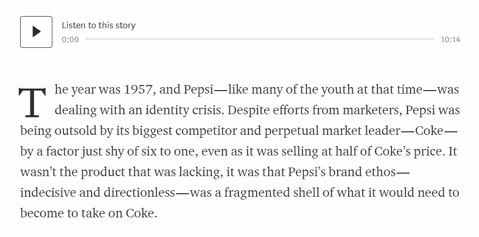

# 音频抄本现在开始成为一种东西——或者说我们作为用户变得有多懒

> 原文：<https://medium.datadriveninvestor.com/audio-transcripts-are-starting-to-be-a-thing-now-or-how-lazy-we-get-as-users-3375dffb0464?source=collection_archive---------21----------------------->

## 内容营销的未来看起来很有趣，也很有挑战性。

毫无疑问，作为用户，我们每天都变得越来越懒。

不相信我？以下是一些“最新”的发明技术，它们让我们的生活变得更加轻松:

*   无人驾驶汽车(忘掉自动和手动吧)
*   开关灯、挠我们的背、给我们讲笑话的虚拟助手
*   智能-一切:你的汽车、洗衣机和狗的皮带可以通过手机上的应用程序进行监控

虽然这个列表在几年后可能会成为旧闻，但我注意到了内容消费方面的一个(可能)新趋势:音频抄本。不，他们不是播客，他们也开始变得“老”了。

Source: unsplash.com

# 什么是音频抄本？

到目前为止，我是如何看到它被实现的:文章的音频文件嵌入在页面上，这样你就可以实际上听文章，而不是阅读它。因为现在谁有时间做这个，对吗？

[培养基](http://www.medium.com/)现在实际上已经使用这种方法一段时间了。它只适用于一些特色文章，我认为它是作为他们平台的高级版本的额外好处而包含在内的。

How the audio transcript option looks like on Medium / medium.com

但是我看到一个名为 [Republica](http://www.republica.ro/) 的罗马尼亚新闻网站正在实施这种方法。尽管他们使用它的方式与 Medium 略有不同，但它肯定是我们很快就会消费书面内容的方式。

# 音频抄本有什么好处？

我想说有很多。因为我的脑海里有一大堆好处，我现在把它们分成三类:可用性、营销、开发。

让我们一个一个来看。

# 可用性

当我提到可用性时，我想的是一个页面的音频抄本如何真正有利于 UX。

首先，速度更快。即使标题正下方有一小段文字告诉你这篇文章需要 5 分钟阅读，你也不相信它。我们以不同的速度阅读，我们会被图片或其他想法分散注意力。对这篇文章进行录音会让我们更快地获得信息。

这样更舒服。虽然在公共汽车上听文章确实需要耳机，但想想戴上耳机听会有多舒服，而不是用一只有弹力的手去读。你也可以在开车、骑自行车或做一些需要用手和眼睛而不是耳朵的事情时听音乐。

考虑得很周到。我不知道怎么称呼这个。我想说的是，对于那些患有低视力或任何其他与视力有关的障碍、无法阅读在线文章的人来说，这可能是一种救命的改善。确实对听力有问题的人没那么有用…

Photo by [Christin Hume](https://unsplash.com/@christinhumephoto?utm_source=medium&utm_medium=referral) on [Unsplash](https://unsplash.com?utm_source=medium&utm_medium=referral)

# 营销

现在我戴上了营销人员的帽子，我可以自由地把所有的疯狂写在纸上。

独特的卖点。由于这是一项相当“新”的技术，我想说它会成为每个产生大量内容并拥有大量读者的平台的绝佳卖点。不，但并非最不重要的是，这可以作为一种高级功能来销售——类似于 Medium 正在做的事情。

与语音搜索更好的集成。我们已经知道[语音搜索](https://backlinko.com/optimize-for-voice-search)正在变得越来越大，这是每个 SEO 专家的口头禅。谷歌的虚拟助手出现在所有 Android 设备上，谷歌也是 iOS 的默认浏览器。对我来说，这只是当使用语音搜索时，算法如何开始更好地链接内容的答案。

越来越接近虚拟助手。Alexa、Google Home 或者 Siri 在市面上已经相当老了，人们其实很爱它们。营销人员已经在尝试把他们的内容“放在那里”。既然一篇文章有音频文本，我认为虚拟助手更有可能为你“阅读”它。

更好的指标。让我们面对现实吧:用户会在页面上停留五分钟甚至更久。哪个营销人员不希望这样呢？！

新指标。虽然旧的衡量标准可能会有所改进，但我认为我们需要一些新的衡量标准，这样我们才能更好地了解 UX。像“页面上的时间”这样的东西是不够的。我们想看看用户在哪里停止了音频，看看它是向前播放(无聊的信息)还是向后播放(有价值的信息)，是否播放等等。

# 开发和实施

这项技术肯定已经存在了。成绩单软件将以非常实惠的价格随处可见，这只是时间问题。

我想说，这将成为一个自动化的过程只是时间问题。我们所需要的只是几个愿意记录几千字的声音。

从软件开发的角度来看，这是一个用这个新的利基赢得市场的大好机会。

至于实现，我一点也不觉得难。所有 CMS 平台都允许在每个页面中集成音频文件，由于音频文件可以由软件自动生成，事情会变得更加容易。

# 这让我们作为用户

嗯，我想这只能说明我们可以保持冷静，将来我们也不用动一根手指。看起来事情正在朝着正确的方向发展…或者不是吗？

这是否意味着书面内容终将消亡？我们仍然需要“专家”来解决这个问题？这个问题最明智的答案是*“只有时间会证明”*。

毫无疑问，作为用户，我们每天都变得越来越懒。科技鼓励着我们。

## ***你有没有在页面上看到过音频文字记录？您的公司会考虑实施它吗？请在评论里告诉我！*** 请不要忘记👏🏻如果你喜欢这篇文章！

*文章原载于* [*LinkedIn 脉脉*](https://www.linkedin.com/pulse/audio-transcripts-starting-thing-now-how-lazy-we-get-ilie/) *。*