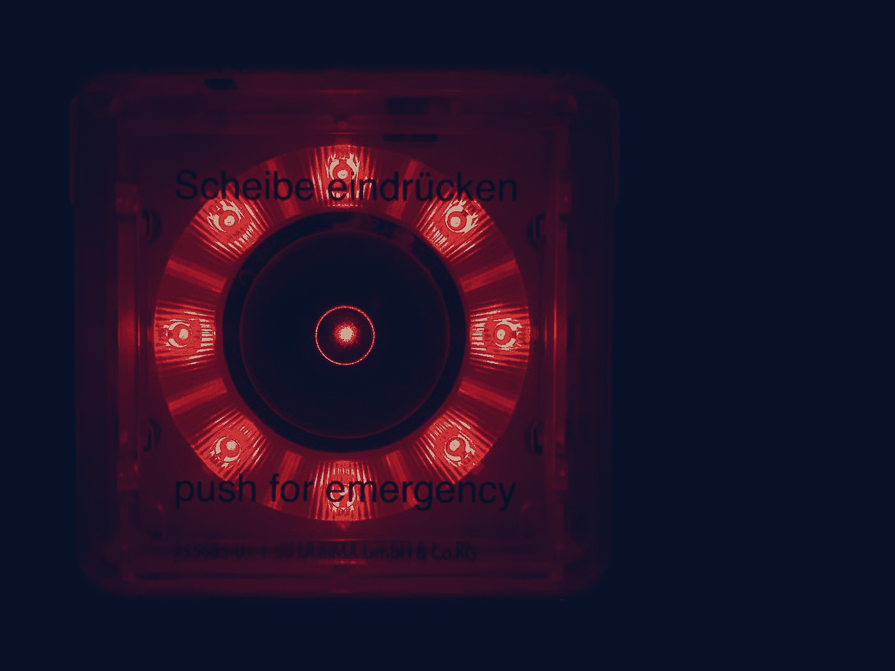

# 增强智能比人工智能更智能

> 原文：<https://medium.datadriveninvestor.com/augmented-intelligence-is-more-intelligent-than-artificial-intelligence-ca15af7dde19?source=collection_archive---------29----------------------->

Photo by [Jan Antonin Kolar 🇨🇿](https://unsplash.com/@makropulos?utm_source=medium&utm_medium=referral) on [Unsplash](https://unsplash.com?utm_source=medium&utm_medium=referral)

大多数专家将人工智能定义为具有自我思考能力并根据自己的想法做出决策的技术。正如一些专家所说，如果这真的成为现实，还需要几年时间。从更哲学的角度来说，为什么我们希望计算机在新的或不确定的情况下不需要指导和输入呢？尤其是在直接与客户打交道的时候。

我们应该使用和瞄准的是增强智能，即人加机器(而不是人对机器)。这个定义本质上是模糊的，但本质上它是软件支持人类决策和行动的地方，当它执行重复或已知的任务，但委托人类执行更复杂或独特的任务时。除非你熟悉这项技术的最新水平，否则很容易相信这种宣传。然而现实是，讽刺的是，即使是最复杂的人工智能应用程序也需要大量的数据科学家来开发和维护它们。对于许多人来说，增强智能中的圣杯是一个由非数据科学家训练和指导的应用程序，特别是，这样一线人员就不会直接执行所有任务，但他们会指导帮助他们的机器人。

用于分析客户数据的最新技术使用机器学习，能够准确地对交互进行分类，以指导流程并生成可操作的预警洞察。第一个技巧是，当它不确定某事时，它会“理解”，并邀请人类来帮助(有时这被称为“人在回路中”)。人类不需要成为数据科学家，他们只需要理解领域，将他们的判断和知识传授给机器，一旦完成，就永远完成了。第二个诀窍是，它以最佳方式做到这一点，要求人类输入最少的信息，以最大限度地提高机器学习的性能和准确性。通过这种方式，它可以在可接受的阈值精度内处理越来越多的任务，并在低于该精度时无缝地移交给人类。Warwick Analytics 的 PrediCX 就是一个很好的例子。

让我们以聊天机器人为例，他们需要不断改进和学习新的和不断变化的来自客户意图的信号。没有可靠的反馈循环，即使客户勾选了“有帮助”或“请问我能和人说话吗”，使用这种方法进行培训和维护也会出现很多严重的问题。此外，了解和分类所有渠道中正在谈论的主题，鼓励和促进针对正确主题的正确渠道，即针对常见问题和复杂查询的自助服务/聊天机器人，以快速路由到电话中的人，聊天和其他半同步渠道可能在中间的某个位置，这一点至关重要。最新的增强智能促进了所有渠道的统一分类的良性循环，打破了孤岛，改善了内部流程，节省了成本，最重要的是优化了客户满意度。

总之，人工智能在这里，而且会一直留在这里。然而，人工智能是增强的，而不是人工智能，在可预见的未来，如果不是永远，将最好的机器与最好的人类相结合，以创造完美的客户体验。