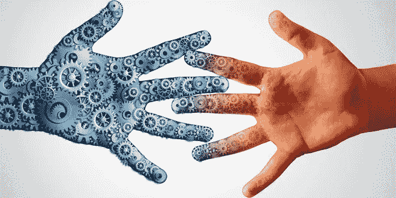

# 未来是增强智能，而不是人工智能

> 原文：<https://medium.datadriveninvestor.com/augmented-intelligence-not-artificial-intelligence-is-the-future-f07ada7d4815?source=collection_archive---------3----------------------->

*本文最初刊登在 CIO Dive 上。*

当我们展望人机交互的未来时，往往会被自动化和人工智能(AI)的想法所迷惑。毕竟，我们不都渴望有一天迈克尔·奈特的 K.I.T.T .能停在我们的车库里，让我们在路上开车时读一本书吗？

大多数专家倾向于同意，我们还远远没有设计出真正的人工智能——即能够像人脑一样独立处理、推理和创造的系统。

但问题是:复制人类智能是商业智能技术最有影响力的应用，因此也是关键目标吗？

这就是智能增强(IA)概念发挥作用的地方。信息架构是利用技术来补充和支持人类智能，而人类仍然是决策过程的中心。

虽然驱动人工智能和人工智能的底层技术是相同的，但目标和应用是根本不同的:人工智能旨在创建没有人类也能运行的系统，而人工智能旨在创建让人类变得更好的系统。

要明确的是，这不是一个单独的技术类别，而只是对其目的的不同思考方式。可以说，许多目前可用于企业的人工智能品牌技术可以也应该更准确地被描述为 IA。

考虑金融机构如何将 IA 集成到欺诈检测中。使用机器学习，可以训练系统识别和标记欺诈活动的标记和模式。

然后，员工使用这些机器数据，运用他们的知识、判断和专业技能来解释数据、进行调查并做出最终决定。根据 2016 年 Oakhall 的一项研究，除了节省时间，这还可以节省大量资金，每年至少 120 亿美元。

# 如何在您的环境中安全地引入 IA？

这里有三点需要考虑:

## 闪亮物体综合症是真实存在的——关注数据

商业技术决策者可能会让供应商每天给他们发电子邮件，告诉他们令人兴奋的新商业人工智能解决方案。当然，机器人助手和聊天机器人是令人兴奋的新东西，但它们真的会改变现状吗？

相反，确定大规模数据分析和见解可以帮助团队做出更好的决策和创造更高水平的参与，并寻求这些具体的解决方案。

## 走在变革管理的前面

引入 IA 解决方案的最大担忧是它对某人的工作意味着什么。让我们面对现实。在过去的几十年里，许多人都在谈论“机器的崛起”以及人类将如何在劳动力中失去一席之地。

虽然一些入门级的工作可能会让位于技术，但对理解数据并能利用分析做出更明智决策的人的需求将会不断增加。

员工需要了解 IA 解决方案将如何帮助他们更好地完成工作。此外，为他们提供学习机会，作为其职业发展的一部分，包括特定 IA 工具的认证，这将是一个双赢的局面。

## 实验，但要知道什么是成功，用什么来衡量

尝试一些不同的解决方案来改进不同的工作流程并没有错。

然而，一旦确定了这些领域，就需要清晰一致的指标来客观衡量 IA 解决方案的影响。

没有人工干预，人工智能解决方案可能会给企业带来重大风险，脸书试图摆脱人工编辑就是一个例子。

对于不需要上下文且容易重复的任务，人工智能解决方案可以提高效率，而不会引入风险。

但即使在这种情况下，对人类的不充分依赖，正如埃隆·马斯克最近发现的那样，也会带来灾难性的后果。在短期内，人工智能最具商业相关性的用例将出现在开发技术中，该技术将机器的处理能力与人类的社交和情感智能相结合，以令人兴奋的新方式增强我们的能力。

*最初发布于:*[*https://www . CIO dive . com/news/why-business-must-focus-on-inte-augmentation-over-artificial-inte/532471/*](https://www.ciodive.com/news/why-businesses-must-focus-on-intelligence-augmentation-over-artificial-inte/532471/)