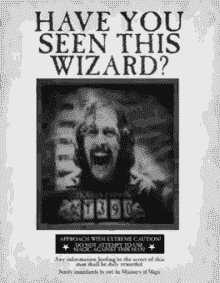
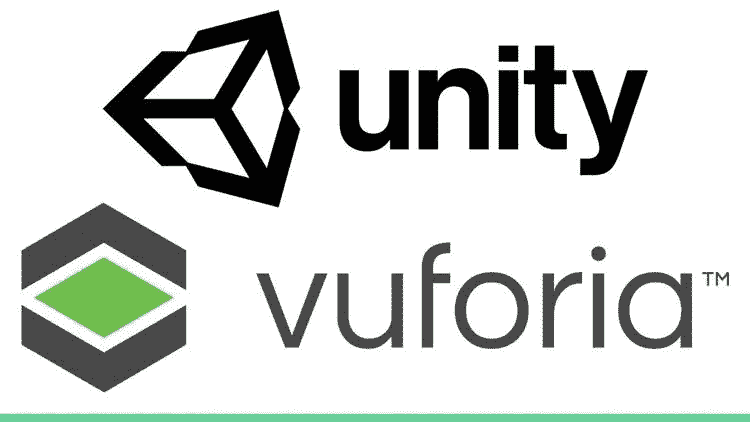
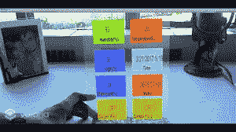
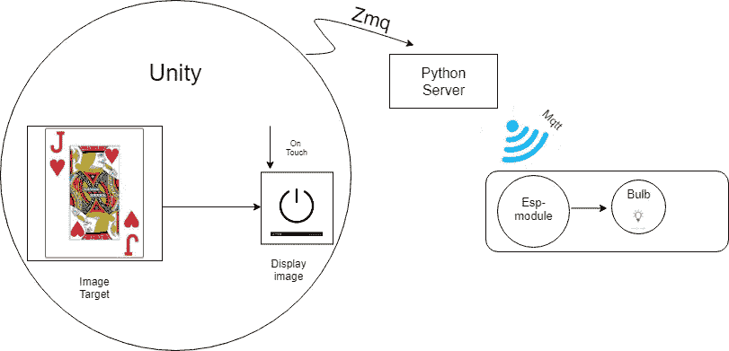
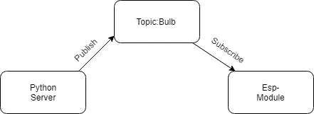
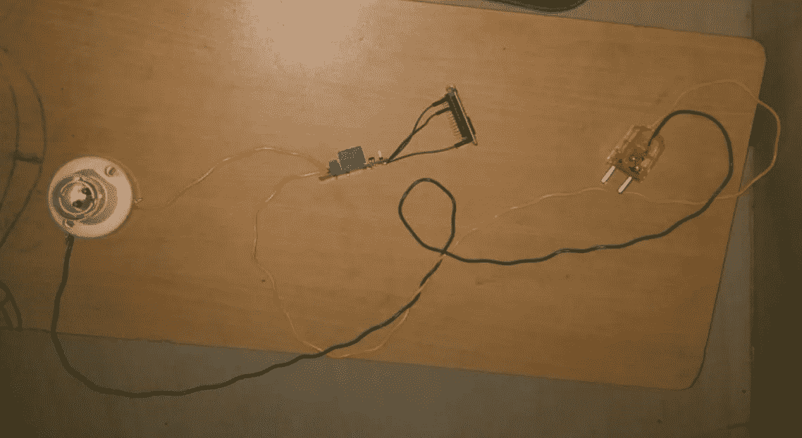

# 增强现实:物联网的完美匹配

> 原文：<https://medium.datadriveninvestor.com/augmented-reality-a-perfect-match-for-iot-devices-1adba93380b5?source=collection_archive---------4----------------------->

> 哈利·波特电影一直是我的梦想。该系列引入了许多魔法物品，如隐身衣、魔法棒、飞天扫帚等。让我困惑的两个这样的神奇道具是各个房子公共休息室前的**会说话的相框**和小天狼星布莱克(《阿兹卡班的囚徒》)的**通缉令**。
> 
> 除此之外，漫威电影世界因其在各种电影中的科幻技术道具而闻名。在最近一期的**蜘蛛侠:远离家乡**中，整部电影都围绕着**伊迪丝**墨镜展开。

 [## 人工智能和虚拟现实的融合-你能期待什么|数据驱动的投资者

### 在技术领域，融合是合乎逻辑的一步。就在几十年前，你可能需要一个专门的…

www.datadriveninvestor.com](https://www.datadriveninvestor.com/2018/08/30/the-convergence-of-ai-rv-what-you-can-expect/) 

这是什么技术？

这是近来机器学习和图像处理最有趣和最酷的应用——增强现实。

> **“增强现实**是一种将计算机生成的图像叠加在用户的真实世界视图上的技术，从而提供一种复合视图。”
> 
> —牛津词典

但是，为了理解增强现实的真正本质，让我们用简单的话来说。增强现实只不过是用另一幅图像、视频或 3d 模型来替换一幅具有足够多特征的图像。

所有这一切似乎都是遥远的未来。但是不要担心！多亏了像 **Vuforia** 和 **Unity** 这样的软件，现在一切都像**打开灯泡一样简单！**

Unity and Vuforia platforms

# **物联网和 AR:**

> 增强现实通常会为任何技术增加一个额外的维度。它可以很容易地与蓬勃发展的领域相结合，如数字孪生[6]，工业物联网等等。物联网领域有许多无生命的数据，增强现实以创新的方式描绘了这些数据，赋予了它们一种实质性的形式。

# **想法:**

我想出了这个用增强现实打开灯泡的主意。我的目标是当摄像机检测到扑克牌时，给灯泡添加一个虚拟按钮。单击虚拟对象时，灯泡的状态会根据当前状态而改变。

在硬件部分，我有一个灯座(带一个灯泡)，它通过一个继电器连接到一个 ESP-8266 模块，该模块被指示接收 **MQTT(** 消息队列遥测传输 **)** 信号【3】。节点 MCU 订阅了一个*主题*，并在收到基于灯泡当前状态的*消息*时，改变灯泡的状态。

How things work!!

MQTT Protocol

A normal relay based bulb

在软件部分，图像目标上传到 Vuforia 中，其数据库导入到 Unity 中。显示图像(电源按钮)连续显示在物理图像目标(扑克牌)上[5]。在 Unity 中，使用一个名为 ZMQ (ZeroMQ 进程间通信)的库将数据装入 python。因此“点击”或“触摸”动作将触发 python 服务器[1]向 ESP 模块发送 MQTT 信号，ESP 模块相应地打开/关闭灯泡。

如需进一步查询，可以参考我的 github 链接[4]和工作视频[2]。

# **资源:**

【1】[ZMQ 库](https://unitylist.com/p/hc8/Unity3D-Python-Communication)
【2】[工作视频](https://youtu.be/Kt1umb_amXQ)
【3】[什么是 MQTT？](https://medium.com/@onur.dundar1/mqtt-part-i-understanding-mqtt-aade455baec9)
【4】[我的 GitHub 代码](https://github.com/karthiks1701/iot-ar.git)
【5】[如何从增强现实](https://www.youtube.com/watch?v=MtiUx_szKbI)
【6】[数字孪生](https://medium.com/@thinkwik/digital-twin-a-technology-that-changed-the-world-5ff5fa685b25)