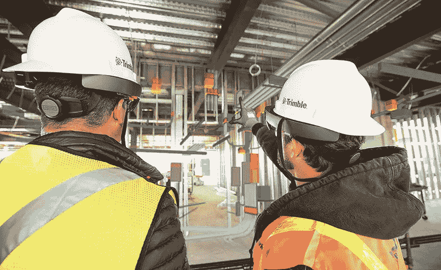
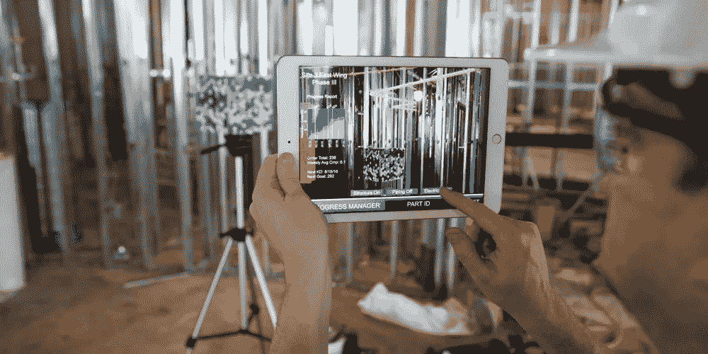
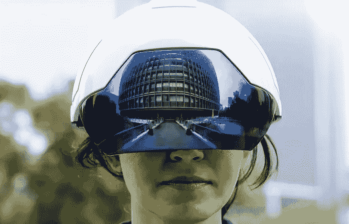

# 建筑施工中的增强现实

> 原文：<https://medium.datadriveninvestor.com/augmented-reality-in-buiconstruction-a2b1c962ddcc?source=collection_archive---------2----------------------->

> 作者声明:这篇文章包含了在建筑中使用 AR 和 VR 技术的基本说明。如果你有兴趣更深入地研究这个问题，可以去那些现在正在使用这些技术的公司看看。链接附后。祝你阅读愉快。

在高级 AR 技术的帮助下(例如，添加计算机视觉，将 AR 相机融入智能手机应用程序和对象识别)，关于用户周围真实世界的信息变得交互式和数字化处理。关于环境及其对象的信息覆盖在真实世界上。

 [## 人工智能和虚拟现实的融合-你能期待什么|数据驱动的投资者

### 在技术领域，融合是合乎逻辑的一步。就在几十年前，你可能需要一个专门的…

www.datadriveninvestor.com](https://www.datadriveninvestor.com/2018/08/30/the-convergence-of-ai-rv-what-you-can-expect/) 

对于 [**史密斯集团**](https://www.smithgroup.com/) 来说，VR 从萌芽到不可或缺，用的时间甚至更少。除了其明显的优势，这种对技术的快速采用可能是未来变化的先兆，包括以相关技术形式进行的类似快速和有影响力的过渡:增强现实(ar)。

史密斯集团正在建筑管理中使用 AR 来确保复杂的立面得到准确安装。

[**GAMMA AR**](https://gamma-ar.com/) 是一款建筑现场监控应用，使用增强现实技术通过智能手机或平板电脑覆盖 BIM 3D 建筑。5

它允许您将工作的实际情况与项目中包含的计划信息进行比较。

GAMMA AR 使 **3D BIM** (建筑信息建模)模型能够在建筑过程之前和过程中被查看，创建对规划的理解，避免错误并降低建筑成本。

## 项目准备中的应收账款

增强现实的新发展使得直接在 2D 平面图上生成 3D 模型成为可能。结合 3D 建模软件和建筑信息建模(BIM)，建筑公司可以制作详细的交互式建筑项目模型，并在项目开始时向客户展示。

AR 调制有助于防止以后昂贵的变更，并让客户参与到项目中来。它还允许团队在项目执行之前进行整个项目的演练，仔细检查结构的细节和组件。

正如你可能经历过的那样，人们真的不擅长从一套平面图或一张 2D 图纸中想象出完整的项目。用来代替虚拟现实，它可以省去将平面图从 3D 转换成 2D 图纸，再转换回 3D 结构的步骤。AR 将模型和元素直接放到网站上，你可以实时看到变化。

## 施工过程中的 AR

在施工现场，工人可以将 3D 模型与实时数据结合起来。他们可以看到现实世界中的问题和错误，并在构建之前解决它们。

教育。使用这项技术，建筑工人可以将他们的技能提升到一个新的水平，增加他们的知识，并利用它做出更好的决策。

有了虚拟现实，在一个工人踏上工作现场之前，蓝图就可以变成现实。这项技术已经被美国最大的建筑公司之一的麦卡锡建筑公司 使用。

客户可以快速方便地对设计进行修改，而不会产生改变物理结构的费用和后勤上的不可行性。

**AR 在这里的主要用途包括 BIM 模型的全息显示，团队成员之间的协作，以及沉浸在建筑计划中。**

越来越多的公司正在使用建筑信息模型(BIM)和增强现实来实现 3D 蓝图。

Displaying the BIM model in AR while construction

专注于建筑领域 VR 和 AR 的黑客马拉松，如 [**AEC 黑客马拉松**](https://aechackathon.com/) ，在大公司 [**Autodesk**](https://www.autodesk.in) (3d 工程软件)和全国各地全年活动的支持下，正在取得进展。

[**Daqri**](https://daqri.com/) (面向工业任务的设备和软件开发商)提供其旗舰智能眼镜，搭配其 AR 应用的 Worksense 套件。Daqri 为建筑工人开发了特殊的 AR 头盔，可以显示建筑工地的信息。

Daqri AR helmet for construction workers

Augmented Reality in Construction. Video.

> AR 将在不久的将来获得普及。到 2035 年，至少 10%的世界人口将使用 VR 和 AR 技术。建筑公司将获得增强现实技术。跳过技术更新的政党将离开市场。