# 移动应用中强大的增强现实

> 原文：<https://medium.datadriveninvestor.com/augmented-reality-in-mobile-59a7398f30df?source=collection_archive---------2----------------------->

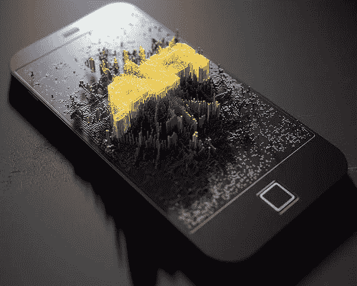

[www.fineartamerica.com](http://www.fineartamerica.com)

增强现实(AR)是一种通过以一种微妙的方式混合现实和数字世界来增强你的现实的技术，从而为你提供独特的体验。我们每天都在使用增强现实，尽管大多数人并没有意识到这一点。

从老电影《谁陷害了兔子罗杰》 或 [*太空堵塞*](https://www.imdb.com/title/tt0117705/) 到如今增强现实在移动领域的流行应用如[口袋妖怪 Go](https://www.pokemongo.com/en-us/) 或 [Snapchat](https://www.snapchat.com/) 上的功能向许多人介绍了看似未来的概念。

AR 市场正在快速增长，所以让我们来看看有什么热闹。

**什么事？**

> [增强现实(AR)](https://thinkmobiles.com/blog/what-is-augmented-reality/) ，扩展你的“真实”或物理世界——它将声音、视频或文本等数字数据强加到你的现实视图上。

 [## 人工智能和虚拟现实的融合-你能期待什么-数据驱动的投资者

### 在技术领域，融合是合乎逻辑的一步。就在几十年前，你可能需要一个专门的…

www.datadriveninvestor.com](https://www.datadriveninvestor.com/2018/08/30/the-convergence-of-ai-rv-what-you-can-expect/) 

举个例子，想想 [Snapchat 和他们的滤镜](https://support.snapchat.com/en-US/article/create-odg-snapchat)，你可以用各种插件比如狗耳朵或者性别互换滤镜等制作搞笑自拍。

与虚拟现实(VR) 相反，虚拟现实实际上将你“吸收”到 3D 环境或场景中，AR 将数字信息放在真实的图像或视频上，从而保留大部分环境不变。

AR 已经变得广泛，因为一个简单的事实，你可以只使用智能手机来体验 AR，而对于 VR，你需要有特殊的设备，比如头盔或护目镜。

许多人认为 AR 是一种有趣的工具，但它是当今任何行业的一个相当强大的附加产品，因为它可以提高参与度，并创建各种产品的逼真体验。

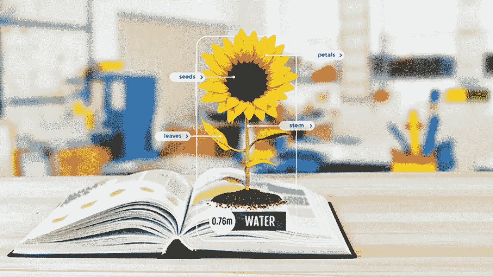

[www.blippar.com](http://www.blippar.com)

# 它是如何工作的？

在过去的几年里，AR 技术似乎是革命性的，但今天它很普通。像苹果和谷歌这样的科技巨头已经创造了增强现实工具包来促进这项技术的发展。

AR 实际上覆盖了第一层是真实世界的体验。

分层效果使用户能够看到自然光和人造光，当摄像机识别目标时，它会处理图像，然后将数字资产放大到图像中。这使得用户能够同时看到真实世界和虚拟世界。

例如，[盖特威克机场开发了一个 AR 应用程序](https://www.gatwickairport.com/at-the-airport/passenger-services/official-gatwick-app/)，帮助乘客在他们的大型网站中导航——他们安装了许多信标，使用 AR 引导人们通过机场。这样，你就有了真实世界的图像(*机场*)和数字导航图像的叠加图像(*登记、不同的登机口号码等*)。).它们共同为用户带来 AR 体验。

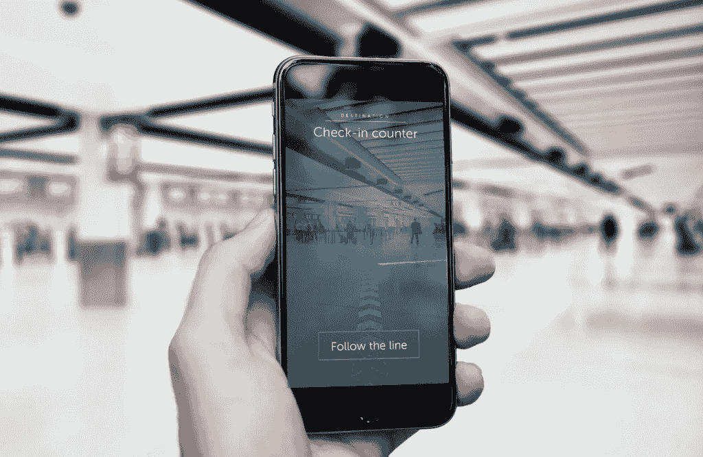

[www.vrfocus.com](http://www.vrfocus.com)

# **应收账款的种类**

[增强现实](https://www.realitytechnologies.com/augmented-reality/)主要有四种。

1.  **基于标记的**

基于标记的 AR 或“图像识别”AR 使用手机摄像头和某些视觉标记(*如* [*QR 码*](https://en.wikipedia.org/wiki/QR_code) *或特定图像*)，当摄像头感应到这些标记时，这些标记会产生 AR。如果你想让你的图像栩栩如生，那么你应该使用基于标记的增强现实。一些例子是印刷媒体(*海报、标识、小册子等*)。)或物体(*瓶子或某种机械等*)。)像 [ScanLife](http://www.scanlife.com/) 或者 [Popcode](http://popcode.info/whatispopcode) 。

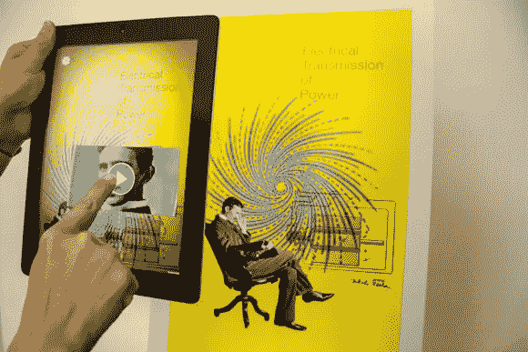

[www.yestzerstudio.com](http://www.yestzerstudio.com)

2.**无标记 AR**

无标记 ar 是最受欢迎的 AR 类型——它使用[加速度计](https://www.knowyourmobile.com/glossary/accelerometer)、 [GPS](https://en.wikipedia.org/wiki/Global_Positioning_System) 或数字指南针根据位置或速度向设备提供数据。这对于显示与其他对象相关的物理对象非常有用。这是一个很好的地图方向，寻找附近的公司和其他以位置为中心的应用程序。它的一个例子是 [ARIS](https://fielddaylab.org/make/aris/) ，一个交互式讲故事的应用程序。

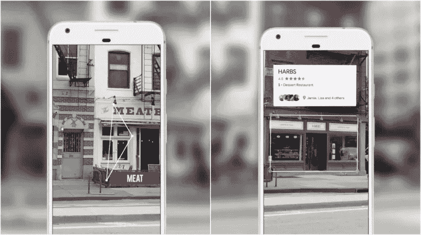

[www.techook.com](http://www.techook.com)

3.**基于投影的 AR**

基于投影的 AR 将光线投射到真实的表面上，类似于电影放映机。你不需要任何额外的设备，如屏幕或耳机。这种类型的 AR 通常部署在大型会议或活动中，因为它可以显示大型对象(汽车、货车等)。)并且还可以用于不同型号的消费者反馈。它可以是交互式的，并使用传感器和 3D。一些例子包括激光等离子体技术，它使用 AR 来投影 3D 交互式全息图。

4.**基于叠加的 AR**

这种类型的 AR 使用对象识别——增强图像完全或部分取代原始图像。这种类型的 [AR 用于与将 X 射线叠加到患者身体上相关的医学领域](https://smartglasseshub.com/benefits-of-augmented-reality-in-medicine/)。

它可以用来[增强历史之旅](https://explorar.co.uk/)——例如，这种类型的 AR 可以展示一幅[绘画或一座雕像以及它最初的样子](https://www.yetzerstudio.com/terracotta-warriors-ar)，直观地描绘它是如何老化的以及它为什么如此重要。

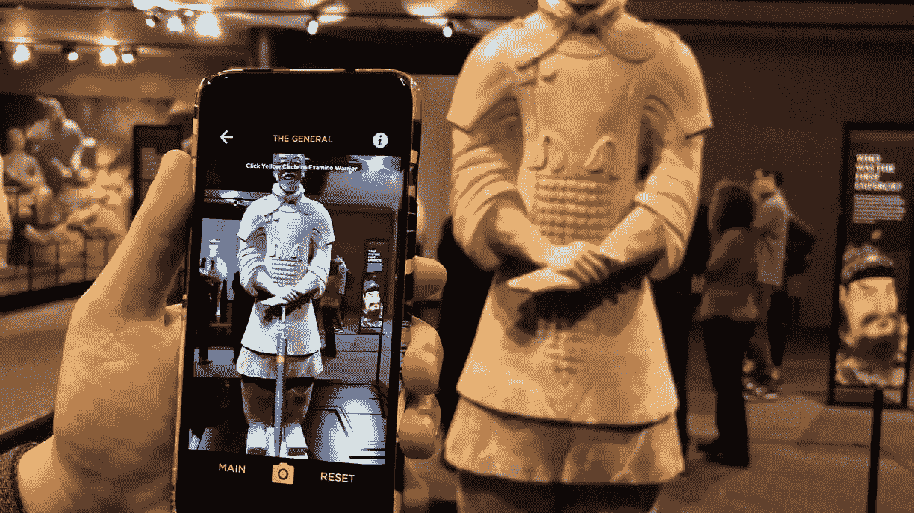

[www.yetzerstudio.com](http://www.yetzerstudio.com)

# **应收账款的好处**

尽管许多人认为这项技术只是娱乐，但事实并非如此。在[医疗](https://www.medpagetoday.com/practicemanagement/informationtechnology/59072)、[电子商务](https://www.augment.com/customer_stories/fnac_darty/)、[建筑](https://archicgi.com/top5-architectural-augmented-reality-apps/)、[广告](https://catchoom.com/blog/15-cool-augmented-reality-advertising-campaigns/)等诸多行业广泛传播。

AR 的潜力是巨大的，喜欢跟上技术趋势的品牌已经在他们的业务中利用这项技术来提供全新的用户体验。

一些例子包括制作[产品演示](https://mashable.com/2017/11/01/amazon-ar-view-app/#i6qg_ykouiqo)、[互动广告](https://www.youtube.com/watch?v=RWwQXi9RG0w&feature=youtu.be)或向消费者提供[实时信息](https://www.trendhunter.com/trends/uniqlo-magic-mirror)。根据俄亥俄州立大学的[研究，人们更倾向于在“触摸”或与产品互动后购买产品，因为在这个过程中，情感纽带建立起来了。](https://www.livescience.com/3241-study-touch-buy.html)

## **个性化客户体验**

对于企业来说，这是一个很好的方式来加强他们与消费者的互动，在应用程序中，你可以虚拟地“试穿”产品，就像雷朋对许多其他类似应用程序的虚拟试穿功能一样。

另一个具体的例子是 [IKEA Place app](https://highlights.ikea.com/2017/ikea-place/) ，顾客可以在家中虚拟摆放家具，无需离开舒适的扶手椅。这样，顾客在实际购买之前，可以确保它适合他们的空间。

www.ikea.com

[家得宝](https://www.homedepot.com/c/SF_Mobile_Shopping)也在 2017 年做了同样的事情，开发了一个应用程序，你可以在家里放置家具和其他家居饰品，类似于宜家。

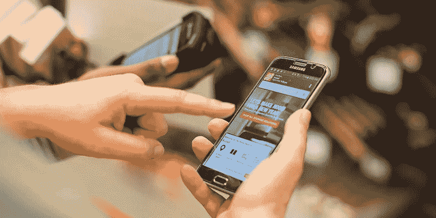

像这里这样使用 AR 实际上简化了产品试用和整个购买过程。

## **互动广告**

星巴克用他们的[星巴克杯子魔术](https://www.youtube.com/watch?v=RWwQXi9RG0w&feature=youtu.be)给出了一个互动广告的极好例子，当你将相机对准杯子时，通过显示动画角色如溜冰者、狐狸等来增强顾客体验。从而与消费者建立互动纽带，消费者也与品牌本身建立纽带。

更多的例子是妮维雅互动广告，其中包括一个腕带，当你的孩子在沙滩上跑步时，可以戴上它，然后父母可以设置距离，如果孩子超过限制，就会收到警报。摩托罗拉对 [Moto X 的](https://www.adweek.com/creativity/print-ad-moto-x-lets-you-change-phones-color-push-button-154620/)定制做了一个很好的推广，人们可以通过按键改变手机的颜色。

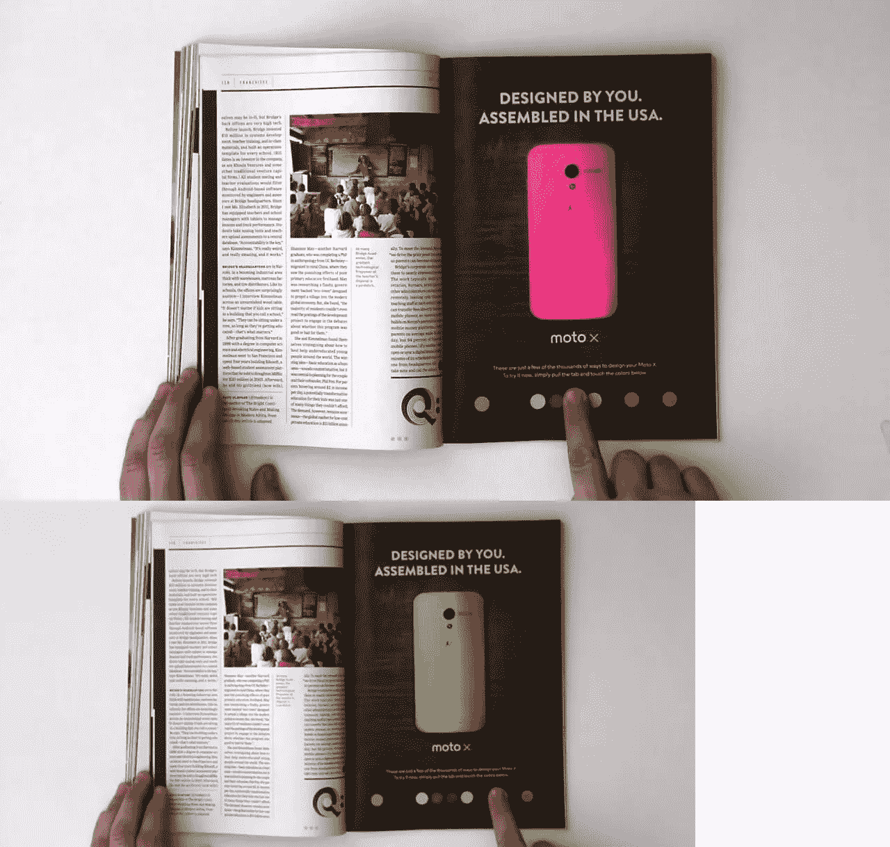

pinterest.com

还有更多[互动广告的例子](https://blog.hubspot.com/marketing/interactive-print-ads)，不管是印刷还是非印刷的，如今它们已经取代了传统营销，所以请跟上步伐！

## **消费者参与和帮助购买决策**

丝芙兰也是一个很好的例子——你只需要拍一张你的脸，然后投入一场冒险，尝试他们提供的不同颜色的眼影、口红和其他美食。

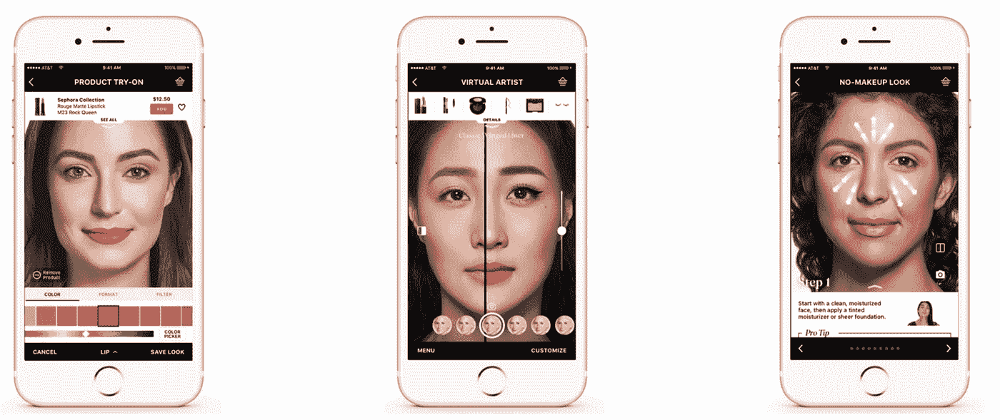

[www.sephora.com](http://www.sephora.com)

你会说'*哈，这个应用除了好玩就没别的功能了，简直是浪费时间！*“但这完全不是真的——事实上，丝芙兰正在通过让消费者享受更长时间来提高客户参与度，此外，他们还提高了消费者的购买机会，现在他们可以以一种全新的方式与他们互动。

更多的例子是[优衣库魔镜](https://www.trendhunter.com/trends/uniqlo-magic-mirror)，它使顾客能够尝试同一件衣服的多种颜色和图案——随后是[阿迪达斯和 Gap](https://apparelmag.com/using-virtual-and-augmented-reality-bridge-digital-divide) 。另一个例子是 Timberland 虚拟试衣间，消费者可以在这里试穿不同的衣服、配饰以及它们的各种组合。如今，虚拟试衣间已经成为一种普遍现象，但这一概念仍在获得更广泛的发展。

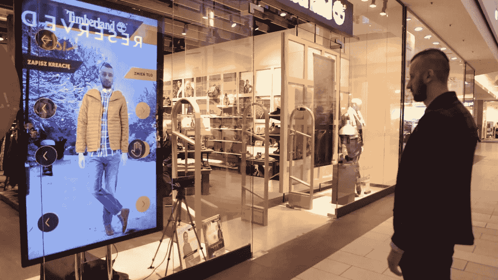

[www.timberland.com](http://www.timberland.com)

## **让你的品牌/产品脱颖而出**

如果你需要在商展上展示你的公司或产品，这可能会要求很高。商展都是为了吸引注意力——简单的旧传单或小册子不再管用了。

如果你希望你的产品脱颖而出，你需要唤起人们的“魅力”效应——例如，移动设备将 3D 交互式 AR 产品模型的视频传输到大屏幕上，会让人们以其他媒体无法激发的魅力关注你的产品。众所周知，魅力创造了一种有利于销售的情感纽带。

您可以使用像 [nuReflection](https://www.numediainnovations.com/numedia-innovations-nureflection-augmented-reality-mirror) 这样的 AR 屏幕来吸引更多的人来到您的展位，例如，您可以使用基于 AR 位置的信息，如覆盖真实世界的展位数字方向，以及可以发送给任何人的奖品的 3D 图像，从下载应用程序并走到您展位 50 米以内的人到刚刚进入展会的人。

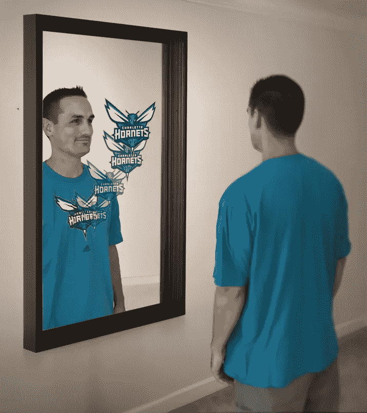

[www.numediainnovations.com](http://www.numediainnovations.com)

## **鼓励重复购买和客户忠诚度**

如果你想保持客户忠诚度，并使重复购买，你需要为你的客户多做一点。

同样的事情也发生在[奥迪 eKurtzinfo](https://itunes.apple.com/gb/app/audi-ekurzinfo/id436341817) 上，该应用程序将你的智能手机转换成详细的用户手册，解释零件如何工作。我认为这对用户来说非常方便，因为它可以帮助他们识别按钮和旋钮，这是硬拷贝手册所不能做到的。此外，所有东西都存储在云中，因此用户不必不断更新应用程序。

公司如何鼓励重复购买的另一个例子是乐高，它在 2010 年推出了一款应用程序“[Lego X](https://www.archdaily.com/592450/augmented-reality-app-lego-x-simplifies-3d-modeling)”——它使用联网的乐高积木在你的设备上创建 3D 模型。顾客只需在屏幕前举起盒子，成品乐高就会出现在盒子上面。

对于顾客来说，这是一个在购买前检查商品的好方法，它有助于建立对品牌的信任，让他们再次回来购买。

## **地理目标市场**

使用地理位置功能的应用程序可以使用您的设备摄像头显示附近的餐馆、商店和其他位置，以及每个位置的重要信息-r*eviews、方向、开门/关门时间*等。

示例应用程序是谷歌开发的 [Street Lens](https://play.google.com/store/apps/details?id=com.trackyapps.street_lens&hl=en) ，它使用地理定位来增强您的体验。

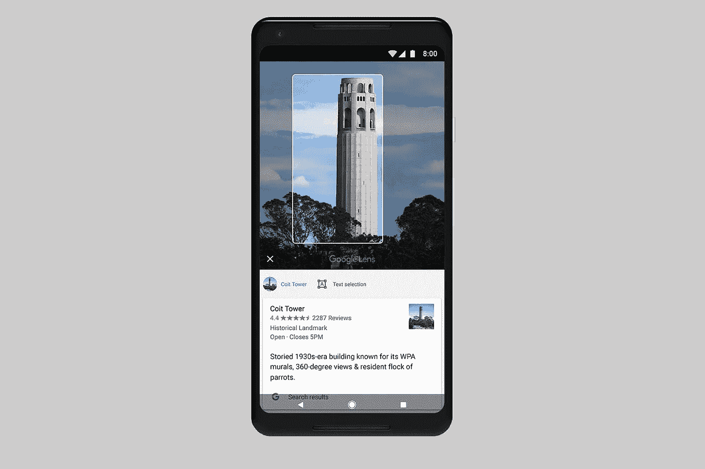

[www.digitaltrends.com](http://www.digitaltrends.com)

这些类型的应用程序可以根据用户的位置向用户发送通知，并推荐附近最好的酒吧和到达那里的方式，以及更具体的目标，如使用 GPS 在大型停车场或车库内找到你的车。

## **助推 b2b 移动营销**

增强现实技术不仅仅适用于个人目的——它还可以帮助推动 B2B 行业。

基于产品的公司可以通过 AR 驱动的 360°视图和交互式体验展示他们的商品，客户可以在其中测试产品，基于服务的公司可以创建其关键产品的 AR 教程，在做出任何承诺之前向客户展示他们将获得的回报。

例如，销售代表可以在他的演示中使用 AR 创建产品演示，以显示他们的产品效率或使用过程；建筑设计工作室可以向客户展示一个新房间完工后从外面看是什么样子，等等。

B2B 使用 AR 的例子不胜枚举，一个很好的例子是[思科 AR 目录](https://play.google.com/store/apps/details?id=com.kaon.android.lepton.cisco3d&hl=en)，在这里您可以探索产品功能，轮换产品，并了解更多关于关键技术的信息。

如果你能让 B2B 观众在他们的智能手机上观看交互式 3D 模型，公司就能超越视频会议的限制，让参与者参与到一个全新的层面。

# **最终想法**

今天的行业更加关注移动设备，因为它们无处不在，并且拥有 AR 所需的所有元素——屏幕、摄像头、处理器、传感器、运行应用的能力等。

只是最近，增强现实(AR)开始得到更多的关注，我们也有同样的热情。如果您希望将 AR 功能集成到您的移动应用程序中，并与快速发展的技术保持同步，请定义您的需求(或富有想象力的渴望)，并找到一家[可靠的开发公司](http://zesium.com/our-work/)来讨论您的想法，并将其转化为“现实”。

随着 AR 工具和框架的快速发展，AR 正在各种行业中寻找出路，我们可以期待看到更多涉及 AR 的用例和体验，这将把移动应用生态系统提升到一个新的水平。

所以，让我们拭目以待吧！