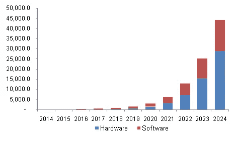
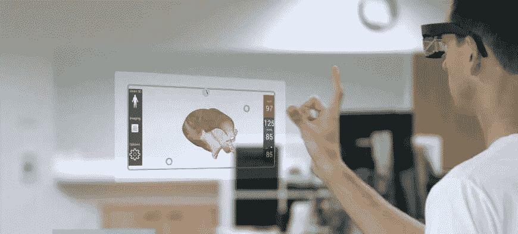

# 到 2024 年，增强现实市场价值将达到 1002.4 亿美元

> 原文：<https://medium.datadriveninvestor.com/augmented-reality-market-8ef2bf30a9f7?source=collection_archive---------6----------------------->

根据 Grand View Research，Inc .的一份新报告，增强现实(AR)市场的规模预计到 2024 年将达到 1002.4 亿美元。由于硬件技术和复杂的移动软件的进步，AR 市场预计将大幅增长。

可穿戴设备、AR 和物联网(IoT)之间的日益融合等新兴趋势预计将推动需求。这些技术的融合有望提供更具互动性和沉浸感的用户体验。

 [## 人工智能和虚拟现实的融合-你能期待什么|数据驱动的投资者

### 在技术领域，融合是合乎逻辑的一步。就在几十年前，你可能需要一个专门的…

www.datadriveninvestor.com](https://www.datadriveninvestor.com/2018/08/30/the-convergence-of-ai-rv-what-you-can-expect/) 

AR 已被有效地用于电视、电影和其他媒体宣传活动的营销和公关计划中。因此，娱乐行业对 AR 技术的日益采用预计将在预测期内推动市场。

娱乐相关计划的概念化上升被视为该行业的一个有利可图的机会。例如，增强现实公司 Magic Leap 正在开发一种称为动态数字化光场信号的技术，这种信号照射在用户的视网膜上，允许虚拟人物和现实世界之间的互动。

**如需索取本报告的样本或查看报告摘要，请点击以下链接:**[**http://www . grandview research . com/industry-analysis/augmented-reality-market**](https://www.grandviewresearch.com/industry-analysis/augmented-reality-market?utm_source=medium&utm_medium=social&utm_campaign=Gaurav_Aug8_ict_AugmentedReality_RD2&utm_content=Content)

**该报告的进一步关键发现表明:**

*   在预测期内，硬件部门的 CAGR 增长率预计将超过 90%。索尼和微软等公司预计将在 2016 年将其设备商业化，预计这将推动预测期内的增长。此外，几家公司正在努力提高 AR 设备中使用的传感器和处理器的质量。例如，谷歌与芯片制造商合作，为 Android 手机制造摄像头组件和处理器。
*   智能手机和平板电脑的渗透率不断增加，预计将推动软件细分市场，从 2016 年到 2024 年，CAGR 将增长 55%以上。零售、游戏和娱乐领域对 AR 应用的需求不断增长，预计将有助于行业增长。
*   预计头戴式显示器(HMD)市场将占据主导地位，从 2016 年到 2024 年，CAGR 将增长近 70%。这要归功于其在军事、医学、科学可视化、制造、教育、培训、导航和娱乐等领域的应用范围不断扩大。推动需求的其他因素包括更好的内容连接、增强的用户体验和更好的视野(FOV)。
*   智能眼镜的采用预计将在消费市场大幅增加。几家公司正在开发高级智能眼镜，这种眼镜更加用户友好，重量更轻，FOV 更好。
*   在预测期内，汽车行业的 CAGR 增长率有望超过 70%。虚拟技术越来越多地应用于汽车行业，以应对汽车设计和开发过程中不断增加的车型和设备变体。例如，大众汽车使用空间 AR 将虚拟数据放到实际的车辆设计模型上，从而允许对组件进行分析。因此，它节省了产品开发所需的时间和成本。
*   预计到 2024 年，亚太 AR 市场将超过 443 亿美元。随着增强现实设备和移动应用的普及，预计中国将推动地区增长。2014 年，中国见证了硬件制造的快速发展，因此，几家芯片组制造商正计划通过大量投资来支持 AR 技术。
*   主要行业参与者包括友达光电公司、剑桥显示技术有限公司、LG 显示器公司、三菱电机公司、松下公司、索尼公司和东芝公司。这些参与者频繁进行并购，以增加其产品组合和地理位置，从而获得竞争优势。

**查看更多此类报道:** [**https://www . grandview research . com/industry/emerging-and-next-generation-technologies**](https://www.grandviewresearch.com/industry/emerging-and-next-generation-technologies)

**关于大观研究:**

Grand View Research，Inc .是一家总部位于美国的市场研究和咨询公司，在加利福尼亚州注册，总部位于旧金山。该公司提供联合研究报告、定制研究报告和咨询服务。为了帮助客户做出明智的商业决策，我们提供市场情报研究，确保从技术到化学品、材料和医疗保健等一系列行业的相关和基于事实的研究。